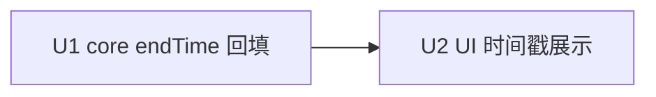

# chat-flow-timestamp 实施计划
基线: <待填> | 来源设计: .tmp/dev-flow/chat-timestamp.design.md | 日期: 2026-09-13

## 0 章节映射
| 内容 | 设计文档实际位置 |
|------|------------------|
| 背景/目标 | §1 背景/目标 |
| 终态/机制 | §2 终态/机制（1-5 点） |
| 验收场景表 | §3 验收场景表（A1-A7） |
| 下一层拆分 | §4 下一层拆分（U1/U2） |
| 待验证检查点 | §2.1（live overlay 覆盖时序）、§2.4（v-memo deps） |

## 1 目标快照
> 摘录自设计 §1（逐字）：
> 「目标（用户拍板 demo 方案 F）：1. 块行尾常驻「耗时 · 时刻」（tool 块两者都显；text/thinking/user 只显时刻）2. TurnMeta 在「已工作 Xs」后接 turn 首末时刻区间 `· HH:MM:SS → HH:MM:SS` 3. 历史 reload 与 live 形态一致（live≡reload 红线）」
> Out-of-scope：方案 A/B/D/E；per-part 块级精确时间；时区切换设置；subagent panel 对话流；移动端。

## 2 单元列表
| Unit | 职责 | 领地（精确文件路径） | 依赖 | 隔离 | 验收条款 |
|------|------|----------------------|------|------|----------|
| U1 | toolCall endTime reload 回填（fill 点 + 调用点 + 测试） | `packages/core/src/domain/chat/apply-entry-convert.ts` · `packages/core/src/domain/chat/apply-entry.ts`（仅 endTime 透传所需改动）· `packages/core/src/domain/chat/__tests__/`（apply-entry-convert 相关 + apply-entry-equivalence） | - | plain | ① computeToolCallFill 返回 endTime=toolResult body.timestamp（缺失不填）；② reload 路径 toolCall.endTime 有值；③ `pnpm -C packages/core test` 全绿（含 equivalence） |
| U2 | UI 时间戳展示（formatClock + TurnMeta 区间 + Block 行尾列 + UserBubble + i18n + 测试） | `packages/ui/src/features/chat/format-utils.ts` · `TurnMeta.vue` · `composables/useTurnElapsed.ts` · `Block.vue` · `composables/useToolMeta.ts` · `UserBubble.vue` · `Turn.vue` · `__tests__/{format-utils,useTurnElapsed,TurnMeta,Block,UserBubble}.test.ts` · `packages/renderer/src/i18n/locales/zh-CN/panel.ts` · `packages/renderer/src/i18n/locales/en-US/panel.ts` | U1 | plain | ① formatClock 本地时区 HH:MM:SS；② TurnMeta 区间（完成定格/live 进行中）；③ Block tool 块 `耗时 · 时刻`、text/thinking 时刻；④ UserBubble 时刻；⑤ useToolMeta 耗时项移除；⑥ `pnpm -C packages/ui test` + `pnpm -C packages/ui typecheck` 绿 |

注：u-foundation 共享契约根节点不设——无新增共享类型（`ToolCall.endTime` 已存在）；formatClock 归 U2 领地内。

## 3 DAG 图

## 4 测试与验收计划
增量（单元开发期内）：
- `pnpm -C packages/core test`（U1；vitest，子包目录运行）
- `pnpm -C packages/ui test` / `pnpm -C packages/ui typecheck`（U2；vue-tsc）
- `pnpm -C packages/core typecheck`（U1）

全量（阶段 3 尾）：`pnpm test`（root，workspace 全包 --no-bail）+ `pnpm lint`

### 验收计划表
| # | 验收项（场景表行） | 方式(L0-L4) | 成本 | 收益 | 组 | 依赖 | 优化判定 |
|---|--------------------|-------------|------|------|----|------|----------|
| A1 | TurnMeta 完成区间 | L1 ui vitest（TurnMeta.test DOM 断言） | 2 | 8 | 核心 | U2 | 并入 ui 套件 |
| A2 | TurnMeta live 区间 | L1 ui vitest（fake timers） | 2 | 7 | 核心 | U2 | 并入 ui 套件 |
| A3 | tool 块行尾耗时·时刻 | L1 ui vitest（Block.test）+ L3 真机 | 3 | 9 | 核心 | U2 | 单测断言 DOM；L3 验 running 跳动 |
| A4 | text/thinking/user 行尾时刻 | L1 ui vitest | 2 | 6 | 非核心 | U2 | 并入 ui 套件 |
| A5 | 历史 reload 耗时持久 | L1 core vitest + L3 真机 reload | 4 | 9 | 核心 | U1,U2 | core 单测断言回填值；L3 验视觉 |
| A6 | 时区正确 | L1 format-utils.test（本地 getter 断言） | 1 | 7 | 核心 | U2 | 并入 ui 套件 |
| A7 | live≡reload 等价 | L1 core equivalence 套件 | 2 | 9 | 核心 | U1 | 并入 core 套件 |
| A8 | 全量回归 | L2 `pnpm test` + L0 `pnpm lint` + typecheck | 4 | 8 | 核心 | A1-A7 | 单命令跑 |

**提速结论**：可合并 6 项（A1/A2/A4/A6 同一 ui 套件跑，A5/A7 同一 core 套件跑）；可脚本化 7 项（全部 L0/L1 机器断言）；L0 静态守卫清单 = pre-commit 链（eslint taste-lint / vue_rules_checker.py / check_env_boundary 族）；L3 仅 1 场景（真机 live 跳动 + reload 持久，browser-automation 连 dev 实例）。预计 2 轮 dev subagent + 1 轮全量 + 1 轮 L3，无 L4。

## 5 合理偏差登记表
| 日期 | Unit | 偏差 | 理由 | 登记 |
|------|------|------|------|------|
| （空） | | | | |

## 6 状态表
| Unit | 状态 | 轮次 | 证据指针 |
|------|------|------|----------|
| U1 | pending | 0 | - |
| U2 | pending | 0 | - |

## 7 残留风险与变更历史
- 风险 R1：live `tool_call_end` overlay（Date.now()）与 message_end 回填（body.timestamp）覆盖时序——终态以回填为准，等价性测试守卫；若 equivalence 对 endTime 敏感导致既有用例红，回退方案 = overlay 不设 endTime，仅回填点设置。
- 风险 R2：text/thinking 多块共享同一 message 时刻（近似语义）——已在 demo 与设计 §2.4 声明，用户接受。
- 变更历史：
  - 2026-09-13 计划建立。设计审查豁免记录见设计文档头部（用户明示「不需要复杂设计」，以 demo 迭代 + 用户拍板替代三审）。
