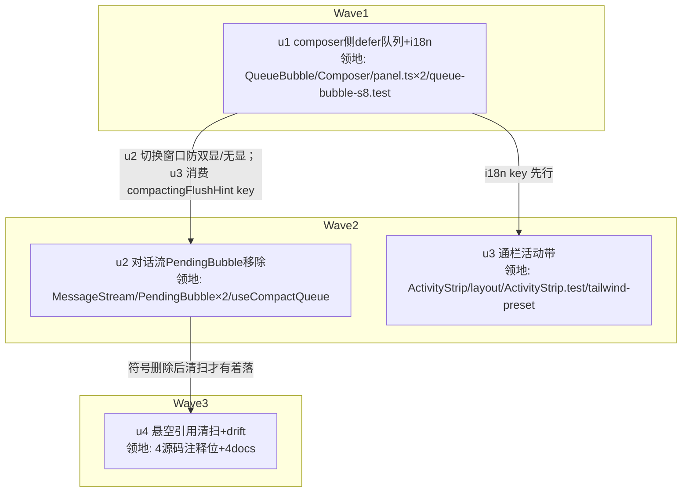

# 压缩待发消息展示统一与压缩中活动带 实施计划
基线: 67e5f0f95 | 来源设计: docs/design/compact-defer-composer-queue.md (v3) | 日期: 2026-09-13

## 0 章节映射
| 内容 | 本文实际位置 |
|------|--------------|
| 背景/目标 | §1 背景与目标（§1.1 现状问题 / §1.2 目标 / §1.3 Out of scope 与已接受代价） |
| 终态/机制 | §2 终态与机制（§2.1 defer 行迁移含双数据源归一规则 / §2.2 通栏活动带 / §2.3 i18n） |
| 验收场景表 | §3 验收场景表（A1–A9） |
| 下一层拆分 | §4 下一层拆分（u1–u4 种子表 + 领地互斥核对） |
| 待验证检查点 | §2.2 COMPACTING_NOTICE_HEIGHT 实测校准（useConstantHeightAssert dev 断言） |

## 1 目标快照（逐字摘录设计 §1）
- defer 消息与 steer/followUp 统一收口到 composer 上方队列区：专属 Hourglass icon + 占用分档 chip（「压缩后」/「命令后」/「稍后发送」）区分三种排队语义，保留未提交条目的 × 撤销能力。
- 「压缩中」指示升级为通栏活动带（accent-soft 底、高度 ≈48px），并副文案联动待发队列计数（「完成后自动发送 N 条待发消息」），闭环「消息没丢」的感知。
- Out of scope：useCompactQueue 队列记账/flush/confirmDelivery/drain 逻辑零改动；发送位四态路由、steer/followUp 行样式、stripDeferMarker 通路不动；亮色主题不做逐主题视觉回归（四要素见设计 §1.3）。

## 2 单元列表
| Unit | 职责 | 领地（精确文件路径） | 依赖 | 隔离 | 验收条款 |
|------|------|----------------------|------|------|----------|
| u1 | composer 侧 defer 队列展示 + 全部新增 i18n key + 测试改造/re-home | packages/renderer/src/components/panel/QueueBubble.vue（含头注「只读」声明修订）· packages/renderer/src/components/panel/Composer.vue · packages/renderer/src/i18n/locales/zh-CN/panel.ts · packages/renderer/src/i18n/locales/en-US/panel.ts · packages/renderer/src/__tests__/panel/queue-bubble-s8.test.ts | 无 | plain | V1 `cd packages/renderer && pnpm test -- queue-bubble-s8` 绿（含新用例：state=undefined 根门渲染 defer 行 / 未提交 × emit removeDefer / 分档 chip+hover 文案 / +N 徽标 / 只读契约收窄后 steer/followUp 无按钮断言保持）；V2 `pnpm typecheck` 绿 |
| u2 | 对话流侧 PendingBubble 移除 + useCompactQueue 收尾 | packages/renderer/src/components/panel/MessageStream.vue · packages/renderer/src/components/panel/message-stream/PendingBubble.vue(删) · packages/renderer/src/components/panel/message-stream/__tests__/PendingBubble.test.ts(删) · packages/renderer/src/composables/panel/useCompactQueue.ts（拆 useSessionPendingEntries + 头注 :10/:19/:106 修订） | u1 | plain | V1 全仓 `rg "PendingBubble|useSessionPendingEntries" packages/renderer/src --include="*.{ts,vue}"` 仅剩 u3/u4 领地内已登记的注释位；V2 `cd packages/renderer && pnpm test` 绿（composer-compact-queue / chat-transient-reset 等既有回归）；V3 MessageStream 模板无 pending-bubble-list 块 |
| u3 | 压缩中通栏活动带 + 高度常量 + 原语注释同步 | packages/renderer/src/components/panel/message-stream/ActivityStrip.vue · packages/renderer/src/composables/panel/message-stream-layout.ts（常量值+强绑定 DOM 注释）· packages/renderer/src/components/panel/message-stream/__tests__/ActivityStrip.test.ts（band 用例 + 本文件 PendingBubble 注释清扫）· packages/shared/src/tailwind-preset.ts（content-col 消费方清单注释，纯注释） | u1 | plain | V1 `cd packages/renderer && pnpm test -- ActivityStrip` 绿（band 结构：无 content-col/system-notice、accent-soft 底、border-y、副文案 count 未提交口径、count=0 隐藏副文案、bash/thinking/settling 行不变）；V2 message-stream-layout.ts 的 COMPACTING_NOTICE_HEIGHT 与新 DOM 实测一致（dev 断言零 warn 由真机验收复核）；V3 shared 包 `cd packages/shared && pnpm test` 绿（守卫不受注释影响） |
| u4 | 悬空引用清扫 + drift 机检（全注释/文档编辑，无逻辑改动） | packages/renderer/src/composables/panel/useMessageStreamFollowTriggers.ts(:17/:147) · packages/renderer/src/composables/panel/useVirtuaFollow.ts(:33) · packages/renderer/src/__tests__/panel/composer-compact-queue.test.ts(头注 3 处 :4/:5/:15，PendingBubble 指称改指 QueueBubble defer 行 / queue-bubble-s8.test.ts) · packages/core/src/domain/chat/store.ts(:382) · docs/design/chat-pin-bottom-fix.md(7 处) · docs/design/session-dead-structural-fixes.md(:23/:328) · docs/testing/03-chat-flow.md(`pending-bubble-list` testid :44/:401) · docs/design/adversarial-review-fixes.md(:316)；豁免 docs/page-design/archive/v3/fast-fork/spec.md | u2 | plain | V1 `node scripts/check-doc-symbol-drift.mjs` exit 0；V2 全仓 rg "PendingBubble" 仅剩显式豁免位（archive spec）与历史变更记录性文字（逐处登记）；V3 `cd packages/core && pnpm test` 绿 |

领地互斥：两两交集为空（panel.ts 仅 u1；ActivityStrip.test.ts 仅 u3；useCompactQueue.ts 仅 u2；u4 与 u2/u3 无交集）。u4 共 8 路径，全部 1–3 行注释/文档编辑——超「≤5 文件」判据部分为机械清扫，无逻辑风险。

## 3 DAG 图

关键路径深度 = 3（≤4 ✓）；最大反链宽度 = 2（u2∥u3）。无共享契约模块需 u-foundation（唯一跨单元契约 = i18n key，单写者 u1，串行边已覆盖）。

## 4 测试与验收计划
**测试命令（真实读取自各包 package.json）**：
- 增量：`cd packages/renderer && npx vitest run <file>`（⚠️ vitest 4.1.9 下 `pnpm test -- <file>` 的 `--` 过滤不生效会跑全量，禁用——D1 偏差登记）、`cd packages/renderer && pnpm typecheck`（vue-tsc）
- 包级回归：`cd packages/renderer && pnpm test`；`cd packages/core && pnpm test`；`cd packages/shared && pnpm test`
- L0 静态：`pnpm run lint`（root，含 taste-lint/vue_rules_checker）· `node scripts/check-doc-symbol-drift.mjs` · pre-commit 全套钩子
- 全量（阶段 3 尾）：renderer + core + shared 三包全量 + lint；不跑 extensions 三连（本改动不触 extensions/）与 e2e playwright（无 e2e 用例改动）

**验收计划表**：

| # | 验收项（场景表行） | 方式(L0-L4) | 成本 | 收益 | 组 | 依赖 | 优化判定 |
|---|--------------------|-------------|------|------|----|------|----------|
| A1 | 压缩中入队即显队列行（state=undefined 根门） | L1 组件测试 | 2 | 9 | 核心 | - | 可脚本化（testid 已有） |
| A2 | 撤销边界（仅未提交行渲染 ×） | L1 组件测试 | 2 | 9 | 核心 | A1 | 可脚本化 |
| A3 | 混合顺序 + 溢出 + 副文案全量计数 | L1 组件测试 | 2 | 8 | 核心 | A1 | 可脚本化 |
| A4 | 通栏活动带（宽面板 + count=0 边缘） | L1 组件测试 + L0 dev 像素断言 | 2 | 9 | 核心 | A1 | 可脚本化；高度实测校准靠 useConstantHeightAssert |
| A5 | 压缩完成转态（live ≡ reload） | L1（core use-chat-compacted-flush 既有回归 + composer-compact-queue）+ L4 真机 | 3 | 9 | 核心 | A1 | 单测降级为主，真机并入 L4 一轮 |
| A6 | bash 占用分档 chip | L1 组件测试 | 2 | 7 | 非核心 | A1 | 可脚本化 |
| A7 | 自动压缩文案 | L1 组件测试 | 2 | 6 | 非核心 | A4 | 可脚本化 |
| A8 | flush 提交窗口无双行（归一规则） | L1 组件测试（mock 双条目：mode=steer 断言镜像承接语义下无 defer 行；mode=send 断言同样隐藏；无相邻双行）+ L4 真机（D1 长任务维持 run，验瞬态豁免后的稳态判据） | 3 | 10 | 核心 | A1 | 可脚本化（round1 最高危反例的回归锚） |
| A9 | split 双 panel 隔离 | L4 真机 | 8 | 4 | 非核心 | A5 | 无法降级（分区契约单测已有覆盖，真机反证一轮） |

**提速结论**：9 项中 7 项可脚本化降级为 L1 组件测试（A1-A4/A6-A8），1 项半降级（A5 单测为主），仅 A9 需 L4 真机；真机 L4 合并为单轮（browser-automation 连 dev app CDP，按 AGENTS.md `XYZ_DEV_BACKGROUND=1 pnpm dev` 规范）覆盖 A1/A4/A5/A8/A9 五场景——A8 真机步骤按设计场景表执行（D1 长任务提示词维持 run、瞬态豁免以稳态判据）。L0 守卫清单：check-doc-symbol-drift、taste-lint/vue_rules_checker（pre-commit）、useConstantHeightAssert（dev 运行时断言）。预计派发轮次：开发 3 波（u1 → u2∥u3 → u4）+ 真机 1 轮。

## 5 合理偏差登记表
| # | Unit | 偏差内容 | 理由 / 处置 |
|---|------|----------|-------------|
| D1 | u1 | 测试过滤命令：`pnpm test -- <file>` 在 vitest 4.1.9 下 `--` 后不生效、实际跑全量套件；改用 `npx vitest run <file>` 精确过滤 | 工具链行为修正，非设计偏离；本表登记后 §4 增量命令以此为准 |
| D2 | u1 | 全量套件中 locale-key-usage-guard.test.ts 报 `panel.message.compactingFlushHint` 零字面引用（i18n 反向守卫） | 预期跨 wave 瞬态：key 由 u1 新增、唯一消费方是 u3 的 ActivityStrip.vue（领地外）；u3 落地后自然转绿，阶段 3 全量套件复验 |

## 6 状态表
| Unit | 状态(pending/in-progress/committed/blocked) | 轮次 | 证据指针 |
|------|---------------------------------------------|------|----------|
| u1 | committed（67e5f0f95 基线后 u1 commit；queue-bubble-s8 16/16、typecheck 0、领地 5 文件精确） | 1 | commit hash 见 git log；test_evidence = vitest run queue-bubble-s8 16 passed + pnpm typecheck exit 0（主 agent 复跑确认） |
| u2 | pending | 0 | - |
| u3 | pending | 0 | - |
| u4 | pending | 0 | - |

## 7 残留风险与变更历史
- 残留风险：① COMPACTING_NOTICE_HEIGHT 实测值可能与预填 48 有 ±2px 偏差（border-y 计入与否）——useConstantHeightAssert dev 断言兜底，真机校准；② A8 真机窗口可观测性依赖确认帧到达时序（秒级），组件测试已锁定核心断言；③ `submittedAwaitingDelivery` key 暂留零消费方，阶段 6 终态同步复核清理。
- 变更历史：
  - 2026-09-13 计划创建（设计 v3；round2 聚焦复审后主审 0MF 收敛，影响审 2MF 已在设计 v3 全修）。
