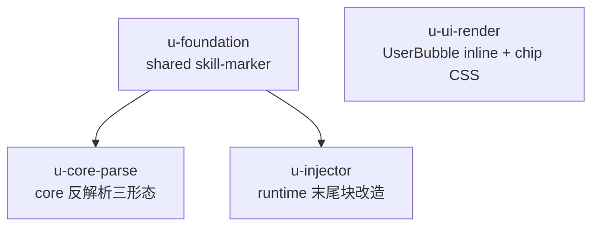

# composer-multi-skill-injection R4 实施计划

基线: PENDING（审查清零后 commit 回填） | 来源设计: docs/design/composer-multi-skill-injection.md | 日期: 2026-09-13

## 0 章节映射

| 内容 | 本文实际位置 |
|------|--------------|
| 背景/目标 | §1 背景目标（SCQA + 设计目标 G1–G5 + In/Out-of-scope） |
| 终态/机制 | §3.1 终态（使用者视角 4 场景）+ §3.3 关键决策 D1–D13 + §3.4 错误规格表 |
| 验收场景表 | §4 验收（场景 1–12，全真实 pi 进程 + 真实模型） |
| 下一层拆分 | §5 下一层拆分（P1–P4 实施路径 + 文件改动地图 + 检查点 1–6） |
| 待验证检查点（无则记「无」） | §5 待验证检查点 1–6（1 已核实关闭；6 = CJK 系数校准） |

对抗审查记录：`.tmp/tech-design/design-review-20260913-105940{,-impact,-simplicity}.md`（三审 0 must-fix；10 suggestions 已全修，聚焦复审结论见变更历史 2026-09-13 条目）。

## 1 目标快照（逐字摘录设计 §1）

> 如何在不改 pi 的前提下，让用户在 composer 任意位置插入任意多个 skill，并保证注入量可控、会话不会因此卡死？

设计目标（G1–G5）：任意位置触发；多 skill 生效；注入可控（超预算安全降级）；会话可恢复显示；零 pi 侵入。

R4 增量目标（对话确认 + D11–D13）：
1. **D11**：注入形态从「原位展开」改为「正文原样保留 `<xyz-skill/>` 占位标记 + 消息末尾集中追加 `<xyz-skill-data>` 包裹块」（正常形态 = 块内 pi 对齐展开全文、同 name 去重；降级形态 = 块内标记清单 + 指引行，原 `<xyz-skills>` 退役）；resume 反解析任意位置剥块、存量旧形态兼容。
2. **D12**：用户气泡混排消息（text 段 + badge 段）inline 化渲染，badge 前后不换行。
3. **D13**：composer 中 skill chip 前后自动空开（CSS margin）。

Out-of-scope（设计 §1）：skill 目录管理 UI；pi 原生 `/skill:` 行首语义变更；`<available_skills>` 自主触发路径；token 精确计量；file/session/subagent chip 的间距统一（仅 skill，D13 范围声明）。

## 2 单元列表

| Unit | 职责 | 领地（精确文件路径） | 依赖 | 隔离 | 验收条款 |
|------|------|----------------------|------|------|----------|
| u-foundation | shared 标记 SSOT 扩展：新增 `SKILL_DATA_BLOCK_TAG`（`xyz-skill-data`）+ 包裹块构建（正常形态：去重后 `<skill>` block 列表；降级形态：标记清单 + `SKILL_FALLBACK_GUIDANCE`）+ 块解析位置切片辅助（供 core 剥块） | `packages/shared/src/skill-marker.ts`；`packages/shared/src/index.ts`（导出如需）；`packages/shared/src/__tests__/skill-marker.test.ts` | 无（DAG 根） | plain | ① 两形态构建/解析往返单测绿；② 旧 `<xyz-skills>` 构建/解析函数不动（存量兼容面零改动）；③ `pnpm typecheck` 绿 |
| u-core-parse | core 反解析三形态升级：剥块优先（任意位置 `<xyz-skill-data>...</xyz-skill-data>` 整块剔除，块内不参与后续解析）→ 标记还原（现状保留）→ 存量兼容（pi block / `<xyz-skills>` 现状规则不动）；store.ts 失配判据注释更正（影响面 S5 顺手项） | `packages/core/src/domain/chat/apply-entry-convert.ts`；`packages/core/src/domain/chat/store.ts`（仅注释）；`packages/core/src/domain/chat/__tests__/apply-entry.test.ts`；`packages/core/src/domain/chat/__tests__/apply-entry-equivalence.test.ts` | u-foundation | plain | ① 剥块/标记还原/存量三形态单测绿（含块内标记不误还原、存量 pi block 行为不变断言）；② apply-entry-equivalence 守卫扩展「标记 + 末尾块消息」两链路绿（live ≡ reload，架构关键规则 9）；③ `pnpm typecheck` + `pnpm test` 绿 |
| u-injector | runtime 注入器 R4 改造：正文标记原样保留（移除原位替换）；末尾 `<xyz-skill-data>` 块组装（同 name 去重、location 恒取 get_commands 映射）；降级形态并入同一块（超预算/fail-safe/mapping_unavailable 不加块）；失效标记不进块 + notice 不变；dispatcher 三入口挂载点不动 | `packages/runtime/src/services/session/skill-injector.ts`；`packages/runtime/src/services/session/__tests__/skill-injector.test.ts`；`packages/runtime/src/infra/pi/__tests__/pi-semantics-skill-expansion-golden.test.ts`（断言粒度核对）；`packages/runtime/src/infra/pi/__tests__/pi-semantics-skill-expansion-static.test.ts`（同） | u-foundation | plain | ① 注入器单测全绿（正文保留 + 末尾块形态 + 去重 + 降级/失败分路断言）；② 无标记文本零改动（既有早退断言保持）；③ 探针 golden 锚定单 `<skill>` block 内容不变（REAL_PI 无凭证环境 skip 合法）；④ `pnpm typecheck` + `pnpm test` 绿 |
| u-ui-render | 两项显示修复：D12 UserBubble 混排 inline 化（text+badge 混排时启用修饰 class + scoped CSS 置 .md-render/内部容器/p 为 inline + 段间换行补偿；纯 text 不加 class）；D13 ComposerInput skill chip CSS（`[data-chip-type='skill']` margin-left 4px / margin-right 6px / first-child 抑制，`:deep()` 范式） | `packages/ui/src/features/chat/UserBubble.vue`；`packages/ui/src/features/composer/ComposerInput.vue`；`packages/ui/src/features/chat/__tests__/UserBubble.test.ts` | 无（独立根，可与 u-foundation 并行） | plain | ① UserBubble 混排断言绿（badge 与前后文本同行、纯 text 多段落排版不变回归）；② 现有 UserBubble/segment-rebuild 测试零回归；③ `pnpm typecheck` + `pnpm test` 绿 |

切分说明：u-foundation 是契约根（shared SSOT，两消费方 core/runtime 依赖其常量与构建函数）；u-ui-render 与协议链路零耦合（不 import skill-marker），独立根并行。全部 plain 隔离：四个单元领地互不重叠、无双写文件（store.ts 仅 u-core-parse 触及）。

## 3 DAG 图

就绪集演化：{u-foundation, u-ui-render} → {u-core-parse, u-injector} → {}（4 单元两波）。

## 4 测试与验收计划

**增量（单元开发期）**（命令从各包 package.json scripts 真实读取）：

| 包 | 命令 | 范围 |
|----|------|------|
| shared | `cd packages/shared && pnpm test`（vitest run）+ `pnpm typecheck` | u-foundation |
| core | `cd packages/core && pnpm test` + `pnpm typecheck` | u-core-parse |
| runtime | `cd packages/runtime && pnpm test` + `pnpm typecheck`（REAL_PI 池无凭证自动 skip 合法） | u-injector |
| ui | `cd packages/ui && pnpm test` + `pnpm typecheck` | u-ui-render |
| dom-core | `cd packages/dom-core && pnpm test`（回归确认，本批零源码改动） | u-ui-render 连带 |

**全量（阶段 3 尾）**：上述五包 `pnpm test` 全绿 + `pnpm run lint`（root）+ `pnpm extensions:typecheck`（确认 extensions 零波及）。

**验收计划表（阶段 5 执行依据）**：

| # | 验收项（场景表行） | 方式(L0-L4) | 成本(1-10) | 收益(1-10) | 组 | 依赖 | 优化判定 |
|---|--------------------|-------------|------------|------------|----|------|----------|
| A1 | 场景 1（多 skill：正文标记保留 + 末尾块全文 + badge 显示不换行） | L4 agent（真实 pi + dev app + browser-automation；JSONL 形态断言部分可脚本） | 8 | 10 | 核心 | - | JSONL 断言可脚本化拆分并入 A2 脚本 |
| A2 | 场景 2/2b（降级形态 + fail-safe；JSONL 形态 + 提示文案可区分） | L3 脚本（构造消息 + JSONL 断言 + dev app 提示 DOM） | 5 | 9 | 核心 | A1 | 可脚本化（形态断言确定性） |
| A3 | 场景 4（resume 剥块还原 + sidecar 丢失 + 存量兼容 ⑤） | L3 脚本（移走 sidecar + 重开 + DOM 断言） | 5 | 9 | 核心 | A1 | 可脚本化 |
| A4 | 场景 10（混排气泡不换行 + 非 skill badge 回归 ⑤） | L3 脚本（browser-automation DOM 断言 + 截图） | 4 | 8 | 核心 | - | 与 A5 同会话合并 |
| A5 | 场景 11（chip 空开 + 行首抑制 + Backspace + 序列化无双重空格） | L3 脚本（getComputedStyle + 键盘事件 + segments 导出比对） | 4 | 7 | 核心 | - | 与 A4 同会话合并 |
| A6 | 场景 3/3b（失效可见降级 + hook 破坏标记） | L3 脚本（移走 skill 目录 + 测试 plugin） | 5 | 6 | 非核心 | A1 | 可脚本化 |
| A7 | 场景 5/7/6（steer 注入 / 手打回归 / 误弹回归） | L4 agent（场景 5 需长任务窗口）+ L0（6②③ 部分单测已覆盖） | 7 | 6 | 非核心 | A1 | 场景 7 JSONL 断言可脚本化 |
| A8 | 场景 8（探针 golden diff 全绿 + 篡改变红实验） | L1（REAL_PI vitest 池；无凭证跑 static 锚 + 记录 skip） | 2 | 8 | 核心 | u-injector committed | 已是自动化测试 |
| A9 | 场景 12（跨消息累积观察 + usage 记录） | L3 脚本（4–5 条消息 + usage 抓取 + 重开断言） | 4 | 5 | 非核心 | A1 | 与 A2 脚本共用形态 |

**提速结论**：可脚本化 5 项（A1 部分/A2/A3/A4/A5/A9）；可合并 1 组（A4+A5 同 browser-automation 会话）；L0 静态/单测守卫清单 = u-foundation/u-core-parse/u-injector/u-ui-render 四单元 vitest 全量（含 apply-entry-equivalence 等价性守卫、探针双锚 A8）——单位验收不进 L4 即可关闭的约 70%；L4 仅 A1 端到端主链路与 A7 场景 5 两处，预计派发轮次 ≤3。

## 5 合理偏差登记表

| # | Unit | 偏差 | 处置 | 证据 |
|---|------|------|------|------|
| R1 | u-ui-render | D12 触发面宽于设计文字：实现按「一切非 text 段」统一判定（含 slash 文本还原/image 缩略图），设计采用句原只枚举 badge | 实现属同类缺陷修复无负面效应——设计文档 D12 采用句/现状缺陷/场景 10-⑤ 已补 slash/image 扩面措辞（审查 unreasonable[LOW] 收口） | UserBubble.vue:207-215；cr-ui-r2 报告 |
| R2 | u-ui-render | D13 设计句第二选择器写法（`>` 子代组合器无 :deep()）按字面在 scoped CSS 下不可实施，实现用 :deep() 后代形式（行为等价） | doc_error 修正：设计 D13 采用句已改为与实现一致的 :deep() 后代形式 | ComposerInput.vue:282-284；cr-ui-r2 报告 |
| R3 | u-core-parse | 代码注释三形态编号与设计 D7 编号不一致：<xyz-skills> 注释归 ②、设计归 ③（行为零差异，仅口径） | ✅ 已修：统一按设计口径（<xyz-skills> 归 ③），commit e5bfe596b | apply-entry-convert.ts 头注释；cr-core-r2 报告 |

## 6 状态表

| Unit | 状态 | 轮次 | 证据指针 |
|------|------|------|----------|
| u-foundation | committed | 1 | c1c212d92（409 tests 绿 / typecheck 绿；发现并修正降级形态指引行块内 vs 存量块外语义差异） |
| u-core-parse | committed（审查通过：R3 注释编号已修 e5bfe596b） | 1 | 7be82c59d（core 2074 绿 / 存量断言零改动 / E8 两链路等价新增；防御细化：剥块后无标记命中不回退原文防泄漏） |
| u-injector | committed（审查通过：0 unreasonable，2 doc_error 已修 add637ce9） | 1 | b58ba09e0（injector 24 + static 8 + golden REAL_PI 真实执行绿；runtime 全量 5949 中 1 失败 = 既有 subagent-extractor-engine，已实证 HEAD 同红） |
| u-ui-render | committed（一致性审查通过：7 reasonable / 1 LOW 已收口 / 1 doc_error 已修） | 1 | cc80fedb6（ui 772 绿含 5 条 D12 新用例 / dom-core 232 零回归 / scoped 编译与 :first-child 语义实测） |

## 7 残留风险与变更历史

- 阶段 5 验收（2026-09-13）：核心组 A1–A5 全真机 PASS（真实 pi 进程 + mimo-v2.5-pro + dev app + Playwright CDP 全真实键盘事件）——A1 主链路（正文标记原位 + 末尾块去重双 skill 全文 + badge 显示 + 模型确认识别）、A2 降级形态（3MB SKILL.md 夹具触发 budget_exceeded：块内标记清单 + 指引行、零展开，模型按指引自主 read 51KB toolResult 验证降级设计意图）、A3 resume 剥块还原（切 session 重读后块剥离 + 标记还原 badge + 混排仍单行）、A4 混排不换行（is-mixed 容器内文本/badge 全元素同 top 单行）、A5 chip 空开（getComputedStyle 实测 4px/6px/first-child 0）。证据汇总 `.tmp/dev-flow/composer-multi-skill-injection-r4.acceptance/acceptance-summary.md`（截图 9 张 + 断言 JSON 4 份 + 脚本 6 个）。非核心组 A6–A9 按后续波次执行，不阻塞核心组关闭；A8 探针双锚已随 Gate A 执行（static 8 绿 + REAL_PI golden 绿）。
- 一致性审查清零（2026-09-13）：三区 reviewer（ui / core / shared+runtime）聚合 = 28 reasonable / 2 unreasonable（均 LOW：D12 扩面措辞、core 注释编号）/ 5 doc_errors（均 LOW）——unreasonable 全部修复收口、doc_errors 全部主 agent 修订、reasonable 全部入登记表。清零标记 commit = 设计文档 add637ce9 + 注释对齐 e5bfe596b。Gate A 证据见下条。
- Gate A（2026-09-13）：五包 vitest（shared 409 / core 2074 / ui 772 / dom-core 232 / runtime 5949 中 1 失败）+ root lint + extensions:typecheck。runtime 唯一失败 = test/subagent-extractor-engine.test.ts「rejects journal path outside engines root」——已实证 HEAD（stash 掉本流水线改动后）同样红，属 zcode db-isolation 工作流面既有债务，非本次引入；登记为残留风险待用户签认。

- R4 设计协议变更涉及 pi 落盘文本形态（正文标记 + 末尾块）；存量会话（原位展开形态落盘）靠 core 反解析存量兼容规则（u-core-parse ③ 断言锁定）。
- REAL_PI 探针依赖凭证环境；无凭证时以 static 锚 + skip 记录代替（场景 8 通过标准已声明）。
- 变更历史：
  - 2026-09-13 初版（三审 0 must-fix 后起草；基线 hash 待审查清零后 commit 回填）。
