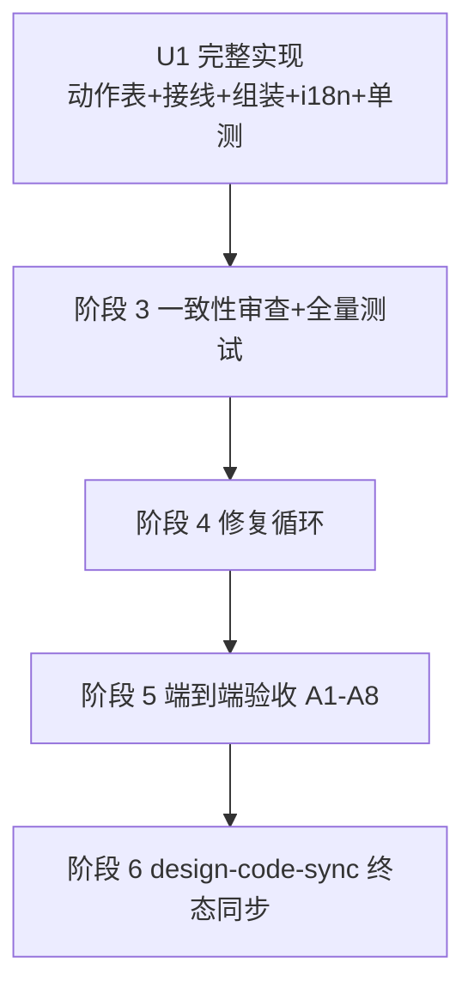

# composer-pi-shortcuts 实施计划
基线: e69a01fa8 | 来源设计: docs/design/composer-pi-shortcuts.md | 日期: 2026-09-16

## 0 章节映射
| 内容 | 设计文档实际位置 |
|------|------------------|
| 背景/目标 | §1 背景目标（G1 肌肉记忆平移 / G2 同一入口 / G3 零回归一处显式让位） |
| 终态/机制 | §3 解决方案（§3.1 终态 / §3.2 决策 1-4 / §3.3 关键决策含决策 6-9 / §3.4 守卫矩阵与事件拦截语义 / §3.5 错误规格表） |
| 验收场景表 | §4 验收（S1-S13 场景表 + e2e 影响面评估） |
| 下一层拆分 | §5 下一层拆分（U1-U4） |
| 待验证检查点 | §5「待验证」：无（①② 已核实销项） |

## 1 目标快照（逐字摘录设计 §1）

> **结论：让 pi TUI 用户的键盘肌肉记忆在太极 GUI 的输入框中原样成立——不新增鼠标操作，不新增第二套切换真相源。**

- G1 pi 肌肉记忆平移：4 个键位在 composer 输入框聚焦时的行为与 pi TUI 语义一致。
- G2 与鼠标通路等价：键位触发的切换与 popover 点击走**同一**入口（core `useComposerModelThinking` 三分支路由），不产生平行真相源。
- G3 零回归（一处显式让位除外）：原生编辑行为（剪切/IME）、命令浮层、staging（fork/handoff）等既有键盘语义不被破坏；唯一让位 = composer 内 `shift+tab` 的原生反向焦点导航被档位循环接管（§3.3 决策 9）。

**Out of scope**：用户自定义键位与设置页重录 UI（P1 注册表化）、其他 pi 键位（esc 中断等）、应用级全局键、`super`/⌘ 系绑定。平台差异已裁决：GUI 全平台统一 `ctrl+shift+p`（决策 6）。

## 2 单元列表

| Unit | 职责 | 领地（精确文件路径） | 依赖 | 隔离 | 验收条款 |
|------|------|----------------------|------|------|----------|
| U1 | 按 §5 U1-U4 合并实现：① 新建 `useComposerShortcutActions`（键判定/守卫矩阵/决策 8 意图目标续步/动作编排）；② composer-keydown 分发链插入动作表分支；③ composer-shell 组装 deps；④ Composer.vue 传参（≤2 行，行数红线见下）；⑤ i18n toast 文案；⑥ 全量单测（守卫矩阵 + 循环取值 + 意图目标生命周期） | `packages/renderer/src/composables/panel/composer-shortcut-actions.ts`（新） `packages/renderer/src/composables/panel/composer-shortcut-actions.test.ts`（新） `packages/renderer/src/composables/panel/composer-keydown.ts` `packages/renderer/src/composables/panel/composer-keydown.test.ts` `packages/renderer/src/composables/panel/composer-shell.ts` `packages/renderer/src/components/panel/Composer.vue` `packages/renderer/src/i18n/locales/zh-CN.ts` `packages/renderer/src/i18n/locales/en-US.ts`（如 toast key 落子目录结构，以同文件既有组织为准） | —（DAG 根） | plain | V1: 新旧测试全绿（`vitest run`，renderer 包目录） V2: `vue-tsc --noEmit` 零错误 V3: Composer.vue `<script setup>` ≤300 行（vue_rules_checker 硬拦） V4: 守卫矩阵 §3.4 每行至少 1 条单测（含 ctrl+x repeat 例外口径） V5: locale-sync guard 测试绿（新增 key 中英同步） |

**合并理由**（dag-authoring 合并判据）：设计 §5 的 U1-U4 同属 renderer panel 单领地、总量 <400 行、相互依赖线性（keydown 接线与 shell 组装都消费 U1 的接口）、subagent 派发成本远大于单元体量——拆 4 个单元产生 3 次纯派发开销与跨单元上下文重建，零并行收益。无共享契约文件需要独立根节点（deps 接口内聚在新文件内导出），U1 即 DAG 根。

**行数红线**：`Composer.vue` `<script setup>` 上限 300（vue_rules_checker MAX_SCRIPT_LINES 硬拦；checker 计数口径 = script 体排除标签行）。计划期 283（基线 e69a01fa8）、交付后 285。传参超 2 行时必须把组装逻辑下沉 `composer-shell.ts`，禁止顶爆红线。

**行为规格唯一来源**：设计文档 §3.3 键位表 + 决策 6/7/8/9 + §3.4 守卫矩阵 + §3.5 错误规格表。实现与设计冲突时以设计为准；发现设计缺陷走偏差三分类（§5 合理偏差登记表 / 打回修 / 主 agent 改文档）。

## 3 DAG 图

## 4 测试与验收计划

**增量测试（U1 开发期，dev 自跑）**：
- `cd packages/renderer && pnpm vitest run`（composer-shortcut-actions.test.ts + composer-keydown.test.ts + 全包回归）
- `cd packages/renderer && pnpm typecheck`（vue-tsc --noEmit）
- locale 同步守卫（renderer 包内 i18n 测试，vitest 一并跑）

**全量测试（阶段 3 尾，主 agent 跑）**：
- `pnpm lint`（含 taste-lint / vue_rules_checker）
- renderer + core 包 vitest 全量；受影响面以 `git diff --name-only` 圈定（本改动 renderer-only，core 不动则跑 renderer 全量 + core 冒烟）

**验收计划表**（设计 §4 S1-S13 逐行编译）：

| # | 验收项（场景表行） | 方式(L0-L4) | 成本 | 收益 | 组 | 依赖 | 优化判定 |
|---|--------------------|-------------|------|------|----|------|----------|
| A1 | 守卫矩阵 §3.4 全行 + 循环取值（含起点规则/仅 off/单模型）+ 意图目标续步/清除（回执等值清/reject 清/sessionId 清/进 staging 清） | L1 单测 | 3 | 9 | 核心 | - | 单测化（设计 §4 明定回归防线主体） |
| A2 | S1 真机：streaming 中 shift+tab 档位循环，chip 与 popover 同源 | L4 agent | 8 | 8 | 核心 | A1 | 与 A3/A4 同环境合并为一次会话 |
| A3 | S2+S10 真机：ctrl+p / ctrl+shift+p 双向循环绕回 + RPC 失败 chip 保持旧值 | L4 agent | 8 | 8 | 核心 | A1 | 合并同环境 |
| A4 | S4+S11 真机：ctrl+x 复制闭环（非流式全文/流式部分文本）+ 空流 no-op | L4 agent | 8 | 8 | 核心 | A1 | 合并同环境 |
| A5 | S5+S6+S7+S12+S13 守卫类真机：选区剪切/浮层不触发+ctrl+shift+p 预设并存/IME/S13 长按单步+焦点让位 | L4 agent | 8 | 6 | 非核心 | A2 | 合并同环境一次连测 |
| A6 | S3+S8 真机：landing 态 ctrl+p → 首发生效 + staging 快照生效 | L4 agent | 8 | 6 | 非核心 | A3 | 合并同环境 |
| A7 | S9 单模型/non-reasoning no-op | L1→L4 抽验 | 2 | 4 | 非核心 | A6 | 可降级：no-op 分支 L1 单测覆盖，真机抽验 1 条 |
| A8 | composer 像素无回归（本改动零视觉变更） | L1 visual 轨 | 2 | 5 | 非核心 | U1 committed | 可脚本化：`npx playwright test --project=visual-chromium` |

**提速结论**：设计 13 场景若逐条 L4 = 13 次派发；合并后 L4 会话 3 次（A2-A4 核心一次 + A5 + A6），A1 全量下沉 L1 单测（dev 自跑零派发），A7 降级 L1+抽验，A8 脚本化。L0 静态守卫清单：`pnpm lint`（taste-lint/vue_rules_checker）、`vue-tsc --noEmit`、locale-sync guard test、项目 pre-commit 全套（本次提交已验证全绿）。预计节省派发 ~10 轮。

**e2e 影响面圈定**（继承设计 §4 + 机器对账 `select-affected-e2e --base main`，输出 2 条 always L1 轨）：

| rule | 判定 | 时点/理由 |
|------|------|-----------|
| E2E-VISUAL-01（visual-chromium，含 composer.spec.ts） | 跑 | U1 committed 后，mock 轨零 token；本改动零视觉变更，防 composer 结构意外变更 |
| E2E-ELECTRON-01（electron-smoke P0 子集） | 不跑 | P0 smoke 子集不含 composer 键盘场景，改动不触及窗口/shell 结构；CI 每 PR 固定跑兜底 |
| 真实 LLM 轨（runtime equivalence real-pi / TAIJI_PI_LIVE） | 不跑 | 改动 renderer-only，零 runtime/pi/协议变更（设计 §4 e2e 影响面评估裁决） |

机器对账差异披露：脚本输出仅 2 条 always 轨（按 `git diff main...HEAD` 当前仅设计文档 1 文件；U1 committed 后重跑对账，预期命中不变）；无人工清单独有条目。执行要求：空载串行。

**验收执行结果（阶段 5 终态，2026-09-16）**：13 场景 = 12 pass + 1 blocked（环境限制）+ 0 fail。

| # | 场景 | 结果 | 证据指针 |
|---|------|------|----------|
| A1 | L1 守卫矩阵+循环取值+意图生命周期 | pass | 44+37 用例全绿；Gate A 全量 4202/4202（composer-pi-shortcuts.gate-a.log：交付时 4201/4201 段 + 阶段 6 终态 4202/4202 段） |
| A8 | visual 轨像素无回归 | pass | 2/2（visual-chromium 含 composer.spec.ts，mock 轨零 token） |
| A2-A4 | 核心组 S1/S2/S4/S10/S11 | pass | a2a4-report.md（5/5；S11 原生剪切以 execCommand 同层通路取证，真实人手按键留人工复核） |
| A5 | 守卫组 S5/S6/S7/S12/S13 | pass | a5-report.md（5/5；决策 7 机制证据 = window 探针 0 次收到 ctrl+shift+p；决策 8/9 = 26 keydown 单步 + 焦点保持） |
| A6 | S3 landing 首发继承+迁移 / S8 staging 透传 | pass | a6a7-report.md（S8 三层实锤：UI chip / assistant 消息 model 字段 / runtime spawn `--model --thinking` 参数；S3 pi 文件 modelId/provider/thinkingLevel 三字段一致） |
| A7 | S9 non-reasoning no-op 抽验 | blocked | dev 环境 12 个 enabled 模型档位集均 ≥3 档，「仅 off」不可构造；L1 用例在列且绿（composer-shortcut-actions.test.ts），如实报 blocked 未编造 |

附带登记（非缺陷）：session 刚切换真值未就绪即进 staging 时，快照抓到占位值致首按按起点规则从第一档起算——既有 staging 通路时序窗，非本次改动引入，真值就绪后行为正常。

## 5 合理偏差登记表

| # | 偏差 | 裁决 | 依据 |
|---|------|------|------|
| 1 | deps.toast 窄接口入参为 i18n key，翻译在 composer-shell 组装适配时完成（翻译时刻=触发时刻） | 合理——动作模块零 i18n 依赖，locale 切换后文案跟随；设计 §5 只列 `toast` 未规定翻译落点 | 设计 §5 U1 deps 清单未细化 |
| 2 | 「composer 内有选区」判定操作化为 window.getSelection 非折叠且 anchorNode ⊆ document.activeElement | 合理——本表只挂输入框 keydown 链，焦点元素即输入框；设计 §3.4 未规定 DOM 判定细节 | 同上 |
| 3 | enabledModels 的 enabled 兜底过滤落在 composer-shell 组装（deps 契约=已过滤序源），模块单测只锁「按注入序循环」；壳层 filter 一行无独立单测（composer-shell.test.ts 不在领地） | 合理——过滤逻辑与 ModelSelectPopover 双保险同款且由 L1 全量回归覆盖调用路径 | 领地锁定约束的直接后果 |
| 4 | RPC reject 清为无条件清（决策 8 原文）：连按中先发 RPC 晚到 reject 会清掉后发意图 | 按设计执行非偏差——极端时序回退一步由下一次按键自愈（回执真值起算）；callId 归属收窄属新机制，设计未要求 | 设计 §3.3 决策 8 原文 |

## 6 状态表

| Unit | 状态 | 轮次 | 证据指针 |
|------|------|------|----------|
| U1 | committed | 0 | dev sa-c9a60dd1 交付，主 agent 硬核验通过（以下为交付时快照）：diff 8 文件 ⊆ 领地、vitest 两目标文件 80/80 + vue-tsc exit 0 重跑与证据一致、Composer.vue script setup 287 行（含标签口径；checker 口径 285）；V1-V5 全过，偏差 4 条登记 §5。修复批次后终态 81/81（44+37），见 §7 变更历史 |

## 7 残留风险与变更历史

- **风险 R1**：`useComposerKeydown` 的 deps 在 `Composer.vue:419` 组装（现 285/300，checker 口径）——传参必须极简；若引发行数超限，下沉 composer-shell（领地内已含该文件，无需扩领地）。
- **风险 R2**：`isStaging` 信号源 = composer-shell 的 `staging.activeStaging`（设计 §5 U1 deps 清单已列）——若 staging 结构暴露面不足，允许在 composer-shell 内派生只读 computed，禁止改 core（core 不在领地）。
- **风险 R3**：subagent 环境间歇 exit 143（本会话 tech-design 复审阶段连发）——dev 派发失败时用 action:message 续跑恢复（上下文保留），连续 2 次失败改串行单发。
- **残留 R4（阶段 3 审查登记，2026-09-16 已清理）**：core `model-thinking.ts`「RPC + 乐观更新」注释残留——用户授权后独立小修清除，涟漪扫描合计 11 处（core 5 + renderer useModel.ts 3 + 测试注释 3），统一改为「RPC 回执写」口径；见变更历史末条。

### 变更历史
- 2026-09-16 计划创建（设计 docs/design/composer-pi-shortcuts.md 三审 0 must-fix 收敛后）。
- 2026-09-16 中断恢复校准：以 git log 与工作区实物核实 U1 领地零实物（前任 dev sa-e3de5ce0 跨会话不可达、无产出），按 execute.md 接替程序补派新 dev（sa-c9a60dd1），轮次 0 重计。
- 2026-09-16 U1 交付核验通过并 commit（diff 8 文件 ⊆ 领地；vitest 两目标 80/80 + vue-tsc 0 重跑一致；script setup 287 行含标签 / checker 口径 285）。
- 2026-09-16 阶段 3 一致性审查 + Gate A（单 reviewer 合并承载）：Gate A 四项全绿（renderer 全量 4201/4201、typecheck 0、根 lint 0、core 零改动；绕过扫描零命中；日志 .tmp/dev-flow/composer-pi-shortcuts.gate-a.log）；机制层逐项核实一致（链序/决策 7/决策 8 五清除/起点对称/§3.5 逐行/G2 同入口）。结论：unreasonable 2 low（COMPOSER_ACTION_KEYS 锚点未落地→派修复批次对齐设计；core 注释残留→R4 登记）；doc_errors 2（S6 冒号笔误、§3.4 landing×ctrl+x 措辞）已由主 agent 修正设计文档；coverage 补测 1 条（选区×ctrl+p 触发）并入同批修复。
- 2026-09-16 审查清零 commit（阶段 5 入口门标记）：修复批次 R1 核验通过（diff 2 文件 ⊆ 领地、81/81 + vue-tsc 0 重跑一致、主 agent 定向复审 diff 逐行通过——常量查表等价改写零语义漂移、新用例真实 DOM 断言）；设计文档 2 处 doc_errors 修正同 commit。Gate A 最终态全绿：renderer 全量 4202/4202（+1 补测用例）、根 lint exit 0、vue-tsc exit 0、core 零改动。
- 2026-09-16 阶段 5 端到端验收完成：A1 → A8 → A2-A4 核心组 → A5 守卫组 → A6+A7 末组依次通过；13 场景 12 pass + 1 blocked（S9 环境不可构造，L1 已覆盖）+ 0 fail。剧本分流：全部 L4 场景判一次性（本设计特有键盘交互验证），产物落 `.tmp/dev-flow/composer-pi-shortcuts.acceptance/`（3 份报告 md 随收尾 commit 入库，截图/console log 留盘不入库）；无可复用 e2e spec 沉淀——回归防线主体为 L1 单测矩阵（设计 §4 裁决）。
- 2026-09-16 收尾检查：功能分级同步（docs/FEATURE-PRIORITIES.md §4「快捷键与 side drawer」行并入 composer 快捷键；P2 依据 = 键盘入口挂掉后 UI 点选通路无损，模型/档位能力本身仍 P0）；文档资产对照 8 项，仅 FEATURE-PRIORITIES 触发，其余零同步。
- 2026-09-16 阶段 6 design-code-sync 第 1 轮（终态全量审查，基线 c20b379b1）：11 条 findings（3 must-fix / 5 suggestion / 3 info；零 contested、零 code-right）全部当轮修复。must-fix ×3：基线 SHA 悬空（36a605c1e → e69a01fa8，前者为 rebase 前旧 SHA 不可达）、行数口径声称 299 → 实测 285（checker 口径；三处 = 设计文档 §2.2 + §3.2 决策 1 C 行 + composer-keydown.ts:5 头注释）、A1 证据指针与日志不符（gate-a.log 追加终态段后指针改为双段口径）。suggestion/info ×8：§3.4 事件拦截补选区例外（§3.3 决策 7 同模式涟漪一并收口）、§2.2 core 锚点 :78 → :53-58、决策 8 机制归属（runtime replicated-state markDirty）、§5「瞬态 ref」→「瞬态变量」、test 文件头覆盖矩阵补动作表接线段（F4）、impl-plan R1 行号 418 → 419（F7）与状态表快照标注（F10）、gate-a.log 本机绝对路径清理（F8，规则 22）。核验：5 文件 diff 逐行 ⊆ 领地（注释/文档文本，零行为代码改动）、终态全量 4202/4202 + vue-tsc exit 0 + lint exit 0。
- 2026-09-16 阶段 6 聚焦复审（第 2 轮，复审对象 = 修复 commit 4376de292）：11 条修复 + 涟漪全部判定「修复成立」（关键项重演验证：e69a01fa8 祖先判定 TRUE、script setup 行数独立复算吻合、全量 vitest 重跑 4202/4202 且 junit 44+37 与台账一致、被改 12 文件族零 /Users/ 残留）；新差距 3 条全 info（gate-a.log 追加段时间戳误标 UTC、存量行数行未标口径、上条目严重度计数笔误），当轮修完（本 commit），不为 info 单独循环。收敛达成：must-fix = 0。
- 2026-09-16 R4 清理（用户授权的领地外小修）：core `model-thinking.ts`「RPC + 乐观更新」注释残留 5 处 + 同模式涟漪 6 处（renderer useModel.ts 3、session store 测试注释 1、renderer 测试 mock 注释 2）= 11 处统一改「RPC 回执写」口径；真乐观机制（settings toggle / chat 气泡 / sidebar / subagent cancel）零触碰。核验：core 335/335 + renderer 24/24。同日用户裁决保持回执写（oe-audit 意图目标删除锚点条件不触发）。
