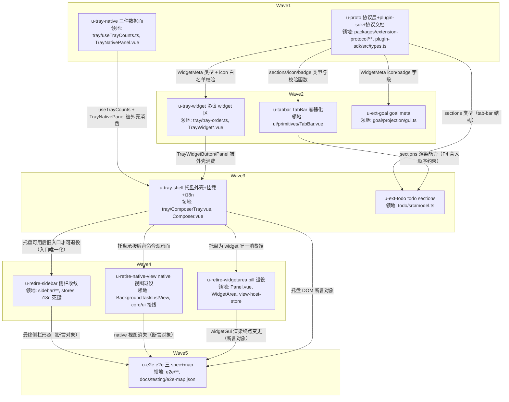

# Composer 任务托盘（Widget Tray）实施计划

基线: 本计划自身 commit（hash 见 §7 变更历史） | 来源设计: docs/design/composer-task-tray.md | 日期: 2026-09-16

> **审查证据（tech-design 循环收敛判据 = 0 must-fix）**：R5 三审 + R6 两审聚焦复核——R5 影响面 1 must-fix（D10 命令捕获集与自述不符 + 分诊桶缺类）已修并由 R6 影响面复核 0 must-fix；R5 主审 0 must-fix（2 suggestion 已修）；R5 简洁审 0 must-fix / 0 suggestion（并对文档数字声称逐项实跑复核吻合）；R6 主审 0 must-fix（1 suggestion 已修）。全部 suggestion 修复经逐条 grep 自对账 + 命令实跑复核。报告（.tmp/ 不入库）：`.tmp/tech-design/design-review-20260916-143055-r5{,-impact,-simplicity}.md`、`.tmp/tech-design/design-review-20260916-143931-r6{,-impact}.md`。

## 0 章节映射

| 内容 | 本文实际位置 |
|------|--------------|
| 背景/目标 | 设计 §1 背景目标（含「设计目标」4 条、in-scope / out-of-scope、设计输入裁决记录①-⑦） |
| 终态/机制 | 设计 §3 解决方案（§3.1 终态三场景、§3.3 关键决策 D1-D14、§3.4 终态数据流、§3.5 错误规格、§3.6 探针清单） |
| 验收场景表 | 设计 §4 验收（A1 / A2 / A2b / A3 / A4 / A5 / A6 / A7 / N1 / N2 + e2e 影响面评估表） |
| 下一层拆分 | 设计 §5 下一层拆分（P1-P4 四阶段表 + 文件改动地图） |
| 待验证检查点（无则记「无」） | 设计 §5 待验证检查点 1-4（= §3.6 ⛔ 探针 P7 浮层溢出 / P5 TabBar 本地 active / composer.toolbar 布局挤压 / WidgetArea 依赖追踪复刻） |

## 1 目标快照

> 逐字摘录设计 §1（不改写）。

**设计目标**（从使用者体验倒推）：

1. **视线不离开工作区**：agent 派发了 3 个 subagent + 1 个 workflow + 2 个后台命令时，用户在 composer 工具条上直接看到六个进行中计数；hover 任一 icon 弹出该类任务的完整面板（分桶列表），可就地 kill/cancel/pause/abort，点行开 drawer 详情。
2. **todo/goal 及未来 widget 统一挂载**：extension 推 setWidget 即在托盘出现（icon + badge + 面板 = 协议渲染），不要求 extension 写任何 taiji 定制代码；未来任何任务型 widget 自动获得挂载位。
3. **常态归零**：无进行中任务、无活跃 widget 时，托盘不制造任何视觉噪音（空闲但有历史 = dim 常驻可查看；彻底无记录 = 隐藏）。
4. **入口唯一化**：同一任务类型只有一个**常驻观察入口**（侧栏任务列表退役，托盘为唯一列表/计数面）——drawer 详情 tab 与对话流内联块属内容呈现（深度检视 / 历史记录），不在此列；消灭「侧栏 tab 数 vs 托盘计数不一致」这类双口径穿帮面。

**in-scope**：composer-bar 左簇托盘组件（built-in 三件 + 协议 widget 两条目）；WidgetMeta / tab-bar 协议小版本扩展；todo buildGui 加 tab-bar；侧栏五 tab 收敛为三 tab 及组件退役；WidgetArea pill 退役；i18n；单测；e2e 影响面对账。

**out-of-scope**：widget 面板内的人写操作（勾选 todo / 完成 goal）；drawer 内 subagent/workflow 详情视图（保留现状）；Plugins tab 的 plugin sidebar view 机制（保留为挂载点，仅退役任务类 native 视图）；通知链（pending-notifications）改动。

## 2 单元列表

> 领地 = 该单元唯一允许改动的文件集合（主 agent 按此生成 add 白名单）。所有单元 `隔离=plain`（领地互斥，无热点公共文件需 worktree 隔离）。

| Unit | 职责 | 领地（精确文件路径） | 依赖 | 隔离 | 验收条款 |
|------|------|----------------------|------|------|----------|
| **u-proto** | 协议层：WidgetMeta +`icon?`/`badge?`、tab-bar props +`sections?`；icon paths 白名单校验函数（正则/条数≤8/单条≤512/总≤2048）；plugin-sdk 平行副本同步；两包 changeset；协议文档同步 | `packages/extension-protocol/src/core/types.ts`、`packages/extension-protocol/src/core/helpers.ts`、`packages/extension-protocol/src/core/helpers.test.ts`、`packages/extension-protocol/src/index.ts`、`packages/plugin-sdk/src/types.ts`、`.changeset/*.md`（新增 1 个：extension-protocol；plugin-sdk 为 private 工作区包 + changeset ignore 名单内，不参与发布）、`docs/architecture/extension-gui-protocol.md` | 无 | plain | ① `cd packages/extension-protocol && npx vitest run` 全绿；② `pnpm --filter @zhushanwen/extension-protocol typecheck` 绿；③ icon 校验单测覆盖四边界（合法 / 非法字符 / 超条数 / 超长度）且越限返回兜底判定（探针 P6）；④ plugin-sdk 平行副本与 extension-protocol 的 WidgetMeta/GuiComponentProps 字段逐项一致（diff 对账，含新字段）；⑤ changeset 文件存在（extension-protocol，minor；plugin-sdk 副本随同 commit 同步、不单独发版） |
| **u-tray-native** | 托盘 built-in 三件数据面：`useTrayCounts`（三件计数 + D13 首拉触发 watch sessionId）+ `TrayNativePanel`（bash/sub/wf 三面板，分桶视图 + 行内操作 + cancel 防误报复制件） | `packages/renderer/src/components/panel/tray/useTrayCounts.ts`、`packages/renderer/src/components/panel/tray/TrayNativePanel.vue`、`packages/renderer/src/__tests__/panel/tray/useTrayCounts.test.ts`、`packages/renderer/src/__tests__/panel/tray/tray-native-panel.test.ts`（新测试命名沿用 panel 目录惯例 `.test.ts`）、`packages/renderer/src/i18n/locales/en-US/tray.ts`（新建）、`packages/renderer/src/i18n/locales/zh-CN/tray.ts`（新建）、`packages/renderer/src/i18n/locales/en-US.ts`、`packages/renderer/src/i18n/locales/zh-CN.ts`（注册 tray 模块） | 无 | plain | ① `cd packages/renderer && npx vitest run src/__tests__/panel/tray/` 全绿；② 计数口径单测：subagent 用 `isRunningProjection`（running 且无 stopReason）且 `origin!=='workflow'`、已结束排除 archived、已收起 = `intent==='archived'`；workflow running/paused；bash 两视图由 background-task-bucket SSOT 谓词派生；③ 首拉触发测试：mount + sessionId 变化 → 断言 `loadSubagents`/`loadWorkflows` 各被调（D13）；④ cancel 防误报用例（迟到收口不发 RPC）；⑤ 空态可行动（「查看已结束 (N)」按钮切 tab，不自动跳）；⑥ 文案走 i18n（新建 `panel.tray.*` 键模块 tray.ts + 双 locale 注册；`pnpm --filter @taiji/frontend check:i18n` 绿、中英键对称、组件代码零硬编码 CJK 文案——check_i18n_cjk.py 规则）；⑦ 面板 props/emit 契约在代码注释写明（供 u-tray-shell 消费） |
| **u-tabbar** | `TabBar.vue` 容器化：`sections?: GuiComponent[][]` 渲染 active section；active 态归本地（首挂载取推送值，用户点击后不被后续推送重置）；缺 sections / 长度不等时退化纯展示 | `packages/ui/src/rendering-protocol/primitives/TabBar.vue`、`packages/ui/src/rendering-protocol/__tests__/TabBar.test.ts` | u-proto（sections 类型） | plain | ① `cd packages/ui && npx vitest run src/rendering-protocol/__tests__/TabBar.test.ts` 全绿；② 探针 P5 行为测试：mount 后 setProps 推新 tabs/sections，断言 active 索引保持（本地选择不被重置）；③ 向后兼容用例：无 sections 时渲染与现状一致（纯展示、无点击态）；④ sections 与 tabs 不等长 → 退化 + warn（设计 §3.5）；⑤ `pnpm --filter @taiji/ui typecheck` 绿 |
| **u-tray-widget** | 托盘协议 widget 区：排序纯函数（known-order + getViewIds 当前插入序）、widget 按钮（icon/badge fallback 链 + status 视觉）、widget 面板（meta head + GuiComponentRenderer） | `packages/renderer/src/components/panel/tray/tray-order.ts`、`packages/renderer/src/components/panel/tray/TrayWidgetButton.vue`、`packages/renderer/src/components/panel/tray/TrayWidgetPanel.vue`、`packages/renderer/src/__tests__/panel/tray/tray-order.test.ts`、`packages/renderer/src/__tests__/panel/tray/tray-widget.test.ts` | u-proto | plain | ① `cd packages/renderer && npx vitest run src/__tests__/panel/tray/` 全绿；② 排序单测：known-order `['todo','goal']` 优先、未知 key 按插入序追加；invalidate→重注册的 key 落尾部（「当前插入序」契约升为测试）；③ icon fallback 链三档（自定义 paths → key 解析 → 内置 widgetKey 映射 → 通用兜底）+ 非法 paths 落兜底；④ badge fallback（`meta.badge → progress.label ?? String(progress.current) → 无`）+ 超长 truncate 至 6 + title 全文；⑤ 依赖追踪复刻验证：mock ViewHostStore 推送新 entry 后 widget 区条目重算（getViewIds+getView 同 computed 路径建链，断链症状 = 不重算）；⑥ 清屏（invalidate）后条目消失 |
| **u-ext-goal** | goal extension：meta 推 icon（badge 用现有 progress.label 推导，可选补推） | `extensions/universal/goal/src/projection/gui.ts`、`extensions/universal/goal/src/projection/__tests__/widget.test.ts`、`.changeset/*.md`（新增 1 个） | u-proto | plain | ① `cd extensions/universal/goal && npx vitest run` 全绿（或 `pnpm extensions:test` 全绿）；② 断言 buildGoalGui 输出 meta.icon（形状符合协议）；③ `pnpm extensions:typecheck && pnpm extensions:lint` 绿；④ changeset 存在 |
| **u-tray-shell** | 托盘外壳：`ComposerTray.vue`（built-in 三按钮行 + hover 160ms / 移出 240ms / pin / 互斥 / 锚定 icon 上方）+ `Composer.vue` 挂载（`v-if="sessionId"`，AddMenuPopover 之后）+ i18n（tray 键）+ 文档同步（DESIGN.md composer 工具条节） | `packages/renderer/src/components/panel/tray/ComposerTray.vue`、`packages/renderer/src/components/panel/Composer.vue`、`packages/renderer/src/i18n/locales/en-US/tray.ts`、`packages/renderer/src/i18n/locales/zh-CN/tray.ts`（优先复用 u-tray-native 已建键，必要时追加；与 u-tray-native 为串行依赖边、先后编辑不并发）、`packages/renderer/src/__tests__/panel/tray/composer-tray.test.ts`、`docs/DESIGN.md` | u-tray-native、u-tray-widget | plain | ① `cd packages/renderer && npx vitest run src/__tests__/panel/tray/` 全绿；② 交互行为测试：hover 开面板（160ms）/ 移出收起（240ms）/ 移入面板不收起 / 点击 pin（再点/Esc 解除）/ 同时至多一个面板（互斥）；③ built-in 三态：running>0 亮计数+呼吸点、有历史 dim、全无隐藏（DOM 层断言计数元素不存在而非 opacity:0）；④ `pnpm --filter @taiji/frontend check:i18n` 绿且中英键对称；⑤ Composer 挂载断言（landing 态隐藏与 GenStats 同判据）；⑥ 探针 P7 真机验证项列入阶段 5（窗口最小宽度下浮层不裁剪/翻转异常降级手写浮层） |
| **u-ext-todo** | todo extension：buildGui 改 `tab-bar{tabs, sections}`（待办/已完成两段）+ meta 推 icon/badge | `extensions/universal/todo/src/model.ts`、`extensions/universal/todo/src/index.ts`、`extensions/universal/todo/src/__tests__/gui.test.ts`、`extensions/universal/todo/src/__tests__/tool-rpc.test.ts`、`.changeset/*.md`（新增 1 个） | u-proto、u-tabbar | plain | ① `cd extensions/universal/todo && npx vitest run` 全绿（或 `pnpm extensions:test`）；② gui.test 断言：tab-bar 的 `sections` 与 `tabs` 等长（2 段），第二段为已完成 list-tree；meta.icon/badge 到位；③ `pnpm extensions:typecheck && pnpm extensions:lint` 绿；④ changeset 存在 |
| **u-retire-sidebar** | 侧栏收敛三 tab + D10 侧栏域退役清单（组件/composable/store/测试/i18n 死键）+ 文档同步（FEATURE-PRIORITIES P0 用例组入口迁移） | 删除：`packages/renderer/src/components/sidebar/{SubagentList.vue,SubagentFilterBar.vue,WorkflowList.vue,WorkflowDetail.vue}`、`packages/renderer/src/composables/features/chat/useListSync.ts`、`packages/renderer/src/composables/features/sidebar/{useSidebarSubagentActions.ts,useSubagentBucketFilter.ts,useBackgroundTaskBucketFilter.ts}`、`packages/renderer/src/__tests__/sidebar/{SubagentList.spec.ts,WorkflowList.spec.ts,WorkflowDetail.spec.ts}`、`packages/renderer/src/__tests__/components/SubagentFilterBar.test.ts`、`packages/renderer/src/__tests__/composables/{useListSync.test.ts,useSubagentBucketFilter.test.ts,use-background-task-bucket-filter.test.ts}`；修改：`packages/renderer/src/components/sidebar/{Sidebar.vue,SegmentedTab.vue}`、`packages/renderer/src/composables/features/sidebar/useSidebarCounts.ts`（瘦身：subagent/workflow 段迁出）、`packages/renderer/src/stores/{sidebar.ts,workflow.ts}`、`packages/renderer/src/__tests__/sidebar/*`（SegmentedTab.spec / sidebar-layout / sidebar-list-error-state / sidebar-crud-error-handling / sidebar-ondeletefolder / sidebar-import-entry / sidebar-assign-project-wiring / fork-keymap / `__tests__/helpers/sidebar-mount.ts`）、`packages/renderer/src/__tests__/stores/workflow.test.ts`、`packages/renderer/src/__tests__/composables/useSidebarCounts.test.ts`、`packages/renderer/src/i18n/locales/{en-US,zh-CN}/sidebar.ts`（死键清理，`sidebar.workflowDetail.*` 7 键 + 兄弟键 `sidebar.workflowOpFailed` 必须保留）、`packages/renderer/src/components/panel/WorkflowTab.vue`、`packages/renderer/src/components/panel/SubagentTab.vue`（仅头注悬空引用清扫）、`packages/core/src/domain/drawer/coordination.ts`、`packages/core/src/transport/mock/workflow-data.ts`（仅注释清扫）、`packages/renderer/src/lib/subagent-bucket.ts`、`packages/renderer/src/lib/background-task-bucket.ts`（仅头注消费者列举清扫）、`packages/renderer/src/composables/features/fork-handoff/useForkActions.ts`、`packages/renderer/src/composables/features/sidebar/useSidebarSessionActions.ts`（仅头注悬空引用清扫）、`packages/renderer/src/__tests__/lib/subagent-bucket.test.ts`、`packages/renderer/src/__tests__/composables/useSidebar.test.ts`、`packages/renderer/src/__tests__/composables/use-context-usage.test.ts`、`packages/shared/__tests__/subagent.test.ts`（仅注释指针清扫，文件保留）、`docs/FEATURE-PRIORITIES.md` | u-tray-shell | plain | ① N1 断言：`rg -l "from.*(SubagentList|WorkflowList|BackgroundTaskListView|SubagentFilterBar|WorkflowDetail|useListSync|useSidebarSubagentActions|useSubagentBucketFilter|useBackgroundTaskBucketFilter)" packages/renderer/src` 活代码零命中（计划期实测基线 = 13 文件，全部随本单元删除/改造）；② D10 宽口径 rg 圈定（现文命令 = 模块名 + id 字面量（'subagents'/'workflows'/background-tasks）+ API 符号（subagentRunningCount/workflowRunningCount），实跑基线 76 文件）逐项按四桶分诊清零（import 直引 = 删或改 / vi.mock = 删 / 注释 = 清理（文件保留）/ 无关符号名碰撞 = 不动）；碰撞登记 6 项（subagent-core `formatWorkflowList` 等）与注释保留件登记（lib/subagent-bucket.test 等）不得处置；core contribution-registry.test 跨包项在 u-retire-native-view 处理；射程外人工补充两类（Panel.inbound-frame-notice.test / Panel.dead-diagnostics-export.test 的 VIEW_HOST_SOURCE_KEY provide 清理）必须纳入改造；③ `pnpm --filter @taiji/frontend typecheck` + `npx vitest run` 全绿；④ SegmentedTab 仅 会话/文件/Plugins 三枚（DOM 断言）；⑤ `stores/workflow.ts` 视图 2 簇删除且头注「保留」句修正；⑥ `pnpm --filter @taiji/frontend check:i18n` 绿；⑦ FEATURE-PRIORITIES P0 用例组入口提法更新；⑧ 保留面头注/注释悬空引用清扫（计划期实测：WorkflowTab.vue 4 处「复用自 WorkflowDetail」、SubagentTab.vue 1 处、lib/subagent-bucket.ts 头注消费者列举、lib/background-task-bucket.ts 头注、useForkActions.ts / useSidebarSessionActions.ts 头注、drawer/coordination.ts 1 处、mock/workflow-data.ts 1 处、lib/subagent-bucket.test.ts / useSidebar.test.ts / use-context-usage.test.ts / shared subagent.test.ts 各 1 处），清扫后 `rg` 保留面零命中注释级引用（碰撞类不清扫） |
| **u-retire-native-view** | background-tasks native 视图退役：删 `BackgroundTaskListView.vue`、`builtin-contributions.ts` 贡献声明、`useExtensionHostBridge` 的 NATIVE_VIEWS 路由与 L2_TAB_BADGE 接线、PluginViewContainer/L2TabBar 的 NATIVE_VIEWS 分支 | 删除：`packages/renderer/src/components/extension/BackgroundTaskListView.vue`、`packages/renderer/src/__tests__/components/background-task-list-view.test.ts`；修改：`packages/renderer/src/composables/shell/useExtensionHostBridge.ts`、`packages/renderer/src/composables/shell/__tests__/useExtensionHostBridge.test.ts`、`packages/core/src/extension-host/builtin-contributions.ts`、`packages/core/src/extension-host/__tests__/contribution-registry.test.ts`、`packages/ui/src/extension-host/{PluginViewContainer.vue,L2TabBar.vue,l2-tab-item.ts,index.ts}`、`packages/ui/src/extension-host/__tests__/PluginViewContainer.test.ts` | u-tray-shell | plain | ① `cd packages/core && npx vitest run` + `cd packages/ui && npx vitest run` + `cd packages/renderer && npx vitest run` 全绿；② NATIVE_VIEWS 路由表不再含 `background-tasks`（断言或删除）；③ `rg -n "background-tasks" packages/renderer/src packages/core/src packages/ui/src` 剩余命中仅为保留面（非任务视图）并逐条说明；④ 三包 typecheck 绿 |
| **u-retire-widgetarea** | WidgetArea pill 退役：`Panel.vue` 摘挂 + `widgetSessionId` 删除；`@taiji/ui` WidgetArea 组件/barrel 导出/测试删除；`view-host-store.ts` getViewIds 头注顺序契约修正；Panel 相关测试 provide 清理 | 修改：`packages/renderer/src/components/panel/Panel.vue`、`packages/renderer/src/components/panel/__tests__/Panel.widget-area.test.ts`（删除或改造）、`packages/renderer/src/__tests__/panel/Panel.inbound-frame-notice.test.ts`、`packages/renderer/src/__tests__/panel/Panel.dead-diagnostics-export.test.ts`、`packages/ui/src/features/chat/index.ts`、`packages/core/src/extension-host/view-host-store.ts`；删除：`packages/ui/src/features/chat/WidgetArea.vue`、`packages/ui/src/features/chat/__tests__/WidgetArea.test.ts` | u-tray-shell | plain | ① `rg -n "WidgetArea" packages/renderer/src packages/ui/src` 活代码零命中（注释提及须清理或指向托盘）；② 三包 vitest + typecheck 全绿；③ `view-host-store.ts` getViewIds JSDoc 含「当前插入序」契约表述；④ Panel 两测试的 VIEW_HOST_SOURCE_KEY 范式 provide 清理 |
| **u-e2e** | e2e 影响面落地：三份受影响 spec 更新（workflow-sidebar-sync 改写为托盘断言 / gui-components 消费端改挂托盘 / visual composer 基线更新）+ e2e-map 登记对账 | `e2e/workflow-sidebar-sync.spec.ts`、`e2e/gui-components.spec.ts`、`e2e/composer.spec.ts`、`e2e/visual/composer.spec.ts`、`e2e/visual/*snapshots*`（若有）、`docs/testing/e2e-map.json` | u-tray-shell、u-retire-sidebar、u-retire-native-view、u-retire-widgetarea | plain | ① `npx playwright test --project=electron e2e/workflow-sidebar-sync.spec.ts e2e/gui-components.spec.ts e2e/composer.spec.ts` 空载串行实跑绿；② `npx playwright test --project=visual-chromium e2e/visual/composer.spec.ts` 基线更新后复跑绿；③ `node scripts/validate-e2e-map.mjs` 绿 + `node scripts/select-affected-e2e.mjs --base main --check` 无漏登记；④ 单测化路径标注：列表渲染断言沉淀 ComposerTray/托盘组件测试（设计 §4 e2e 表） |

## 3 DAG 图

**计划自检结论**（阶段 1 [MANDATORY]）：

1. **切分粒度**：11 单元，领地逐文件枚举；唯一跨单元共享文件 = i18n tray 模块 4 文件（u-tray-native 建键 → u-tray-shell 复用/追加），二者间存在 DAG 串行边（同文件共改依串行边保证，不并发）；共享契约 extension-protocol 独立为 u-proto 根，跨单元消费的类型只在其一处定义；无空转单元；依赖方向与 DAG 一致（每条边带原因）。
2. **worktree 隔离**：全部 plain——改动无热点公共文件（无全局路由表/index 出口/共享 store 的多单元共改面），领地互斥已足够。
3. **验收条款无遗漏**：每单元 ≥1 条机器可核验证据条款（测试命令 / DOM 断言 / rg 零命中 / diff 对账）；设计 §4 场景表 A1-A7、N1、N2 全部落到单元验收条款或 §4.2 验收计划表。
4. **验收计划表自洽**：核心组（A1 起）覆盖主链路；依赖列无环；每项含方式/成本/收益/组/依赖/优化判定；提速结论已给出（可合并 6 / 可脚本化 4 / L0 守卫清单）。
5. **e2e 影响面无悬空**：设计 §4 e2e 表逐项落「跑 / 不跑（理由）」；已与 `select-affected-e2e` 输出双向对账（差异逐条披露见 §4.3）。

## 4 测试与验收计划

### 4.1 测试命令（从项目 package.json / AGENTS.md 真实读取）

| 层 | 命令 |
|----|------|
| 增量单测（renderer） | `cd packages/renderer && npx vitest run <文件路径>`；typecheck `pnpm --filter @taiji/frontend typecheck`；i18n 对账 `pnpm --filter @taiji/frontend check:i18n` |
| 增量单测（ui） | `cd packages/ui && npx vitest run <文件路径>`；typecheck `pnpm --filter @taiji/ui typecheck` |
| 增量单测（core） | `cd packages/core && npx vitest run <文件路径>`；typecheck `pnpm --filter @taiji/core typecheck` |
| 增量单测（extension-protocol） | `cd packages/extension-protocol && npx vitest run`；typecheck `pnpm --filter @zhushanwen/extension-protocol typecheck` |
| extensions 三连 | `pnpm extensions:typecheck && pnpm extensions:lint && pnpm extensions:test` |
| 静态规则（L0） | `pnpm run lint`；`node scripts/check-doc-symbol-drift.mjs`；N1 的 `rg` 断言（设计 §4 N1 原文命令） |
| 全量单测（收尾） | `pnpm test`（阶段 3 尾执行；增量期不跑） |
| e2e（L3，空载串行） | `npx playwright test --project=electron <spec>`（mock 轨）/ `npx playwright test --project=visual-chromium e2e/visual/composer.spec.ts`（像素轨，基线更新用 `--update-snapshots` 后复跑）；按改动面圈定，禁全量扫跑 |

### 4.2 验收计划表（设计 §4 场景表逐行编译；阶段 5 执行依据）

| # | 验收项（场景表行） | 方式 | 成本(1-10) | 收益(1-10) | 组 | 依赖 | 优化判定 |
|---|--------------------|------|-----------|-----------|----|------|----------|
| A1 | 并行任务可见性（三计数与进行中一致、切 session 回来历史桶非空） | L4 agent（真机 `TAIJI_DEV_BACKGROUND=1 pnpm dev` + CDP） | 7 | 10 | 核心 | - | 可脚本化：计数口径已由 u-tray-native 单测覆盖，真机只验「渲染 + 数据链路」；CDP DOM 断言可脚本化沉淀 |
| A2 | hover 面板与操作（subagent 三 tab、cancel 两段式、行点击开 drawer） | L4 agent | 8 | 9 | 核心 | A1 | 交互时序（160/240ms）可由 u-tray-shell 组件测试覆盖；真机验 hover/pin 与 drawer 归宿 |
| A2b | workflow 面板与操作（pause/resume/abort、行点击 drawer workflow tab） | L4 agent | 8 | 8 | 核心 | A1 | 同上；与 A2 合并同一真机会话内执行（同环境并行） |
| A3 | widget 挂载（todo/goal icon+badge、tab 本地切换不重置、内容刷新） | L4 agent | 7 | 8 | 核心 | A1 | TabBar 本地 active 由 u-tabbar 单测覆盖（探针 P5）；真机验端到端推送链 |
| A4 | 常态归零（计数/呼吸点消失、有历史 dim、widget 清屏消失、冷启动零条目） | L4 agent | 6 | 7 | 核心 | A2、A3 | 三态判定可由组件测试断言 DOM；真机验与真实数据链联动 |
| A5 | 入口唯一（侧栏三枚、无 Agents/Flows、无后台命令 L2、无 pill、drawer 三 tab 行为不变、内联块保留） | L0 静态（rg/tsc）+ L4 真机 | 5 | 8 | 核心 | A1-A3 | 静态部分（N1 rg）为 L0 机器断言；真机验 drawer 邻居不变量 |
| A6 | 切 session 跟随（计数/面板随 sessionId 切换、不残留旧任务） | L4 agent | 6 | 7 | 核心 | A1 | 可合并进 A1 会话（同一真机会话内切换验证） |
| A7 | 协议兼容性（无 icon/badge 字段的既有 widget 推 setWidget 正常挂载、无 warn 刷屏） | L3 脚本（mock 推帧/no-icon widget）+ L4 复核 | 4 | 6 | 非核心 | A3 | 可用现役未升级 widget mock 帧脚本化；u-tray-widget 的 fallback 单测已覆盖判定逻辑 |
| N1 | 负面：不可达入口（退役面 import 零命中、NATIVE_VIEWS 空、i18n 死键按规则清理） | L0 静态（rg + tsc） | 1 | 9 | 核心 | - | 已脚本化为 rg 断言（设计 §4 N1 原文）；归 u-retire-* 三单元验收条款 |
| N2 | 负面：归零不虚亮（托盘无 accent/呼吸点元素；计数元素不存在而非 opacity:0） | L4 agent（DOM 断言） | 4 | 8 | 核心 | A4 | DOM 级断言可脚本化；u-tray-shell 组件测试先行覆盖，真机复核 |

**提速结论**：可降级 0 项（L4 → L3 的候选均依赖真机 UI 交互时序，降级会丢真实链路验证）；可合并 6 项（A2+A2b 同会话、A6 并入 A1、A4/N2 同会话、A5 的 L0 部分与 N1 同源）；可脚本化 4 项（A1/A3/A4/N2 的 DOM 断言在组件测试先行，真机仅复核；A7 走 mock 推帧脚本）；L0 静态守卫清单 = `pnpm run lint`、`node scripts/check-doc-symbol-drift.mjs`、`node scripts/validate-e2e-map.mjs`、`node scripts/select-affected-e2e.mjs --base main --check`、N1 rg 断言、各包 typecheck。预计节省派发轮次：真机验收由 8 场景 3 批收敛为 4 会话 2 批（A1+A6 / A2+A2b / A3+A4+N2 / A5+A7）。

### 4.3 e2e 影响面圈定（继承设计 §4 e2e 影响面评估）

| 受影响资产 | 圈定 | 执行时点 | 理由 |
|---|---|---|---|
| `e2e/visual/composer.spec.ts`（E2E-VISUAL-01） | 跑 | u-e2e 单元（基线更新 + 复跑） | 托盘进 composer-bar 必然像素 diff |
| `e2e/composer.spec.ts`（E2E-MOCK-01） | 跑 | u-e2e 单元（空载串行） | 工具条结构断言可能受影响 |
| `e2e/workflow-sidebar-sync.spec.ts`（E2E-MOCK-01） | 跑（改写为托盘断言后） | u-e2e 单元 | 侧栏收敛直接击中；单测化路径 = 列表渲染断言沉淀 ComposerTray 组件测试 |
| `e2e/gui-components.spec.ts`（E2E-MOCK-01） | 跑（widget 断言改挂托盘） | u-e2e 单元 | widgetGui 渲染终点由 WidgetArea 变为托盘 |
| E2E-ELECTRON-01 P0 smoke（v6-shell-baseline 等） | 跑 p0-smoke 子集 | 阶段 5（`--project=electron-smoke`，l1 常跑） | shell 布局含侧栏 tab 数 |
| `WidgetArea.test.ts` / `Panel.widget-area.test.ts` | 不跑（随 D11 删除/改造） | — | 组件退役，断言有价值部分迁托盘组件测试 |
| 真实 LLM e2e（E2E-REAL-01 轨） | 不跑 | — | 本次无 runtime/pi 协议行为变化（extension-protocol 为纯类型 + 守卫扩展）；项目纪律：真实 LLM 轨不进 PR/CI，开发期按改动面排除 |

**机器对账**（`node scripts/select-affected-e2e.mjs --base main`）：

- 现状（工作区仅设计文档 untracked、无代码 diff）输出 = E2E-ELECTRON-01（always）+ E2E-VISUAL-01（always），2/13 rule。
- 改动落地后预期命中：E2E-ELECTRON-01（always）、E2E-VISUAL-01（`packages/renderer/src/**` scope）、E2E-MOCK-01（`packages/renderer/src/**`/`packages/core/src/**` scope，其 assets 含 composer/gui-components/workflow-sidebar-sync 三 spec）、E2E-REAL-01（`packages/renderer/src/**` scope 命中但人工裁决不跑，理由见上表）。
- 差异双向披露：① 机器输出无人工清单之外的 rule（人工清单全部落在 ELECTRON-01 / VISUAL-01 / MOCK-01 / REAL-01 四 rule 内）；② 机器 rule 的 assets 大于人工圈定子集（MOCK-01 含 11 spec，人工取 3）——按改动面圈定、非全量扫跑（项目 AGENTS.md e2e 执行准则）；③ E2E-REAL-01 属机器选中、人工排除项，理由已登记；④ `--check` 门禁在 u-e2e 单元执行，防漏登记。

## 5 合理偏差登记表

| # | 单元 | 偏差 | 原因 | 处置 |
|---|------|------|------|------|
| — | — | （初始为空） | — | — |

## 6 状态表

| Unit | 状态 | 轮次 | 证据指针 |
|------|------|------|----------|
| u-proto | pending | 0 | — |
| u-tray-native | pending | 0 | — |
| u-tabbar | pending | 0 | — |
| u-tray-widget | pending | 0 | — |
| u-ext-goal | pending | 0 | — |
| u-tray-shell | pending | 0 | — |
| u-ext-todo | pending | 0 | — |
| u-retire-sidebar | pending | 0 | — |
| u-retire-native-view | pending | 0 | — |
| u-retire-widgetarea | pending | 0 | — |
| u-e2e | pending | 0 | — |

## 7 残留风险与变更历史

**残留风险**：

1. **探针 P7（浮层溢出/翻转）**：composer 底部向上弹面板，窗口最小宽度下可能裁剪——u-tray-shell 实施期首验，降级路径 = 手写 anchored 浮层（设计 §3.6 明示两种仓内成熟范式）。
2. **探针 P5（TabBar 本地 active）**：vue 更新机制若导致组件重建，active 需提升模块级 per-widgetKey 缓存（代价 0，不改协议）——u-tabbar 行为测试兜底。
3. **D14 共存窗口**：P2（托盘）与 P3（退役）之间双入口共存期 ≤1 工作日、不跨 changeset 发版；窗口内穿帮面仅计数口径（同源 store 派生）。恢复路径：P3 前单点摘挂载/revert P2；P3 后 revert P3。
4. **性能面**：ViewHostStore 推送频次 = tool call 级；托盘只读 meta 派生（O(1)），guiTree 仅面板打开时渲染（设计 §3.5）。

**变更历史**：

| 日期 | 事件 |
|------|------|
| 2026-09-16 | 计划创建（阶段 1）；来源设计 docs/design/composer-task-tray.md（审查循环 R1-R5 收敛后） |
