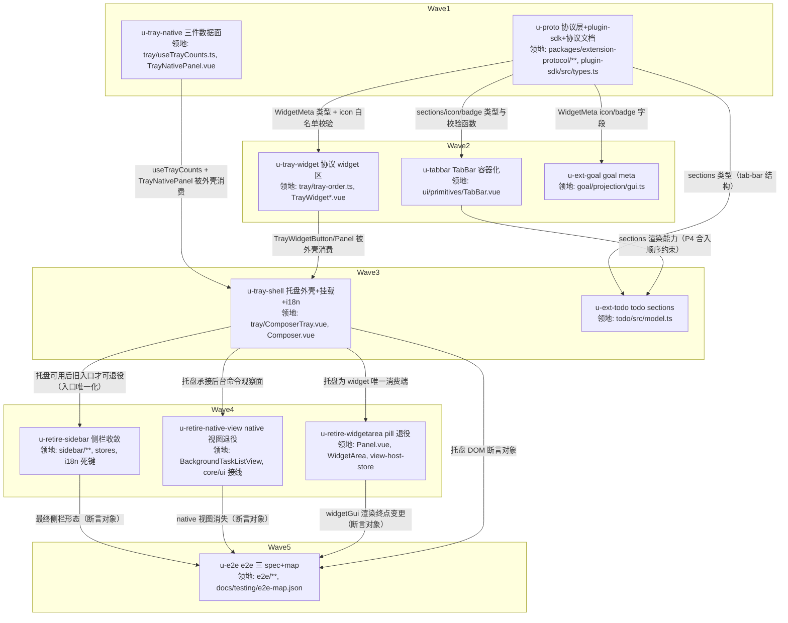

# Composer 任务托盘（Widget Tray）实施计划

基线: 本计划自身 commit（hash 见 §7 变更历史） | 来源设计: docs/design/composer-task-tray.md | 日期: 2026-09-16

> **审查证据（tech-design 循环收敛判据 = 0 must-fix）**：R5 三审 + R6 两审聚焦复核——R5 影响面 1 must-fix（D10 命令捕获集与自述不符 + 分诊桶缺类）已修并由 R6 影响面复核 0 must-fix；R5 主审 0 must-fix（2 suggestion 已修）；R5 简洁审 0 must-fix / 0 suggestion（并对文档数字声称逐项实跑复核吻合）；R6 主审 0 must-fix（1 suggestion 已修）。全部 suggestion 修复经逐条 grep 自对账 + 命令实跑复核。报告（.tmp/ 不入库）：`.tmp/tech-design/design-review-20260916-143055-r5{,-impact,-simplicity}.md`、`.tmp/tech-design/design-review-20260916-143931-r6{,-impact}.md`。

## 0 章节映射

| 内容 | 本文实际位置 |
|------|--------------|
| 背景/目标 | 设计 §1 背景目标（含「设计目标」4 条、in-scope / out-of-scope、设计输入裁决记录①-⑦） |
| 终态/机制 | 设计 §3 解决方案（§3.1 终态三场景、§3.3 关键决策 D1-D14、§3.4 终态数据流、§3.5 错误规格、§3.6 探针清单） |
| 验收场景表 | 设计 §4 验收（A1 / A2 / A2b / A3 / A4 / A5 / A6 / A7 / N1 / N2 + e2e 影响面评估表） |
| 下一层拆分 | 设计 §5 下一层拆分（P1-P4 四阶段表 + 文件改动地图） |
| 待验证检查点（无则记「无」） | 设计 §5 待验证检查点 1-4（= §3.6 ⛔ 探针 P7 浮层溢出 / P5 TabBar 本地 active / composer.toolbar 布局挤压 / WidgetArea 依赖追踪复刻） |

## 1 目标快照

> 逐字摘录设计 §1（不改写）。

**设计目标**（从使用者体验倒推）：

1. **视线不离开工作区**：agent 派发了 3 个 subagent + 1 个 workflow + 2 个后台命令时，用户在 composer 工具条上直接看到六个进行中计数；hover 任一 icon 弹出该类任务的完整面板（分桶列表），可就地 kill/cancel/pause/abort，点行开 drawer 详情。
2. **todo/goal 及未来 widget 统一挂载**：extension 推 setWidget 即在托盘出现（icon + badge + 面板 = 协议渲染），不要求 extension 写任何 taiji 定制代码；未来任何任务型 widget 自动获得挂载位。
3. **常态归零**：无进行中任务、无活跃 widget 时，托盘不制造任何视觉噪音（空闲但有历史 = dim 常驻可查看；彻底无记录 = 隐藏）。
4. **入口唯一化**：同一任务类型只有一个**常驻观察入口**（侧栏任务列表退役，托盘为唯一列表/计数面）——drawer 详情 tab 与对话流内联块属内容呈现（深度检视 / 历史记录），不在此列；消灭「侧栏 tab 数 vs 托盘计数不一致」这类双口径穿帮面。

**in-scope**：composer-bar 左簇托盘组件（built-in 三件 + 协议 widget 两条目）；WidgetMeta / tab-bar 协议小版本扩展；todo buildGui 加 tab-bar；侧栏五 tab 收敛为三 tab 及组件退役；WidgetArea pill 退役；i18n；单测；e2e 影响面对账。

**out-of-scope**：widget 面板内的人写操作（勾选 todo / 完成 goal）；drawer 内 subagent/workflow 详情视图（保留现状）；Plugins tab 的 plugin sidebar view 机制（保留为挂载点，仅退役任务类 native 视图）；通知链（pending-notifications）改动。

## 2 单元列表

> 领地 = 该单元唯一允许改动的文件集合（主 agent 按此生成 add 白名单）。所有单元 `隔离=plain`（领地互斥，无热点公共文件需 worktree 隔离）。

| Unit | 职责 | 领地（精确文件路径） | 依赖 | 隔离 | 验收条款 |
|------|------|----------------------|------|------|----------|
| **u-proto** | 协议层：WidgetMeta +`icon?`/`badge?`、tab-bar props +`sections?`；icon paths 白名单校验函数（正则/条数≤8/单条≤512/总≤2048）；plugin-sdk 平行副本同步；两包 changeset；协议文档同步 | `packages/extension-protocol/src/core/types.ts`、`packages/extension-protocol/src/core/helpers.ts`、`packages/extension-protocol/src/core/helpers.test.ts`、`packages/extension-protocol/src/index.ts`、`packages/plugin-sdk/src/types.ts`、`.changeset/*.md`（新增 1 个：extension-protocol；plugin-sdk 为 private 工作区包 + changeset ignore 名单内，不参与发布）、`docs/architecture/extension-gui-protocol.md` | 无 | plain | ① `cd packages/extension-protocol && npx vitest run` 全绿；② `pnpm --filter @zhushanwen/extension-protocol typecheck` 绿；③ icon 校验单测覆盖四边界（合法 / 非法字符 / 超条数 / 超长度）且越限返回兜底判定（探针 P6）；④ plugin-sdk 平行副本与 extension-protocol 的 WidgetMeta/GuiComponentProps 字段逐项一致（diff 对账，含新字段）；⑤ changeset 文件存在（extension-protocol，minor；plugin-sdk 副本随同 commit 同步、不单独发版） |
| **u-tray-native** | 托盘 built-in 三件数据面：`useTrayCounts`（三件计数 + D13 首拉触发 watch sessionId）+ `TrayNativePanel`（bash/sub/wf 三面板，分桶视图 + 行内操作 + cancel 防误报复制件） | `packages/renderer/src/components/panel/tray/useTrayCounts.ts`、`packages/renderer/src/components/panel/tray/TrayNativePanel.vue`、`packages/renderer/src/__tests__/panel/tray/useTrayCounts.test.ts`、`packages/renderer/src/__tests__/panel/tray/tray-native-panel.test.ts`（新测试命名沿用 panel 目录惯例 `.test.ts`）、`packages/renderer/src/i18n/locales/en-US/tray.ts`（新建）、`packages/renderer/src/i18n/locales/zh-CN/tray.ts`（新建）、`packages/renderer/src/i18n/locales/en-US.ts`、`packages/renderer/src/i18n/locales/zh-CN.ts`（注册 tray 模块） | 无 | plain | ① `cd packages/renderer && npx vitest run src/__tests__/panel/tray/` 全绿；② 计数口径单测：subagent 用 `isRunningProjection`（running 且无 stopReason）且 `origin!=='workflow'`、已结束排除 archived、已收起 = `intent==='archived'`；workflow running/paused；bash 两视图由 background-task-bucket SSOT 谓词派生；③ 首拉触发测试：mount + sessionId 变化 → 断言 `loadSubagents`/`loadWorkflows` 各被调（D13）；④ cancel 防误报用例（迟到收口不发 RPC）；⑤ 空态可行动（「查看已结束 (N)」按钮切 tab，不自动跳）；⑥ 文案走 i18n（新建 `panel.tray.*` 键模块 tray.ts + 双 locale 注册；`pnpm --filter @taiji/frontend check:i18n` 绿、中英键对称、组件代码零硬编码 CJK 文案——check_i18n_cjk.py 规则）；⑦ 面板 props/emit 契约在代码注释写明（供 u-tray-shell 消费） |
| **u-tabbar** | `TabBar.vue` 容器化：`sections?: GuiComponent[][]` 渲染 active section；active 态归本地（首挂载取推送值，用户点击后不被后续推送重置）；缺 sections / 长度不等时退化纯展示 | `packages/ui/src/rendering-protocol/primitives/TabBar.vue`、`packages/ui/src/rendering-protocol/__tests__/TabBar.test.ts` | u-proto（sections 类型） | plain | ① `cd packages/ui && npx vitest run src/rendering-protocol/__tests__/TabBar.test.ts` 全绿；② 探针 P5 行为测试：mount 后 setProps 推新 tabs/sections，断言 active 索引保持（本地选择不被重置）；③ 向后兼容用例：无 sections 时渲染与现状一致（纯展示、无点击态）；④ sections 与 tabs 不等长 → 退化 + warn（设计 §3.5）；⑤ `pnpm --filter @taiji/ui typecheck` 绿 |
| **u-tray-widget** | 托盘协议 widget 区：排序纯函数（known-order + getViewIds 当前插入序）、widget 按钮（icon/badge fallback 链 + status 视觉）、widget 面板（meta head + GuiComponentRenderer） | `packages/renderer/src/components/panel/tray/tray-order.ts`、`packages/renderer/src/components/panel/tray/TrayWidgetButton.vue`、`packages/renderer/src/components/panel/tray/TrayWidgetPanel.vue`、`packages/renderer/src/__tests__/panel/tray/tray-order.test.ts`、`packages/renderer/src/__tests__/panel/tray/tray-widget.test.ts` | u-proto | plain | ① `cd packages/renderer && npx vitest run src/__tests__/panel/tray/` 全绿；② 排序单测：known-order `['todo','goal']` 优先、未知 key 按插入序追加；invalidate→重注册的 key 落尾部（「当前插入序」契约升为测试）；③ icon fallback 链三档（自定义 paths → key 解析 → 内置 widgetKey 映射 → 通用兜底）+ 非法 paths 落兜底；④ badge fallback（`meta.badge → progress.label ?? String(progress.current) → 无`）+ 超长 truncate 至 6 + title 全文；⑤ 依赖追踪复刻验证：mock ViewHostStore 推送新 entry 后 widget 区条目重算（getViewIds+getView 同 computed 路径建链，断链症状 = 不重算）；⑥ 清屏（invalidate）后条目消失 |
| **u-ext-goal** | goal extension：meta 推 icon（badge 用现有 progress.label 推导，可选补推） | `extensions/universal/goal/src/projection/gui.ts`、`extensions/universal/goal/src/projection/__tests__/widget.test.ts`、`.changeset/*.md`（新增 1 个） | u-proto | plain | ① `cd extensions/universal/goal && npx vitest run` 全绿（或 `pnpm extensions:test` 全绿）；② 断言 buildGoalGui 输出 meta.icon（形状符合协议）；③ `pnpm extensions:typecheck && pnpm extensions:lint` 绿；④ changeset 存在 |
| **u-tray-shell** | 托盘外壳：`ComposerTray.vue`（built-in 三按钮行 + hover 160ms / 移出 240ms / pin / 互斥 / 锚定 icon 上方）+ `Composer.vue` 挂载（`v-if="sessionId"`，AddMenuPopover 之后）+ i18n（tray 键）+ 文档同步（DESIGN.md composer 工具条节） | `packages/renderer/src/components/panel/tray/ComposerTray.vue`、`packages/renderer/src/components/panel/Composer.vue`、`packages/renderer/src/i18n/locales/en-US/tray.ts`、`packages/renderer/src/i18n/locales/zh-CN/tray.ts`（优先复用 u-tray-native 已建键，必要时追加；与 u-tray-native 为串行依赖边、先后编辑不并发）、`packages/renderer/src/__tests__/panel/tray/composer-tray.test.ts`、`docs/DESIGN.md` | u-tray-native、u-tray-widget | plain | ① `cd packages/renderer && npx vitest run src/__tests__/panel/tray/` 全绿；② 交互行为测试：hover 开面板（160ms）/ 移出收起（240ms）/ 移入面板不收起 / 点击 pin（再点/Esc 解除）/ 同时至多一个面板（互斥）；③ built-in 三态：running>0 亮计数+呼吸点、有历史 dim、全无隐藏（DOM 层断言计数元素不存在而非 opacity:0）；④ `pnpm --filter @taiji/frontend check:i18n` 绿且中英键对称；⑤ Composer 挂载断言（landing 态隐藏与 GenStats 同判据）；⑥ 探针 P7 真机验证项列入阶段 5（窗口最小宽度下浮层不裁剪/翻转异常降级手写浮层） |
| **u-ext-todo** | todo extension：buildGui 改 `tab-bar{tabs, sections}`（待办/已完成两段）+ meta 推 icon/badge | `extensions/universal/todo/src/model.ts`、`extensions/universal/todo/src/index.ts`、`extensions/universal/todo/src/__tests__/gui.test.ts`、`extensions/universal/todo/src/__tests__/tool-rpc.test.ts`、`.changeset/*.md`（新增 1 个） | u-proto、u-tabbar | plain | ① `cd extensions/universal/todo && npx vitest run` 全绿（或 `pnpm extensions:test`）；② gui.test 断言：tab-bar 的 `sections` 与 `tabs` 等长（2 段），第二段为已完成 list-tree；meta.icon/badge 到位；③ `pnpm extensions:typecheck && pnpm extensions:lint` 绿；④ changeset 存在 |
| **u-retire-sidebar** | 侧栏收敛三 tab + D10 侧栏域退役清单（组件/composable/store/测试/i18n 死键）+ 文档同步（FEATURE-PRIORITIES P0 用例组入口迁移） | 删除：`packages/renderer/src/components/sidebar/{SubagentList.vue,SubagentFilterBar.vue,WorkflowList.vue,WorkflowDetail.vue}`、`packages/renderer/src/composables/features/chat/useListSync.ts`、`packages/renderer/src/composables/features/sidebar/{useSidebarSubagentActions.ts,useSubagentBucketFilter.ts,useBackgroundTaskBucketFilter.ts}`、`packages/renderer/src/__tests__/sidebar/{SubagentList.spec.ts,WorkflowList.spec.ts,WorkflowDetail.spec.ts}`、`packages/renderer/src/__tests__/components/SubagentFilterBar.test.ts`、`packages/renderer/src/__tests__/composables/{useListSync.test.ts,useSubagentBucketFilter.test.ts,use-background-task-bucket-filter.test.ts}`；修改：`packages/renderer/src/components/sidebar/{Sidebar.vue,SegmentedTab.vue}`、`packages/renderer/src/composables/features/sidebar/useSidebarCounts.ts`（瘦身：subagent/workflow 段迁出）、`packages/renderer/src/stores/{sidebar.ts,workflow.ts}`、`packages/renderer/src/__tests__/sidebar/*`（SegmentedTab.spec / sidebar-layout / sidebar-list-error-state / sidebar-crud-error-handling / sidebar-ondeletefolder / sidebar-import-entry / sidebar-assign-project-wiring / fork-keymap / `__tests__/helpers/sidebar-mount.ts`）、`packages/renderer/src/__tests__/stores/workflow.test.ts`、`packages/renderer/src/__tests__/composables/useSidebarCounts.test.ts`、`packages/renderer/src/i18n/locales/{en-US,zh-CN}/sidebar.ts`（死键清理，`sidebar.workflowDetail.*` 7 键 + 兄弟键 `sidebar.workflowOpFailed` 必须保留）、`packages/renderer/src/components/panel/WorkflowTab.vue`、`packages/renderer/src/components/panel/SubagentTab.vue`（仅头注悬空引用清扫）、`packages/core/src/domain/drawer/coordination.ts`、`packages/core/src/transport/mock/workflow-data.ts`（仅注释清扫）、`packages/renderer/src/lib/subagent-bucket.ts`、`packages/renderer/src/lib/background-task-bucket.ts`（仅头注消费者列举清扫）、`packages/renderer/src/composables/features/fork-handoff/useForkActions.ts`、`packages/renderer/src/composables/features/sidebar/useSidebarSessionActions.ts`（仅头注悬空引用清扫）、`packages/renderer/src/__tests__/lib/subagent-bucket.test.ts`、`packages/renderer/src/__tests__/composables/useSidebar.test.ts`、`packages/renderer/src/__tests__/composables/use-context-usage.test.ts`、`packages/shared/__tests__/subagent.test.ts`（仅注释指针清扫，文件保留）、`docs/FEATURE-PRIORITIES.md` | u-tray-shell | plain | ① N1 断言：`rg -l "from.*(SubagentList|WorkflowList|BackgroundTaskListView|SubagentFilterBar|WorkflowDetail|useListSync|useSidebarSubagentActions|useSubagentBucketFilter|useBackgroundTaskBucketFilter)" packages/renderer/src` 活代码零命中（计划期实测基线 = 13 文件，全部随本单元删除/改造）；② D10 宽口径 rg 圈定（现文命令 = 模块名 + id 字面量（'subagents'/'workflows'/background-tasks）+ API 符号（subagentRunningCount/workflowRunningCount），实跑基线 76 文件）逐项按四桶分诊清零（import 直引 = 删或改 / vi.mock = 删 / 注释 = 清理（文件保留）/ 无关符号名碰撞 = 不动）；碰撞登记 6 项（subagent-core `formatWorkflowList` 等）与注释保留件登记（lib/subagent-bucket.test 等）不得处置；core contribution-registry.test 跨包项在 u-retire-native-view 处理；射程外人工补充两类（Panel.inbound-frame-notice.test / Panel.dead-diagnostics-export.test 的 VIEW_HOST_SOURCE_KEY provide 清理）必须纳入改造；③ `pnpm --filter @taiji/frontend typecheck` + `npx vitest run` 全绿；④ SegmentedTab 仅 会话/文件/Plugins 三枚（DOM 断言）；⑤ `stores/workflow.ts` 视图 2 簇删除且头注「保留」句修正；⑥ `pnpm --filter @taiji/frontend check:i18n` 绿；⑦ FEATURE-PRIORITIES P0 用例组入口提法更新；⑧ 保留面头注/注释悬空引用清扫（计划期实测：WorkflowTab.vue 4 处「复用自 WorkflowDetail」、SubagentTab.vue 1 处、lib/subagent-bucket.ts 头注消费者列举、lib/background-task-bucket.ts 头注、useForkActions.ts / useSidebarSessionActions.ts 头注、drawer/coordination.ts 1 处、mock/workflow-data.ts 1 处、lib/subagent-bucket.test.ts / useSidebar.test.ts / use-context-usage.test.ts / shared subagent.test.ts 各 1 处），清扫后 `rg` 保留面零命中注释级引用（碰撞类不清扫） |
| **u-retire-native-view** | background-tasks native 视图退役：删 `BackgroundTaskListView.vue`、`builtin-contributions.ts` 贡献声明、`useExtensionHostBridge` 的 NATIVE_VIEWS 路由与 L2_TAB_BADGE 接线、PluginViewContainer/L2TabBar 的 NATIVE_VIEWS 分支 | 删除：`packages/renderer/src/components/extension/BackgroundTaskListView.vue`、`packages/renderer/src/__tests__/components/background-task-list-view.test.ts`；修改：`packages/renderer/src/composables/shell/useExtensionHostBridge.ts`、`packages/renderer/src/composables/shell/__tests__/useExtensionHostBridge.test.ts`、`packages/core/src/extension-host/builtin-contributions.ts`、`packages/core/src/extension-host/__tests__/contribution-registry.test.ts`、`packages/ui/src/extension-host/{PluginViewContainer.vue,L2TabBar.vue,l2-tab-item.ts,index.ts}`、`packages/ui/src/extension-host/__tests__/PluginViewContainer.test.ts` | u-tray-shell | plain | ① `cd packages/core && npx vitest run` + `cd packages/ui && npx vitest run` + `cd packages/renderer && npx vitest run` 全绿；② NATIVE_VIEWS 路由表不再含 `background-tasks`（断言或删除）；③ `rg -n "background-tasks" packages/renderer/src packages/core/src packages/ui/src` 剩余命中仅为保留面（非任务视图）并逐条说明；④ 三包 typecheck 绿 |
| **u-retire-widgetarea** | WidgetArea pill 退役：`Panel.vue` 摘挂 + `widgetSessionId` 删除；`@taiji/ui` WidgetArea 组件/barrel 导出/测试删除；`view-host-store.ts` getViewIds 头注顺序契约修正；Panel 相关测试 provide 清理 | 修改：`packages/renderer/src/components/panel/Panel.vue`、`packages/renderer/src/components/panel/__tests__/Panel.widget-area.test.ts`（删除或改造）、`packages/renderer/src/__tests__/panel/Panel.inbound-frame-notice.test.ts`、`packages/renderer/src/__tests__/panel/Panel.dead-diagnostics-export.test.ts`、`packages/ui/src/features/chat/index.ts`、`packages/core/src/extension-host/view-host-store.ts`；删除：`packages/ui/src/features/chat/WidgetArea.vue`、`packages/ui/src/features/chat/__tests__/WidgetArea.test.ts` | u-tray-shell | plain | ① `rg -n "WidgetArea" packages/renderer/src packages/ui/src` 活代码零命中（注释提及须清理或指向托盘）；② 三包 vitest + typecheck 全绿；③ `view-host-store.ts` getViewIds JSDoc 含「当前插入序」契约表述；④ Panel 两测试的 VIEW_HOST_SOURCE_KEY 范式 provide 清理 |
| **u-e2e** | e2e 影响面落地：四份受影响 spec 更新（workflow-sidebar-sync 改写为托盘断言 / gui-components 消费端改挂托盘 / visual composer 基线更新 / **tasks-drawer-real 断言 list-tree→tab-bar（实施期发现的计划级漏项，设计 §4 e2e 表已同步登记）**）+ e2e-map 登记对账（含 **E2E-REAL-01 scope 补 `extensions/universal/**`**——原 scope 不含 extensions，机器选择器抓不到 extension GUI 形态变更） | `e2e/workflow-sidebar-sync.spec.ts`、`e2e/gui-components.spec.ts`、`e2e/composer.spec.ts`、`e2e/visual/composer.spec.ts`、`e2e/tasks-drawer-real.spec.ts`、`e2e/visual/*snapshots*`（若有）、`docs/testing/e2e-map.json` | u-tray-shell、u-retire-sidebar、u-retire-native-view、u-retire-widgetarea、u-ext-todo | plain | ① `npx playwright test --project=electron e2e/workflow-sidebar-sync.spec.ts e2e/gui-components.spec.ts e2e/composer.spec.ts` 空载串行实跑绿；② `npx playwright test --project=visual-chromium e2e/visual/composer.spec.ts` 基线更新后复跑绿；③ `node scripts/validate-e2e-map.mjs` 绿 + `node scripts/select-affected-e2e.mjs --base main --check` 无漏登记；④ 单测化路径标注：列表渲染断言沉淀 ComposerTray/托盘组件测试（设计 §4 e2e 表）；⑤ `e2e/tasks-drawer-real.spec.ts` R2/R3 断言改写（list-tree → tab-bar + 两段结构）并空载串行实跑一次（真实 LLM 轨）；⑥ `node scripts/validate-e2e-map.mjs` 绿 + `--check` 无漏登记（含 REAL-01 scope 补 extensions/universal/** 后的命中复查） |

## 3 DAG 图

**计划自检结论**（阶段 1 [MANDATORY]）：

1. **切分粒度**：11 单元，领地逐文件枚举；唯一跨单元共享文件 = i18n tray 模块 4 文件（u-tray-native 建键 → u-tray-shell 复用/追加），二者间存在 DAG 串行边（同文件共改依串行边保证，不并发）；共享契约 extension-protocol 独立为 u-proto 根，跨单元消费的类型只在其一处定义；无空转单元；依赖方向与 DAG 一致（每条边带原因）。
2. **worktree 隔离**：全部 plain——改动无热点公共文件（无全局路由表/index 出口/共享 store 的多单元共改面），领地互斥已足够。
3. **验收条款无遗漏**：每单元 ≥1 条机器可核验证据条款（测试命令 / DOM 断言 / rg 零命中 / diff 对账）；设计 §4 场景表 A1-A7、N1、N2 全部落到单元验收条款或 §4.2 验收计划表。
4. **验收计划表自洽**：核心组（A1 起）覆盖主链路；依赖列无环；每项含方式/成本/收益/组/依赖/优化判定；提速结论已给出（可合并 6 / 可脚本化 4 / L0 守卫清单）。
5. **e2e 影响面无悬空**：设计 §4 e2e 表逐项落「跑 / 不跑（理由）」；已与 `select-affected-e2e` 输出双向对账（差异逐条披露见 §4.3）。

## 4 测试与验收计划

### 4.1 测试命令（从项目 package.json / AGENTS.md 真实读取）

| 层 | 命令 |
|----|------|
| 增量单测（renderer） | `cd packages/renderer && npx vitest run <文件路径>`；typecheck `pnpm --filter @taiji/frontend typecheck`；i18n 对账 `pnpm --filter @taiji/frontend check:i18n` |
| 增量单测（ui） | `cd packages/ui && npx vitest run <文件路径>`；typecheck `pnpm --filter @taiji/ui typecheck` |
| 增量单测（core） | `cd packages/core && npx vitest run <文件路径>`；typecheck `pnpm --filter @taiji/core typecheck` |
| 增量单测（extension-protocol） | `cd packages/extension-protocol && npx vitest run`；typecheck `pnpm --filter @zhushanwen/extension-protocol typecheck` |
| extensions 三连 | `pnpm extensions:typecheck && pnpm extensions:lint && pnpm extensions:test` |
| 静态规则（L0） | `pnpm run lint`；`node scripts/check-doc-symbol-drift.mjs`；N1 的 `rg` 断言（设计 §4 N1 原文命令） |
| 全量单测（收尾） | `pnpm test`（阶段 3 尾执行；增量期不跑） |
| e2e（L3，空载串行） | `npx playwright test --project=electron <spec>`（mock 轨）/ `npx playwright test --project=visual-chromium e2e/visual/composer.spec.ts`（像素轨，基线更新用 `--update-snapshots` 后复跑）；按改动面圈定，禁全量扫跑 |

### 4.2 验收计划表（设计 §4 场景表逐行编译；阶段 5 执行依据）

| # | 验收项（场景表行） | 方式 | 成本(1-10) | 收益(1-10) | 组 | 依赖 | 优化判定 |
|---|--------------------|------|-----------|-----------|----|------|----------|
| A1 | 并行任务可见性（三计数与进行中一致、切 session 回来历史桶非空） | L4 agent（真机 `TAIJI_DEV_BACKGROUND=1 pnpm dev` + CDP） | 7 | 10 | 核心 | - | 可脚本化：计数口径已由 u-tray-native 单测覆盖，真机只验「渲染 + 数据链路」；CDP DOM 断言可脚本化沉淀 |
| A2 | hover 面板与操作（subagent 三 tab、cancel 两段式、行点击开 drawer） | L4 agent | 8 | 9 | 核心 | A1 | 交互时序（160/240ms）可由 u-tray-shell 组件测试覆盖；真机验 hover/pin 与 drawer 归宿 |
| A2b | workflow 面板与操作（pause/resume/abort、行点击 drawer workflow tab） | L4 agent | 8 | 8 | 核心 | A1 | 同上；与 A2 合并同一真机会话内执行（同环境并行） |
| A3 | widget 挂载（todo/goal icon+badge、tab 本地切换不重置、内容刷新） | L4 agent | 7 | 8 | 核心 | A1 | TabBar 本地 active 由 u-tabbar 单测覆盖（探针 P5）；真机验端到端推送链 |
| A4 | 常态归零（计数/呼吸点消失、有历史 dim、widget 清屏消失、冷启动零条目） | L4 agent | 6 | 7 | 核心 | A2、A3 | 三态判定可由组件测试断言 DOM；真机验与真实数据链联动 |
| A5 | 入口唯一（侧栏三枚、无 Agents/Flows、无后台命令 L2、无 pill、drawer 三 tab 行为不变、内联块保留） | L0 静态（rg/tsc）+ L4 真机 | 5 | 8 | 核心 | A1-A3 | 静态部分（N1 rg）为 L0 机器断言；真机验 drawer 邻居不变量 |
| A6 | 切 session 跟随（计数/面板随 sessionId 切换、不残留旧任务） | L4 agent | 6 | 7 | 核心 | A1 | 可合并进 A1 会话（同一真机会话内切换验证） |
| A7 | 协议兼容性（无 icon/badge 字段的既有 widget 推 setWidget 正常挂载、无 warn 刷屏） | L3 脚本（mock 推帧/no-icon widget）+ L4 复核 | 4 | 6 | 非核心 | A3 | 可用现役未升级 widget mock 帧脚本化；u-tray-widget 的 fallback 单测已覆盖判定逻辑 |
| N1 | 负面：不可达入口（退役面 import 零命中、NATIVE_VIEWS 空、i18n 死键按规则清理） | L0 静态（rg + tsc） | 1 | 9 | 核心 | - | 已脚本化为 rg 断言（设计 §4 N1 原文）；归 u-retire-* 三单元验收条款 |
| N2 | 负面：归零不虚亮（托盘无 accent/呼吸点元素；计数元素不存在而非 opacity:0） | L4 agent（DOM 断言） | 4 | 8 | 核心 | A4 | DOM 级断言可脚本化；u-tray-shell 组件测试先行覆盖，真机复核 |

**提速结论**：可降级 0 项（L4 → L3 的候选均依赖真机 UI 交互时序，降级会丢真实链路验证）；可合并 6 项（A2+A2b 同会话、A6 并入 A1、A4/N2 同会话、A5 的 L0 部分与 N1 同源）；可脚本化 4 项（A1/A3/A4/N2 的 DOM 断言在组件测试先行，真机仅复核；A7 走 mock 推帧脚本）；L0 静态守卫清单 = `pnpm run lint`、`node scripts/check-doc-symbol-drift.mjs`、`node scripts/validate-e2e-map.mjs`、`node scripts/select-affected-e2e.mjs --base main --check`、N1 rg 断言、各包 typecheck。预计节省派发轮次：真机验收由 8 场景 3 批收敛为 4 会话 2 批（A1+A6 / A2+A2b / A3+A4+N2 / A5+A7）。

### 4.3 e2e 影响面圈定（继承设计 §4 e2e 影响面评估）

| 受影响资产 | 圈定 | 执行时点 | 理由 |
|---|---|---|---|
| `e2e/visual/composer.spec.ts`（E2E-VISUAL-01） | 跑 | u-e2e 单元（基线更新 + 复跑） | 托盘进 composer-bar 必然像素 diff |
| `e2e/composer.spec.ts`（E2E-MOCK-01） | 跑 | u-e2e 单元（空载串行） | 工具条结构断言可能受影响 |
| `e2e/workflow-sidebar-sync.spec.ts`（E2E-MOCK-01） | 跑（改写为托盘断言后） | u-e2e 单元 | 侧栏收敛直接击中；单测化路径 = 列表渲染断言沉淀 ComposerTray 组件测试 |
| `e2e/gui-components.spec.ts`（E2E-MOCK-01） | 跑（widget 断言改挂托盘） | u-e2e 单元 | widgetGui 渲染终点由 WidgetArea 变为托盘 |
| E2E-ELECTRON-01 P0 smoke（v6-shell-baseline 等） | 跑 p0-smoke 子集 | 阶段 5（`--project=electron-smoke`，l1 常跑） | shell 布局含侧栏 tab 数 |
| `WidgetArea.test.ts` / `Panel.widget-area.test.ts` | 不跑（随 D11 删除/改造） | — | 组件退役，断言有价值部分迁托盘组件测试 |
| 真实 LLM e2e（E2E-REAL-01 轨） | 不跑 | — | 本次无 runtime/pi 协议行为变化（extension-protocol 为纯类型 + 守卫扩展）；项目纪律：真实 LLM 轨不进 PR/CI，开发期按改动面排除 |

**机器对账**（`node scripts/select-affected-e2e.mjs --base main`）：

- 现状（工作区仅设计文档 untracked、无代码 diff）输出 = E2E-ELECTRON-01（always）+ E2E-VISUAL-01（always），2/13 rule。
- 改动落地后预期命中：E2E-ELECTRON-01（always）、E2E-VISUAL-01（`packages/renderer/src/**` scope）、E2E-MOCK-01（`packages/renderer/src/**`/`packages/core/src/**` scope，其 assets 含 composer/gui-components/workflow-sidebar-sync 三 spec）、E2E-REAL-01（`packages/renderer/src/**` scope 命中但人工裁决不跑，理由见上表）。
- 差异双向披露：① 机器输出无人工清单之外的 rule（人工清单全部落在 ELECTRON-01 / VISUAL-01 / MOCK-01 / REAL-01 四 rule 内）；② 机器 rule 的 assets 大于人工圈定子集（MOCK-01 含 11 spec，人工取 3）——按改动面圈定、非全量扫跑（项目 AGENTS.md e2e 执行准则）；③ E2E-REAL-01 属机器选中、人工排除项，理由已登记；④ `--check` 门禁在 u-e2e 单元执行，防漏登记。
- **实施期发现的计划级漏项（u-ext-todo 报告）**：`e2e/tasks-drawer-real.spec.ts` 断言 todo `__gui__` 根为 list-tree（实测 L233 等 5 处）——D5 改造后必红；该 spec 不在原 u-e2e 领地枚举，且 E2E-REAL-01 的 scope 不含 `extensions/**`（机器选择器只按 spec 文件路径命中，抓不到「extension GUI 形态变更」这一改动面）。处置：设计 §4 e2e 表补该行（doc_errors 修复）、u-e2e 领地上收该 spec、REAL-01 scope 补 `extensions/universal/**`、断言改写列入 u-e2e 验收 ⑤。

## 5 合理偏差登记表

| # | 单元 | 偏差 | 原因 | 处置 |
|---|------|------|------|------|
| D1 | u-ext-goal | 不补推 badge（设计 §5 P4 标「可选补推」） | 避免百分比双真相源：`progress.label` 已是 extension 全权格式化的 '42%'，再推同值字符串会漂移 | 接受（宿主 badge fallback 链 `progress.label` 派生同值；gui.ts 存 why 注释 + 测试锁定 `meta.badge === undefined` + changeset 正文记录） |
| D2 | u-ext-goal | 修改 `extensions/universal/goal/src/__tests__/gui.test.ts`（领地清单未逐字列入该路径） | 该文件是 buildGoalGui 专属测试，meta 精确 `toEqual` 断言随新增 icon 字段必红——属派发指令「既有测试文件/断言如需同步更新一并处理」射程 | 接受（改动最小同步：两处 toEqual 加 icon + 新增 1 个 icon 契约用例） |
| D3 | u-tray-native | i18n 模块注册形态：tray.ts default export 只含 tray 子树，aggregator 用 `panel: { ...panel, ...tray }` 展开并入 panel 命名空间 | 对象字面量不能并列两个 panel 顶层键 | 接受（运行时 key 仍为 `panel.tray.*`；locale-sync / key-usage 双检查绿） |
| D4 | u-tray-native | 面板新增 `props.pinned`（默认 false）；bash kill 按钮由旧 hover-only（opacity-0 + group-hover）改为 pin 门控恒显 | D8「hover 态不渲染行内按钮、pin 后出现」——pin 状态由外壳管理、行渲染在面板，面板必须消费该位 | 接受；u-tray-shell **必须显式透传 pinned**（否则行内操作永不渲染），已写入其派发契约 |
| D5 | u-tray-native | `TrayNativePanel.vue` script 403 行超 300 门禁，按登记制 `split-justified: built-in 三件面板同一语义域` 放行至 500 | 单元领地固定两文件；三件行渲染/行内操作/分桶状态同属一个面板语义域 | 接受（登记制 = 2026-09-11 用户裁决机制，已核实 checker 输出 INFO 非错误） |
| D6 | u-tray-native | 桶标签两套词：bash 用「运行中」（进程域）/ subagent·workflow 用「进行中」（任务域） | 沿用 sidebar.ts 已登记域差异；设计 D2 亦分别写「运行中/已结束」与「进行中/已结束/已收起」 | 接受（裁决登记在两个 locale 文件头） |
| D7 | u-tray-native | 面板 emits 为空（契约以文件头注释写明，非 defineEmits） | 面板自持数据源与动作：行内操作直连 store/RPC、行点击直连 drawer API，外壳无需回调 | 接受 |
| D8 | u-tabbar | 渲染器接入不走 PrimitiveRouter 静态回退（inject-only + 新增 `no-renderer` 降级分支） | 避免 Router↔TabBar 二文件 import 环（container-registry 头注断环不变量；迁入注册表需改 3 个领地外文件） | 接受（环实测 0；应用路径均经 GuiComponentRenderer provide（已核 L42）；降级分支有用例；设计 §3.5 同 commit 新增该行） |
| D9 | u-tabbar | warn 去重：同 (原因, tabs 数, sections 数) 形态只出声一次，恢复合法后重置 | 防每次推送刷屏（对齐 A7「无 warn 刷屏」精神） | 接受（设计 §3.5 行同 commit 扩写） |
| D10 | u-tabbar | 探针 P5 降级路径（模块级 per-widgetKey active 缓存）未启用 | 行为测试证明经 GuiComponentRenderer setProps 推送后 DOM 元素同一（组件未重建）+ 本地选择保持 | 接受——**探针 P5 ⛔ 门关闭（无需降级）** |
| D11 | u-tabbar | 新增 `data-testid="gui-tab-bar-section"` / class `tab-bar__section` | section 容器定位锚点（供后续 e2e / 组件断言） | 接受 |
| D12 | u-tabbar | 「无 sections 与现状完全一致」精确口径 = 元素/class/属性/交互一致；fragment 根新增两个注释节点（v-if 占位 + 模板说明注释） | 无元素计数/样式/text() 影响（CSS 结构伪类与邻接选择器忽略注释节点） | 接受 |
| D13 | u-tray-widget | icon key 解析 = 宿主 registry 白名单（10 条，命中前归一化大小写/-/_）而非 `@lucide/vue` 全量 namespace 解析 | namespace import 击穿 tree-shaking（1500+ icon 进 renderer bundle） | 接受（未知名走兜底链 + warn 一次；已文件头登记） |
| D14 | u-tray-widget | 非法/越限自定义 paths 的下一档取「宿主内置 widgetKey 映射」（'todo' 坏 paths 仍显 ListChecks），非直接通用 icon | 按派发链序实现（自定义 → key → 内置映射 → 通用） | 接受（设计 §3.1「落兜底通用 icon」为宽松措辞，安全性同一；登记备查） |
| D15 | u-tray-widget | 组件 props 驱动（不 inject ViewHostStore）；单一数据源 = 外壳 entries computed | 与 WidgetArea 模式一致（区级 computed → 子组件 props），避免第二份真相 | 接受（依赖追踪复刻写入 tray-widget.test.ts 的「外壳契约复刻」含反证用例，供 u-tray-shell 照抄） |
| D16 | u-tray-widget | 新增原型链防护：内置 icon 映射用 Map、status→色用 switch | viewId/status 由 extension 决定且 core 只校验 meta.title；裸对象下标会把 'constructor' 等原型链键取成函数渲染 | 接受（新增脏数据防护用例） |
| D17 | u-tray-widget | 无 fake timers 用例（两组件不持计时器；hover 计时归外壳） | 无 timer 路径可测 | 接受（头注写明后续引入计时时的 fake timers 范式） |
| D18 | u-ext-todo | 待办段 = 未完成项（pending + in_progress），非全量清单 | D5 被否方案理由成立前提（否则已完成段常驻占位把待办挤出首屏）；tab 标签「待办 N」与 badge 必须与段内容同源（防双口径） | 接受 |
| D19 | u-ext-todo | sections wire 形状 = `[[list-tree],[list-tree]]`（子树数组） | 协议 `sections?: GuiComponent[][]` 定义 + TabBar 按 `sections[active]` 渲染 | 接受（测试锁定；初版扁平写法被新测试抓红后修正） |
| D20 | u-ext-todo | tab 标签中文带计数（`待办 N` / `已完成 M`）+ 首段显式 `active: true` | 设计/派发文案逐字为中文；GUI 内容无 i18n 通道；显式 active 防宿主默认值漂移 | 接受 |
| D21 | u-ext-todo | 未跑本地 pi CLI 真机实测（归阶段 5 A3 真机验收） | 本单元验收条款只含包内 vitest + extensions 三连（与 u-ext-goal 同证据形态） | 接受（wire 层已由 tool-rpc G-1/G-4 在真实 marker 载荷上 JSON.parse 断言覆盖） |
| D22 | u-ext-todo | 未改 `index.ts` 清屏路径与 `render.ts`（TUI 侧无双段承载） | 清屏语义（探针 P1）零改动；设计射程 = buildGui | 接受（G-2 清屏用例继续锁定） |
| D23 | u-ext-todo | `buildGui([])` badge 推 `'0'` 无特判（仅测试可达） | 生产路径空清单走清屏；不加无生产效果的分支（YAGNI） | 接受 |
| D24 | u-doc-sync | refreshDisplay 示例定位修正：派发写的 §3.2 实际位于 §4.3（§3.2 已由 u-proto 同步） | 按符号唯一定位改 §4.3 | 接受 |
| D25 | u-doc-sync | 登记未改的相邻文档存量滞后（超射程）：① §4.3 helper 示例签名与 §5.2/指南 Helper 表滞后（现走 setWidgetDual + GuiRenderResult）；② 指南 §4 速查表「渲染状态」列整列仍标「P2 待实现」而 8 原语已实现；③ 架构文档 §3.2 list-tree props 未列 `numbered`、GuideComponentProps 未列 `group` | 属存量滞后（非本次引入），改动横跨 3+ 处超领地 | 接受暂不改；入 §7 残留风险登记另行建档 |
| D26 | u-tray-shell | 浮层实现 = reka Popover（每条目一个受控 `:open`），未用手写 anchored | 设计 D8 二选一 + 派发「先按仓内 popover 范式」 | 接受（P7 降级预案写入 ComposerTray.vue 文件头；真机复核在阶段 5） |
| D27 | u-tray-shell | 新增 1 个 i18n 键 `panel.tray.trayLabel`（中英对称） | 托盘 icon 行 `role=group` aria-label | 接受 |
| D28 | u-tray-shell | 面板键命名空间化（`native:<kind>` / `widget:<viewId>`）+ 互斥实现为单一 activeKey | 设计只要求「至多一个面板」，未规定键形态；单键持有使互斥结构性成立，前缀防 widget 名为 bash/flow 时撞键 | 接受 |
| D29 | u-tray-shell | 新增 `renderedPanelKeys` 守卫（widget 清屏 / built-in 归零 → 面板与 pin 一并作废，条目回来不弹回） | D7 只写条目可见性，未明说「条目消失时交互态如何处置」——边界补齐 | 接受（2 条用例锁定 + 变异验证） |
| D30 | u-tray-shell | 面板打开拦截 reka FocusScope 自动聚焦（`open-auto-focus → preventDefault`） | hover 预览打开不得抢走 composer 输入焦点（打字中被打断属正常路径破坏） | 接受（断言 `document.activeElement` 不变 + 变异验证） |
| D31 | u-tray-shell | 层外点击判定排除托盘按钮行内目标（`onInteractOutside` 对托盘根内 target preventDefault） | 设计只写「点面板外解除」；不排除则「再点 icon 解除」被 pointerdown 先解除、click 再 pin 回来（永远解不开） | 接受（真实 pointerdown+click 时序用例锁定） |
| D32 | u-tray-shell | DESIGN.md 只加 1 条 bullet（composer-bar 任务托盘 + 位置），未改「composer-bar 6 元素」原行 | 该行本就不全（缺 GenStatsTriggers / composer.toolbar）；最小必要补充 | 接受 |
| D33 | u-tray-shell | 测试用真实 TrayNativePanel/TrayWidgetPanel（不 stub）+ 变异验证（6 处改坏→红） | `pinned` 透传必须由真实 DOM 断言（防空断言）；hover 计时期望独立常量化 | 接受（质量加分项） |
| D34 | （观察，非偏差） | tray 测试 stderr 的 Vue warn「no active effect scope」 | 存量模式：抽样既有 composer-smoke=2 / context-chips-bar=1，非本次引入 | 不处置 |
| D35 | u-retire-widgetarea | 派发路径修正：Panel 两测试实际位于 `components/panel/__tests__/`（派发文案写的 `__tests__/panel/` 不存在） | 按磁盘现文精确定位 | 接受 |
| D36 | u-retire-widgetarea | `Panel.widget-area.test.ts` 选「删除」不改造：firstRunning 预览断言**无承接对象**（托盘无该 UI，以 badge fallback + status 视觉替代） | 守护对象随 `activePreview` computed 消亡（e2e-map R3 语义）；fallback 链断言已由 tray-widget.test.ts 承接 | 接受（设计 §4 e2e 表同批修正措辞） |
| D37 | u-retire-widgetarea | i18n 死键 `panel.widget.details` 双侧删除（**计划领地漏项**，经续聊定向修，领地临时扩展至两个 panel.ts） | locale-key-usage-guard 反查守卫拦截；消费者随 WidgetArea 消亡 | 接受（教训：退役单元领地须显式含所删组件消费的 i18n 键所在 locale 文件） |
| D38 | u-retire-native-view | 范围略扩：NATIVE_VIEWS / L2_TAB_BADGE 机制整体退役（删两 KEY、`L2TabItem.badge` 字段、L2TabBar badge 渲染、index.ts 导出、bridge 侧 `resetBadgeSource` 与 badge 装配腿） | 两键唯一生产者/消费者对 = background-tasks；N1 明文「NATIVE_VIEWS 路由表为空/移除」；留键 = 零生产者死机制 | 接受（plugin sidebar view 机制本体原样保留） |
| D39 | u-retire-native-view | 顺带清扫 `useExtensionHostBridge.ts` 内 2 处 WidgetArea 注释 | 该文件不在 widgetarea 领地，不清扫即跨单元死结 | 接受 |
| D40 | u-retire-sidebar | 领地外必要同步 3 文件：`components/sidebar/__tests__/Sidebar.test.ts`（vi.mock 指向已删模块）、`__tests__/i18n/{i18n-value-smoke,locale-sync-check}.test.ts`（断言死键值；check:i18n 是硬门） | 不改则红；属设计 D10 基线名单点名文件的路径枚举偏差 | 接受（最小等价替换，测试语义不变） |
| D41 | u-retire-sidebar | `useSidebarSessionActions.ts` 超「仅头注」：删 `onRetryWorkflows`/`onRetrySubagents` 与 store 依赖 | D13 明文「retry 全在退役面内」；不删则未使用 import 触发 lint | 接受（`focusedSessionId` 注入字段保留并注明） |
| D42 | u-retire-sidebar | i18n 删除面含兄弟单元消费键：`sidebar.backgroundTaskList.*` 10 键（随 BackgroundTaskListView 删除）+ 4 个既有零引用死键 | locale 文件是本单元唯一领地；保留即无人认领死键 | 接受（逐键全仓 grep 证实零消费） |
| D43 | u-retire-sidebar | 注释清扫写法 = 去标识符保语义（[HISTORICAL] 注记改写为描述性表述，不书写已删模块名） | 使 D10 宽口径在领地内零命中；历史细节由 git 承载 | 接受 |
| D44 | u-retire-sidebar | 保留未动：`lib/subagent-bucket` 的 `filterSubagents`/`countSubagents`/`DEFAULT_SUBAGENT_FILTER` 与 `stores/workflow` 的 `workflowCount`（现零生产消费） | D2/D10 明文「SSOT 模块不随 UI 宿主退役」；设计枚举的视图 2 清单不含 workflowCount | 接受（登记为后续清理候选，不扩权） |
| D45 | u-retire-* 批（观察） | u-retire-sidebar 领地清单中 `__tests__/sidebar/*` glob 未覆盖 `components/sidebar/__tests__/`（同类路径歧义第二例） | 派发时以 glob 兜底而非逐文件枚举所致 | 接受（已由 D40 覆盖）；教训：退役单元领地须逐文件枚举，减少 glob |

## 6 状态表

| Unit | 状态 | 轮次 | 证据指针 |
|------|------|------|----------|
| u-proto | committed | 1 | commit「feat(tray): u-proto protocol fields...」；vitest 14 files/227 pass + tsc --noEmit ok + plugin-sdk 副本 identical=True + 主 agent 复核重跑同结果 |
| u-tray-native | committed | 1 | commit「feat(tray): u-tray-native counts + native panel」；tray vitest 2 files/31 pass + check:i18n 201 pass + typecheck ok + 主 agent 重跑复核同结果；契约：pinned 必须由 u-tray-shell 透传 |
| u-tabbar | committed | 1 | commit「feat(tray): u-tabbar sections container」；TabBar.test 16 pass + ui 全包 806 pass + ui typecheck ok + 主 agent 重跑复核同结果；P5 门关闭（见偏差 D10） |
| u-tray-widget | committed | 1 | commit「feat(tray): u-tray-widget ordering + widget button/panel」；tray 目录 4 files/64 pass + typecheck(:test) ok + 主 agent 重跑复核同结果；对接契约（button props/emits、panel props、视觉序）已写入两组件文件头 |
| u-ext-goal | committed | 1 | commit「feat(tray): u-ext-goal meta icon」；goal vitest 24 files/403 pass + extensions:typecheck/lint ok + 主 agent 重跑复核同结果 |
| u-tray-shell | committed | 1 | commit「feat(tray): u-tray-shell composer tray shell + mount」；tray 5 files/90 pass + check:i18n 203 pass + typecheck(:test) ok + 改动面回归 26 files/278 pass + 变异验证 6 处；主 agent 重跑复核同结果；偏差 D26-D33 登记 |
| u-ext-todo | committed | 1 | commit「feat(tray): u-ext-todo tab-bar sections」；todo vitest 8 files/144 pass + extensions:typecheck/lint ok + 主 agent 重跑复核同结果；带出计划级漏项 1（e2e/tasks-drawer-real.spec.ts 断言陈旧）+ 文档滞后 2（见 u-doc-sync） |
| u-doc-sync | committed | 1 | commit「docs(protocol): sync todo tab-bar shape + tab-bar sections」；doc-symbol-drift 绿 + 逐处 grep 自对账通过（陈旧断言清零）；偏差 D24-D25 登记 |
| u-retire-sidebar | in-progress（开发完成，待批次提交） | 1 | N1 窄口径零命中 + renderer 355 files/4116 pass + typecheck + check:i18n 198 pass + SegmentedTab 三枚断言 + 15 删除路径 gone=15（主 agent 独立重跑复核同结果）；偏差 D40-D45 登记 |
| u-retire-native-view | in-progress（开发完成，待批次提交） | 1 | renderer 355 files/4116 pass + core 2106 pass + ui 789 pass + typecheck(:frontend/:ui) 绿 + `rg NATIVE_VIEWS|L2_TAB_BADGE` 零命中；偏差 D38-D39 登记；core typecheck 红为基线存量（git show HEAD 复现证明） |
| u-retire-widgetarea | in-progress（开发完成，待批次提交） | 2 | ui 789 pass + core 2106 pass + Panel 簇 19 pass + i18n 守卫 198 pass（死键修复后）+ typecheck(:frontend/:ui) 绿；偏差 D35-D37 登记（D37 经续聊定向修） |
| u-retire-refs-sweep | in-progress（在途：全仓悬空引用清扫——注释 13 文件 + 失效 stub 1 + 文档 8 份） | 0 | 依赖三退役单元；验收 = doc-symbol-drift 绿 + validate-constraints 绿 + 逐处自对账 |
| u-e2e | pending | 0 | — |

## 7 残留风险与变更历史

**残留风险**：

0. **文档存量滞后（非本次引入，另行建档）**：① extension-gui-protocol.md §4.3 helper 示例签名 / §5.2 签名行 / gui-protocol-guide.md Helper 表三处滞后（现实走 setWidgetDual + GuiRenderResult）；② gui-protocol-guide.md §4 速查表「渲染状态」列整列标「P2 待实现」但 8 原语已实现；③ 架构文档 §3.2 list-tree props 缺 `numbered`、GuiComponentProps 缺 `group`（指南称「8 个内置类型」）。均为本次改动前既存，交项目文档债务另行处理。

1. **探针 P7（浮层溢出/翻转）**：composer 底部向上弹面板，窗口最小宽度下可能裁剪——u-tray-shell 实施期首验，降级路径 = 手写 anchored 浮层（设计 §3.6 明示两种仓内成熟范式）。
2. **探针 P5（TabBar 本地 active）**：vue 更新机制若导致组件重建，active 需提升模块级 per-widgetKey 缓存（代价 0，不改协议）——u-tabbar 行为测试兜底。
3. **D14 共存窗口**：P2（托盘）与 P3（退役）之间双入口共存期 ≤1 工作日、不跨 changeset 发版；窗口内穿帮面仅计数口径（同源 store 派生）。恢复路径：P3 前单点摘挂载/revert P2；P3 后 revert P3。
4. **性能面**：ViewHostStore 推送频次 = tool call 级；托盘只读 meta 派生（O(1)），guiTree 仅面板打开时渲染（设计 §3.5）。

**变更历史**：

| 日期 | 事件 |
|------|------|
| 2026-09-16 | 计划创建（阶段 1）；来源设计 docs/design/composer-task-tray.md（审查循环 R1-R5 收敛后） |
| 2026-09-16 | 设计文档 commit d3e3ab516；计划基线 commit 40dc35b2e |
| 2026-09-16 | u-proto committed（协议字段 + 白名单校验函数 + plugin-sdk 副本 + changeset + 协议文档；vitest 227 绿，主 agent 重跑复核通过） |
| 2026-09-16 | u-ext-goal committed（meta.icon='target'，badge 不补推见偏差 D1；vitest 403 绿，主 agent 重跑复核通过） |
| 2026-09-16 | u-tray-native committed（useTrayCounts + TrayNativePanel + i18n tray 模块；tray vitest 31 绿 + check:i18n 201 绿，主 agent 重跑复核通过；偏差 D3-D7 登记） |
| 2026-09-16 | u-tabbar committed（TabBar 容器化 + 本地 active + 探针 P5 门关闭；ui 806 绿，主 agent 重跑复核通过；偏差 D8-D12 登记，设计 §3.5 同步两行） |
| 2026-09-16 | u-tray-widget committed（排序/按钮/面板 + 依赖追踪复刻契约测试；tray 64 绿，主 agent 重跑复核通过；偏差 D13-D17 登记） |
| 2026-09-16 | u-ext-todo committed（sections 双 tab + icon/badge；todo 144 绿，主 agent 重跑复核通过；偏差 D18-D23 登记；带出计划级漏项 1（tasks-drawer-real spec）→ 设计 §4 e2e 表修正 + u-e2e 领地扩展；文档滞后 2 → 新增 u-doc-sync 单元） |
| 2026-09-16 | u-doc-sync committed（协议文档 §4.3 示例 + §14.4 覆盖表 + 指南速查表 tab-bar 行；doc-symbol-drift 绿；偏差 D24-D25 登记，存量文档债务入 §7 残留风险 0） |
| 2026-09-16 | u-tray-shell committed（外壳 + 挂载 + trayLabel + DESIGN.md；tray 90 绿 + 回归 278 绿 + 变异验证 6 处；偏差 D26-D34 登记）→ 阶段 2 全部 11 单元就差退役三件 |
| 2026-09-16 | W4 三退役单元开发完成（并行派发）；**批次门通过**：N1 窄口径零命中 + renderer 355 files/4116 全绿（主 agent 独立重跑）+ 15 删除路径 gone=15；doc-symbol-drift 报 2 处文档路径引用待清扫（阻塞提交）→ 新开 u-retire-refs-sweep |
