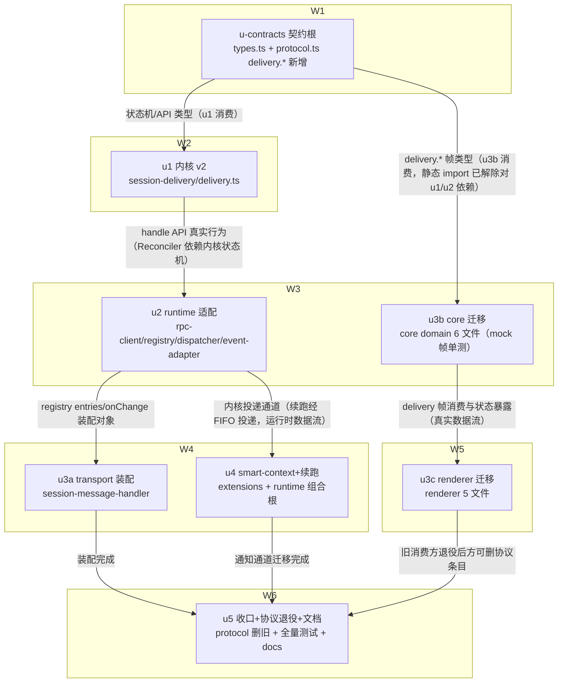

# 投递所有权内核 实施计划

基线: 6dc14b6ee | 来源设计: .tmp/tech-design/delivery-ownership-kernel.md（v4 审查通过） | 日期: 2026-09-16

## 0 章节映射

| 内容 | 设计文档实际位置 |
|------|------------------|
| 背景/目标 | §1 背景目标（SCQA + 1.2 目标表 G1-G5 + 1.3 In/Out of Scope） |
| 终态/机制 | §3 解决方案（3.1 终态与数据流图 / 3.2 方案对比 / 3.3 D1-D10 决策 / 3.4 错误规格表 / 3.5 探针清单 / 3.4+ 接管归属表） |
| 验收场景表 | §4 验收（V1-V11 场景表 + e2e 影响面评估） |
| 下一层拆分 | §5 下一层拆分（S1-S5 slice + 文件改动地图 + 待验证检查点 5 项） |
| 待验证检查点 | §5 末「待验证检查点」5 项（session-delivery design.md 缺失确认 / staging 通路交点 / plugin-service {queued} 语义 / settling 空闲判定 / 续跑文案形态） |

审查证据（阶段 0.3）：`.tmp/tech-design/design-review-20260916-1425.md`（主审，R4 0/0）、`...-impact.md`（影响面审，R4 0/0）、`...-simplicity.md`（简洁审，全程 0/0）。收敛轨迹 R1 3F/6S → R2 2F/2S → R3 1F/1S → R4 0/0。

## 1 目标快照（逐字摘录设计 §1）

> **一句话结论**：消息「丢/滞留/已读乱序」的根因不是 pi 的某个 bug，而是 taiji 从未实现 pi 契约假定的那一层——「消息进入 transcript 之前所有权属于前端」。本设计把这一层一次性补齐：runtime 的 delivery 内核升级为**投递所有权内核**（单一所有者 + 两阶段回执 + 对账器），pi 的 steer/followUp/clear_queue/get_state/nextTurn 契约原语**全部保留复用、零绕过、零重造**，renderer 侧四套各自为政的时序防御整体退役。

| # | 目标 | 使用者视角的验收口径 |
|---|---|---|
| G1 | **任意时刻发送，消息按序必达** | 用户在压缩中、agent 收尾中、bash 运行中连发多条，全部按发送顺序最终出现在对话流，无丢失、无重复、无乱序 |
| G2 | **进程级故障后自动恢复** | pi 被回收/崩溃、runtime 滚动重启、renderer 断连重连后，发送中的消息无需用户重发即恢复投递；不重复 |
| G3 | **队列状态实时可见可撤** | 每条未送达消息在 UI 上有明确形态与状态（排队中/投递中），可单条撤销；不再出现「气泡消失只剩一行小字」的隐形滞留 |
| G4 | **不破坏既有红线** | live ≡ reload 等价性、occupancy 单写原语（C-data-19）、sessionId 隔离等既有约束全部保持 |
| G5 | **发送方接入零时序防御** | 人（composer）、agent（session_manager send）、回流（completion-backflow）走同一所有权层；新发送方接入即获得 G1-G3，无需各自发明防御 |

**In**：composer 用户消息全 lane；delivery 内核升级与既有三调用方承接；smart-context 四类通知通道收敛与续跑；WS 协议调整；renderer 状态源切换。
**Out**：subagent-workflow notifyDone 账本化迁移（独立线）；scheduler 提醒通道（已销账）；plugin-service 发送路径（透明承接）；bash 通道；staging 自有通路（检查点兜底）；内核 outbox 磁盘持久化（显式否决，重审条件已登记）。

## 2 单元列表

| Unit | 职责 | 领地（精确文件路径） | 依赖 | 隔离 | 验收条款 |
|------|------|---------------------|------|------|----------|
| u-contracts | 契约根：内核条目状态机/事件/双视图/onSettled 语义类型 + WS delivery.* 请求/Reply 配对类型 + session.delivery 帧类型（**仅新增，不删旧条目**） | `packages/session-delivery/src/types.ts`、`packages/shared/src/protocol.ts` | - | plain | 两包 `typecheck` 绿（tsc --noEmit）；新类型 export 可被两包交叉 import（grep 证实） |
| u1 | 内核 v2 实现：五态状态机 + entries/onChange 双视图 + confirmDelivered/requeue/cancel/drain + TextPayload.images + onSettled 送达口径（sendChecked 受理口径不变，D9⑤）+ 判重 tombstone（D5②）+ 30s watchdog 保持 + 单测（状态机全迁移路径/收养序列/判重/收回-重投） | `packages/session-delivery/src/delivery.ts`、`packages/session-delivery/src/__tests__/**` | u-contracts | plain | `pnpm --filter @zhushanwen/session-delivery test` 全绿；新增用例覆盖 D9①③⑤ 与 D5② 判重 |
| u2 | runtime 适配：rpc-client clearQueue 封装 + registry 重写（hasPendingMessages 真值化 + Reconciler 五触发点 + deliverText 回执接线 + 三分处置含外来收养）+ message-dispatcher 三路径内核化 + busy 预检/send.rejected 退役（runtime 侧）+ 错误分类迁移（D6）+ 探针脚本 P-F9a/P-F9b/P-adopt | `packages/runtime/src/infra/pi/rpc-client.ts`、`packages/runtime/src/services/session/session-delivery-registry.ts`、`packages/runtime/src/services/session/message-dispatcher.ts`、`packages/runtime/src/services/session/event-adapter.ts`、`packages/runtime/src/__tests__/**`（增量）、探针脚本落 `packages/runtime/src/__tests__/probes/**` | u1 | plain | runtime 增量测试绿（`cd packages/runtime && pnpm test` 相关文件）；P-F9a/P-F9b 探针脚本 exit 0 |
| u3b | core 迁移（与 u2 并行，mock 帧单测）：send.ts 路由分支收敛统一 submit + send-route.ts 头注重写/降级 UI 预测 + useChat.ts（defer flush/S1/timer/熔断/handleSendRejected 退役 + delivery 帧消费 + morph 编排）+ effects/registry.ts + user-delivery.ts（计数腿退役、①a 标记分支泛化）+ `transport/api/domains/chat.ts`（delivery.submit/cancel/drain/resync 客户端封装） | `packages/core/src/domain/composer/dispatch/send.ts`、`packages/core/src/domain/composer/dispatch/send-route.ts`、`packages/core/src/domain/chat/useChat.ts`、`packages/core/src/domain/chat/effects/registry.ts`、`packages/core/src/domain/chat/effects/user-delivery.ts`、`packages/core/src/transport/api/domains/chat.ts`、`packages/core/src/**/*.test.ts`（增量） | u-contracts | plain | core 增量测试绿（mock delivery 帧）；`pnpm --filter <core包名> typecheck` 绿 |
| u3a | transport 装配：session-message-handler 挂 delivery.* 四 RPC + session.delivery topic 装配（消费 entries() 投影视图，D9②） | `packages/runtime/src/transport/session-message-handler.ts`、`packages/runtime/src/transport/**`（增量测试） | u2 | plain | transport 增量测试绿 |
| u4 | smart-context + 续跑：tool.ts/index.ts 四调用点 nextTurn 化（D4①）+ runtime 组合根 compaction_end 续跑判定与内核续跑投递（D4②）+ 探针 P-F13/P-reason | `extensions/universal/smart-context/src/tool.ts`、`extensions/universal/smart-context/src/index.ts`、`packages/runtime/src/index.ts`（组合根挂点）、续跑判定模块（落 `packages/runtime/src/services/session/`，实施期命名） | u2 | plain | `pnpm extensions:typecheck && pnpm extensions:test`（smart-context 子集）绿；P-F13/P-reason 探针 exit 0 |
| u3c | renderer 迁移：useCompactQueue.ts 退役 + QueueBubble 单源化（session.delivery 帧单一数据源）+ 气泡 morph + × 撤销接线 + Composer 适配 + useSidebar.ts deleteSession cleanup 编排收窄（ADR-0049）+ useSidebarSessionActions.ts forceQuit→delivery.drain | `packages/renderer/src/composables/panel/useCompactQueue.ts`、`packages/renderer/src/components/panel/QueueBubble.vue`（或实际路径，实施期以 grep 定位）、`packages/renderer/src/composables/panel/composer-shell.ts`、`packages/renderer/src/composables/features/sidebar/useSidebar.ts`、`packages/renderer/src/composables/features/sidebar/useSidebarSessionActions.ts`、`packages/renderer/src/**`（增量测试） | u3b | plain | renderer 增量测试绿；`pnpm --filter <renderer包名> typecheck`（vue-tsc）绿 |
| u5 | 收口 + 协议退役 + 文档总检：protocol.ts 删除 message.steer/follow_up/send.rejected 条目（ADR-0046 配对）+ chat.ts 旧方法退役 + S5 文档 checklist 集中执行（send-route 头注已在 u3b 随码；CONTEXT.md 词条 / C-data-08 修订 / compact-defer 边界登记 / pi-boundary-reliability 域注记 / ADR-0049 收窄登记 / e2e-map.json 新资产登记）+ check-doc-symbol-drift + 全量测试 | `packages/shared/src/protocol.ts`、`packages/core/src/transport/api/domains/chat.ts`（旧方法删除）、`docs/**`（S5 清单）、`docs/testing/e2e-map.json` | u3a、u3b、u3c、u4 | plain | 根 `pnpm test` 全量绿 + 各包 typecheck 全绿 + `node scripts/check-doc-symbol-drift.mjs` 过 + pre-commit 全绿 |

注 1：设计 §5 的 S3（WS 协议 + renderer）按 ≤5 文件判据拆为 u3a/u3b/u3c 三单元；S5 文档同步按「代码伴生项随码（u2/u3b/u3c/u4 各自 commit 内）+ docs/ 集中项收口（u5）」执行——与设计「分散在对应 slice 内」的偏差登记于 §5。
注 2：待验证检查点 5 项的归属：检查点 1（session-delivery design.md）→ u1 开工前；检查点 2（staging 通路）→ u3b 开工前 grep；检查点 3（plugin-service {queued}）→ u2 实施期冒烟；检查点 4（settling 空闲判定）→ u2 探针实测（V10 已消除对它的验收依赖）；检查点 5（续跑文案）→ u4 实施期真机各试一次。

## 3 DAG 图

关键路径 = u-contracts→u1→u2→u3a→u5，深度 5（>4）；最大反链宽度 2（<3）。已走契约先行（u3b 对 u1/u2 的静态依赖解除，提前至 W3 与 u2 并行），剩余深链均属运行时行为依赖，非静态 import，契约救不了：u2 需内核真实状态机（Reconciler 驱动它）、u3a 需 registry 真实 API、u3c 需 core 真实状态暴露、u5 依赖全部迁移完成——任务本质串行部分，注明原因。并行度受运行时行为链约束为 2-3，接受。

## 4 测试与验收计划

**分层策略**（遵循 docs/TEST-STRATEGY.md）：单测 = vitest（子包目录运行，fake timers）；禁触碰真实数据目录（fs-guard 白名单）；增量优先，收尾 u5 全量。三视角缺一不可（构建者白盒 + 使用者黑盒 + 观察者形态），每条用例至少一个用户可见 DOM 断言（renderer 侧）。

**测试命令**（从各包 package.json 实读）：
- L0：`pnpm lint` / 各包 `typecheck`（core/runtime tsc、renderer vue-tsc）/ `node scripts/check-doc-symbol-drift.mjs` / `node scripts/check-pi-sync.mjs` / `node scripts/validate-constraints.mjs` / `node scripts/select-affected-e2e.mjs --check`
- L1 增量：`pnpm --filter @zhushanwen/session-delivery test`；`cd packages/runtime && npx vitest run <相关>`；core/renderer 同型；`pnpm extensions:typecheck && pnpm extensions:test`（u4）
- L2 全量：根 `pnpm test`（u5 收口）
- L3 脚本化 e2e（开发期按改动面，空载串行）：见下表 e2e 圈定
- L4 agent 端到端：V8 邻居不变量（browser-automation 连 dev 实例 GUI 多步验证）

**验收计划表**（§4 验收场景逐行编译；阶段 5 执行依据）：

| # | 验收项（场景表行） | 方式(L0-L4) | 成本(1-10) | 收益(1-10) | 组 | 依赖 | 优化判定 |
|---|--------------------|-------------|------------|------------|----|------|----------|
| A1 | V1 压缩中发送按序必达 | L3（新增压缩窗口 equivalence e2e = P-e2e 探针自动化形态） | 7 | 10 | 核心 | u2,u4 committed | 可脚本化（真 pi + faux LLM）；核心断言（标记确认/按序）随 u1/u2 单测沉淀 |
| A2 | V2 settled 空档滞留自愈 | L3（独立 pi RPC 脚本构造滞留态） | 6 | 9 | 核心 | u2 committed | 可脚本化；滞留序列重放已有单测形态（u2） |
| A3 | V3 pi 崩溃恢复不丢不重 | L3（kill -9 + respawn + get_entries 断言恰好 1 条） | 7 | 9 | 核心 | u2 committed | 可脚本化 |
| A4 | V4 压缩后无自起 run | L3（脚本观察 60s 无 agent_start + 首条消息生效验证） | 5 | 8 | 核心 | u4 committed | 可脚本化（P-reason 探针复用） |
| A5 | V5 runtime 滚动重启 + renderer 断连 | L3（exit 86 信号 + resync 重放） | 7 | 8 | 核心 | u3a,u3b committed | 可脚本化；与 A1 同环境并跑 |
| A6 | V6 快速连发顺序与可见性 | L3（generating 中连发 10 条 + 重开 session 对比） | 5 | 8 | 核心 | u3c committed | 与 A8/A9 同环境合并执行 |
| A7 | V7 既有调用方回归（sendChecked 语义/backflow/notifyDone） | L3（send-queue-e2e real 子集 + completion-backflow-e2e 空载串行） | 6 | 9 | 核心 | u5 committed | 既有 e2e 资产直用 |
| A8 | V9 queued 态单条撤销 | L3（compacting 窗口连发 2 撤 1） | 5 | 7 | 非核心 | u3c committed | 与 A6 同环境并跑；cancel 路径单测已随 u1 |
| A9 | V10 投递中单条撤销（队列级收回） | L3（单 turn 长生成连发 2 撤 1，验证其余重投） | 6 | 8 | 非核心 | u3c committed | 与 A6 同环境并跑；收回-重投单测已随 u1 |
| A10 | V11 forceQuit 全量回收回草稿 | L4（GUI forceQuit + 草稿恢复验证） | 5 | 7 | 非核心 | u3c committed | 并入 A11 场景连跑 |
| A11 | V8 邻居系统不变量（3 轮连跑 + recents + JSONL + diff 数据目录） | L4（browser-automation GUI 多步） | 8 | 7 | 非核心 | A1-A6 | 全场景后一次执行；diff 数据目录部分可脚本化（L0 守卫辅助） |

**提速结论**：可脚本化 6 项（A1-A7 中 L3 全部脚本驱动，无纯人工 GUI 步骤）；可合并 3 项（A8/A9 并入 A6 环境；A10 并入 A11）；L0 静态守卫清单（每单元 committed 前主 agent 直跑）：eslint、各包 typecheck、check-doc-symbol-drift、check-pi-sync、validate-constraints、pre-commit 全家（CSP/路径白名单/env 白名单/vue_rules）。预计派发轮次：单元开发 8 轮内（W2-W6 流式派发）+ 验收 L3 脚本轮 3-4 轮 + L4 一轮。

**e2e 影响面圈定**（继承设计 §4，SSOT = docs/testing/e2e-map.json）：

| 项 | 裁决 | 执行时点 |
|----|------|----------|
| E2E-EQUIV-01 受影响 spec（send-queue-e2e、completion-backflow-e2e、pi-protocol-contract） | 跑（空载串行） | u2/u5 committed 后 |
| E2E-MOCK-01 composer.spec | 跑 | u3c committed 后 |
| E2E-ELECTRON-01 P0 smoke（@p0-smoke） | 跑（CI 每 PR 固定，本地复跑确认） | 每 unit committed 后 |
| E2E-ELECTRON-01 state-tearing ST-1/ST-5 | 跑 | u3c committed 后 |
| 新增：压缩窗口 equivalence e2e（V1/V4 自动化形态） | 跑 + 同 commit 登记 e2e-map.json（R2，trigger = runtime session 服务或 smart-context 变更） | u2+u4 后 |
| 新增：V9/V10/V11 自动化形态 | 同 commit 登记 e2e-map.json | u3c 后 |
| E2E-REAL-01 其余 spec | 不跑（改动面外） | - |
| E2E-VISUAL-01 像素轨 | 跑（always 项，CI 已覆盖；QueueBubble morph 后本地确认一次） | u3c committed 后 |

**e2e 机器对账披露**：`node scripts/select-affected-e2e.mjs --base main` 于计划期执行——分支刚切出 main、diff=0，机器仅输出 always 项 2 条（E2E-ELECTRON-01/E2E-VISUAL-01）。人工清单（上表）来自设计 §4 按预期改动面圈定，属 plan.md 允许的人工判断项。**复核点**：u2/u3b/u3c/u5 committed 后各复跑一次机器对账，机器输出有人工清单没有的 rule → 补清单或落「不跑（理由）」；`--check` 防漏登记门禁随 pre-commit 生效。

**单测化沉淀路径**（e2e 逐步单测化方向）：标记确认/对账回收/收回-重投/收养序列四类核心断言随 u1/u2 以 fake port 重放形态落单测；e2e 仅保留真实 pi 集成面（V1-V7）。

## 5 合理偏差登记表

| # | 偏差 | 依据 | 状态 |
|---|------|------|------|
| D-1 | 设计 §5 S5 文档同步「分散在各 slice 同 commit」→ 实施拆为「代码伴生项（头注/注释）随各 unit commit + docs/ 集中项（CONTEXT.md/约束修订/e2e-map 登记）收口于 u5」 | S5 本质是 checklist 汇总；集中执行让 check-doc-symbol-drift 与约束校验一次全跑，防遗漏保证更强；u5 验收条款可机械核验 | 待审查确认（初始登记） |

## 6 状态表

| Unit | 状态 | 轮次 | 证据指针 |
|------|------|------|----------|
| u-contracts | pending | 0 | - |
| u1 | pending | 0 | - |
| u2 | pending | 0 | - |
| u3b | pending | 0 | - |
| u3a | pending | 0 | - |
| u4 | pending | 0 | - |
| u3c | pending | 0 | - |
| u5 | pending | 0 | - |

## 7 残留风险与变更历史

**残留风险**（继承设计 §5 待验证检查点，实施期门）：
1. 检查点 1：`packages/session-delivery` 注释引用的 design.md 不在仓内——u1 开工前确认无冲突设计约束
2. 检查点 2：staging（fork/handoff）发送通路与内核在途条目交点——u3b 开工前 grep + u2/u3c 实施期实测
3. 检查点 3：plugin-service 经 dispatcher 的 {queued} 语义透明性——u2 实施期既有插件冒烟
4. 检查点 4：settling 窗口空闲判定精确性——u2 探针实测（保守降级「settling 一律 queued」备用；V10 已不依赖此实测）
5. 检查点 5：V4 续跑投递文案形态——u4 实施期真机各试一次
6. get_entries 实装形态（分页/限量）是 transcript 全量扫描唯一实装期不确定点——P-F9b 探针门 + 降级路径覆盖（影响面审 R4 INFO）

**变更历史**：
- 2026-09-16：计划首版（基于设计 v4 审查通过版）。S3 拆分为 u3a/u3b/u3c（≤5 文件判据）；S5 集中收口登记偏差 D-1。
