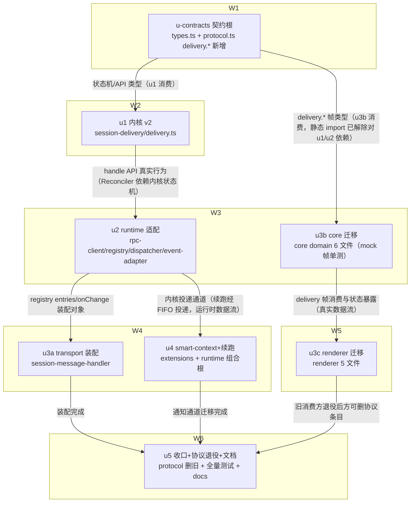

# 投递所有权内核 实施计划

基线: 6dc14b6ee | 来源设计: .tmp/tech-design/delivery-ownership-kernel.md（v4 审查通过） | 日期: 2026-09-16

## 0 章节映射

| 内容 | 设计文档实际位置 |
|------|------------------|
| 背景/目标 | §1 背景目标（SCQA + 1.2 目标表 G1-G5 + 1.3 In/Out of Scope） |
| 终态/机制 | §3 解决方案（3.1 终态与数据流图 / 3.2 方案对比 / 3.3 D1-D10 决策 / 3.4 错误规格表 / 3.5 探针清单 / 3.4+ 接管归属表） |
| 验收场景表 | §4 验收（V1-V11 场景表 + e2e 影响面评估） |
| 下一层拆分 | §5 下一层拆分（S1-S5 slice + 文件改动地图 + 待验证检查点 5 项） |
| 待验证检查点 | §5 末「待验证检查点」5 项（session-delivery design.md 缺失确认 / staging 通路交点 / plugin-service {queued} 语义 / settling 空闲判定 / 续跑文案形态） |

审查证据（阶段 0.3）：`.tmp/tech-design/design-review-20260916-1425.md`（主审，R4 0/0）、`...-impact.md`（影响面审，R4 0/0）、`...-simplicity.md`（简洁审，全程 0/0）。收敛轨迹 R1 3F/6S → R2 2F/2S → R3 1F/1S → R4 0/0。

## 1 目标快照（逐字摘录设计 §1）

> **一句话结论**：消息「丢/滞留/已读乱序」的根因不是 pi 的某个 bug，而是 taiji 从未实现 pi 契约假定的那一层——「消息进入 transcript 之前所有权属于前端」。本设计把这一层一次性补齐：runtime 的 delivery 内核升级为**投递所有权内核**（单一所有者 + 两阶段回执 + 对账器），pi 的 steer/followUp/clear_queue/get_state/nextTurn 契约原语**全部保留复用、零绕过、零重造**，renderer 侧四套各自为政的时序防御整体退役。

| # | 目标 | 使用者视角的验收口径 |
|---|---|---|
| G1 | **任意时刻发送，消息按序必达** | 用户在压缩中、agent 收尾中、bash 运行中连发多条，全部按发送顺序最终出现在对话流，无丢失、无重复、无乱序 |
| G2 | **进程级故障后自动恢复** | pi 被回收/崩溃、runtime 滚动重启、renderer 断连重连后，发送中的消息无需用户重发即恢复投递；不重复 |
| G3 | **队列状态实时可见可撤** | 每条未送达消息在 UI 上有明确形态与状态（排队中/投递中），可单条撤销；不再出现「气泡消失只剩一行小字」的隐形滞留 |
| G4 | **不破坏既有红线** | live ≡ reload 等价性、occupancy 单写原语（C-data-19）、sessionId 隔离等既有约束全部保持 |
| G5 | **发送方接入零时序防御** | 人（composer）、agent（session_manager send）、回流（completion-backflow）走同一所有权层；新发送方接入即获得 G1-G3，无需各自发明防御 |

**In**：composer 用户消息全 lane；delivery 内核升级与既有三调用方承接；smart-context 四类通知通道收敛与续跑；WS 协议调整；renderer 状态源切换。
**Out**：subagent-workflow notifyDone 账本化迁移（独立线）；scheduler 提醒通道（已销账）；plugin-service 发送路径（透明承接）；bash 通道；staging 自有通路（检查点兜底）；内核 outbox 磁盘持久化（显式否决，重审条件已登记）。

## 2 单元列表

| Unit | 职责 | 领地（精确文件路径） | 依赖 | 隔离 | 验收条款 |
|------|------|---------------------|------|------|----------|
| u-contracts | 契约根：内核条目状态机/事件/双视图/onSettled 语义类型 + WS delivery.* 请求/Reply 配对类型 + session.delivery 帧类型（**仅新增，不删旧条目**） | `packages/session-delivery/src/types.ts`、`packages/shared/src/protocol.ts` | - | plain | 两包 `typecheck` 绿（tsc --noEmit）；新类型 export 可被两包交叉 import（grep 证实） |
| u1 | 内核 v2 实现：五态状态机 + entries/onChange 双视图 + confirmDelivered/requeue/cancel/drain + TextPayload.images + onSettled 送达口径（sendChecked 受理口径不变，D9⑤）+ 判重 tombstone（D5②）+ 30s watchdog 保持 + 单测（状态机全迁移路径/收养序列/判重/收回-重投） | `packages/session-delivery/src/delivery.ts`、`packages/session-delivery/src/__tests__/**` | u-contracts | plain | `pnpm --filter @zhushanwen/session-delivery test` 全绿；新增用例覆盖 D9①③⑤ 与 D5② 判重 |
| u2 | runtime 适配：rpc-client clearQueue 封装 + registry 重写（hasPendingMessages 真值化 + Reconciler 五触发点 + deliverText 回执接线 + 三分处置含外来收养）+ message-dispatcher 三路径内核化 + busy 预检/send.rejected 退役（runtime 侧）+ 错误分类迁移（D6）+ 探针脚本 P-F9a/P-F9b/P-adopt | `packages/runtime/src/infra/pi/rpc-client.ts`、`packages/runtime/src/services/session/session-delivery-registry.ts`、`packages/runtime/src/services/session/message-dispatcher.ts`、`packages/runtime/src/services/session/event-adapter.ts`、`packages/runtime/src/__tests__/**`（增量）、探针脚本落 `packages/runtime/src/__tests__/probes/**` | u1 | plain | runtime 增量测试绿（`cd packages/runtime && pnpm test` 相关文件）；P-F9a/P-F9b 探针脚本 exit 0 |
| u3b | core 迁移（与 u2 并行，mock 帧单测）：send.ts 路由分支收敛统一 submit + send-route.ts 头注重写/降级 UI 预测 + useChat.ts（defer flush/S1/timer/熔断/handleSendRejected 退役 + delivery 帧消费 + morph 编排）+ effects/registry.ts + user-delivery.ts（计数腿退役、①a 标记分支泛化）+ `transport/api/domains/chat.ts`（delivery.submit/cancel/drain/resync 客户端封装） | `packages/core/src/domain/composer/dispatch/send.ts`、`packages/core/src/domain/composer/dispatch/send-route.ts`、`packages/core/src/domain/chat/useChat.ts`、`packages/core/src/domain/chat/effects/registry.ts`、`packages/core/src/domain/chat/effects/user-delivery.ts`、`packages/core/src/transport/api/domains/chat.ts`、`packages/core/src/**/*.test.ts`（增量） | u-contracts | plain | core 增量测试绿（mock delivery 帧）；`pnpm --filter <core包名> typecheck` 绿 |
| u3a | transport 装配：session-message-handler 挂 delivery.* 四 RPC + session.delivery topic 装配（消费 entries() 投影视图，D9②） | `packages/runtime/src/transport/session-message-handler.ts`、`packages/runtime/src/transport/**`（增量测试） | u2 | plain | transport 增量测试绿 |
| u4 | smart-context + 续跑：tool.ts/index.ts 四调用点 nextTurn 化（D4①）+ runtime 组合根 compaction_end 续跑判定与内核续跑投递（D4②）+ 探针 P-F13/P-reason | `extensions/universal/smart-context/src/tool.ts`、`extensions/universal/smart-context/src/index.ts`、`packages/runtime/src/index.ts`（组合根挂点）、续跑判定模块（落 `packages/runtime/src/services/session/`，实施期命名） | u2 | plain | `pnpm extensions:typecheck && pnpm extensions:test`（smart-context 子集）绿；P-F13/P-reason 探针 exit 0 |
| u3c | renderer 迁移：useCompactQueue.ts 退役 + QueueBubble 单源化（session.delivery 帧单一数据源）+ 气泡 morph + × 撤销接线 + Composer 适配 + useSidebar.ts deleteSession cleanup 编排收窄（ADR-0049）+ useSidebarSessionActions.ts forceQuit→delivery.drain | `packages/renderer/src/composables/panel/useCompactQueue.ts`、`packages/renderer/src/components/panel/QueueBubble.vue`（或实际路径，实施期以 grep 定位）、`packages/renderer/src/composables/panel/composer-shell.ts`、`packages/renderer/src/composables/features/sidebar/useSidebar.ts`、`packages/renderer/src/composables/features/sidebar/useSidebarSessionActions.ts`、`packages/renderer/src/**`（增量测试） | u3b | plain | renderer 增量测试绿；`pnpm --filter <renderer包名> typecheck`（vue-tsc）绿 |
| u5 | 收口 + 协议退役 + 文档总检：protocol.ts 删除 message.steer/follow_up/send.rejected 条目（ADR-0046 配对）+ chat.ts 旧方法退役 + S5 文档 checklist 集中执行（send-route 头注已在 u3b 随码；CONTEXT.md 词条 / C-data-08 修订 / compact-defer 边界登记 / pi-boundary-reliability 域注记 / ADR-0049 收窄登记 / e2e-map.json 新资产登记）+ check-doc-symbol-drift + 全量测试 | `packages/shared/src/protocol.ts`、`packages/core/src/transport/api/domains/chat.ts`（旧方法删除）、`docs/**`（S5 清单）、`docs/testing/e2e-map.json` | u3a、u3b、u3c、u4 | plain | 根 `pnpm test` 全量绿 + 各包 typecheck 全绿 + `node scripts/check-doc-symbol-drift.mjs` 过 + pre-commit 全绿 |

注 1：设计 §5 的 S3（WS 协议 + renderer）按 ≤5 文件判据拆为 u3a/u3b/u3c 三单元；S5 文档同步按「代码伴生项随码（u2/u3b/u3c/u4 各自 commit 内）+ docs/ 集中项收口（u5）」执行——与设计「分散在对应 slice 内」的偏差登记于 §5。
注 2：待验证检查点 5 项的归属：检查点 1（session-delivery design.md）→ u1 开工前；检查点 2（staging 通路）→ u3b 开工前 grep；检查点 3（plugin-service {queued}）→ u2 实施期冒烟；检查点 4（settling 空闲判定）→ u2 探针实测（V10 已消除对它的验收依赖）；检查点 5（续跑文案）→ u4 实施期真机各试一次。

## 3 DAG 图

关键路径 = u-contracts→u1→u2→u3a→u5，深度 5（>4）；最大反链宽度 2（<3）。已走契约先行（u3b 对 u1/u2 的静态依赖解除，提前至 W3 与 u2 并行），剩余深链均属运行时行为依赖，非静态 import，契约救不了：u2 需内核真实状态机（Reconciler 驱动它）、u3a 需 registry 真实 API、u3c 需 core 真实状态暴露、u5 依赖全部迁移完成——任务本质串行部分，注明原因。并行度受运行时行为链约束为 2-3，接受。

## 4 测试与验收计划

**分层策略**（遵循 docs/TEST-STRATEGY.md）：单测 = vitest（子包目录运行，fake timers）；禁触碰真实数据目录（fs-guard 白名单）；增量优先，收尾 u5 全量。三视角缺一不可（构建者白盒 + 使用者黑盒 + 观察者形态），每条用例至少一个用户可见 DOM 断言（renderer 侧）。

**测试命令**（从各包 package.json 实读）：
- L0：`pnpm lint` / 各包 `typecheck`（core/runtime tsc、renderer vue-tsc）/ `node scripts/check-doc-symbol-drift.mjs` / `node scripts/check-pi-sync.mjs` / `node scripts/validate-constraints.mjs` / `node scripts/select-affected-e2e.mjs --check`
- L1 增量：`pnpm --filter @zhushanwen/session-delivery test`；`cd packages/runtime && npx vitest run <相关>`；core/renderer 同型；`pnpm extensions:typecheck && pnpm extensions:test`（u4）
- L2 全量：根 `pnpm test`（u5 收口）
- L3 脚本化 e2e（开发期按改动面，空载串行）：见下表 e2e 圈定
- L4 agent 端到端：V8 邻居不变量（browser-automation 连 dev 实例 GUI 多步验证）

**验收计划表**（§4 验收场景逐行编译；阶段 5 执行依据）：

| # | 验收项（场景表行） | 方式(L0-L4) | 成本(1-10) | 收益(1-10) | 组 | 依赖 | 优化判定 |
|---|--------------------|-------------|------------|------------|----|------|----------|
| A1 | V1 压缩中发送按序必达 | L3（新增压缩窗口 equivalence e2e = P-e2e 探针自动化形态） | 7 | 10 | 核心 | u2,u4 committed | 可脚本化（真 pi + faux LLM）；核心断言（标记确认/按序）随 u1/u2 单测沉淀 |
| A2 | V2 settled 空档滞留自愈 | L3（独立 pi RPC 脚本构造滞留态） | 6 | 9 | 核心 | u2 committed | 可脚本化；滞留序列重放已有单测形态（u2） |
| A3 | V3 pi 崩溃恢复不丢不重 | L3（kill -9 + respawn + get_entries 断言恰好 1 条） | 7 | 9 | 核心 | u2 committed | 可脚本化 |
| A4 | V4 压缩后无自起 run | L3（脚本观察 60s 无 agent_start + 首条消息生效验证） | 5 | 8 | 核心 | u4 committed | 可脚本化（P-reason 探针复用） |
| A5 | V5 runtime 滚动重启 + renderer 断连 | L3（exit 86 信号 + resync 重放） | 7 | 8 | 核心 | u3a,u3b committed | 可脚本化；与 A1 同环境并跑 |
| A6 | V6 快速连发顺序与可见性 | L3（generating 中连发 10 条 + 重开 session 对比） | 5 | 8 | 核心 | u3c committed | 与 A8/A9 同环境合并执行 |
| A7 | V7 既有调用方回归（sendChecked 语义/backflow/notifyDone） | L3（send-queue-e2e real 子集 + completion-backflow-e2e 空载串行） | 6 | 9 | 核心 | u5 committed | 既有 e2e 资产直用 |
| A8 | V9 queued 态单条撤销 | L3（compacting 窗口连发 2 撤 1） | 5 | 7 | 非核心 | u3c committed | 与 A6 同环境并跑；cancel 路径单测已随 u1 |
| A9 | V10 投递中单条撤销（队列级收回） | L3（单 turn 长生成连发 2 撤 1，验证其余重投） | 6 | 8 | 非核心 | u3c committed | 与 A6 同环境并跑；收回-重投单测已随 u1 |
| A10 | V11 forceQuit 全量回收回草稿 | L4（GUI forceQuit + 草稿恢复验证） | 5 | 7 | 非核心 | u3c committed | 并入 A11 场景连跑 |
| A11 | V8 邻居系统不变量（3 轮连跑 + recents + JSONL + diff 数据目录） | L4（browser-automation GUI 多步） | 8 | 7 | 非核心 | A1-A6 | 全场景后一次执行；diff 数据目录部分可脚本化（L0 守卫辅助） |

**提速结论**：可脚本化 6 项（A1-A7 中 L3 全部脚本驱动，无纯人工 GUI 步骤）；可合并 3 项（A8/A9 并入 A6 环境；A10 并入 A11）；L0 静态守卫清单（每单元 committed 前主 agent 直跑）：eslint、各包 typecheck、check-doc-symbol-drift、check-pi-sync、validate-constraints、pre-commit 全家（CSP/路径白名单/env 白名单/vue_rules）。预计派发轮次：单元开发 8 轮内（W2-W6 流式派发）+ 验收 L3 脚本轮 3-4 轮 + L4 一轮。

**e2e 影响面圈定**（继承设计 §4，SSOT = docs/testing/e2e-map.json）：

| 项 | 裁决 | 执行时点 |
|----|------|----------|
| E2E-EQUIV-01 子集（**send-queue-e2e、completion-backflow-e2e、pi-protocol-contract、live-reload、session-manager-full-e2e**） | 跑（空载串行；`TAIJI_SKIP_REAL_PI=1` 凭证无关子集） | u2/u3a/u5 committed 后 |
| E2E-MOCK-01（mock 行为轨全 project，零 token） | 跑（机器 rule 命中即按机器粒度全跑） | u3c committed 后 |
| E2E-ELECTRON-01 P0 smoke（@p0-smoke） | 跑（CI 每 PR 固定，本地复跑确认） | 每 unit committed 后 |
| E2E-ELECTRON-01 state-tearing ST-1/ST-5 | 跑 | u3c committed 后 |
| 新增：压缩窗口 equivalence e2e（V1/V4 自动化形态） | 跑 + 同 commit 登记 e2e-map.json（R2，trigger = runtime session 服务或 smart-context 变更） | u2+u4 后 |
| 新增：V9/V10/V11 自动化形态 | 同 commit 登记 e2e-map.json | u3c 后 |
| E2E-REAL-01（workspace/ask-user/tasks-drawer/workflow-thinkinglevel 4 spec） | **不跑**（机器 rule 命中但人工裁决排除：4 spec 的断言面 = workspace 树 / ask-user 交互 / 任务抽屉 / thinking-level 切换，无投递语义断言；投递面已由 E2E-EQUIV-01 子集 + 新增压缩窗口 e2e 覆盖；real 轨耗真实 LLM token 且须空载串行，按「禁止全量扫跑」不纳入） | - |
| E2E-VISUAL-01 像素轨 | 跑（always 项，CI 已覆盖；QueueBubble morph 后本地确认一次） | u3c committed 后 |

**e2e 机器对账披露**：① 计划期 `node scripts/select-affected-e2e.mjs --base main` —— 分支刚切出 main、diff=0，机器仅输出 always 项 2 条（E2E-ELECTRON-01/E2E-VISUAL-01）。② **执行期复核（2026-09-16 21:35，u2+u3b committed 后）**：机器输出 5 条 rule——E2E-ELECTRON-01 / E2E-VISUAL-01（always）+ **E2E-MOCK-01 / E2E-REAL-01 / E2E-EQUIV-01（on-diff 新增命中）**。逐条处置已并入上表：EQUIV-01 子集扩至 5 spec（原 3 spec，补 live-reload 与 session-manager-full-e2e——二者正是 live ≡ reload 守卫，与 D7 单源化直接相关）；MOCK-01 采纳机器粒度全跑（零 token）；REAL-01 落「不跑（理由见上表）」。等 u3c/u5 committed 后各再复跑一次本对账。

**单测化沉淀路径**（e2e 逐步单测化方向）：标记确认/对账回收/收回-重投/收养序列四类核心断言随 u1/u2 以 fake port 重放形态落单测；e2e 仅保留真实 pi 集成面（V1-V7）。

## 5 合理偏差登记表

| # | 偏差 | 依据 | 状态 |
|---|------|------|------|
| D-1 | 设计 §5 S5 文档同步「分散在各 slice 同 commit」→ 实施拆为「代码伴生项（头注/注释）随各 unit commit + docs/ 集中项（CONTEXT.md/约束修订/e2e-map 登记）收口于 u5」 | S5 本质是 checklist 汇总；集中执行让 check-doc-symbol-drift 与约束校验一次全跑，防遗漏保证更强；u5 验收条款可机械核验 | 已接受 |
| D-2 | 协议侧 state/lane 字面量在 DeliveryFrameEntry 内联双定义（非 import 内核类型）——session-delivery 零依赖包边界，shared 不反向依赖 | u-contracts 决策1；session.occupancy 帧与 event-interpreter 先例同款，逐字面对齐义务注释化，错位由 u3a 装配赋值编译期拦截 | 已接受 |
| D-3 | delivery.cancel Reply 扩展携带全文 + Segment[] 快照（设计仅明确 drain 携带） | u-contracts 决策3；renderer 刷新后帧仅 preview，V9「文本回草稿」依赖 cancel reply 全文，按 D7/ADR-0043 同款口径，optional 字段不破坏最小消费 | 已接受 |
| D-4 | lane 'steer' 字面量与 session-delivery「零 pi 词汇」头注释的表面张力 | u-contracts 决策2；投递车道语义名非 pi API 词汇（intent→底层参数翻译在适配器），头注释已补裁决说明 | 已接受 |
| D-7 | u3b 领地外 4 文件（`domain/chat/api-port.ts`、`index.ts`、`use-chat-types.ts`、`transport/mock/index.ts`）判定为**必需**（编译阻断：ChatApiPort 缺 submitDelivery / barrel 悬空导出 / deps 退役成员 / mock 臂同构），保留并随 u3b 一并提交 | 四者均为 D1 统一提交 + defer 退役的必然可编译前提；u3c 消费口（getDeliveryProjection 等）经 index.ts 暴露；u3b 报告 D-7 | 已接受 |
| D-8 | 回执三分支新增 ②「无本地气泡的投递 → 纯文本降级入流」（`effects/user-delivery.ts`）——前身腿 2 includes 兜底的显示职责被前任实现遗漏，缺它则 live ≢ reload（外来注入/reattach 形态） | 设计 §3.4+ 接管归属表（退役腿职责被送达回执 + reducer 通路承接）+ D2 等值兜底职责必须被吸收；u3b 报告 D-2 | 已接受（职责吸收，非机制新增） |
| D-9 | renderer 过渡红窗口：u3b 契约退役使 `packages/renderer` vue-tsc 红（11 错，全指 u3c 领地）——保留结构干净，不降级 optional 做双轨 | 计划 DAG U3B→U3C 直接后继关闭；u3b 报告 D-11 | 已接受 |
| D-10 | 风险窗口：renderer fork 首发（`useForkActions.ts:119` chatApi.send 不带 clientUuid）与内核条目 clientUuid 异源——当前触发条件不成立（新 session 恒 direct 车道）；u3c 迁移发送链后自然收敛 | u3b 报告 D-12；转 u3c 实施期核验 | 已接受（窗口登记） |
| D-11 | 检查点 2 结论：staging 通路有交点——fork 经 `message.send`（= 内核适配器路径，自动覆盖）；handoff 直调 pi（`handoff-service.ts:255/311`）绕开 dispatcher，与内核在途条目零交点 | u3b 报告 D-13 grep 证据 | 已接受（结论固化，u2/u3c 实施期复述） |
| D-12 | u3b commit 被仓库级守卫 `check_pi_type_leak.py`（目录全扫，非 staged 范围）阻塞——u2 在途 registry 重写引入 `PiEventListener` 泄漏（services 层禁 PiXxx）；处置 = 令 u2 正面修复，u3b commit 待其清零 | C-comm-02；非 u3b 语义问题；`IPiEngine` 不触雷（正则 `\bPi[A-Z]`） | 已解决（u2 改内联 lambda 后守卫 exit 0，u3b 已 commit 0bd885fd0） |
| D-13 | 内核标记形态 = **裸 uuid**（非 u- 形态）：msg-id-mapper 的 TAG_STRIP 只剥 u- 形态，标记若用 u- 会被 input hook 剥掉 → transcript 无标记 → 回执永不触发；连带放宽 `skill-notice-publisher` 提取正则为双形态（领地外 1 文件，注释已说明理由） | u2 偏离 #1；PS-26 探针（裸标记不被 mapper 剥除） | 已接受 |
| D-14 | per-message 投递：用户消息走 sendChecked + 适配层持有 + **合批拆分**（splitComposed 按全文精确子串校验逐条还原）——不拆则内核 buildBatchPayload 合批，V1/V6/V9/V10 的「每条一个 user entry + 可单条撤销」失效；校验失败退回合批语义（宁合不裂） | u2 偏离 #2；设计 D2/D5 单条条目语义 | 已接受 |
| D-15 | `clearQueue` 未收编 `IPiEngine` 端口（ports 不在 u2 领地）→ 注册表侧结构化窄接口 + 运行时 guard 承接；**长期动作 = u3a/u4 改 index.ts/ports 时收编** | u2 偏离 #3 | 已接受（待收编项登记） |
| D-16 | 「dispatcher → 注册表」接线用模块级活动注册表槽 `getActiveDeliveryRegistry()`（与 getActiveRelayRegistry 同款范式；index.ts/session-service.ts 不在领地）；**长期方案 = 组合根显式构造注入** | u2 偏离 #4 | 已接受（待收编项登记） |
| D-17 | 对账触发点②③④为合成来源（compaction_end 取 pi 事件流 / abort-idle 取 dispatcher.abort 成功点 / pi-restored 取交付时 client 实例变更 / settled 取既有 agentSettledListeners / watchdog 自建 30s）；槽位非空判定用 **clear_queue 返回值**（pi 权威、操作时刻）替代 queue_update 缓存投影——后者需改 event-adapter（且计划写的 `services/session/event-adapter.ts` 实装为 `src/infra/pi/event-adapter.ts`，缓存有滞后） | u2 偏离 #5/#10；设计 D3 对账器五触发点 | 已接受 |
| D-18 | markSessionActive 三副作用落在适配层 deliverOne 且**位于 prompt 受理之后**（旧 dispatcher 为 prompt 之前）；旧顺序仅服务已退役的拒绝复位逻辑，适配层顺序与既有 registry 契约（A5 测试）一致 | u2 偏离 #6 | 已接受 |
| D-19 | 对账两处实施扩展：①在途未确认扫描（>10s 宽限 + 槽位未命中 → transcript 扫描 → 确认或重投，V3/G2 恢复通道）；②rebuild-delivered 用 suppressed 集抑制真实投递 + confirmDelivered 落 tombstone（判重锚）；`hasDeliveryActivity` 保持 depth() 口径（queued-only，在途未确认不计入回收豁免，由 pi-restored 对账兜底） | u2 偏离 #7/#8 | 已接受 |
| D-20 | u2 领地扩展：`test/**` 3 文件旧腿迁移（dispatcher-bus / workspace-message-handler / message-dispatcher-precheck）+ `skill-notice-publisher.ts`；**残余 20 例**（occupancy-runtime 5 / session-service 11 / session-service-w3 2 / user-stopped-convergence 2）由专职收口 dev 承接 | u2 偏离 #9 + 主 agent 复跑实测（20 failed / 5838 passed → 收口后四文件 202 passed，随 u2 commit 落地） | 已完成 |
| D-21 | u3a 领地扩展：`services/message-bus/message-bus.ts` 各追加 1 行 TOPIC_TABLE/STATE_TYPE_KEY_MAP 登记 `session.delivery`（state/'delivery'）——未登记则 topicOf fallback='stream'，帧只入 ring、stateSnapshot 无该帧 → V5/G2「重连队列区自动恢复」结构性不成立；替代方案（transport 侧注入 subscribe reply）已被否决（制造第二装配源） | u3a 申报 D-u3a-1；改动纯增量 + 三条测试锁定 | 已接受（u3a 一并提交） |
| D-22 | u3a 新增 transport 模块 `session-delivery-topic.ts`（帧 DTO 装配 + per-session onChange 订阅管理）——职责过载面拆分，仍在 transport 领地内；另 `server.ts` 在 onSessionDestroyed 汇聚点追加订阅释放（缺则被删 session 订阅残留） | u3a 申报 D-u3a-2/D-u3a-5 | 已接受 |
| D-23 | u3a：cancel/drain reply 的 content 与帧 preview 一律剥除出站投递标记（`<!--taiji:msg:...-->` 裸形态 + u- 富内容形态）——协议语义是「完整文本供草稿恢复」= 用户面文本；reply 不含 segments（runtime 无 Segment 知识，协议字段 optional，u3c 接受缺省走文本回草稿）；submit reply 的 cancelled 兜底映射 queued（同 tick 结构不可达，防谎报终态） | u3a 申报 D-u3a-3/D-u3a-6 | 已接受 |
| D-24 | lint 债务（本次改动面，根 lint+CI+pre-merge 门禁口径 `--max-warnings 0`）：probe `.mjs` 3 error + registry 3 magic number warning + 两内核文件 4 个 max-lines warning（registry 760/577、delivery.ts 642/496）——处置 = error/magic number 正面修（具名常量）；max-lines 按仓库既有 eslint.config.mjs override 模式登记（文件级两条目 + HISTORICAL 说明 + 长期拆分方向；拆分等价于重写已验收实现，不满足「行为零变」前提） | 修复 dev 执行 + 主 agent 复核；`pnpm run lint` 在 ci.yml:49 与 pr-pre-merge.sh:196 执行 | 已完成（commit 6277b5f27；残留 u4 在途两探针 error 已路由） |

## 6 状态表

| Unit | 状态 | 轮次 | 证据指针 |
|------|------|------|----------|
| u-contracts | committed | 1 | commit 3ff81b8f5 之后的流转 commit；两包 typecheck 绿 + session-delivery 73 测试全绿（主 agent 复跑证实） |
| u1 | committed | 1 | 内核 v2 + 129 测试全绿（56 新增）+ typecheck 绿；两段式 cancel in-flight、confirmDelivered 接受 queued（D3② rebuild/竞态事实优先）、deliveredWindow:0 bug 修复；偏差见变更历史 |
| u2 | committed | 4 | commit `eeb53f429`（21 文件）。主 agent 复跑：runtime 全量 500 files / 5858 passed（0 failed）+ `tsc --noEmit` 零错 + `check_pi_type_leak` exit 0 + u2 十文件 109/109 绿 + 探针 `p-f9-queue-primitives.mjs` exit 0（检查点 4 实测 settling 死窗口成立 → 保守档必需；检查点 3 结论=插件 `{queued}` 语义透明）；残余 20 例由专职收口 dev 迁移完成（四文件 202 绿，迁移逐条附设计依据、无弱化）；守卫收口（prompt-outpost 登记换新调用点 + 探针 maxRetries）双绿。偏差 D-13~D-20 |
| u3b | committed | 2 | commit `0bd885fd0`（25 文件）。主 agent 复跑：`pnpm test` 126 files / 2031 passed / 5 todo（0 failed）+ `npx tsc --noEmit` 495 = 基线零扩大；E5a/E5b/E5c 迁移保留全部原判据（恰一条气泡 / `toRaw(content)===segments` 引用恒等 / segmentsToText 保真 / reducer 镜像等价 / id 异源窗断言）；4 个退役腿测试文件删除 + 新增 effects-delivery-receipt.test.ts（9 例）；偏差 D-7~D-12 |
| u3a | committed | 1 | commit `e480d5bda`（7 文件）。主 agent 复跑：runtime `pnpm test` 501 files / 5879 passed（0 failed）+ `tsc --noEmit` 零错；shared 34 files / 416 passed + tsc 零错；守卫五连（pi_type_leak / prompt_outposts / no_direct_ws_send / flake hygiene / path whitelist）PASS。偏差 D-21~D-23（含 message-bus 领地外登记申报）；**报出 3 个跨单元缺陷**（见 §7 残留风险 #9-#11）|
| u4 | committed | 1 | commit `68c807358`（15 文件）。主 agent 复跑：extensions:typecheck/lint exit 0 + smart-context 7 files / 53 passed + runtime 全量 503 files / 5907 passed（0 failed）+ tsc 零错 + 根 `pnpm run lint` exit 0 + P-F13/P-reason 探针 exit 0（真进程）。抽查实质：notices.ts 单一注入出口（`deliverAs:'nextTurn'` + `triggerTurn:false` 双写）、五调用点改造无旧通路残留；resume-decision 三条件 + 事件序事实（aborted 先于 compaction_start，投影不可判）；reattach-delivery-trigger 顺序硬约束 + fire-and-forget + 负面对照测试。检查点 5 裁决 = 固定文案形态 A（真机两形态各试一次，证据回写常量注释）。偏差 D-u4-1~6（组合根装饰打标 / 事件序判据 / pi.sendMessage 落地名 / 文案形态 / 队列在场口径 / 触发面收窄）|
| u3c | committed | 1 | commit `8d9667d07`（44 文件，全在 renderer/src）。主 agent 复跑：`npx vitest run` 355 files / 4111 passed（0 failed）+ `vue-tsc --noEmit`（生产轨 + tsconfig.typecheck-test.json 轨）双零错；退役符号残留 grep = 仅注释（无活代码）；抽查实质——`useQueueRows` 单源消费 `getDeliveryProjectionRef`（ADR-0049 无实例态）、fork 首发迁移 `submitDelivery(clientUuid from appendUser)` + inflight 占位对齐、mock 门面只回协议合法最小响应不伪造事实。D-10 窗口关闭 |
| u5 | pending | 0 | - |

## 7 残留风险与变更历史

**残留风险**（继承设计 §5 待验证检查点，实施期门）：
1. 检查点 1：`packages/session-delivery` 注释引用的 design.md 不在仓内——u1 开工前确认无冲突设计约束
2. 检查点 2：staging（fork/handoff）发送通路与内核在途条目交点——u3b 开工前 grep + u2/u3c 实施期实测
3. 检查点 3：plugin-service 经 dispatcher 的 {queued} 语义透明性——u2 实施期既有插件冒烟
4. 检查点 4：settling 窗口空闲判定精确性——u2 探针实测（保守降级「settling 一律 queued」备用；V10 已不依赖此实测）
5. 检查点 5：V4 续跑投递文案形态——u4 实施期真机各试一次
6. get_entries 实装形态（分页/限量）是 transcript 全量扫描唯一实装期不确定点——P-F9b 探针门 + 降级路径覆盖（影响面审 R4 INFO）
7. **core 包 typecheck 基线存量红**（u-contracts 硬核验时发现）：495 个存量错误（489 × TS5097 import 扩展名写法 + 6 × TS2304/2339 测试 fixture 引用缺失类型 SubagentRecord/chatMode），与本次改动零相关（delivery 相关 0 命中），vitest/esbuild 转译不受影响测试可绿。非本设计 scope 不修，登记基线；**u3b 验收口径据此调整为「typecheck 错误集零扩大（delivery/chat 相关 0 新增）+ 增量测试真实跑绿」**；若阶段 3 全量或 pre-commit 被存量挡住，按「发现即正面修复」升级处置
8. 两包根入口 index.ts 为显式白名单 re-export，u-contracts 新类型暂不可经根入口命名 import（deep import 被 exports map 挡）——收编动作归属：`packages/session-delivery/src/index.ts` 并入 u1 领地、`packages/shared/src/index.ts` 并入 u3a 领地（各追加一行 export 名单）【u3a 已执行 shared 侧收编】
9. **缺陷（u3a 报出、主 agent 已核实）：用户撤销/forceQuit 产生虚假错误气泡**——内核 `cancel()`/`drain()` 对挂起 waiter `rejectWaitersOf(Error('delivery cancelled'/'delivery drained'))`（`session-delivery/src/delivery.ts:900/905`），u2 registry 的 `sendChecked(...).catch(onDeliveryFailure)`（`session-delivery-registry.ts:954`）无条件广播 `message.error '消息投递失败：…'`（:802-809）→ V9/V11 主场景渲染错误气泡，与「撤销成功、文本回草稿」矛盾。处置 = 专项修复 dev（过滤 cancel/drain 来源的 rejection，保持真实失败仍广播；必配三例测试）【修复中】
10. **缺陷（u3a 报出、主 agent 已核实）：`delivery.resync` 对 failed 条目无实效**——`session-delivery-registry.ts:1008-1031` 对 active 条目 `continue`（:1025）不调 `handle.requeue`，而类型注释与设计 §3.4 明示「重试耗尽 → 重试钮 = resync 单条重报（failed → queued）」→ u3c 的 failed 行重试钮点了没反应。处置 = 同一修复 dev（resync 内对 failed 条目 requeue + flush；必配测试）【修复中】
11. **缺陷（u3a 报出、主 agent 已核实）：滚动重启/reattach 后无对账触发点（V5/A5 风险）**——`reconcile` 无运行时即 no-op（`session-delivery-registry.ts:604-606`），而运行时只在提交类入口创建；滚动重启后若 renderer 仅重连 + resync，pi 槽位滞留文本不会被收养重建。处置 = u4 追加必办项（组合根 reattach/激活路径 `getOrCreateDelivery` + `reconcile(sid,'pi-restored')`，须配测试；不得改 registry 文件以免与修复 dev 写冲突）【u4 处理中】
12. **lint 债务（本次改动面，门禁口径 `pnpm run lint` = `eslint . --max-warnings 0`，CI ci.yml:49 与 pr-pre-merge.sh:196 执行）**：probe `.mjs` 3 error + registry 3 magic number + 两内核文件 4 max-lines warning（registry 760/577、delivery.ts 642/496）→ 见 D-24【已清（commit 6277b5f27）】；残留：u4 在途两探针（p-f13/p-reason）各 1 个 no-unused-expressions error → 已路由 u4
13. **观察项（归因完成，非本次改动引入）：`src/__tests__/services/idle-pi-reclaim-integration.test.ts` 全量跑间歇红（4 轮数据 红/绿/绿/红）**——失败文本 = pi 侧 `No API key found for the selected model`（faux provider 未注册形态的 spawn 期凭据解析失败），孤立单跑恒绿（1.26s）；归因证据：该测试文件与 fixture 在本分支零改动（`git log main..HEAD --` 空）、u2 对 `rpc-client.ts` 的改动为纯增量 +45 行（clearQueue 封装，不碰 spawn env / 模型解析 / 进程管理）。判定 = 满载下真进程初始化的既有时序抖动（vitest 配置注释已记录过同类翻轨史）。处置：阶段 3 全量测试验收时按「先读 junit 失败详情归因 → 本例成因已知即孤立复跑确认 → 记录证据」，禁止改断言/加 skip 换绿灯

**变更历史**：
- 2026-09-16：计划首版（基于设计 v4 审查通过版）。S3 拆分为 u3a/u3b/u3c（≤5 文件判据）；S5 集中收口登记偏差 D-1。
- 2026-09-16：u-contracts committed。偏差 D-2/D-3/D-4 登记；残留风险 #7（core 存量红 + u3b 验收口径调整）、#8（index.ts 收编归属：u1 领地 + session-delivery/src/index.ts，u3a 领地 + shared/src/index.ts）。
- 2026-09-16：u1 committed。偏差 D-5（D9⑤ 落地更新 8 个既有用例口径断言）、D-6（状态机两处实施扩展：confirmDelivered 接受 queued 态、cancel in-flight 两段式）登记；eslint max-lines 2 warnings 为 v1 存量类别放大，u5 收口裁决。
- 2026-09-16 17:0x：u2/u3b 并行派发期间 5h 套餐额度耗尽（限额 18:46:46 重置），两 agent 中断。主 agent 现场核验：u2 零产出；u3b 留下未完工的部分工作区改动（详见状态表证据指针）。处置 = 落盘 quota-wait 状态 + 定时额度恢复后接续（不丢 u3b 已有工作，走接替程序；u2 重派）。接替 dev 须完成 u3b 剩余项：7 个旧腿测试迁移/退役（apply-entry-equivalence E5a/E5b/E5c 属 live ≡ reload 等价性守卫——项目规则 9 的历史资产，迁移须保持断言强度，不得弱化删除）、api-port.ts 领地外改动必要性申报（deviations）、检查点 2 staging grep、core 全量测试绿 + typecheck 错误集零扩大（基线 495）。
- 2026-09-16 17:2x：额度提前恢复（用户确认），定时调度删除，立即续跑——u3b 接替 dev（agent_6164d889）与 u2 重派（agent_78a639f5）已并行后台派发。
- 2026-09-16 20:25：两 agent 运行约 90 分钟后被 provider rate limit 掐断（非额度、非单元质量问题）。主 agent 现场核验：u2 留下实质进展（rpc-client clearQueue + registry 重写 1044 行：Reconciler 六触发/三分处置/hasPendingMessages 真值化/onSettled 接线），缺口 = typecheck 1 错（submit 误写 async 与接口同步受理口径冲突）+ dispatcher/event-adapter 未动 + 探针与增量单测未落；u3b 续作零推进（core 仍 7 failed / 2025 passed，与开工前一致）。处置 = 以 SendMessage 唤醒两 agent 带上下文续跑（附实测现状与精准缺口清单与建议顺序），不新起 agent。
- 2026-09-16 20:40：u3b 接替完成（续跑轮次 2）。主 agent 硬核验通过：领地 diff 与申报一致；复跑 core 全量 126 files / 2031 passed / 5 todo（0 failed）、tsc 495 = 基线；抽查实质——E5x 迁移保留/加强断言（`toRaw` 引用恒等、单气泡、inflight 归零、reducer 镜像等价），store.test 退役锁 + 维度转移有 D7 依据，跨包消费面仅 renderer（D-9 登记，u3c 关闭）。偏差 D-7~D-12 登记入 §5。流转 commit 被仓库级守卫 check_pi_type_leak 拦下（命中 u2 在途文件，非 u3b 问题）→ 通知 u2 正面修复后补提交；同时按「u3b 实现已验证在盘」判定 u3c 可并行启动（调度偏差登记于 D-9 说明）。
- 2026-09-16 20:50：u2 主体完成（续跑轮次 3，报 partial）。主 agent 硬核验：runtime typecheck 零错、守卫 exit 0（PiEventListener 已改内联 lambda）、u2 十文件 109/109 绿、探针 exit 0（检查点 4 结论=settling 死窗口成立 → 保守档为必需；检查点 3 结论=插件 {queued} 语义透明）、文件集与申报一致。**u3b 补提交落地（0bd885fd0，25 文件，hooks 全绿）**。残余：`test/**` 4 文件 20 例锁定旧 dispatcher 语义（prompt 实参形态 / occupancy 置位顺序 / send.rejected 广播 / steer-followUp 直调）未迁移，u2 上下文预算耗尽自报残余债务 → 派专职收口 dev（D-20）。u2 偏差 D-13~D-19 登记入 §5。旁证：`src/__tests__/services/idle-pi-reclaim-integration.test.ts` 首轮全量红、二轮绿（真进程并发抖动嫌疑）——登记为观察项，待三轮数据判 flake。
- 2026-09-16 21:10：u2 残余收口完成（专职 dev）。主 agent 硬核验：领地干净（只动 `test/**` 四文件，零源码改动）；四文件复跑 202 passed；全量复跑 500 files / 5858 passed（0 failed）；`tsc --noEmit` 零错；抽查迁移实质——`steerMessage/followUpMessage` 直调断言 → 内核车道（`streamingBehavior='steer'/'followUp'` + 调用次数 + 正文包含），「throws when session not active」→ 「resolves + message.error 错因可见」，与设计「send.rejected 全链退役（内核永远不拒绝用户消息）」逐字对得上，无弱化。idle-pi 三轮数据：红/绿/绿（全量复跑绿）→ 按并发抖动归档观察，不进 flake 档案。u2 状态 = committed。
- 2026-09-16 21:35：e2e 机器对账执行期复核（u2/u3b committed 后）：机器输出 5 条 rule（always 2 + on-diff 新增 3：MOCK-01 / REAL-01 / EQUIV-01），逐条处置并入 §4 圈定表——EQUIV 子集扩至 5 spec（补 live-reload / session-manager-full-e2e，live ≡ reload 守卫）、MOCK 采纳机器粒度全跑、REAL 落「不跑（理由）」。
- 2026-09-16 22:00：u3c（renderer 迁移）完成并 commit `8d9667d07`（44 文件）。主 agent 硬核验：改动全在 `packages/renderer/src/**`（越界检查零命中）；`vitest run` 355 files / 4111 passed（0 failed）；`vue-tsc` 生产轨与测试轨双零错（u3b 遗留的 11 个过渡错清零）；退役符号残留仅存注释；抽查实质——单源 composable 消费内核投影 ref、fork 首发 clientUuid 单源化（D-10 关闭：非 direct 车道双显示悬挂窗口消除）、mock 门面不伪造投递事实（收编归 u5）。u3c 偏差：renderer 侧 delivery 门面新增（core mock 缺三方法，领地外不可改）、队列 chip 语义改条目状态（服役术语退役）、+N 徽标退役（帧无 segments，草稿恢复走 reply 快照）、failed 行重试钮（resync 单条重报）、断连不 resync（单源无本地残留，state 帧重放承接）——均随其汇报登记，u5 收口评估收编项（core mock 补齐 / composable.* 死键）。
- 2026-09-16 22:15：u3a（transport 装配）完成并 commit `e480d5bda`（7 文件）。主 agent 硬核验：领地 diff 与申报一致（含 message-bus 领地外 1 行登记 = D-21，理由成立）；runtime 全量 501 files / 5879 passed、shared 34/416、双侧 tsc 零错、五守卫 PASS。**u3a 报出 3 个跨单元缺陷**，主 agent 逐条实码核实为真并登记为残留风险 #9/#10/#11：① cancel/drain 的 waiter rejection 被 `onDeliveryFailure` 误当终态失败 → 虚假错误气泡（V9/V11 主场景）② `resync` 不 requeue failed 条目 → u3c 重试钮无实效（§3.4 恢复动作落空）③ `reconcile` 无运行时早退 + 运行时仅提交入口创建 → 滚动重启后 reattach 无对账触发点（V5/A5 风险）。处置：#9/#10 派专项修复 dev（同文件、含 lint 债务 D-24）；#11 交 u4（落点组合根 index.ts 属其领地，已 SendMessage 追加必办项并要求配测试、不得改 registry 避免写冲突）。
- 2026-09-16 22:40：缺陷修复 dev 完成（缺陷 #9/#10 + lint 债务），commit `6277b5f27`（5 文件）。主 agent 硬核验：改动集 = registry.ts + 其测试文件（追加 6 例，既有 19 例零改动）+ p-f9 探针 + eslint.config.mjs；实现复核——`isUserReclaimRejection` 双信号 AND（契约前缀 ∧ 条目已终结为 cancelled），任一不满足退回真实失败路径（宁多播不吞真失败）；`resync` 对 failed 条目调内核 requeue + flush；override 为**文件级两条目**（非全局放宽）且带 HISTORICAL 说明与长期拆分方向；**变异验证**（临时禁用修复 → 4 例红，还原后逐字节一致）证明测试真锁缺陷；复跑 `session-delivery-registry.test.ts` 25 passed、session-delivery 包 129 passed + tsc 零错。残留：u4 在途两探针各 1 lint error → 已路由 u4。另：全量复跑 503 files / 5907 passed，唯一红 = idle-pi 集成测试，已归因为「pi spawn 期凭据解析」既有时序抖动（证据入残留风险 #13），非本次改动引入。
- 2026-09-16 23:05：u4（smart-context nextTurn 化 + 续跑 + reattach 对账）完成并 commit `68c807358`（15 文件）。主 agent 硬核验：改动集与申报一致、禁触面（registry / rpc-client / dispatcher / transport / core / renderer / session-delivery）零 diff；extensions 双门 exit 0、smart-context 53 例绿、runtime 全量 503 files / 5907 passed、tsc 零错、**根 lint exit 0（残留两探针 error 已清）**、P-F13/P-reason 探针真进程 exit 0；实质抽查——notices 单出口（nextTurn + triggerTurn:false 双写防分支序漂移）、五调用点无旧通路、续跑三条件以事件序为据（aborted 先于 compaction_start；P-reason 探针实测 idx 20<22 形成证据闭环）、reattach 触发点顺序硬约束 + 负面对照测试锁缺口本体。检查点 5 结论 = 固定文案（真机两形态均成功续跑，A 更短且不与 compaction_end.result 耦合）。**阶段 2 全部单元 committed**——下一步 u5 收口。
