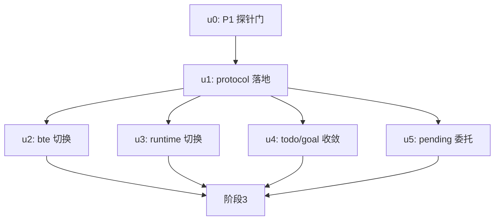

# ext-simplify-13 实施计划

基线: 08ce984d7 | 来源设计: docs/design/ext-simplify-13-base-tool-enhance-protocol.md (v2.2) | 日期: 2026-09-14

## 0 章节映射

| 内容 | 设计文档实际位置 |
|------|------------------|
| 背景/目标 | §1（1.1 系统背景 / 1.2 设计目标 G1-G4 表 + In/Out-of-scope） |
| 终态/机制 | §2（现状 F1-F4/根因）+ §3（3.1 终态 / 3.2 D1+D2 归一策略含子出口与 onLog / 3.3 D3-B 两层 API / 3.4 D3-M5 / 3.5 D4/D5 / 3.6 执行项总表 E1-E11） |
| 验收场景表 | §4（V1-V6） |
| 下一层拆分 | §5（5.1 迁移路径 M0-M5 / 5.2 单元清单 / 5.3 探针 P1-P3 / 5.4 协调与待验证 / 5.5 文件改动地图） |
| 待验证检查点 | §5.4 待验证①-④ + §5.3 探针（P1⛔M0 / P2⛔M3 / P3⛔M4） |

## 1 目标快照（逐字摘录）

> | G1 | 行为原语单一实现 | pid 判据/进程树 kill/tail/原子写/LRU/registry 解析防御在仓内各只有一份实现（extension-protocol），bte 与 runtime 改 import；任一侧修改语义，另一侧编译期即见 |
> | G2 | bt- 对账判据与 pending 差集规则同源 | bte `collectUnsettledTaskIds` 删除，对账消费 protocol 差集核心；对账与 goal 守卫对同一 session 文件得出一致的活跃集 |
> | G3 | isGui 模式分派单点 | 「isGuiCapable 外层判定不可省略（TUI 误调 marker 乱码）」这条约束被编码进 protocol helper 一次，todo/goal 消费方不再各自持守卫注释 |
> | G4 | 零用户可见回归 + bte 独立性保持 | **用户/LLM 可见行为与 registry.json 文件字节形态零变化**；内部 API 签名归一（tail 字段名/参数序、registry 读写薄壳）、日志通道经回调注入的适配、对账 emit 恒 no-op 死路径删除（D5）为**有意内部变化**（清单见 D2/D5）；bte 的 bash 后台/查询/kill 行为、pending optional peer 语义不变；纯 CLI 单独安装 bte（无 pending）仍功能完整 |

**Out-of-scope**：pending W4/registry 现算化/导出面收敛（12 号已实施，E6 仅委托）；goal theme 成员（03 号已实施）；bte 其余机制（poller/task-store/force-patterns/config）；relay 第 4 份 isPidAlive（移交 code-simplify）；移交 code-simplify 清单 5 条。

## 2 单元列表

| Unit | 职责 | 领地（精确文件路径） | 依赖 | 隔离 | 验收条款 |
|------|------|----------------------|------|------|----------|
| u0 = M0 探针门 | P1 探针前置可行性证实：esbuild 对 workspace 包 exports 子路径解析（pi-file-lock/core 先例已在 runtime 双链路实证——设计已核实，本单元仅做 bte builtin staging 侧打样验证） | 无文件改动（探针性，允许临时脚本，收尾清理） | 无 | plain | bte 打包链（scripts/bundle-extensions.mjs）对 `@xyz-agent/extension-protocol/background-task` 子路径 import 解析成功的证据（临时探针 + grep 产物后删除）；失败 → 冻结流水线升级（D1 降级重审） |
| u1 = M1 protocol 落地（E1+E4+E7） | 三原语模块（background-task-process.ts ~90 行含 onFallback / background-task-registry-file.ts ~90 行含 onLog / output-tail.ts ~60 行 opts+onLog）+ background-task-entry.ts 子出口聚合 + pending-entries.ts 两层 API（常量/scan/diff/collect 组合）+ background-task.ts 补 BACKGROUND_TASK_ID_PREFIX + core/helpers.ts 增 setWidgetDual + index.ts 出口（pending-entries 进 index，三原语不进）+ package.json exports/publishConfig + tsup entry 三处同步 + README 首段与 description 更新 + 各新模块单测 | packages/extension-protocol/src/{background-task-process,background-task-registry-file,output-tail,background-task-entry,pending-entries}.ts、background-task.ts、core/helpers.ts、index.ts、../README.md、../package.json、../tsup.config.ts、相关 .test.ts（新增） | u0 | plain | ① protocol 包 test+typecheck 绿（新单测覆盖：4 原语 / corrupt 隔离 / 原子写 / trim / tail opts 签名 / pending-entries 两层语义含 register→unregister→register 边界 / setWidgetDual TUI 不产 marker 断言）；② grep：index.ts 无三原语 re-export；exports 含 "./background-task"；③ `node -e "import('@xyz-agent/extension-protocol/background-task')"` 或等价探针解析成功 |
| u2 = M2 bte 切换（E2+E5+E10+E11） | kill-tree.ts 整删（消费点 bash-kill-tool/spawn-background/pending-reconcile 改 import 子出口）；registry.ts 本地 guard/parse/atomicWrite/LRU 删改引（onLog 注入 logger 适配）；task-store evictTerminalOverflow 改 trim 纯函数；output-tail.ts 薄壳化（readTailSummary 保留，bash_output `output` 字段名经薄壳适配保持）；pending-reconcile 删 collectUnsettledTaskIds 改 collectActivePendingIds + 删 emit 路径（:135-144）与文件头 emit 句；tool-error-audit.ts:7 注释修正；E11 登记（base-tool-enhance.md :333 三处旧口径回写 + CLI 兜底边界登记） | extensions/universal/base-tool-enhance/src/{kill-tree.ts(删),bash-kill-tool.ts,spawn-background.ts,background/output-tail.ts,background/registry.ts,background/task-store.ts,background/pending-reconcile.ts,tool-error-audit.ts}、docs/design/base-tool-enhance.md、bte 相关测试 __tests__/{kill-tree,registry,task-store,pending-reconcile,maintenance-once,index}.test.ts | u1 | plain | ① bte 包 test 绿 + extensions:typecheck 全仓绿；② grep：src/ 无 kill-tree 本地实现（文件已删）、无 collectUnsettledTaskIds、pending-reconcile 无 `events.emit`；③ bash-output-tool 返回 JSON 的 output 字段名不变（测试断言）；④ base-tool-enhance.md :333 段无「内存 registry/changed/rebuild/尽力补 emit」旧口径残留 |
| u3 = M3 runtime 切换（E3） | reaper 删本地原语改 import 子出口（编排层保留）+ console 适配注入；registry-write writeTrimmedLocked 改 trim；output-tail 删实现（OUTPUT_TAIL_DEFAULT_MAX_BYTES 留调用方实参） | packages/runtime/src/services/session/background-task-reaper.ts、services/background-task/{registry-write,output-tail}.ts、runtime 相关测试 test/background-task-reaper{,-primitives}.test.ts、services/background-task/{output-tail,background-task-service}.test.ts | u1 | plain | ① runtime 包相关测试绿；② grep：两文件无本地 isPidAlive/killProcessTree/getProcessStartTimeSec/pidStartMatchesRegistered/readOutputTail 实现（import 代替）；③ `bash scripts/validate-runtime-bundle.sh` 绿（P1 runtime 侧证据） |
| u4 = M4 todo/goal 收敛（E8+E9） | todo makeRefreshDisplay 四分支 → setWidgetDual 两次调用 + 删守卫注释；goal UiPort 删 isGui/setGuiWidget、setWidget 签名改 dual（string 臂删除、theme 不动）、adapter delegate helper、updateWidget 三处 2×2 塌缩、session.ts:129 兼容；两包 UiPort fake 测试同步 | extensions/universal/todo/src/index.ts、extensions/universal/goal/src/{ports.ts,adapters/ports.ts,projection/widget.ts,session.ts}、todo/goal 的 UiPort 相关测试 | u1 | plain | ① 两包 test 绿 + extensions:typecheck 绿；② grep：todo/goal src 无 isGuiCapable 直接调用（helper 内化）、无 `setGuiWidget`；③ helpers.test 的 TUI 负面断言（P3 单测面）绿 |
| u5 = M5 pending 委托（E6） | pending state.ts 删私有 scanPendingEntries 改 import protocol 版；countActiveFromEntries 委托 scan+diff，filterActiveRegisters 收窄为 pending 特有过滤层；hasPendingId/isPendingActive 随私有 scan 删除自动消费 protocol 原语 | extensions/universal/pending-notifications/src/state.ts、state 相关测试 | u1（与 u2-u4 无文件交集） | plain | ① pending 包 test 绿（12 号 TC 矩阵不回归）；② grep：state.ts 无本地 `function scanPendingEntries`；③ extensions:typecheck 全仓绿 |

## 3 DAG 图

u2/u3/u4/u5 领地互斥可并行（并发 ≤5 内全派）；验收 V3（双端协作）需 u2+u3 齐。

## 4 测试与验收计划

**增量**：各单元按验收条款 ①；**全量（阶段 3 尾）**：`pnpm extensions:typecheck && pnpm extensions:lint && pnpm extensions:test` + `pnpm --filter @xyz-agent/runtime test` + `bash scripts/validate-runtime-bundle.sh`。
**L0**：pre-commit 全套（C-proc-09 spawn-env / 引擎边界 / doc-symbol-drift 等）。

### 验收计划表

| # | 验收项（场景表行） | 方式(L0-L4) | 成本(1-10) | 收益(1-10) | 组 | 依赖 | 优化判定 |
|---|--------------------|-------------|------------|------------|----|------|----------|
| A1 | V2 bte 后台 bash 全流程（含 tail 50KB 口径 + kill 进程组消亡） | L4（pi CLI bash 驱动 + pgrep 断言） | 6 | 9 | 核心 | u2 | 驱动可脚本化（stdin JSONL + pgrep），agent 判定 |
| A2 | V1 M13 对账一致性（僵尸 register 收口 + JSONL entry 逐字段） | L4（pi CLI，双 extension 装载） | 7 | 9 | 核心 | A1（同环境链） | 可脚本化驱动；JSONL diff 断言机器可判 |
| A3 | V4 registry 字节同构 + 旧文件兼容 | L0/L3（文件 diff + 预置旧文件重跑 V3 流程） | 3 | 8 | 核心 | A1、A4 | 纯文件比对脚本化 |
| A4 | V3 runtime 双端协作（孤儿补杀 + corrupt 日志落盘两侧通道） | L4（pnpm dev 桌面端 + browser-automation） | 8 | 9 | 核心 | u2+u3 committed | 真机必需；corrupt 日志断言脚本化 |
| A5 | V5 widget 双模渲染含负面（TUI 无 marker 行 / 桌面组件 / headless） | L4（TUI pi CLI + 桌面 dev） | 7 | 7 | 非核心 | u4 | TUI 侧可脚本化（输出 grep 无 marker）；桌面并入 A4 环境 |
| A6 | V6 bte 独立安装负面（无 pending 全功能） | L4（pi CLI 单装 bte） | 4 | 7 | 非核心 | A1 | 与 A1 同脚本换装载参数合并跑 |

**提速结论**：可脚本化 4 项（A1/A2/A3/A6 的驱动与断言）；可合并 2 组（A2 并入 A1 会话链、A5 桌面侧并入 A4 环境）；L0 守卫 = pre-commit 全套 + validate-runtime-bundle。预计核心组 2 轮派发（A4 桌面一轮 + CLI 链一轮），非核心 1 轮。

## 5 合理偏差登记表

（空——实施中填充）

## 6 状态表

| Unit | 状态 | 轮次 | 证据指针 |
|------|------|------|----------|
| u0 | pending | 0 | — |
| u1 | pending | 0 | — |
| u2 | pending | 0 | — |
| u3 | pending | 0 | — |
| u4 | pending | 0 | — |
| u5 | pending | 0 | — |

## 7 残留风险与变更历史

- V1 的 JSONL 逐字段比对基线需在 u2 前采集（改动前跑一次留档，设计 §5.4③）——编排者在 u2 派发前执行。
- u0 探针若失败：冻结流水线，D1 降级重审（设计 P1 降级路径）。
- 版本 bump（extension-protocol patch）归 merge 阶段 changesets。
- 2026-09-14：计划创建（阶段 0 预检通过；审查证据 = .tmp/tech-design/ext-simplify-13-r3-review.md PASS 0 must-fix + 原始 review.md 5 MF 与 r2 复审 1 MF 均已修复闭环）。
