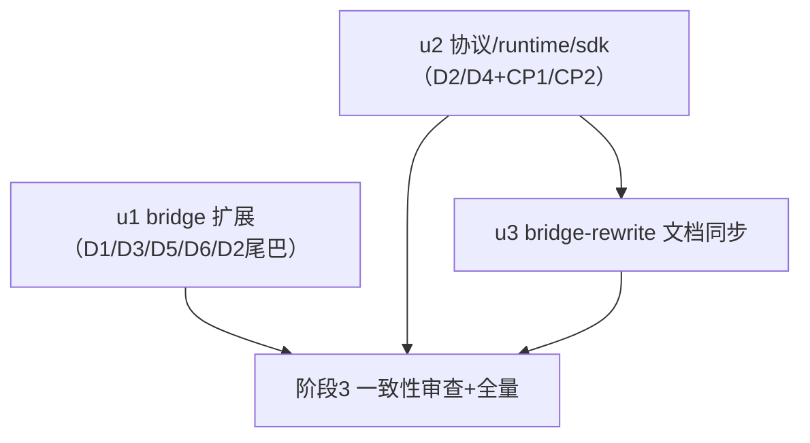

# ext-simplify-16 plugin-bridge 实施计划

基线: a8718fcd5（设计文档 v1.2 终版；本计划文档 commit 即流水线基线） | 来源设计: docs/design/ext-simplify-16-plugin-bridge.md | 日期: 2026-09-14
审查证据: docs/design/ext-simplify-16-plugin-bridge.review.md——对抗式审查 r1（NEEDS-FIX 1 MF + 4 S）全修 → 聚焦复审 R2 **PASS（0 must-fix）**；残留 1 suggestion（bridge-rewrite :238 E2 讹写）已并入 u3 清单。

## 0 章节映射

| 内容 | 设计文档实际位置 |
|------|------------------|
| 背景/目标 | 开篇 SCQA + §1 背景 + §2 设计目标与非目标 |
| 终态/机制 | §3 现状位置图 + §4 物理数据流（4.1 拦截注入链 / 4.2 sync 链）+ §5 终态 + §6 决策 D1-D6 + §6.7 执行项总表 + §6.8 探针 P1-P3 |
| 验收场景表 | §7 验收（A1/A2/A3/N1/N2/A4 + 「已核实非过度」不触碰清单） |
| 下一层拆分 | §8.1 迁移路径 + §8.2 下一层拆分清单（u1/u2/u3） |
| 待验证检查点 | §8.3 CP1-CP3 |

## 1 目标快照（逐字摘录设计 §2）

**目标**：
1. M21 裁决落地：注入映射收窄为 string-only，删除结构化透传死分支（D1）；
2. 协议死面双端删除：`commands` 字段、`Tool not found` error 形态分支（D2/D3）；
3. Bridge* 回包形状单源化：三处定义 → extension-protocol 一处（D4）；
4. `details` ok 变体去重、三失败 kind 保留（D5）；
5. `getSessionId` 删不可达防御（D6）；
6. bridge-rewrite §3.2「类型零丢失」承诺同步降格登记（登记即债务修复即清账）。

**非目标**（不动清单）：select+marker 通道机制与三条硬约束；sync/准入闸/失败折叠；协议层 `injectedMessages: unknown[]` 类型（不收紧）；SDK worker 通道专属类型（`BridgeSyncRequest`/`BridgeSyncResponse`/`BridgeState`/`BridgeToolExecuteRequest`）；runtime `bridge-handler`/`bridge-interop` 的路由与塑形逻辑。

## 2 单元列表

| Unit | 职责 | 领地（精确文件路径） | 依赖 | 隔离 | 验收条款 |
|------|------|----------------------|------|------|----------|
| u1 | D1 收窄 string-only（删 InjectedTextContent/InjectedImageContent :99-109 + isTextContent/isImageContent :111-117 + 透传分支 :463-467，content 映射恒两路：string→`{type:'text',text}` / 非 string→JSON.stringify）+ D3 isToolNotFound 删 error 形态分支（:123，保留函数与形态②判定）+ D5 details ok 变体去重（:176-184 ok 改 `{kind:'ok'}` 无载荷；:360-365 内联构造同步；:174 失实「session-manager 同款」注释如实化）+ D6 getSessionId 删 try/catch 直呼（:164-172，删错位辩护注释、保留下游语义注释）+ D2 桥侧尾巴（:257 注释、两测试文件 fixtures 的 `commands: []`、:191-198 守护用例删除） | extensions/taiji/plugin-bridge/src/index.ts · extensions/taiji/plugin-bridge/src/__tests__/forwarding.test.ts · extensions/taiji/plugin-bridge/src/__tests__/sync-and-registration.test.ts | 无 | plain | ① `cd extensions/taiji/plugin-bridge && pnpm typecheck && pnpm test` 全绿 ② bridge 包 rg 零命中：`commands`/`isTextContent`/`InjectedImageContent`/`InjectedTextContent` ③ forwarding.test.ts 含 N2 失配序列化用例（非 string content → JSON.stringify 进 text 段）与 D1 string-only 断言（原 :295-313 透传用例重写） |
| u2 | D2 commands 协议/runtime 侧删除（types.ts:46/:49、plugin-types.ts:99-105、bridge-interop.ts:148/:152、bridge-handler.ts:91、runtime fixtures）+ D4 三形状单源化到 extension-protocol（runtime plugin-types 改 re-export；plugin-sdk 两形状改 re-export + package.json 增 workspace 依赖 + `pnpm install` 刷 lockfile；协议 :33-35 手工同步矛盾注释清理）+ plugin-types.ts:3-5 头注释 D28 叙事同步（runtime-internal 仅剩 IPluginServiceDeps）+ bridge-interop.ts:254-258 退役文档引用注释修正（指向 git `7a3797d0b` 原文，注明已退役于 `fadd8b8b4`） | packages/extension-protocol/src/extensions/plugin-bridge/types.ts · packages/runtime/src/services/plugin-service/plugin-types.ts · packages/runtime/src/services/plugin-service/bridge-interop.ts · packages/runtime/src/transport/bridge-handler.ts · packages/runtime/test/bridge-marker-channel.test.ts · packages/runtime/test/plugin-hooks-integration.test.ts · packages/plugin-sdk/src/types.ts · packages/plugin-sdk/package.json · pnpm-lock.yaml | 无（与 u1 并行安全：bridge 不读 `.commands`，测试 fixtures 是无类型 JSON 字面量） | plain | ① P2：`cd packages/extension-protocol && pnpm typecheck` + `cd packages/runtime && pnpm typecheck` 全绿（三包 import 链无断裂 = CP1 通过） ② runtime 增量测试绿（bridge-marker-channel + plugin-hooks-integration + plugin-service 相关） ③ 协议/runtime/sdk 侧 rg 零命中 `commands`（bridge sync payload 语义域；plugin-sdk 的 PluginContributesCommand/manifest commands 域与 bridge-interop 的 commands-executor 注释**不在删除面**，勿误伤） ④ CP2：`node scripts/bundle-extensions.mjs` 复核过 |
| u3 | 文档同步：bridge-rewrite §3.2「类型零丢失」降格（string 注入零转换；非 string 失配形态序列化保信息）+ §3.3-D7 commands 死代码裁决回写关闭登记（字段本体已删）+ :208 miss 形态描述修正（`{error: 'Tool not found: ...'}` → 实装 `{content: 'Tool not found: <name>', isError: true}`）+ :238 E2 行 `isError` 讹写修正（r2 残留 suggestion）+ 该文档变更历史登记 | docs/design/bridge-rewrite-pi-0.84.md | u2（同批或紧随：文档描述 u1/u2 终态） | plain | ① 四处表述与 u1/u2 落地终态一致 ② pre-commit doc-symbol-drift 守卫过 |

## 3 DAG 图

u1 ⊥ u2 文件级零交集真并行；u3 串行于 u2 之后（文档表述依赖 u2 落地形态）；u1 与 u3 亦零交集。

## 4 测试与验收计划

**增量（单元开发期）**：
- u1：`cd extensions/taiji/plugin-bridge && pnpm typecheck && pnpm test`
- u2：`cd packages/extension-protocol && pnpm typecheck`；`cd packages/runtime && pnpm typecheck`；`cd packages/runtime && pnpm vitest run test/bridge-marker-channel.test.ts test/plugin-hooks-integration.test.ts`；plugin-sdk 无独立 script，其类型链由 runtime/protocol typecheck 经 import 覆盖；u2 改 package.json 后跑 `ELECTRON_SKIP_BINARY_DOWNLOAD=1 pnpm install` 刷 lockfile
- 全量（阶段 3 尾）：`pnpm extensions:typecheck && pnpm extensions:lint && pnpm extensions:test` + `cd packages/runtime && pnpm test` + `node scripts/bundle-extensions.mjs`（CP2）
- **L0**：pre-commit 全套（doc-symbol-drift 由 u3 领地触发）+ N1 rg 断言（主 agent 直跑）

**分层策略**：遵循 TEST-STRATEGY.md；本设计验收面以真机桌面为主链路（bridge 是 runtime↔pi 通道，pi CLI 裸跑无 runtime PluginService 对端，CLI 腿不适用——与 13 号双环境不同，16 号仅桌面腿）。

### 验收计划表

| # | 验收项（场景表行） | 方式(L0-L4) | 成本(1-10) | 收益(1-10) | 组 | 依赖 | 优化判定 |
|---|--------------------|-------------|------------|------------|----|------|----------|
| A1 | fixture 插件（probe_echo 工具 + before_agent_start hook）经 bridge 同步注册，模型调用返回 echo——D2/D3/D5 删除面零回归 | L4 桌面 dev 实例（`XYZ_DEV_BACKGROUND=1 pnpm dev`）+ fixture 插件写入实例 plugins 目录（configDir/plugins，PluginService 发现）+ CDP 驱动 | 7 | 9 | 核心 | u1+u2 committed | 驱动脚本化（CDP 执行 JS + JSONL/工具结果断言） |
| A2 | hook 注入 string，下一轮 prompt 前模型可见 `TOKEN_INJECT:*`；session JSONL plugin-inject CustomMessage.content 为 `[{type:'text',text:'TOKEN_INJECT:*'}]` | L4 同 A1 环境 | 3 | 9 | 核心 | A1（同会话链） | 可合并（并入 A1 会话）；JSONL grep 机器可判 |
| A3 | sync 快照消费 + 桥侧 sync debug 日志 `synced N plugin tool(s)`（XYZ_AGENT_DEBUG=1）——D2 消费方透明性 | L3（A1 环境内日志取证） | 2 | 7 | 核心 | u2 | 可合并（A1 环境）；「负载无 commands 键」由 N1+u2 单测兜底（设计 §7 A3 定案） |
| CP3 | details 收敛后 plugin 工具条目会话重开渲染无异常 | L4 并入 A1/A2（重开 session 核对） | 1 | 6 | 非核心 | A1 | 可合并 |
| N1 | 负面 rg：`commands` 在协议/runtime/plugin-sdk/bridge 四包的类型、构造点、注释、测试 fixtures 全部零命中；`isTextContent`/`InjectedImageContent` 零命中；`startsWith("Tool not found")` 仅形态②一处；getSessionId 调用点无 try/catch 包裹 | L0 rg（主 agent 直跑） | 1 | 9 | 核心 | u1+u2 | 可脚本化 |
| N2 | 失配序列化单测（非 string content → JSON.stringify text 段） | L1（u1 单测） | 1 | 6 | 非核心 | u1 | 单测兜底（生产不可达路径，设计明示不设真机场景） |
| A4 | `pnpm extensions:typecheck && pnpm extensions:lint && pnpm extensions:test` 三连绿 + runtime plugin-service 相关测试绿 | L2 | 4 | 8 | 核心 | u1+u2+u3 | 阶段 3 尾统一跑（与 Gate A 合并） |

**提速结论**：可脚本化 2 项（A1 驱动 / N1）；可合并 3 项（A2/A3/CP3 全部并入 A1 单环境单会话链）；L0 守卫 = pre-commit 全套 + N1 rg。核心组预计 **1 轮**桌面验收派发（A1 环境承载 A1/A2/A3/CP3 四项取证）+ N1/A4 主 agent 直跑，无独立非核心轮次。

## 5 合理偏差登记表

（空——待阶段 3 审查后登记）

## 6 状态表

| Unit | 状态(pending/in-progress/committed/blocked) | 轮次 | 证据指针 |
|------|----------------------------------------------|------|----------|
| u1 | pending | 0 | — |
| u2 | pending | 0 | — |
| u3 | pending | 0 | — |

## 7 残留风险与变更历史

- **CP1 回退方案**（设计 §8.3 预设）：plugin-sdk 增 workspace 依赖后若 typecheck 链断裂，回退 = SDK 侧维持本地定义，D4 收窄为 runtime 侧单源化并登记（u2 执行时首验）。SDK 实测无 scripts、无构建步骤（main=src/index.ts 源码直消）、private 包，预判零风险。
- **P3 备查**（不在执行面）：forwardToolExecute 把通道异常折叠为「cancelled.」文案——已登记移交 code-simplify 备选，本次不顺手改。
- **D2「同批同 PR」兑现方式**：u1/u2 各自独立 commit、同分支合入（注释与 fixture 不参与运行时，批间无行为窗口；co-deployed 无版本偏斜）。
- **不触碰红线**：设计 §7「已核实非过度」清单与 §2 非目标为 u1/u2 领地内禁改区（三条硬约束头注释、sync 循环、守卫族、SDK worker 通道四类型、plugin-sdk manifest commands 域 :243/:281/:837/:888、bridge-interop 的 commands-executor 相关注释 :39/:71）。
- v0（2026-09-14）：计划建立，基线 a8718fcd5。计划期补登两条（grep 机械核实）：① forwarding.test.ts:49 `commands: []` 字面量——设计 §6.2 清单未列，按 N1「fixtures 全部零命中」补进 u1；② runtime fixtures 精确行号核实——bridge-marker-channel.test.ts :58/:176、plugin-hooks-integration.test.ts :188-193（含用例名与注释，均 u2 领地）。
