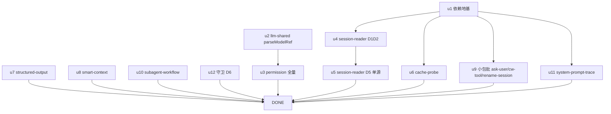

# ext-simplify-18 shared adoption 实施计划

基线: 73ecdd2a4 | 来源设计: `docs/architecture/ext-simplify-18-shared-adoption.md`（v2 双 PASS） | 日期: 2026-09-14
审查报告: `.tmp/tech-design/design-review-ext-simplify-18.md`（must_fix=0）

## 0 章节映射

| 内容 | 设计文档位置 |
|------|--------------|
| 背景/目标 | §1 背景与目标（含非目标） |
| 终态/机制 | §3 方案（§3.1 桶1 D1-D3 / §3.2 桶2 D4 / §3.3 桶3 D5 / §3.4 桶4 D6） |
| 验收场景表 | §5 验收（§5.1 确定性 V1-V6 + V2b / §5.2 真机 V7-V9 / §5.3 三视角） |
| 下一层拆分 | §6 实施拆分与分支归属（批次 1-4 + changeset + 收尾义务） |
| 待验证检查点 | §2 现状与证据（各迁移点行号清单 + 等价论证）；§4 负面清单（排除项） |

## 1 目标快照（逐字摘录）

> 兑现 17 号登记项：ext-guards 既有导出（`toErrorMessage` / `isRecord` / `isEnoentError`）的残余手写副本全量采用 + llm-shared `parseRef` 导出化 + session-reader 包内 SessionHeader 三副本单源 + 词表守卫比对面补第三副本。
> 目标：extensions 生产代码中上述四族手写副本清零（V1 可证伪），全程行为等价（1 处病态输入微变显式登记，见 D4）。
> **非目标**：packages/ 层副本；extension-protocol 发布层拆分；getSessionsDir/encodeCwdSlug 路径推导归宿；extension-logger rawStderr；17 号 D4 ③④ subagent-core 既有债务。

## 2 单元列表

| Unit | 职责 | 领地（精确文件路径） | 依赖 | 隔离 | 验收条款 |
|------|------|---------------------|------|------|----------|
| u1 | 依赖地基：5 包新增 `@zhushanwen/pi-ext-guards` workspace:* 依赖 + 根 extension-dependencies.json 登记 + pnpm install 更新 lockfile | `extensions/universal/session-reader/package.json`、`extensions/universal/cache-probe/package.json`、`extensions/universal/cw-tool/package.json`、`extensions/universal/ask-user/package.json`、`extensions/taiji/system-prompt-trace/package.json`、`extension-dependencies.json`、`pnpm-lock.yaml` | - | plain | ① 6 文件 diff 形态正确（依赖版本 workspace:*；json 5 条 dependsOn 条目，格式照 bte 先例）② `CI=true ELECTRON_SKIP_BINARY_DOWNLOAD=1 pnpm install` EXIT=0 ③ `node scripts/check-extension-dependencies.mjs` EXIT=0 ④ `.githooks/check_pnpm_store_layout.sh` 绿 |
| u2 | llm-shared D4 前半：`parseRef` 更名导出 `parseModelRef`（内部调用点同步）+ 五形态钉值单测 | `extensions/shared/llm-shared/src/resolve.ts`、`extensions/shared/llm-shared/src/__tests__/resolve.test.ts`（追加） | - | plain | ① `parseModelRef` 从 index 导出 ② 单测五形态（合法 ref / 缺斜杠 / "provider/" / "/model" / "a/b/c"）全绿 ③ 内部零 `parseRef` 残留引用 |
| u3 | permission 全量：D1 toErrorMessage 7 处 + D2 config.ts isPlainObject + D4 model-picker 两方法采用（行为微变，主 agent 单独 commit） | `extensions/universal/permission/src/config.ts`、`index.ts`、`pipeline.ts`、`ast/analyzer.ts`、`ast/loader.ts`、`classifier/classifier.ts`、`model-picker.ts`（+ model-picker 相关测试文件追加 V2b 钉值） | u2 | plain | ① 该包 `instanceof Error ?` 手写 0 残留 ② `function isPlainObject` 定义删除改 import ③ V2b 单测：合法 ref 双预选不变 + "provider/" 回 Auto 钉值 ④ 包内既有测试全绿 |
| u4 | session-reader D1+D2：tool-handler.ts 5 处 toErrorMessage + core/workflow.ts isRecord 迁移 | `extensions/universal/session-reader/src/tool-handler.ts`、`src/core/workflow.ts` | u1 | plain | ① 两文件目标手写副本 0 残留 ② isRecord 消费点全部走 ext-guards import ③ 包内既有测试全绿 |
| u5 | session-reader D5：SessionHeader 三副本包内单源（新建 discovery/session-header.ts；两 async 副本删除；sync 4KB 版原样搬入） | `extensions/universal/session-reader/src/discovery/session-header.ts`（新建）、`src/discovery/subagents.ts`、`src/discovery/find.ts`、`src/tool-handler.ts` | u4 | plain | ① 三处旧定义删除、import 统一 ② `readSessionHeaderIdSync` 行为不变（`src/__tests__/tool-handler.test.ts:1057-1058` 既有用例绿）③ discovery 既有测试全绿 |
| u6 | cache-probe D1+D2：index.ts 5 处 toErrorMessage（含 :66 变体）+ fingerprint.ts isRecord | `extensions/universal/cache-probe/src/index.ts`、`src/fingerprint.ts` | u1 | plain | ① 两文件手写副本 0 残留 ② 包内既有测试全绿 |
| u7 | structured-output D1+D2：3 处 toErrorMessage + isPlainObject 导出降级 re-export + 三消费文件直改 import | `extensions/universal/structured-output/src/loop-gate.ts`、`src/workflow-hook.ts`、`src/schema-guards.ts`、`src/tool-definition.ts`、`src/execute.ts` | - | plain | ① `function isPlainObject` 本地定义删除，schema-guards.ts 留 `export const isPlainObject = isRecord` deprecated re-export（JSDoc 注明）② 10 位点调用语义不变 ③ 三消费文件 import 源 = ext-guards ④ 包内既有测试全绿 |
| u8 | smart-context D1+D2：llm.ts/compact-handler.ts toErrorMessage 2 处 + tool.ts/pure.ts isRecord | `extensions/universal/smart-context/src/llm.ts`、`src/compact-handler.ts`、`src/tool.ts`、`src/pure.ts` | - | plain | ① 4 文件手写副本 0 残留 ② 包内既有测试全绿 |
| u9 | 小包批 D1+D3：ask-user 1 处 + cw-tool toErrorMessage 1 处 + cw-spawn isEnoentError 2 处 + rename-session isEnoentError 1 处（消 as 断言） | `extensions/universal/ask-user/src/index.ts`、`extensions/universal/cw-tool/src/cw-runner.ts`、`src/cw-spawn.ts`、`extensions/universal/rename-session/src/pure.ts` | u1 | plain | ① 4 文件目标手写 0 残留 ② pure.ts `as NodeJS.ErrnoException` 该处断言消除 ③ 三包既有测试全绿 |
| u10 | subagent-workflow D1：2 处 toErrorMessage | `extensions/universal/subagent-workflow/src/injectors/model-list-injector.ts`、`src/host/inflight-reporter.ts` | - | plain | ① 2 处替换 ② 包内既有测试全绿 |
| u11 | system-prompt-trace D2：exported isRecord 删导出（不保留 re-export），包内 2 消费点改 import ext-guards | `extensions/taiji/system-prompt-trace/src/types.ts`、`src/baseline.ts` | u1 | plain | ① types.ts `export function isRecord` 定义删除 ② baseline.ts/types.ts 消费点 import ext-guards ③ 包内既有测试全绿 |
| u12 | 守卫 D6 四件连带：提取正则适配+self-test 三形态 / hook 触发面扩 model-ref.ts + 头注释 / T3 比对面 / model-ref.ts 注释 / C-build-10 登记 | `scripts/check-thinking-levels.mjs`、`.githooks/install-hooks.sh`、`docs/constraints.json`、`packages/subagent-core/src/shared/model-ref.ts` | - | plain | ① `node scripts/check-thinking-levels.mjs` EXIT=0（三比对面 T1/T2/T3）② 临时删 THINKING_ORDER 一成员 → 脚本非零退出（验收后还原）③ hook 正则含 model-ref.ts ④ `node scripts/validate-constraints.mjs` 绿 |

## 3 DAG 图

波次（并发 ≤3，用户上限）：波1 = u1+u2+u12；波2 = u3+u4+u6；波3 = u5+u7+u8；波4 = u9+u10+u11。

## 4 测试与验收计划

测试命令（真实读取）：`pnpm extensions:typecheck && pnpm extensions:lint && pnpm extensions:test`（根 package.json scripts）；单包增量 = 各包 `pnpm test`（vitest，子包目录运行）；守卫 = `node scripts/check-thinking-levels.mjs` / `node scripts/check-extension-dependencies.mjs` / `node scripts/validate-constraints.mjs`。

| # | 验收项（设计 §5 行） | 方式 | 成本 | 收益 | 组 | 依赖 | 优化判定 |
|---|--------------------|------|------|------|----|------|----------|
| A1 | V1 零残留 grep ×3 | L0 | 1 | 9 | 核心 | 各单元后 | 主 agent 直跑（基线已录：grep2=8 / grep3=3 / grep1=27 行） |
| A2 | V2 parseModelRef 五形态钉值 | L1 | 2 | 7 | 核心 | u2 | 单测随单元交付 |
| A3 | V2b model-picker 钉值（含 "provider/"→Auto 微变） | L1 | 2 | 7 | 核心 | u3 | 单测随单元交付 |
| A4 | V3 extensions 三连绿 | L2 | 5 | 9 | 核心 | 全单元 | 阶段 3 尾一次跑（增量随各单元已跑） |
| A5 | V4 session-reader 回归 | L1 | 2 | 7 | 核心 | u5 | 既有测试锚定（tool-handler.test.ts:1057-1058） |
| A6 | V5 守卫 T3（脚本绿 + 漂移红 + hook 触发实测） | L0 | 2 | 8 | 核心 | u12 | 主 agent 直跑；漂移构造执行后还原 |
| A7 | V6 依赖登记双核对 | L0 | 1 | 6 | 核心 | u1 | check 脚本 + 主 agent 人工比对 5 包 json↔package.json |
| A8 | V7 cache-probe 真机 | L3 | 6 | 7 | 非核心 | u6 | pi CLI `-ne --mode rpc`，可与 A9/A10 同环境依次跑 |
| A9 | V8 permission 真机交互 | L4 | 7 | 6 | 非核心 | u3 | pi CLI `/permission model` 交互 |
| A10 | V9 session-reader 真机 | L3 | 5 | 7 | 非核心 | u5 | pi CLI read/find 工具各一次 |

**提速结论**：L0 静态可消化 3 项（A1/A6/A7，主 agent 直跑零派发）；A8/A9/A10 同一 pi CLI 环境合并一轮依次执行（省 2 轮环境搭建）；A2/A3/A5 单测随单元交付不单独派发；预计派发轮次 = 单元 4 波 + 真机 1 轮 + 审查 1 轮。L0 守卫清单：check-thinking-levels.mjs / check-extension-dependencies.mjs / validate-constraints.mjs / V1 grep×3 / check_pnpm_store_layout.sh。

## 5 合理偏差登记表

| Unit | 偏差 | 判定 |
|------|------|------|
| u2 | impl-plan 领地测试路径笔误 src/resolve.test.ts → 实际按包内布局惯例落 src/__tests__/resolve.test.ts（既有文件追加 describe 块） | 合理（布局惯例优先；u2 行领地已勘误） |
| u1 | install 追加 --no-frozen-lockfile（CI=true 默认 frozen 与更新 lockfile 目标冲突，按 pnpm 报错指引）；三包新建 dependencies 块按既有键序惯例；dependsOn reason 按批次终态写 | 合理（均为指令落地细节） |
| u12 | constraints.json authority 数组补 18 号文档（登记准确性）；compareCopy 可选第 4 参 recoverySuffix（T1/T2 零变化，T3 fail 指向 18 号 D6）；「排序后比对」落实为 Set 集合差异（天然顺序无关，显式 sort 冗余）；hook 头注释同步比对面描述 | 合理（均优于字面指令且行为面更准）；hook staged 级实测留主 agent（已管道级模拟命中） |

## 6 状态表

| Unit | 状态 | 轮次 | 证据指针 |
|------|------|------|----------|
| u1 | committed | 1 | ec84f8109（check-extension-dependencies 22 entries 绿 + store layout 绿 + lockfile 5 hunk 纯净） |
| u2 | committed | 1 | 684d56605（94 tests 绿 + parseRef 零残留 + index 导出） |
| u12 | committed | 1 | 89e7de4 待回填（T1/T2/T3 绿 + 漂移红验证还原 + self-test 10 用例 + validate-constraints 131 条 + hook 管道模拟命中） |
| u3 | pending | 0 | - |
| u4 | pending | 0 | - |
| u5 | pending | 0 | - |
| u6 | pending | 0 | - |
| u7 | pending | 0 | - |
| u8 | pending | 0 | - |
| u9 | pending | 0 | - |
| u10 | pending | 0 | - |
| u11 | pending | 0 | - |
| u12 | pending | 0 | - |

## 7 残留风险与变更历史

- 风险：u3 含 D4 行为微变（"provider/" 病态输入预选回 Auto）——主 agent 分 commit 时单独成 commit；u5 与 u4 同文件（tool-handler.ts）串行防冲突。
- 2026-09-14 计划创建（基线见上）。
