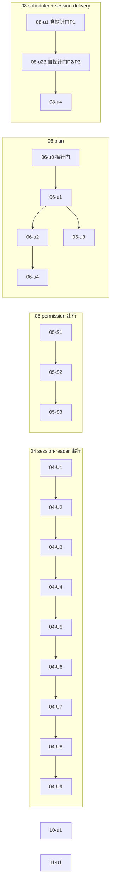

# ext-simplify A 组（04/05/06/08/10/11）实施计划

基线: d15086883 | 来源设计: docs/design/ext-simplify-{04-session-reader,05-permission,06-plan,08-scheduler,10-structured-output,11-ask-user}.md | 日期: 2026-09-14

批次性质：6 份设计两两无文件交集（handoff /tmp/handoff-ext-simplify-execution-order.md A 组表），一份批次计划统一编排，单元编号 = `<设计号>-<设计内单元号>`，内容权威源 = 各设计文档自身（subagent 按编号回设计读细节）。**用户约束：subagent 并发度 ≤2。**

审查证据（阶段 0.3）：`.tmp/tech-design/review-main-r1-batch{1,2}.md` + `review-impact-r1-batch{1,2}.md`（R1 双审查 + R2 聚焦复审追加节，2026-09-14）——6/6 双 PASS 至 0 must-fix，commit cadfaf4b9。审查报告为 gitignored 现场证据，R2 结论节均有「PASS 0 must-fix」记录。

## 0 章节映射

| 内容 | 04 | 05 | 06 | 08 | 10 | 11 |
|------|----|----|----|----|----|----|
| 背景/目标 | 开篇 SCQA + §1 | 开篇 SCQA + §1/§2 | 开篇 SCQA + §1/§2 | 开篇 SCQA + §1/§2 | 开篇 SCQA + §1/§2 | 开篇 SCQA + §1/§2 |
| 终态/机制 | §3 解决方案 | §4 终态 + §6 实现机制 | §4 终态 + §6 机制与文件地图 | §5 终态 + §7 实现机制 | §5 终态 | §5 终态 + §7 实现机制 |
| 验收场景表 | §4（S1-S6） | §8（A1-A7） | §7（V1-V5） | §8（V1-V4） | §8（V1-V3） | §8（V1-V4） |
| 下一层拆分 | §5（U1-U9） | §7 执行项总表 + §9 三阶段 | §8（u0-u5） | §9.2（M0+u1-u4） | §9.1（u1；u2 移交） | §9.2（u1；u2 移交） |
| 待验证检查点 | 附录 A 探针 P1-P4 | §10 T1-T5 | §8.2 | §9.3 | §9.2 | §9.3 |
| 执行项明细 | §5 执行项表（E1-E11/A1-A5，G5 回写清单①-⑤） | §7 三阶段表（E1-E12） | §8.1 单元表 | §6 D1-D3 + §7 | §7 执行项清单（E1-E3） | §7（E1-E3） |

行号基线声明：各设计引用 file:line 为起草时实读值，**subagent 一律以符号检索定位、不照抄行号**（10 号设计证据基线明示 ±1-2 行偏移）。

## 1 目标快照（逐字摘录各设计 SCQA 的 A（答案）行）

- **04**：「3 个决策（预解析根复用 / 删 enrichRefs + family 富字段展示 / renderOutline 返回渲染行）+ 11 项执行清理 + 5 项附加顺带修复，拆 9 个实施单元逐个可验收。」前提：不改变工具契约（schema、action 语义、错误路径）。
- **05**：「五组删除 + 三组收敛 + 一组导出面清理，分三阶段实施（行为零变删除 → 双写收敛 → 导出面收敛），每阶段独立验证独立回滚。」前提：不碰任何核心语义。
- **06**：「4 个决策（tree 档处置、goal 桥失败显式化、模板单源、phase 删除）+ 2 个执行项（静态 import、peer optional 化），全部行为修复或行为等价；仅模板单源带一项已量化的兼容代价。」
- **08**：「M18——croner 移入 dependencies 并静态 import，删除 probe 降级层，错误通道归一为『表达式无效』单一语义；M19——内核 onSettled 改 per-message 回调（±10 行，单消息批次行为不变），scheduler 防重 Map/TTL 保留为终态回调丢失的回收层有界兜底。」
- **10**：「M24 守卫整体删除 + slot 回退模块级 `let` + redesign 文档同批回写 + low 群移交清单登记。行为零变更。」
- **11**：「checkOptionLabels 增加保留字精确匹配拦截（一行校验 + 2 条测试）+ ARCHITECTURE.md 登记 registry 外沿事实；5 项 low 清理显式移交 code-simplify 批次；发现 5（前端编码漂移）经实读证伪后裁决不实施。」注意 S2：匹配口径用 `opt.label.trim() === OTHER_LABEL`（拦空白变体）。

Out-of-scope（各设计 In-scope 之外一律不动）：10 明示 SW 侧任何文件不动；11 明示不在此路径加第二处拦截（channel-handler 透传路径）；06 不动 goal 包（只消费其接口）；05 runtime 侧纯透传零改动；移交 code-simplify 不在本流水线执行：10-u2（E4-E7）、11-u2（L1-L5）、06 §8.3 三项、04 无移交项、08 low 群 L1-L9 归 08-u4 在本批次执行（L7 随 08-u23）。

## 2 单元列表

| Unit | 职责（设计内编号） | 领地 | 依赖 | 隔离 | 验收条款（机械证据） |
|------|------|------|------|------|------|
| 06-u0 | 06 §5.7 探针门 P1/P2（⛔ 不通过不开工，降级路径见探针表） | extensions/universal/plan/**（临时代码跑完移除，工作区还原） | - | plain | P1 日志 isActive=false 且无 phase="complete" 观测；P2 goal widget 出现 + /goal status 可见；产物留档 .tmp/dev-flow/probe-06.md |
| 06-u1 | 静态 import + index.ts 局部 logger 使用剥离（D5）+ buildExecOptions 同步化 + u5 peer optional 并入 | 同上 | 06-u0 | plain | 包 typecheck+lint+test 绿；编译产物无动态 import chunk；package.json peerDependencies @zhushanwen/pi-goal 含 `"optional": true` |
| 06-u2 | complete 交互矩阵（D1+D2+发现 7/8 顺带） | 同上 | 06-u1 | plain | 包测试绿（tool/compact-handler 改写用例）；V3① tree 传参 schema 拒绝 |
| 06-u3 | 模板单源 + 标题统一（D3+D4）+ CHANGELOG 破坏性条目 | 同上 | 06-u1 | plain | 包测试绿 + 新守卫测试；list-template 恰 5 个 builtin 无 source 后缀 |
| 06-u4 | phase 删除（D6） | 同上 | 06-u2（且 06-u0-P1 结论 = 死状态实证） | plain | 包测试绿；`rg "phase" src/`（非测试）写入点清零 |
| 08-u1 | 探针门 P1 红基线先行（新用例在现状下失败 = 缺陷实证留档）→ 内核 settled per-message（D1/B1）+ types 契约注释 → 用例转绿 + 版本 bump session-delivery 0.3.1→0.4.0 | packages/session-delivery/** | - | plain | P1 红基线留档 .tmp/dev-flow/probe-08.md；用例转绿；既有 delivery-receipt/delivery-inflight 套件零改动全绿 |
| 08-u23 | 探针门 P2 现状红确认先行 → croner 依赖修复 + 兜底语义注释 + runtime 测试核对（u2+u3 同 commit）+ 版本 bump scheduler 0.5.2→0.6.0；P2 复跑转绿 + P3 预演；**含 packages/subagent-core/src/execution/notify-ledger.ts:317-318 注释同步（设计 §7 文件表项，08-u1 blocker 裁决归此）** | extensions/universal/scheduler/** + packages/subagent-core/src/execution/notify-ledger.ts | 08-u1 | plain | P2 干净目录 import('croner') 成功（先红后绿两态留档）；`node scripts/check-extension-dependencies.mjs` 绿；runtime.ts 注释与 §5.2 终态一致 |
| 08-u4 | low 群清扫 L1-L9（L7 已随 08-u23） | extensions/universal/scheduler/** | 08-u23 | plain | 三连绿；§6.3 两处二选一裁决落地 |
| 04-U1 | 测试兼容层退役（E4 + G5③ 清账） | extensions/universal/session-reader/**（含包内 docs/ 两文件——回写目标） | - | plain | 包测试绿；re-export 块删除；G5③ 回写落位 |
| 04-U2 | find 单次根解析（E1/D1 + G5②） | 同上 | 04-U1 | plain | P1 spy 断言 doFind 全路径 resolveSessionRoots 恰 1 次 |
| 04-U3 | doctor 缓存删除 + 文档回写（E3+A2 + G5①） | 同上 | 04-U2 | plain | doctor 输出无「缓存命中」；G5① 五笔回写（含 impl-plan 台账清扫）完成 |
| 04-U4 | family 收敛（E2/D2+A3 + G5⑤） | 同上 | 04-U3 | plain | family 新字段可见；G5⑤ 回写落位 |
| 04-U5 | 行渲染统一（E7/D3） | 同上 | 04-U4 | plain | 旁支行 `[旁支 N entries]` 两 action 一致 |
| 04-U6 | deps 收敛（E5） | 同上 | 04-U5 | plain | 注入面收窄 typecheck 绿 |
| 04-U7 | identity 尾读收敛（E8 + P3） | 同上 | 04-U6 | plain | P-fallback 用例零回归 |
| 04-U8 | 死字段与提取收敛（E6+E9+E11+A4 + G5④） | 同上 | 04-U7 | plain | SessionRoot.id 零残留；G5④ 回写落位 |
| 04-U9 | 杂项与正确性（E10+A1+A4 注释+A5） | 同上 + eslint.config.mjs | 04-U8 | plain | A1 场景秒回空列表（S5 前置） |
| 05-S1 | 注入面删除 E1-E5（行为零变） | extensions/universal/permission/** | - | plain | 包测试绿（含 T2 vi.mock 落地）；A5 grep 四符号零命中 |
| 05-S2 | 双写收敛 E6-E8+E11 | 同上 | 05-S1 | plain | approval.test.ts 既有断言不动全绿（T4）；RPC title 断言补 reasoning 行 |
| 05-S3 | 导出面收敛 E9/E10/E12 | 同上 | 05-S2 | plain | A6 grep 六组符号零命中；rules/classifier barrel 各 2 符号 |
| 10-u1 | E1+E2+E3 单 commit + bump 5.1.5→5.1.6 | extensions/universal/structured-output/** + docs/design/structured-output-redesign.md（仅 :275 一处） | - | plain | 三连绿；loop-gate 既有用例除 :704-709 外零改动；redesign :275 表述已改写；version=5.1.6 |
| 11-u1 | E1+E2+E3 单 commit（探针 P1/P2 先行 = V1/V2 预跑） | extensions/universal/ask-user/**（含 ARCHITECTURE.md） | - | plain | validate.test.ts +2 用例绿（trim 口径）；ARCHITECTURE.md 登记；V1 拦截生效 |

注：04-U1..U9 串行依据 = 设计 §5 顺序（tool-handler.ts 等多文件跨单元复触，串行避免自撞）；04 线内「同上」领地 = extensions/universal/session-reader/**（src/tests/eslint.config.mjs + docs/2026-09-10-session-root-discovery-and-env-transparency{.md,.impl-plan.md}）。

## 3 DAG 图

六线两两无交集，任意并行；调度受全局并发 ≤2 约束。推荐波次（探针门最前置）：波1 = 06-u0 + 08-u1（后者内含 P1 红基线先行）→ 波2 = 10-u1 + 11-u1 → 之后 04 线与 05 线占满双槽滚动推进，06/08 剩余单元插空。

## 4 测试与验收计划

### 4.1 测试命令（真实来源：AGENTS.md + package.json scripts）

- 增量（每单元 dev 自跑）：`cd extensions/universal/<pkg> && pnpm vitest run`；涉及类型/导出面改动后补 `pnpm extensions:typecheck && pnpm extensions:lint`
- 08-u1：`cd packages/session-delivery && pnpm vitest run`
- 08-V4 邻居回归：`cd packages/runtime && pnpm vitest run`（delivery 相关既有套件零改动绿）
- 全量（阶段 3 尾一次）：`pnpm extensions:typecheck && pnpm extensions:lint && pnpm extensions:test` + `node scripts/check-doc-symbol-drift.mjs` + `node scripts/check-extension-dependencies.mjs`
- 版本 bump 口径：**08-u1（session-delivery 0.4.0）/08-u23（scheduler 0.6.0）/10-u1（5.1.6）为设计明文，随单元 commit**；04/05/06/11 的版本与 changeset 批次尾统一处理（对齐 c79cd621c/011cd043f 既有实践，handoff「批次版本 bump 由 merge 阶段统一处理」口径）；06 CHANGELOG 破坏性条目按包内既有惯例落 Unreleased/版本节

### 4.2 验收计划表（阶段 5 执行依据；场景定义在各设计验收节）

| # | 验收项 | 方式 | 成本 | 收益 | 组 | 依赖 | 优化判定 |
|---|--------|------|------|------|----|------|----------|
| 04-S1 | find 扫描次数（spy 恒 1 + 真实 agentDir 耗时） | L3 | 3 | 8 | 核心 | 04-U2 | 可脚本化（vitest spy + 真实目录计时）；与 04-S2/S3/S4 合跑同 agentDir 轮次 |
| 04-S2 | family 输出增强（真实 session） | L3 | 3 | 7 | 核心 | 04-U4 | 可合并（同 agentDir 轮次） |
| 04-S3 | outline 渲染与降级 | L3 | 3 | 6 | 非核心 | 04-U5 | 可合并 |
| 04-S4 | doctor 无缓存化（连续两轮 + grep） | L3 | 2 | 6 | 核心 | 04-U3 | grep 部分 L0 化；可合并 |
| 04-S5 | `#` 补全秒回（空 getCwdSessionDir） | L3 | 3 | 7 | 核心 | 04-U9 | 可脚本化（构造空上下文直调） |
| 04-S6 | 全包三连 | L0 | 1 | 8 | 核心 | 04-U9 | 批次尾统一三连 |
| 05-A1 | /permission model TUI 双环境 | L3 | 4 | 8 | 核心 | 05-S1 | 可脚本化（pi RPC select 中继替代 TUI 人工） |
| 05-A2 | /permission rule RPC 真实 select | L3 | 3 | 7 | 核心 | 05-S1 | 可脚本化（stdin JSONL） |
| 05-A3 | 审批卡双形态（TUI 逐字节 + GUI 同形态） | L3 | 5 | 8 | 核心 | 05-S2 | GUI 侧 browser-automation 截图判定（L4→L3）；TUI 侧输出 diff |
| 05-A4 | 手编规则拦截（绝对路径 pattern） | L3 | 3 | 7 | 核心 | 05-S2 | 可脚本化；与 05-A1/A2 同安装形态合跑 |
| 05-A5 | 死注入面 grep 零命中 | L0 | 1 | 6 | 非核心 | 05-S1 | 静态规则 |
| 05-A6 | 死导出面 grep 零命中 | L0 | 1 | 5 | 非核心 | 05-S3 | 静态规则 |
| 05-A7 | permission 三连 | L0 | 1 | 8 | 核心 | 05-S3 | 批次尾统一三连 |
| 06-V1 | complete→goal 全链路（compact 档） | L3 | 6 | 9 | 核心 | 06-u2 | 可脚本化（RPC select 中继 + JSONL 断言，替代 TUI 人工） |
| 06-V2 | goal 失败降级四子场景 | L3 | 5 | 9 | 核心 | 06-u2 | 可脚本化；四子场景同环境合跑 |
| 06-V3 | tree 档 schema 拒绝 + /tree 手动保留 | L3 | 4 | 7 | 核心 | 06-u2 | ① L1 单测承载；② /tree 跳转留 L4 人工（或 tmux 驱动） |
| 06-V4 | 模板单源链路 | L3 | 3 | 6 | 非核心 | 06-u3 | 可脚本化 |
| 06-V5 | peer optional dry-run + entry 形态 | L1 | 2 | 6 | 非核心 | 06-u1 | npm --dry-run + JSONL 检查 |
| 08-V1 | 独立安装 cron 可用（npm pack + pi 实测） | L3 | 4 | 8 | 核心 | 08-u23 | 可脚本化（探针 P2 扩展） |
| 08-V2 | builtin 形态回归（GUI dev + staging grep） | L3 | 6 | 6 | 非核心 | 08-u23 | browser-automation 降 L3；staging grep L0 |
| 08-V3 | 合批精确记账（双任务 ≥12min 观察） | L3 | 7 | 9 | 核心 | 08-u23 | 可脚本化（stdin 脚本 + list 轮询 + 时间线留档）；最贵项，与探针 P3 共产物 |
| 08-V4 | 单任务/失败路径 + 邻居通路 | L3 | 5 | 7 | 核心 | 08-u23 | runtime vitest 部分 L1；GUI 投递并入 08-V2 轮次 |
| 10-V1 | workflow 模式真实任务（env 直注） | L3 | 3 | 8 | 核心 | 10-u1 | 可脚本化 |
| 10-V2 | 日常模式 `{schema,data}` + swapped 拒绝 | L3 | 3 | 7 | 核心 | 10-u1 | 可脚本化；与 10-V1 同环境正反两跑 |
| 10-V3 | 三连 + doc-drift | L0 | 1 | 8 | 核心 | 10-u1 | 批次尾统一 |
| 11-V1 | Other 拦截生效（真实模型诱导） | L3 | 3 | 8 | 核心 | 11-u1 | 可脚本化（探针 P1 即本场景） |
| 11-V2 | TUI 问卷恒单 Other 行（人工观察 + 自由输入） | L4 | 5 | 7 | 核心 | 11-u1 | 无法降级（交互观察）；tmux 驱动可尝试 |
| 11-V3 | 合法调用双路径 + 既有 e2e | L3 | 4 | 7 | 核心 | 11-u1 | e2e 并入 05-A3 的 GUI dev 轮次 |
| 11-V4 | code-simplify 移交批验收 | — | — | — | — | （u2 移交批） | **本流水线不执行**（随 11-u2 移交批，deferred 登记） |

**提速结论**：可降级 2 项（05-A3/08-V2 经 browser-automation L4→L3）+ 11-V2 留 L4；可合并 ~9 项进 6 个环境轮次（04 真实 agentDir 轮 / 05 pi 安装轮 / 06 RPC 会话轮 / 08 双任务观察轮 / 10 正反两跑轮 / GUI dev 共享轮）；可脚本化 14 项（pi RPC + stdin JSONL + JSONL 断言）；L0 静态守卫 5 项（04-S6 / 05-A5 / 05-A6 / 05-A7 / 10-V3 + 各 grep 断言）批次尾统一跑。预计派发轮次 29 → ~10。

## 5 合理偏差登记表

| Unit | 偏差 | 性质 | 裁决 |
|------|------|------|------|
| 08-u1 | onSendOk/onSendFail/onSendReceipt 移除 composed 死参穿线（设计 §7 字面保留签名） | per-message 化后 composed 在两函数零消费方，保留即新死代码 | 接受，随单元 commit；阶段 3 一致性审查回写设计 §7 措辞 |
| 08-u1 | 未加 changeset 条目 | 版本 bump 口径已定（批次尾统一），单元仅动 version 字段 | 接受，批次尾统一补 |

## 6 状态表

| Unit | 状态 | 轮次 | 证据指针 |
|------|------|------|----------|
| 06-u0 | in-progress（波1） | 0 | - |
| 06-u1 | pending | 0 | - |
| 06-u2 | pending | 0 | - |
| 06-u3 | pending | 0 | - |
| 06-u4 | pending | 0 | - |
| 08-u1 | committed | 1 | P1 红基线「called 1 times」留档 probe-08.md；73/73 绿 + typecheck 零错误；commit 见 git log |
| 08-u23 | pending | 0 | - |
| 08-u4 | pending | 0 | - |
| 04-U1 | pending | 0 | - |
| 04-U2 | pending | 0 | - |
| 04-U3 | pending | 0 | - |
| 04-U4 | pending | 0 | - |
| 04-U5 | pending | 0 | - |
| 04-U6 | pending | 0 | - |
| 04-U7 | pending | 0 | - |
| 04-U8 | pending | 0 | - |
| 04-U9 | pending | 0 | - |
| 05-S1 | pending | 0 | - |
| 05-S2 | pending | 0 | - |
| 05-S3 | pending | 0 | - |
| 10-u1 | pending | 0 | - |
| 11-u1 | pending | 0 | - |

## 7 残留风险与变更历史

**约定与风险登记**：

1. 版本 bump 双轨口径（表面化）：设计明文的三处（08-u1/08-u23/10-u1）随单元 commit；其余包批次尾统一（既有 c79cd621c 实践）。06 CHANGELOG 破坏性条目随 06-u3 落（版本号按包内惯例，不阻塞）。
2. 探针门降级路径在各自设计探针表内（06 §5.7 / 08 §6.4）；触发降级 = 停线回设计文档重审，主 agent 冻结该线并升级用户。
3. 05-T1（GUI 多行 title 折叠形态）验收基线 = 与改前同形态对比，不按「按行显示」验收（设计 A3 已固化，防存量形态误诊）。
4. 08-V3 长观察（≥12min）与 GUI dev（08-V2）共享本机资源，验收编排串行化，避免端口/焦点竞争。
5. 11-V4 随 11-u2 移交 code-simplify 批次，本流水线 deferred（终态同步阶段登记到 ext-simplify-index）。
6. subagent 领地 = 线级包目录；发现领地外必改（如 runtime 侧意外牵连）停下上报，禁止顺手改。

**变更历史**：

- 2026-09-14：初版（阶段 0 预检 + 阶段 1 计划）。结构四节 6/6 齐备；审查证据 = R2 双 PASS 0 must-fix（cadfaf4b9）。
- 2026-09-14 r1：08-M0 撤销独立单元——P1 红基线用例即 08-u1 的 TDD 测试（需保留转绿），独立 committed 单元会强制「红测试入库」或「属地不干净」二选一；并入 08-u1（P1 门）/08-u23（P2 现状红确认）作为前置步骤。门性质不变：探针失败 = 停线回设计重审。
