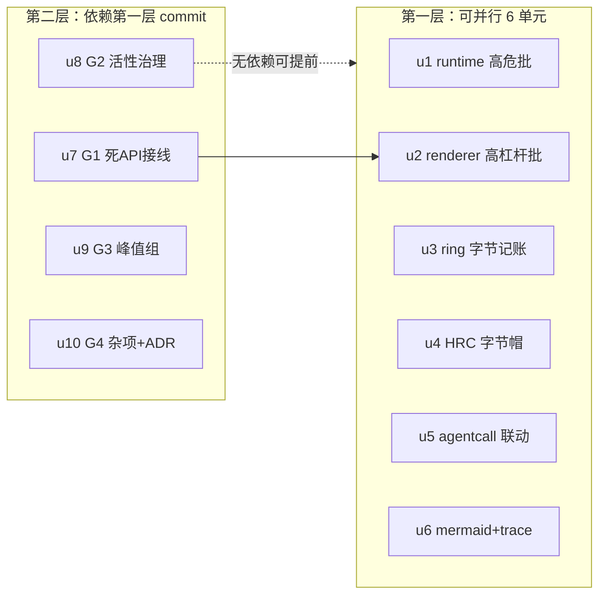

# memory-leak-remediation 实施计划
基线: <本计划 commit hash，基线 commit 后回填> | 来源设计: docs/design/memory-leak-remediation.md（R4 终版） | 日期: 2026-09-14

## 0 章节映射
| 内容 | 设计文档实际位置 |
|------|--------------|
| 背景/目标 | §1 背景目标（SCQA + 设计目标 G1-G4 + In/Out-scope） |
| 终态/机制 | §3 解决方案（§3.2 第一批 B1-B6 / §3.3 第二批 B7-B11 / §3.4 第三批 G1-G4 / §3.5 系统性防护） |
| 验收场景表 | §4 验收（A1-A10 + 单测分层清单） |
| 下一层拆分 | §5 下一层拆分（u1-u10 + justification + 待验证检查点 + 文件改动地图） |
| 待验证检查点 | §5 末尾 5 条（实施期核实，不阻塞） |

## 1 目标快照（逐字摘录）

> **G1**：消灭两个高危项——respawn 场景的 pingTimer 泄漏（连带 pi 进程钉死）、message-bus ring 字节无界
> **G2**：让「活性无界」结构（随用户工作流强度增长、与磁盘语料量无关）获得确定回收路径——销毁编排接线或容量帽
> **G3**：峰值类（一次性大分配）在有低成本手段处收敛，不动协议层
> **G4**：给「新增 per-session 状态必须接线销毁编排」补机械检查，防同类问题再发

Out-of-scope（摘录关键项）：pi-rpc frame.ts 单行缓冲（协议合法载荷）；SessionList 虚拟化；useTerminal scrollback；回收态 bus 分区 ring 清理（静默空洞反例否决）；B10 流式节流（独立议题）；mermaid 库本体。

## 2 单元列表
| Unit | 职责 | 领地（精确文件路径，全部相对 packages/） | 依赖 | 隔离 | 验收条款 |
|------|------|------|------|------|------|
| u1 | runtime 高危批：B1 pingTimer（dispose 补 stopPingLoop）+ B5 clearSessionData（tombstone set+delete guard + 摘碑双路径 + trash 软删除 + removeSessionEntry 尾段直调）+ B6 bridgeRequestIds 应答即删 | runtime/src/services/session/event-interpreter.ts；runtime/src/services/plugin-service/session-data-store.ts；runtime/src/services/plugin-service/session-data-api.ts（写守卫）；runtime/src/services/plugin-service/plugin-service.ts（setOnSessionCreated 摘碑挂点 :441）；runtime/src/services/plugin-service/import-service.ts（import 摘碑）；runtime/src/services/session/session-service.ts（尾段直调）；runtime/src/transport/bridge-handler.ts；runtime/src/services/extension-timeout-manager.ts + 各自 __tests__ | - | plain | 单测（B1 respawn 序列/B5 trash+tombstone 双路径+B6 Set 归零）+ `pnpm --filter runtime test` 绿 + typecheck 绿；tombstone 代码注释含「迟到 set 是唯一文件复活入口」依据 |
| u2 | renderer/core 高杠杆批：B2 events.ts off 删空 Set + B3 Sidebar 退订 + B4 browserDestroy hook（.catch + 头注释修正） | core/src/transport/api/events.ts；renderer/src/components/sidebar/Sidebar.vue；core/src/domain/session/use-session.ts（hooks 序列）；apps/electron/main/browser/browser-view-manager.ts（仅 :33 头注释） + 各自 __tests__ | - | plain | 单测（off 删空 key）+ core/renderer vitest 绿 + typecheck 绿；A4 场景探针代码就位 |
| u3 | B7 ring 字节记账（纯 A：16MB/session 预算 + 加速淘汰 + 仅剩最新帧即停 + truncated 版记账口径 + stateSnapshot 覆盖式观测） | runtime/src/services/message-bus/message-bus.ts；runtime/src/services/message-bus/types.ts + __tests__ | - | plain | 单测（预算内驱逐/超调下界终止/记账口径/覆盖式计量/记账不截断）+ runtime vitest 绿 |
| u4 | B8 history-rebuild-cache 字节帽（32MB/条）+ reclaim 驱逐 | runtime/src/services/session/history-rebuild-cache.ts；runtime/src/services/session/session-lifecycle.ts（reclaim 挂点） + __tests__ | - | plain | 单测（超限不缓存/reclaim 驱逐/重激活全量重建）+ runtime vitest 绿 |
| u5 | B9 agentcall LRU 联动（两路径接线 + viewedVids() panel 枚举豁免） | core/src/domain/chat/lru.ts；core/src/domain/chat/store.ts（装配）；renderer/src/stores/workflow.ts（映射暴露）；renderer/src/composables/features/subagent/control.ts（豁免查询源）+ 装配点 + __tests__ | - | plain | 单测（联动驱逐/豁免/两路径）+ core/renderer vitest 绿；A6 场景探针就位 |
| u6 | B10 mermaid finally 清残留 + B11 trace 台账（seenIds 增量 + 5000 软上限 + truncated 正交字段 + 现有降级 UI） | renderer/src/composables/logic/mermaid.ts；renderer/src/composables/features/trace/useSessionTrace.ts；packages/ui/src/features/chat 下 TraceView 消费点（若有，按 §3.3-B11 消费面清单）+ __tests__ | - | plain | 单测（finally 清理/增量 seen/上限停采）+ renderer vitest 绿 |
| u7 | G1 死 API 接线：terminal-write-queue + command-store + feedMap 接 cleanupSessionState hooks；requestIdSessions respond 路径补删 | core/src/domain/drawer/terminal-write-queue.ts；core/src/domain/new-task-search/command-store.ts；renderer/src/composables/effects/useForkNoticeEffect.ts；renderer/src/composables/shell/extension-host-dialog.ts；core/src/domain/session/use-session.ts（hooks 序列）+ __tests__ | u2（use-session.ts 同文件） | plain | 单测（三 Map 清理接线/requestIdSessions respond 删）+ core/renderer vitest 绿 |
| u8 | G2 活性无界治理：openPiStreams close 摘除 + inFlightSubscribes sweep 挂重连；§2.5 五项注释行 | runtime/src/infra/logger.ts；core/src/transport/ws-client.ts；runtime/src/infra/pi/session-file-external-scan.ts（注释）；runtime/src/infra/pi/session-binding-sidecar-io.ts（注释）；runtime/src/services/git/git-state-service.ts（注释）；runtime/src/services/usage/usage-stats-service.ts（注释）；core/src/domain/chat/bash-effects.ts（注释） | - | plain | 单测（摘除/挂重连）+ runtime/core vitest 绿；注释行 grep 验证 |
| u9 | G3 峰值组：extractor 预检降级 + shell-runner maxBuffer | runtime/src/services/session/subagent-extractor.ts；runtime/src/services/session/workflow-extractor.ts；runtime/src/infra/shell-runner.ts + __tests__ | - | plain | 单测（预检降级返回空+标记/maxBuffer 截断保留头尾）+ runtime vitest 绿 |
| u10 | G4 杂项组 + ADR-0049 条目：prematureTimeoutIds/deferFlushFailureCounts dispose 补面 + quota body cancel + skill-registry watcher LRU 8 + ImportSessionDialog close 清数据 | core/src/domain/chat/streaming-state-machine.ts；core/src/domain/chat/useChat.ts；runtime/src/services/quota-providers/types.ts；runtime/src/services/skill-registry.ts；renderer/src/composables/features/sidebar/useImportSession.ts；docs/adr/0049-session-isolation-map-partition.md（checklist 条 + 变更历史）+ __tests__ | - | plain | 单测（dispose 补面/cancel/LRU 驱逐）+ vitest 绿；ADR 条目 diff 可见 |

注：u2 的 browser-view-manager.ts 在 apps/electron（main 进程），仅头注释改动；u5 的 control.ts 为豁免查询只读源。全部单元领地以本表为准（设计 §5 文件数声明已按本表校正）。

## 3 DAG 图

实际依赖边仅 u7→u2（use-session.ts 同文件串行）；u8-u10 无文件冲突可与第一层并行派发（受全局并发 ≤5 约束分两波）。

## 4 测试与验收计划

**测试命令**（从各包 package.json scripts 真实读取）：
- 增量（每单元 dev 自跑）：`cd packages/<pkg> && pnpm test`（vitest run）+ `pnpm typecheck`
- 全量（阶段 3 尾）：runtime + core + renderer 三包 vitest 全量 + `pnpm extensions:typecheck && pnpm extensions:lint && pnpm extensions:test`（extensions 面未被触碰，作回归闸门）+ 根 `pnpm run lint`
- 测试策略遵循 docs/TEST-STRATEGY.md（vitest 禁 node:test；timer 测试用 fake timers；fs 写删走 tmpdir 白名单——runtime vitest 已有 fs-guard setupFiles）

**验收计划表**（编译自设计 §4 A1-A10；风险分 9 继承自设计——P0 面）：
| # | 验收项（场景表行） | 方式 | 成本(1-10) | 收益(1-10) | 组 | 依赖 | 优化判定 |
|---|--------------------|------|------------|------------|----|------|----------|
| A1 | pi 崩溃恢复后无 pingTimer 残留 | L1 单测(fake timers 重放 respawn 序列) + L3 探针 | 4 | 10 | 核心 | - | 单测覆盖主链路；L3 探针（诊断日志）随 dev 实例验收日并入 A9 批次 |
| A2 | ring 字节有界（预算内驱逐+超调下界） | L1 单测（u3 全套） | 3 | 10 | 核心 | - | 可脚本化；16MB 常数实测量化并入 A9 |
| A3 | session 删除全链路释放（tombstone/trash/分区归零/views 下降） | L3 脚本（dev 实例 + 探针 + RPC 直调模拟迟到写） | 7 | 10 | 核心 | u1,u2,u7 | 操作确定 + 探针可机器断言；browserCreate 直造 view 路径已钉死 |
| A4 | 断连重连不泄漏 handler | L3 脚本（kill runtime ×5 + 探针 size==1） | 5 | 7 | 核心 | u2 | 可脚本化 |
| A5 | bridge 请求不累积 | L1 单测 + L3 探针 | 3 | 7 | 非核心 | u1 | 单测为主，探针并入 A9 |
| A6 | agentcall 联动驱逐 + 豁免（drawer 不白屏） | L1 单测 + L3 场景（切 8 session 挤出 + drawer 存活断言） | 6 | 8 | 核心 | u5 | 单测覆盖驱逐/豁免语义；L3 场景并入 A9 批次 |
| A7 | mermaid 失败不泄漏 DOM | L1 单测（jsdom 断言 body 无 #dmd-*） | 3 | 7 | 非核心 | u6 | 可脚本化（happy-dom 已有先例） |
| A8 | trace 台账有界 + O(n²) 消除 | L1 单测 | 3 | 7 | 非核心 | u6 | 可脚本化（灌 5000 entries 断言上限+耗时） |
| A9 | 长跑回归 + 量化锚点（RSS/heap 中位数回落 + 无孤儿进程） | L3 脚本（30min 混合工作流 + 静置 60s 采样） | 9 | 9 | 核心 | u1-u7 全部 | 不可降级（本分支主题的最终证据）；与 A1/A2/A5/A6 探针合并跑 |
| A10 | 存量测试全绿 | L2 全量套件 | 5 | 8 | 核心 | 全部 | 机械执行；阶段 3 尾统一 |

**提速结论 [MANDATORY]**：可降级 0 项（A9 为最终证据不可降）；可合并 4 项（A1/A2/A5/A6 的 L3 探针全部并入 A9 批次同跑，省 4 个独立派发轮）；可脚本化 8 项（A2-A8 全部 testid/探针/单测可机器断言）；L0 静态守卫清单：`pnpm run lint`、各包 typecheck、`node scripts/validate-constraints.mjs`（若触发）、pre-commit 全链（vue_rules_checker/taste-lint/env 白名单等按路径自动触发）。预计节省派发轮次 ~4 轮（L3 批次合并）。A9 成本 9 为最重项（30min 实跑 + 采样），安排在全部单元 committed 后一次性执行。

## 5 合理偏差登记表
| Unit | 偏差 | 合理性论证 | 设计文档同步动作 |
|------|------|------|------|
| u2 | useSidebar.ts 领地外 1 hook 接线 + 1 import | SessionCleanupHooks 在 renderer 的唯一实现点；不接线则 browserDestroy hook 是死代码（恰为本治理的反模式本身）；设计 B4 落点「lib/ipc.ts 调用方」即壳层接线 | 无需（设计本意） |
| u2 | 5 个测试基建文件 mock 补丁（各 1 行） | vitest mock 代理在未知导出属性访问即抛错（?. 拦不住）；TEST-STRATEGY §5 已登记此坑；属 Sidebar.vue 探针的合法测试伴随面 | 无需 |
| u2 | use-session.ts「12 项」陈旧口径顺手修正为 11 项 | 设计 §2.1 已登记该漂移；hooks 序列本在改动面内 | 已在 R4 文档体现 |
| u1 | session-data-api.ts 实际路径在 plugin-service/api/ 子目录 | 计划笔误；领地意图不变 | impl-plan 领地表以实际路径为准 |
| u3 | shared/constants.ts 领地外 1 常量（RING_BUDGET_BYTES） | message-bus.ts 内联 16*1024*1024 触发 no-magic-numbers warning（项目纪律 warning 正面修复）；既有范式 = 字节守卫常量集中 shared SSOT（OUTBOUND_FRAME_* 同款） | 无需（对齐既有范式） |
| u4 | session-service.ts + index.ts 领地外（facade 委托 + 组合根装配） | SessionHistoryReader 为 Facade 私有、ReclaimSessionDeps 约定组合根装配，窄接口注入链必须经此两点，否则 B8-C 死代码 | 无需（设计本意） |
| u4 | set() 超限时摘除既有条目（设计原文仅「超限不缓存」） | 防冻结基线：append-only 历史保留旧条目使增量 delta 从旧叶子无界增长，劣于全量重建 | 已同步设计 B8 节（本 commit） |
| u5 | 回调形态改纯查询 agentCallEvictionsOf（计划写 evictAgentCallsOf） | 免装配侧自引用 chat store（stores 间 import 禁令）；设计待验证检查点 1 本倾向只读查询 | 设计 B9 措辞以纯查询为准 |
| u5 | 豁免门控补 isOpen + activeTab 分量 | A6 要求关闭 drawer 后释放（isOpen）；非 subagent tab 时 SubagentTab 未挂载不算查看中，切回重挂载即重拉 | 无需（设计链意图内） |
| u5 | 装配外置 features 层 agentcall-lru-linkage.ts（新文件） | stores 间禁止互相 import 的既有约定迫使跨 store 编排外置 | 无需 |

## 6 状态表
| Unit | 状态(pending/in-progress/committed/blocked) | 轮次 | 证据指针 |
|------|------|------|------|
| u1 | committed | 0 | 7f55323f5 |
| u2 | committed | 0 | 4b3bf3ffc |
| u3 | committed | 0 | 0f1d445a2 |
| u4 | committed | 0 | b54df2bf5 |
| u5 | committed | 0 | eadb058fa |
| u6 | in-progress | 0 | 波2派发 |
| u7 | in-progress | 0 | 波2派发（u2 已 committed 解锁）|
| u8 | in-progress | 0 | 波2派发 |
| u9 | in-progress | 0 | 波2派发（含存量 extractor 失败修复）|
| u10 | in-progress | 0 | 波2派发 |

## 7 残留风险与变更历史
- 残留风险：①16MB ring 预算与 32MB HRC 帽为设计值，A2/A9 实测后校准（登记于设计待验证检查点 3）②A9 量化锚点受 GC 波动影响，已用静置 60s + 中位数缓解③摘碑挂点 plugin-service.ts:441 是单槽回调——实施须链式追加不得二次 setOnSessionCreated 覆盖（简洁审 R4 INFO）。
- 变更历史：2026-09-14 计划创建（来源设计 R4 终版，三审 0 MF）。
