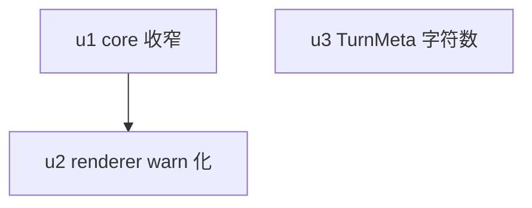

# remove-turn-progress-bar 实施计划

基线: <待 round-2 收敛后 commit 填入> | 来源设计: `.tmp/dev-flow/remove-turn-progress-bar.design.md` | 日期: 2026-09-14

## 0 章节映射

| 内容 | 设计文档实际位置 |
|------|------------------|
| 背景/目标 | §1 背景/目标（含 Out-of-scope） |
| 方案对比与被否谱系 | §1.1 |
| 终态/机制 | §2（2.1 TurnMeta 字符数 / 2.2 TurnProgressBar warn 化 / 2.3 core 收窄 / 2.4 i18n 键增删） |
| 验收场景表 | §3（A1–A9） |
| 下一层拆分 | §4（u1/u2/u3 种子） |
| 待验证检查点 | 无 |

## 1 目标快照（逐字摘录 §1）

> 现状：Composer 上方常驻观测条 `TurnProgressBar.vue` 展示「本 turn 已 N 分钟 · 当前 tool 已 M 分钟 · 已生成 X 字符」，warn（≥10min）时追加「中止此 turn / 继续等待」。对话流 turn 头部 `TurnMeta.vue` 已有「工作中/已工作 + elapsed + 时刻区间 + think/tool badge」。
> 目标：1. TurnMeta 增「已生成 X 字符」（工作中随流式增长、完成后定格），承接观测条的字符数信息；2. TurnProgressBar 改 warn 告警条：仅超阈值时出现（警示色 + 本 turn 已 N 分钟 + 中止/继续等待），常态零视觉占用；3. core `useTurnProgress` 随消费面收窄（删 chars/tool 派生），防死代码漂移。
> Out-of-scope：warn 阈值定值；TurnMeta 5min/30min 分级配色；ask_user 豁免 warn 抑制语义；ActivityStrip；dispatching 空窗 elapsed 缺口（显式接受）；sidebar 段 i18n 死键守卫盲区（独立 chore）。

## 2 单元列表

| Unit | 职责 | 领地（精确文件路径） | 依赖 | 隔离 | 验收条款 |
|------|------|---------------------|------|------|----------|
| u1 | core turn-progress 收窄：snapshot 7→2 字段（`turnElapsedMs`/`warn`）；删 `active`/`awaitingUser` 接口（降 tick 局部变量）/`toolName`/`toolElapsedMs`/`generatedChars`；分区删 `lastAssistantLen`/`generatedChars` 与 `accumulateChars()`；`lastAssistantId` 改边沿回调维护；`startTurn`/`finishTurn` 去字符基线读写；snooze/锚守门/阈值不动 | `packages/core/src/domain/chat/turn-progress.ts` · `packages/core/src/domain/chat/__tests__/turn-progress.test.ts` | — | plain | A7 |
| u2 | renderer warn 化：TurnProgressBar 渲染条件 `snapshot && snapshot.warn`；删 awaitingUser 分型/chars/tool 段；formatDuration 删秒分支；头注回写；Panel.vue 注释回写；sidebar 四死键删除（zh/en 对称）；U6 重写反向断言 | `packages/renderer/src/components/panel/TurnProgressBar.vue` · `packages/renderer/src/components/panel/Panel.vue` · `packages/renderer/src/i18n/locales/zh-CN/sidebar.ts` · `packages/renderer/src/i18n/locales/en-US/sidebar.ts` · `packages/renderer/src/__tests__/panel/turn-progress-bar.test.ts` · `packages/renderer/src/__tests__/panel/turn-progress-composer-wiring.test.ts` · `packages/renderer/src/__tests__/panel/ask-user-inline.test.ts` | u1 | plain | A1 · A4 · A5 · A6 · A8② |
| u3 | TurnMeta 字符数：useTurnElapsed 扩展 `generatedChars` 输出（挂载算一次/每秒重算/停表定格）；Turn.vue 透传；TurnMeta.vue 渲染 `· 已生成 X 字符`（v-if chars>0）；panel.ts 增一键（zh/en 对称） | `packages/ui/src/features/chat/composables/useTurnElapsed.ts` · `packages/ui/src/features/chat/Turn.vue` · `packages/ui/src/features/chat/TurnMeta.vue` · `packages/renderer/src/i18n/locales/zh-CN/panel.ts` · `packages/renderer/src/i18n/locales/en-US/panel.ts` · `packages/ui/src/features/chat/__tests__/useTurnElapsed.test.ts` · `packages/ui/src/features/chat/__tests__/TurnMeta.test.ts` · `packages/ui/src/features/chat/__tests__/Turn.test.ts` · `packages/renderer/src/__tests__/components/Turn.smoke.test.ts` | — | plain | A2 · A3 · A8① |

领地互斥自检：u2（renderer sidebar.ts + panel 组件/测试）与 u3（renderer panel.ts + Turn.smoke.test.ts）在 packages/renderer 内文件集不相交；u1 与 u3 无共享文件。u3 与 u1 可并行。

## 3 DAG 图

## 4 测试与验收计划

**增量测试命令（单元开发期，逐单元跑）**：
- u1：`cd packages/core && npx vitest run src/domain/chat/__tests__/turn-progress.test.ts`
- u2：`cd packages/renderer && npx vitest run src/__tests__/panel/turn-progress-bar.test.ts src/__tests__/panel/turn-progress-composer-wiring.test.ts src/__tests__/panel/ask-user-inline.test.ts src/__tests__/i18n/`
- u3：`cd packages/ui && npx vitest run src/features/chat/__tests__/useTurnElapsed.test.ts src/features/chat/__tests__/TurnMeta.test.ts src/features/chat/__tests__/Turn.test.ts` + `cd packages/renderer && npx vitest run src/__tests__/components/Turn.smoke.test.ts`

**全量测试命令（阶段 3 尾）**：`cd packages/core && pnpm test` · `cd packages/ui && pnpm test` · `cd packages/renderer && pnpm test`（三包 vitest run，命令已从各 package.json scripts 核实）。

**分层依据**：docs/TEST-STRATEGY.md §3 三视角（每条用例至少一个用户可见 DOM 断言；timer 用例 fake timers——u1/u2 的 warn 推进经 `UseTurnProgressOptions.now` 注入时钟，不真实等待）。

### 验收计划表

| # | 验收项（场景表行） | 方式(L0-L4) | 成本(1-10) | 收益(1-10) | 组 | 依赖 | 优化判定 |
|---|--------------------|-------------|------------|------------|----|------|----------|
| A1 | 常态零占用 | L1 | 2 | 8 | 核心 | u2 | 可脚本化（testid 存在性断言） |
| A2 | TurnMeta 工作中字符数 | L1 | 3 | 9 | 核心 | u3 | 可脚本化；与 A3 同领地同批跑 |
| A3 | 完成定格 + live≡reload | L1 | 3 | 9 | 核心 | u3 | 可脚本化（构造性等价 + apply-entry-equivalence 背书） |
| A4 | warn 告警条 | L1 | 3 | 9 | 核心 | u2 | 可脚本化（时钟注入，无真实等待） |
| A5 | snooze + ask_user 豁免（U6 反转） | L1 | 3 | 9 | 核心 | u2 | 可脚本化 |
| A6 | dead 排除保留 | L1 | 2 | 7 | 核心 | u2 | 可脚本化 |
| A7 | core 收窄无回归 | L0+L1 | 2 | 8 | 核心 | u1 | L0（rg 已删字段零命中）+ L1（core 套件） |
| A8 | i18n 死键清零 | L0 | 1 | 7 | 核心 | u2, u3 | L0 静态守卫消化（guard 真覆盖 panel 键 + rg 四键） |
| A9 | 全量回归 | L2 | 4 | 8 | 核心 | u1,u2,u3 | 阶段 3 尾并入 |
| A10 | 真机抽查：常态零占用 + TurnMeta 字符增长 + ask_user 期不渲染 + B1 常驻观感（§1.1 重审条件证据） | L4 | 6 | 7 | 非核心 | A9 | 无法降级（观感判定需真机）；warn 态真机不可造（10min 等待不可接受），由 A4 时钟注入覆盖并在此登记 |

**提速结论**：可脚本化 8 项（A1–A8 全部 L0/L1 消化，零 L3/L4 依赖）；可合并 2 项（A2/A3 同领地 u3 同批；A9 并入阶段 3 尾单轮）；L0 静态守卫清单 = `locale-key-usage-guard` / `locale-sync-check` / `taste-lint`（pnpm run lint）/ `vue_rules_checker`（pre-commit）/ `eslint`。预计 L4 派发仅 A10 一轮真机抽查（browser-automation 连 dev 实例，单轮完成四断言）。

### 计划自检

1. **切分粒度**：三单元领地互斥（§2 自检行）、无空转单元、依赖方向与 DAG 一致（u2 依赖 u1 的 snapshot 类型收窄；u3 只依赖 turn.assistants prop，与 u1/u2 无编译依赖）
2. **worktree 标记**：三单元均小面低风险 renderer/ui/core 文件级改动，plain 隔离足够，不开 worktree
3. **验收条款无遗漏**：设计 A1–A9 每条落到单元验收条款（A1/A4/A5/A6/A8②→u2；A2/A3/A8①→u3；A7→u1；A9→阶段 3 尾）且全部出现在验收计划表；A10 为真机补充项（设计 §1.1 重审条件的证据来源）
4. **验收计划表自洽**：核心组 A1–A9 覆盖主链路；依赖列无环（A10→A9→u1/u2/u3 线性）；优化判定与提速结论已给出

## 5 合理偏差登记表

（初始为空）

## 6 状态表

| Unit | 状态 | 轮次 | 证据指针 |
|------|------|------|----------|
| u1 | pending | 0 | — |
| u2 | pending | 0 | — |
| u3 | pending | 0 | — |

## 7 残留风险与变更历史

**残留风险**：
- sidebar 段 i18n 死键守卫盲区（候选 14 键待 triage，独立 chore）
- durationSec 删除与 `TURN_PROGRESS_WARN_THRESHOLD_MS=600s` 生命周期耦合：阈值若 <60s 则 formatDuration 缺秒分支（P-3 纪律禁收窄但无机器守卫）
- B1 常驻观感重审条件：真机观感噪则机械降级 B2（§1.1）
- warn 态真机不可造（10min），A4 仅 L1 时钟注入覆盖

**变更历史**：
- 2026-09-14 round-1 三审（3 must-fix + 9 suggestion）全修 → 设计 v2（§1.1 方案对比新增 / A8 守卫覆盖如实拆分 / snapshot 7→2 / 死键 3→4 / U6 反转登记 / u2·u3 清单补全 / 速记码对照表）
- 2026-09-14 round-2 聚焦复审收敛：主审 0MF+1S / 影响面审 0MF+0S / 简洁审 0MF+1S（三审均 0 must-fix，设计就绪）。唯一残留 suggestion（两审同指）= durationSec 删除 × P-3 阈值重定值的跨包前提，已回修（设计 §2.4 + u2 条目）。known-issue：三审完成通知在宿主侧丢失（会话 state 文件 19:40 已记 completed，注册表滞留 running），报告经直接读文件回收，已向用户同步排查结论
