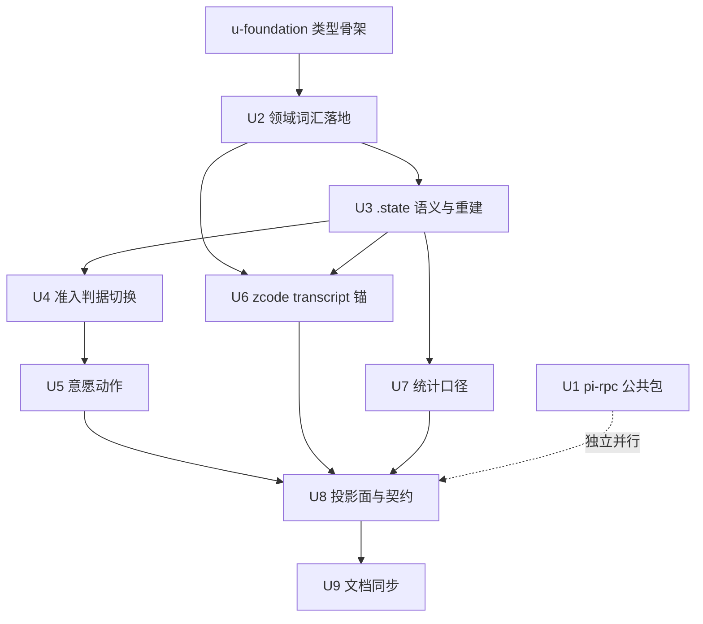

# subagent 永久会话模型 实施计划

基线: c2c111170 | 来源设计: docs/design/subagent-permanent-session-model.md | 日期: 2026-09-13
代码基线: merge dev-0.9.19（235aac23e）后的 H4 形态——设计断言的行号在此基线有效。

## 0 章节映射

| 内容 | 本文实际位置 |
|------|--------------|
| 背景/目标 | §1 背景目标（1.1 SCQA / 1.3 设计目标 G1-G5 / 1.4 in-out scope） |
| 终态/机制 | §3 解决方案（3.1 终态场景 / 3.2.1 领域模型 / 3.2.2 状态机与事件表 / 3.2.3 复活资格判据与 reopen+epoch / 3.2.4 .state 降权与双向兼容与 .alive 生命周期 / 3.2.5 意愿动作表 / 3.2.6 zcode transcript 锚与风险登记 / 3.2.7 结算副作用与通知 gate 三元组 / 3.2.8 投影面与契约 / 3.3 RPC 公共包与分层） |
| 验收场景表 | §4 验收（S1-S9） |
| 下一层拆分 | §5 下一层拆分（U1-U9 + 依赖顺序 + 待验证检查点） |
| 待验证检查点 | §5 待验证清单 4 项（P-1 已测毕） |

## 1 目标快照（逐字摘录设计 §1.3/§1.4）

**目标**：
1. **G1 万物可续聊**：对任何**非 workflow-origin** 的 subagent——无论自然完成、被取消、被关闭、宿主重启过、用的哪种引擎——用户（或主 agent）发 message 都能在**同一个 id** 上继续对话；不需要理解任何形态词汇（workflow 编排成员的立即终态化语义维持现状，见 §1.4 out-of-scope）。
2. **G2 状态可读**：用户在 UI 上只需要理解两个词：「正在跑」（running）和「空闲」（idle）。「为什么停」作为一句话解释展示，不参与任何资格判定。
3. **G3 资源有序**：永久会话不等于资源永不释放——进程、worktree、transcript 文件各有明确保留期与回收通道；回收后续聊自动降级为「带历史重开」，用户无感知中断。
4. **G4 意愿语义直白**：cancel = 「暂停这一轮」（可以继续聊）；close = 「收起来」（列表隐藏，可寻回）。两者都不是处决。
5. **G5 架构收敛**：subagent 的操作逻辑统一收敛（一条 message 链、一套意图原语）；主 agent 与 subagent 在 pi 进程 RPC 上的同类操作（追加消息、状态判断、中断、杀进程）提取公共包，消除双轨实现。

**out-of-scope**：zcode 引擎外移、GUI 快修批次、workflow 域状态机、主 agent 会话管理（详见设计 §1.4）。

## 2 单元列表

| Unit | 职责 | 领地（精确文件路径） | 依赖 | 隔离 | 验收条款 |
|------|------|----------------------|------|------|----------|
| u-foundation | 共享契约：ExecutionStatus 两态 + Intent/StopReason/Epoch/TranscriptRef 类型 + store 原语签名扩展（markSettled/markReopened/markArchived/markIdleEvicted 改名 + lastAbandonedRound）——**类型与骨架先行，throw not implemented**，保持 tsc+eslint 双绿 | packages/subagent-core/src/execution/types.ts、record-store.ts（原语签名层）、state-marker.ts（binding 字段类型面） | - | plain | tsc 零错 + 现有测试不红（additive）+ check-record-write-surface 绿 |
| U1 | pi-rpc 公共包：packages/pi-rpc 新包（spawn-args/frame/commands/kill-chain/env 五模块）+ runtime rpc-client 薄壳化 + pi-subagent-cli stdin-writer/engine-client 归并（先并存后切换） | packages/pi-rpc/**（新）、packages/runtime/src/infra/pi/rpc-client.ts、process-manager.ts、packages/pi-subagent-cli/src/stdin-writer.ts、spawn-args.ts、engine 目录相关、根 pnpm-workspace.yaml | - | plain | pi-rpc 包测试绿 + runtime/pi-subagent-cli 各自测试绿 + grep 无双轨（S7 前置） |
| U2 | 领域词汇落地：types.ts 状态机改造（closed→idle 删除、intent/stopReason/epoch/lastAbandonedRound 实装）+ store 原语实现（u-foundation 骨架填肉） | packages/subagent-core/src/execution/types.ts、record-store.ts、execution-record.ts | u-foundation | plain | 单测：状态机 CAS 语义 + 原语副作用矩阵；tsc 绿 |
| U3 | `.state` 语义切换：state-marker 新格式（{status:"idle", stopReason?, endedAt?}）+ 双向兼容（读旧 finalized/cancelled 映射 + 旧版读新值落 disconnected 兜底声明）+ buildRecord 单规则 + 孤儿恢复简化（删直断/entry-born 分支）+ `.alive` release 出口迁移 | packages/subagent-core/src/execution/state-marker.ts、record-store.ts（重建矩阵/孤儿恢复段） | U2 | plain | 单测：重建矩阵单规则 + 兼容映射 + boot 孤儿恢复保留 idle；fs-guard 白名单路径 |
| U4 | 准入判据切换：cold-lookup 守卫段 + Continuation.reviveOrThrow 合并为锚判据单点（transcriptRef 可解析 + 异进程探针 + 归属）+ endedMessageGuard 缩型 + fork-from 守卫 4/6 调整 + reopen 降级路径（markReopened + 摘要注入 + epoch） | packages/subagent-core/src/execution/cold-lookup.ts、subagent-actions-core.ts、conversation-continuation.ts、service/run-orchestration.ts（resume anchor 构造） | U2, U3 | plain | 单测：closedReason×action 新矩阵（万物可续）+ reopen 触发 + 异进程占用拒绝唯一形态 |
| U5 | 意愿动作：cancel=abort+settle+置放弃轮标记、close=归档（intent 翻转+worktree 回收+patch 前移+.alive release+pending 注销补发+顺序约束）、编排性关闭=自动收起（立即打断）、message 隐含寻回、worktree 重建链（apply 冲突三形态） | packages/subagent-core/src/execution/service/record-lifecycle.ts、conversation-continuation.ts、worktree-manager.ts、finalize-record.ts | U2, U3, U4 | plain | 单测：动作表逐行（含通知 gate 三元组挂点）+ worktree 重建/降级三形态 |
| U6 | zcode transcript 锚：binding/entry 承载 transcriptRef + interact(resume) 实现（resume 读 + 新 session 注入——P-1 探针结论）+ conversation:"cold" + entry-born 分支删除（并入 U3 协同）+ 会话库 TTL 通道 + capabilities 更新 | packages/zcode-subagent-cli/src/zcode-engine.ts、session-channel.ts、capabilities 相关、packages/subagent-core/src/execution/engine/capability-gate.ts、state-marker.ts（binding 块） | U2, U3 | plain | 探针脚本复跑（.tmp/probe/ 基础改造为集成测试）+ zcode 包测试绿 + TTL 通道存在性断言 |
| U7 | 统计口径统一：binding 基准（settle 落快照 + revive 恢复 + roundBaseTurnIndex + epoch/lastAbandonedRound 持久化）+ 内存增量覆盖 | packages/subagent-core/src/execution/execution-record.ts、record-store.ts（binding 写点）、state-marker.ts | U2, U3 | plain | 单测：revive 前轮统计保留 + 跨重启 binding 恢复 |
| U8 | 投影面与契约：shared SubagentStatus 契约（running\|idle+intent+stopReason）+ GUI（SubagentList/bucket 三处判据/默认列表可见性/过滤器）+ runtime diff 基线 + manifest 双写映射（session-reader 前向兼容）+ TUI mapExternalState/bg-notify + 通知简化（gate 三元组 + mapReasonToStatus 词表） | packages/shared/src/subagent.ts、message.ts、packages/renderer/src/components/sidebar/SubagentList.vue、lib/subagent-bucket.ts、stores/subagent.ts、packages/runtime/src/services/session/session-records.ts、subagent-extractor.ts、extensions/universal/subagent-workflow/src/interface/**、extensions/universal/pending-notifications/src/index.ts、notifier 系（subagent-core） | U2-U7 | plain | renderer 测试绿 + runtime 测试绿 + extensions 三连绿 + 旧数据只读兼容（S8） |
| U9 | 文档同步：母设计 D5/D8 注记演进、constraints（C-data-20 原语清单 + zcode TTL 新条目 + u7a 挂点注记）、explainer 更新、AGENTS.md 术语 | docs/design/subagent-record-persistence-consolidation.md、docs/constraints.json（+重渲染）、docs/architecture/subagents/architecture.md、AGENTS.md 相关行 | U2-U8 | plain | check-doc-symbol-drift 绿 + select-constraints 绿 + render-constraints 幂等 |

## 3 DAG 图

依赖顺序：U1 独立流水并行；U2 → (U3, U6) → U4 → (U5, U7) → U8 → U9。

## 4 测试与验收计划

**测试命令（真实）**：
- 单包增量：`cd packages/subagent-core && pnpm vitest run`（2987 用例基线）/ `cd packages/pi-rpc && pnpm vitest run` / `cd packages/zcode-subagent-cli && pnpm vitest run` / `cd packages/runtime && pnpm vitest run` / `cd packages/renderer && pnpm vitest run`
- extensions 三连：`pnpm extensions:typecheck && pnpm extensions:lint && pnpm extensions:test`
- 守卫：`node scripts/check-record-write-surface.mjs`、`node scripts/check-doc-symbol-drift.mjs`、`node scripts/select-constraints.mjs --base main`
- 全量（阶段 3 尾）：根 `pnpm test`（按 TEST-STRATEGY）
- typecheck：各包 `npx tsc --noEmit`

**验收计划表**（设计 S1-S9 编译）：

| # | 验收项（场景表行） | 方式(L0-L4) | 成本(1-10) | 收益(1-10) | 组 | 依赖 | 优化判定 |
|---|--------------------|-------------|------------|------------|----|------|----------|
| A1 | S1 取消后续聊（同 id + 统计连续） | L3 脚本 | 5 | 9 | 核心 | U5 | 可脚本化：subagent-core 集成测试驱动真 pi CLI（本地实测惯例）；cancel→message 断言 |
| A2 | S2 重启后追问 pi | L3 脚本 | 5 | 9 | 核心 | U4 | 可脚本化：fake 重启（新进程 initSession + 磁盘扫描）+ message 断言 |
| A3 | S3 重启后追问 zcode（含 TTL 通道） | L3 脚本 | 7 | 8 | 核心 | U6 | 探针脚本基础（.tmp/probe）改造为集成测试；fake clock 推 TTL |
| A4 | S4 带历史重开（摘要引用历史结论） | L3 脚本 | 6 | 7 | 核心 | U4 | fake clock GC + message；断言首轮 prompt 含摘要 + 真 LLM 回答引用（zcode 侧结构化注入更强） |
| A5 | S5 归档寻回 + worktree 重建 | L3 脚本 | 6 | 7 | 非核心 | U5 | 真 git worktree 操作可脚本化；apply 冲突形态单独用例 |
| A6 | S6 双宿主占用拒绝 | L1 单测 | 2 | 6 | 核心 | U4 | findForeignLiveInstance 既有机制，单测覆盖新判据下不变 |
| A7 | S7 主/从 RPC 收敛回归 | L2 全量 | 8 | 8 | 核心 | U1-U8 | 并入阶段 3 全量；grep 无双轨为 L0 前置 |
| A8 | S8 旧数据兼容 | L3 脚本 | 4 | 7 | 核心 | U3, U8 | 构造旧 sidecar（finalized/cancelled）+ 旧 manifest 只读映射断言 |
| A9 | S9 负面反向（无自动重开/归档静默/gate ②防双发/列表规模） | L1 单测 | 3 | 7 | 核心 | U5, U8 | fake timers 单测三断言；列表规模 GUI 断言并入 U8 renderer 测试 |

**提速结论**：可降级 0 项（真机交互类已尽量 L3 化）；可合并 2 项（A2+A8 同领地同环境并跑；A6 并入 U4 单测批）；可脚本化 6 项（A1-A5, A8-A9 均有确定性断言）；L0 静态守卫清单 = check-record-write-surface / check-doc-symbol-drift / select-constraints / grep-无双轨 / SUBAGENT_STATUS_ALL 编译锁（tsc）。预计节省派发轮次 ~3（验收集中 2 个 L3 批次 + 1 个 L2 批次）。

## 5 合理偏差登记表（初始为空）

| 偏差 | 来源 | 处置 |
|------|------|------|
| U5-D1 workflow D7 例外族扩大保留（失败/取消轮 settle 会触发 hasRunning 绑架/idle-gc 恒挂/误升级/goal defer 四面连带），finalizeFailed/finalizeAborted/settleOneShotOutcome 按 origin==='workflow' 分流终态化 | U5 | 依 §1.4 out-of-scope「维持现状」；已发生证据 = D7 四面连带 |
| U5-D2 round-supervisor 放弃路径保留终态化（service-binding.ts 领地外）；isBootReadoptable 谓词不删（单一权威 + 5 处测试引用），消费点经 bootPartition status 守卫构造性失配 | U5 | U3 后孤儿恢复恒 idle，boot 重认领空转零副作用 |
| U5-D3 续轮窗内 worktree 重建形态①不推进世代（markReopened CAS 仅收 idle），降级走 fresh session + 摘要注入 | U5 | 与 U4-D2「续轮降级无 epoch/round 重置」同族 |
| U5-D4 gate ③收口轮豁免为构造性豁免（顺序约束保证，gate 函数无 closeAfterRound 参数），order 断言锁定 | U5 | 设计意图等价实现 |
| U5-D5 notifyId epoch 化提前实施（设计归 §3.2.3/U8 行未列）：gate ②跨 epoch 去重论证的构造性依赖；epoch=0 恒旧格式零迁移 | U5 | 提前量有依赖锚 |
| U5-D6 close「无在跑轮」判据 = !hasActiveContinuationRound && (isIdle\|\|isResumable)：isResumable 单判据在 fake/协议轮 spawn 窗下会误判（测试实证） | U5 | Continuation.activeRunId 为在飞权威 |
| U5-D7 close 优雅收口的排队消息 = 置挂起标志 + clearQueue（不打断在飞轮）；新增 Continuation.clearQueue 与 abortAndClearQueue 区分 | U5 | 设计表格未明说，取「收起=后续不跑」语义 |
| U5-D8 worktree 重建 repo 定位依赖注册表 branch 反查，归档 cleanup 已移除条目 → 反查落空归形态①降级 reopen | U5 | 重建依据消亡的自然处置 |
| U5-D9 worktree-manager 收纳 reconstruct 后超 max-lines(500)，对账族拆出 worktree-reconcile.ts（RECONCILE 常量 re-export 保持测试 import 路径） | U5 | MANDATORY 行限修复规则 |
| U5-D10 manifest archived 下行映射（archived→closed）与 intent 持久化归 U7/U8；本次 archived record 派生投影 legacy running | U5 | 领地边界，U8 承接 |

## 6 状态表

| Unit | 状态 | 轮次 | 证据指针 |
|------|------|------|----------|
| u-foundation | committed | 1 | tsc 零错 + vitest 3000 passed + write-surface 绿 + flake 修复；deviations 7 条（V2 转正推迟 U2 / barrel 推迟 U8 等） |
| U1 | wip-checkpoint | 1 | 第 1 轮速率限制中断（1302）；半成品已 WIP commit 8ab4461eb 保护（pi-rpc 五模块 + runtime 侧接线）；未完成：pi-subagent-cli 归并 + 双侧验收测试；等 U3 完成后串行重派（附证据包续作） |
| U2 | committed | 1 | 部分在制文件被外部 docs 批次 commit 56898e3cfa 捎带（边界污染已记录）；增量补全 commit 0487bbab2：两态转正 + 四原语填肉 + 桥接不变量 12 文件 + extensions 测试迁移；tsc 0 / vitest 3024 passed / write-surface 绿 / extensions 三连绿；deviations 8 条（桥接判据 SSOT、tryEnterRunning 新增、closedReason 保留等） |
| U3 | committed | 1 | commit 42e3498b4：.state 读侧新格式 + 旧值映射 + 重建单规则四输入 + 孤儿恢复直断删除 + entry stopReason 投影 + cold-lookup/Continuation 桥接（U4 重写锚点已注）；tsc 0 / vitest 3027 passed / runtime 5945 passed / 守卫绿；deviations 8 条（E1 批投影 running 化归 U8、boot 重认领源消亡归 U5、worktree/GC 消费方核实免改） |
| U4 | committed | 1 | commit 后于本表留证：锚判据单点 + endedMessageGuard 缩型 + reopen 降级接线（D1 时序修正：markReopened 在翻边前）+ workflow-origin 拒绝保留 + 万物可续矩阵 22 例；tsc 0 / vitest 3049 passed / extensions 三连绿 / write-surface 绿；deviations 10 条（D2 续轮降级不推进世代、D3 过渡 binding 死数据随 GC 回收、D8 intent 留桩归 U5） |
| U5 | committed | 1 | 四行动作表全落地（cancel=abort+settle+置标记 / close=归档编排 / 编排性关闭=自动收起 / message 隐含寻回）+ gate 三元组 + notifyId epoch 化 + worktree 重建三形态 + D5b 对账拆出 worktree-reconcile.ts；tsc 0 / vitest 3066 passed / runtime 5945 passed / extensions 三连绿（subagent-workflow 939）/ 守卫双绿；deviations 10 条见 §5 |
| U6 | pending | 0 | - |
| U7 | pending | 0 | - |
| U8 | pending | 0 | - |
| U9 | pending | 0 | - |

## 7 残留风险与变更历史

**残留风险**：
1. ~~merge 决策遗留：「arm 链失活」过时注释~~ 已处理（U5 清扫 lifecycle-predicates/lifecycle-manager/notify-host/types 四处）。
2. ~~u7a 推送链 3 处活路径未补推送~~ 已处理（U5 随新语义统一接线完毕）。
3. zcode -32031 上游缺陷：U6 选型已绕开（历史注入），若上游修复可升级原地 resume（设计 K6）。
4. 探针产物 .tmp/probe/*.mjs 不进 git（gitignore），U6 集成测试需自含协议驱动代码。

**变更历史**：
- 2026-09-13 计划创建（基线 c2c111170：merge dev-0.9.19 + u7a re-arm 之后）。
- 2026-09-13 u-foundation committed；U1 速率限制中断半程，WIP checkpoint 8ab4461eb；U2 committed 0487bbab2（部分 src 被外部 docs 批次 56898e3cfa 捎带——并行会话活跃于本 worktree，后续单元验收后立即 commit 缩短在制暴露窗）。
- 2026-09-13 U3 committed 42e3498b4；U4 committed；U5 committed（27 文件：cancel/close/编排性关闭/寻回四动作 + gate 三元组 + worktree 重建；vitest 3066 / extensions 三连绿；10 偏差入 §5）。
