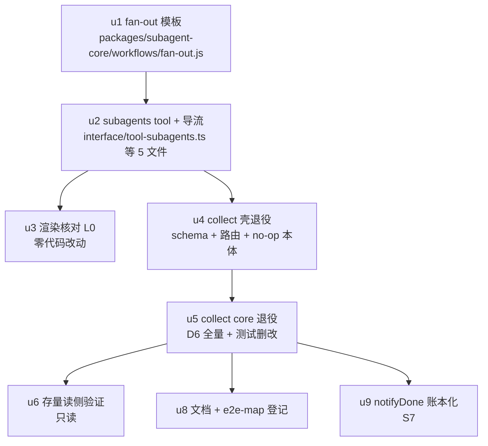

# subagents 批量编排 tool + fan-out 模板 + collect 退役 实施计划

基线: 0c2b313b7 | 来源设计: `.tmp/tech-design/subagents-batch-tool-fanout.md` | 日期: 2026-09-16

对抗式审查证据：`.tmp/tech-design/design-review-20260916-151713.md`（主审）+ `-impact.md`（影响面审）+ `-simplicity.md`（简洁审），经 5 轮修复循环收敛至三份报告 0 must-fix（R5 终轮确认），设计就绪。

## 0 章节映射

| 内容 | 设计文档实际位置 |
|------|------------------|
| 背景/目标 | §1 背景目标（G1/G2/G3 + In/Out of scope） |
| 终态/机制 | §3 解决方案（§3.1 终态、§3.3 D1-D9 关键设计与权衡） |
| 验收场景表 | §4.1 真实场景验收（S1-S7）+ §4.2 e2e 影响面评估 |
| 下一层拆分 | §5 下一层拆分（Phase 1: P1.1-P1.4 / Phase 2: P2.1-P2.4 / Phase 3） |
| 待验证检查点 | §5 待验证检查点（4 项 ⛔ 实施期门） |

## 1 目标快照（逐字摘录设计 §1）

**设计目标**：
1. **G1 采纳**：模型在「N 个独立任务并行」场景下会主动选择批量入口——不需要用户点名，行为与今天爱用 `subagent start` 一致。
2. **G2 可靠**：批量运行有一等实体（runId、状态落盘、status/abort），任一成员失败不炸全局、不吞通知；运行结束主 agent 一次性收到全部结果。
3. **G3 收敛**：`collect:"sync"` 语义与实现完整退役，批量编排只有一个执行管道（runWorkflow），不存在第二套批机制。

**In scope**：`subagents` 批量 tool（schema + handler + 注册 + GUI/TUI 渲染接线）、内置模板 `fan-out.js`、注入面导流文案、collect 全量退役（schema/core/config/测试/文档）、存量数据读侧兼容。

**Out of scope**：`subagent` tool 的 action 拆分（schema 文件自带 TODO option-A，独立后续）、workflow 成员可续聊化（一次性语义维持）、跨 restart 的 run 恢复（D-9 废弃裁决维持）、per-task model 覆盖（无已发生需求）、relay 瞬断杀链的 runtime 修复（独立线，非本设计可及）、`workflow` tool 自身改造、**批量 tool 的依赖编排**（步骤间依赖场景由 workflow 门面的 chain/map-reduce/review-fix-loop 承接，批量 tool 只做独立并行）。

## 2 单元列表

设计 §5 的 Phase 表到 dev unit 的映射：P1.2 与 P1.4 设计要求「同 commit」→ 合并为 u2；P2.4 的测试删改天然分布在 u4/u5（删机制必须同批删改其测试，否则编译红），剩余文档/登记部分独立为 u8；P2.3 为纯验证单元 u6。

| Unit | 职责 | 领地（精确文件路径） | 依赖 | 隔离 | 验收条款 |
|------|------|---------------------|------|------|----------|
| u1-fanout-template (P1.1) | fan-out 模板脚本：@pi-meta 参数面（tasks/agents/aggregate）、agents 数量 fail-fast（>1 且 ≠ tasks.length）、taskIndex 按派发序赋值（不采信成员自报）、summary/fullReportPath 输出 schema、truncated 截断标记、partial 失败语义（allSettled）、lintScript 约束自查 | `packages/subagent-core/workflows/fan-out.js`（新增） | 无（DAG 根；本设计无跨单元新共享类型面，无 u-foundation） | plain | ① 脚本语法过（node --check / lintScript 自查通过）② extensions:typecheck 绿 ③ 参数面与 D4 契约一致（code review 对照 D4 逐条）④ 集成验收随 u2 联调（A1） |
| u2-batch-tool (P1.2+P1.4) | subagents tool：schema（D2 七参数一跳扁平）+ handler 转译 runWorkflow（D3：scriptSource/scriptName 形态参照 tool-workflow.ts:456 先例，reentry guard 共用，返回文案含恢复出口）+ index.ts 注册 + TUI renderCall/Result + slug 缺省 handler 生成 `fan-out-<时间短码>` + 不构造 `details.__gui__` + `WORKFLOW_TOOL_NAMES` 收录（constants.ts）+ 导流文案三处（单数 tool description/guidelines 分工句、subagents description、workflow-list-injector 宿主中立 when/notFor）+ 新增 schema 契约单测 | `extensions/universal/subagent-workflow/src/interface/tool-subagents.ts`（新增）、`extensions/universal/subagent-workflow/src/index.ts`、`extensions/universal/subagent-workflow/src/interface/subagent-tool-schema.ts`（导流句）、`extensions/universal/subagent-workflow/src/injectors/workflow-list-injector.ts`、`packages/shared/src/constants.ts`、`extensions/universal/subagent-workflow/src/interface/__tests__/`（新增测试） | u1 | plain | ① `pnpm extensions:typecheck && pnpm extensions:lint && pnpm extensions:test` 全绿 ② 新增 schema 契约测试断言 tasks required/参数平铺/无 __gui__ 构造 ③ grep 证明 `subagents` 已入 `WORKFLOW_TOOL_NAMES` 且未入 `SUBAGENT_TOOL_NAMES`（D1 裁决）④ 文件头与 `interface/subagents.ts` 互指注释存在 |
| u3-render-check (P1.3) | 渲染归宿核对（预期零代码改动）：L0 代码核对三处消费点（message-turns.ts 并集判定零改、event-interpreter.ts:1011/1014 WORKFLOW 分支零改、Block.vue:434-435 isWorkflow 分支覆盖 subagents → 恒折叠单行 + openWorkflowDrawer）；L3 GUI 截图留档（并入阶段 5 A1 环境）。主 agent 自行执行（纯核对非编码） | 无写入（核对记录落 `.tmp/dev-flow/render-check-u3.md`） | u2 | plain | ① 核对记录含三处消费点 file:line 与行为推演结论 ② 确认 packages/ui、packages/core、packages/runtime 零 diff（git status 佐证）③ GUI 截图在阶段 5 补 |
| u4-collect-shell (P2.1) | collect 壳侧退役：subagent-tool-schema.ts 删 collect 字段、subagent-tool.ts/startHandler 删 collect 解析与路由、core `subagent-service.ts` 删 recoverSyncCollectBatch no-op 本体（extension 侧调用点已随 modeless 波5 摘除）、shell 侧 collect 行为测试随删（subagent-schema-collect.test）、⛔ S5 实施期门：schema 未知字段实测行为（显式报错为裁决偏好，忽略分支则 start description 留「collect removed → use subagents」） | `extensions/universal/subagent-workflow/src/interface/subagent-tool-schema.ts`、`extensions/universal/subagent-workflow/src/interface/subagent-tool.ts`、`packages/subagent-core/src/execution/service/subagent-service.ts`、对应测试文件 | u2（Phase 2 依赖 Phase 1 替代路径就位） | plain | ① extensions:typecheck 绿（collect 引用收敛）② extensions:test 绿 ③ S5 期门实测结论记录进迁移说明素材（写入 u8 输入） |
| u5-collect-core (P2.2) | core 退役（D6 core 行全量，按 `grep -rn "collect\|Collect" packages/subagent-core/src` 全量核对执行）：CollectCoordinator、SyncCollectDomain（域 #5）、E9 convertPendingSyncBufferToAsync、markBatchFinalized 写侧、sync-rebuild.ts、notifyBatch + BatchBudgetParams + sync-batch 幂等键写侧、archiveBatchMembers、config collectSync 节 + DEFAULT_COLLECT_SYNC、全部注入点（subagent-service.ts 两处 getCollectCoordinator getter、chat-rounds.ts:625-627、record-lifecycle.ts:39/84、run-orchestration.ts:150-151/:498-502）；**读侧保留**：batchFinalized entry 容忍解析、session-reader 反查投影不删；测试族：行为测试随删、读侧守卫测试（batch-finalized/rebuild-indexes/permanent-session-legacy-compat）改断言「存量 entry 可读」。**[u4 归属修正并入本单元]** ① core 侧 startHandler collect 解析/路由删除（`assembly/subagent-actions-core.ts:114-122/:374/:396/:412-414`——壳侧纯透传，u4 实测归属错位；S5 结论「pi 静默放行未知字段」下必须与 u5 同批删完才是纯 async 缺省路径）；② u4 遗留 2 处过渡态测试红随测试族删改修复（core `sync-collect-recovery.test.ts` + session-reader `cross-package-subagent-core.test.ts`）；③ `interface/bg-notify-render.ts` 的 batch 分支（extractBatch 死代码——渲染的正是本单元要删的 notifyBatch 形态）删除；④ shell stale 注释 `session-lifecycle.ts:375-376` 清理。删除型单元——机械联动文件数可超 5，以 D6 清单+grep 终扫为准。路径修正：core 服务在本 worktree 实际为 `packages/subagent-core/src/execution/subagent-service.ts` | `packages/subagent-core/src/execution/`（sync-collect-domain.ts、chat-rounds.ts、record-lifecycle.ts、run-orchestration.ts、subagent-service.ts、subagent-actions-core.ts 等）、`packages/subagent-core/src/execution/assembly/`、`packages/subagent-core/src/persistence/`、`packages/subagent-core/src/notify/`、`packages/subagent-core/src/config*`、core 测试（含 sync-collect-recovery.test.ts）、`extensions/universal/session-reader/src/__tests__/cross-package-subagent-core.test.ts`、`extensions/universal/subagent-workflow/src/interface/bg-notify-render.ts`、`extensions/universal/subagent-workflow/src/session-lifecycle.ts` | u4 | plain | ① subagent-core 包 vitest 全绿（含原 2 处过渡态红修复）② `grep -rn "collect\|Collect" packages/subagent-core/src` 仅剩读侧保留面（逐条对照 D6 白名单）③ extensions 三连全绿（session-reader 2 例修复 + 跨包契约测试同步）④ bg-notify-render.ts 无 batch 分支残留（grep extractBatch 零命中） |
| u6-collect-compat (P2.3) | 存量读侧兼容验证（只验证不改）：含 sync 批历史 record（batchFinalized entry）的真实 session 文件经 record-store 重建/读取/session-reader 反查不炸。**样本已定位（u5 期间前置调研）**：`~/.taiji/agent/sessions/--Users-zhushanwen-Code-tai-ji-workspace-feat-optimize-subagent-workflow-bash-tasks--/2026-09-16T03-42-56-924Z_01a0a84f-7d9c-7e36-be25-22b2b5f24be9.jsonl` 与 `~/.taiji/agent/sessions/--Users-zhushanwen-Code-tai-ji-workspace-fix-pending-msg-after-compact--/2026-09-16T05-55-30-247Z_01a0a8c8-d947-7890-ae2c-56581603862c.jsonl`（grep batchFinalized 命中；只读采样，验证脚本须复制到 .tmp 工作，禁触碰真实数据目录——测试红线） | 无写入（验证脚本与样本副本落 `.tmp/dev-flow/`）；若发现读侧强耦合，停下上报（领地外必改禁令） | u5 | plain | ① 验证记录：真实 session 文件路径 + 重建/读取输出 ② ⛔ 期门结论：读侧容忍面成立 / 或强耦合上报裁决 |
| u7 → 并入 u2/u4/u5（P2.4 测试部分）：行为测试族随删、读侧守卫测试随改、structured-output 跨包契约测试对照面同步——不设独立单元，验收条款归 u2 ③ / u4 ② / u5 ①③。 | — | — | — | — |
| u8-collect-docs (P2.4 文档/登记) | 文档同步：`docs/extensions/subagents/architecture.md`（sync-collect-domain 行、结果通知行）、`docs/CONTEXT.md` 或 `docs/extensions/glossary.md`（fan-out 词条登记 + sync 批表述移除）、AGENTS.md 及 `.agents/` skill 中 sync 批提法清扫（grep 全文核对）、迁移说明落地（collect 字段实测行为 + async 无迁移动作 + 忽略分支误读后果）、`docs/testing/e2e-map.json` 登记 S1-S5（R2/R3 态 + 触发条件）过 `select-affected-e2e --check` 门禁 | `docs/extensions/subagents/architecture.md`、`docs/CONTEXT.md`、`docs/extensions/glossary.md`、`AGENTS.md`、`.agents/`（命中文件）、`docs/testing/e2e-map.json` | u5（写终态）+ u4（S5 期门实测结论作迁移说明输入） | plain | ① `node scripts/check-doc-symbol-drift.mjs` 过 ② `node scripts/select-affected-e2e.mjs --check` 过 ③ grep 证明 docs/ 无残留 sync 批活性表述（历史档案豁免按 AGENTS.md 规则 22） |
| u9-notify-ledger (Phase 3) | notifyDone 账本化：helpers.ts notifyDone 路径接 ledger 记账 + courier 送达改造，对齐 C-ext-19（幂等键 + at-least-once + 去重）；ledger 基建落点实施期核实（collect 时代写账先例 notifier.ts BATCH_NOTIFY_ID_PREFIX="sync-batch:" 的机制本体）；S7 登记 e2e-map 随本单元 | `extensions/universal/subagent-workflow/src/interface/helpers.ts` + ledger 基建文件（实施期核实后在此回填） | u5（与 collect 通知机制同域施工，串行避免领地交集；交付序列绑定 Phase 2 见 D7） | plain | ① S7 断连重放验收通过（通知 at-least-once 可达 + 幂等去重不双投递）② helpers.ts g4-allow「待迁移」自注清除 ③ 单测：幂等键去重逻辑（mock 轨） |

## 3 DAG 图

并行度说明：主链 u1→u2→u4→u5 为领地耦合所迫（subagent-tool-schema.ts 被 u2/u4 先后碰、subagent-service.ts 被 u4/u5 先后碰、notify 域被 u5/u9 先后碰）；尾部 u3/u6/u8/u9 四路并行。u9 代码上仅依赖 u2，串行到 u5 后是防 notify 域双 agent 施工的保守选择。

## 4 测试与验收计划

### 4.1 测试命令（来自项目 AGENTS.md / package.json 实读）

- 增量（单元开发期）：`pnpm extensions:typecheck && pnpm extensions:lint && pnpm extensions:test`（extensions/ 三连）；subagent-core vitest 子集从包目录跑（vitest，禁 node:test）；u1 语法自查 `node --check packages/subagent-core/workflows/fan-out.js`
- 全量（阶段 3 尾）：extensions 三连 + subagent-core 全量 vitest + `node scripts/check-doc-symbol-drift.mjs`（docs 触发时）+ pre-commit 全套（lint/hooks）
- 分层遵循 docs/TEST-STRATEGY.md：本设计触及面为 extensions + subagent-core + shared constants，测试落各包 vitest；timer 测试用 fake timers

### 4.2 验收计划表（编译自设计 §4.1，阶段 5 执行依据）

| # | 验收项（场景表行） | 方式(L0-L4) | 成本(1-10) | 收益(1-10) | 组 | 依赖 | 优化判定 |
|---|--------------------|-------------|------------|------------|----|------|----------|
| A1 | S1 pi CLI 真机基本链（双任务计数 → 一条 notifyDone 收齐） | L3 脚本 | 5 | 10 | 核心 | u1,u2 | 可脚本化：pi RPC stdin JSONL 剧本预编译（AGENTS.md 实测惯例命令形态） |
| A2 | S2 三审场景复现（真实 LLM 负载，partial 口径通过 + 成员存活为观察项） | L4 agent | 8 | 9 | 核心 | A1 | 无法降级（需真实 LLM 判断力）；通过标准按 G2 口径防不可归因 |
| A3 | S3 部分失败 + 反向断言（坏 agent 路径 partial；message 拒绝；数量错配 fail-fast） | L3 脚本 | 5 | 9 | 核心 | A1 | 可脚本化（故障注入确定性）；message 拒绝文案与 fail-fast 随 u4/u2 沉淀 mock 单测 |
| A4 | S4 中途停止（abort → aborted 终态 + 无孤儿进程） | L3 脚本 | 4 | 8 | 核心 | A1 | 可合并：与 A1 同剧本环境（派发后立即 abort 分支） |
| A5 | S5 collect 退役回归（存量调用无批副作用 + 旧 session 可读） | L3 脚本 | 4 | 8 | 核心 | u6 | 可脚本化；忽略/报错行为断言随 u4 单测化 |
| A6 | S7 断连重放（relay 瞬断 → 通知 at-least-once 可达 + 幂等去重） | L3 脚本 | 6 | 8 | 核心 | u9 | 可脚本化（断连注入）；幂等去重先行 mock 单测 |
| A7 | S6 采纳率实测（真实会话 jsonl 统计，交付后一周） | L0 grep | 2 | 6 | 非核心 | 交付后 | 时间维度观察项，不入阶段 5；阶梯预案见设计 S6 行 |
| A8 | P1.3 渲染归宿（workflow 块恒折叠 + drawer 成员可见） | L0+L3 | 3 | 7 | 核心 | u2 | L0 部分 = u3 核对清单（主 agent 直跑）；L3 截图并入 A1 环境 |

### 提速结论

可脚本化 4 项（A1/A3/A5/A6，剧本预编译 + 空载串行）；可合并 2 项（A4→A1 同环境、A8 的 L0 部分→u3 主 agent 直跑不派发）；L0 静态守卫清单（项目既有，逐 unit committed 自动过）：`extensions:typecheck` / `extensions:lint` / pre-commit 全套（含 check-doc-symbol-drift、check_pnpm_store_layout、CSP/taste/vue_rules 等）/ `select-affected-e2e --check`（u8 后）。预计派发轮次节省：验证类 4 项收敛为 2 个剧本环境（A1 环境 + A6 环境），A7 延至交付后不占流水线。

### e2e 影响面圈定（开发阶段空载串行，禁止全量扫跑）

**跑（执行时点）**：
- extensions 三连 —— u1/u2/u4/u5/u8 各自 committed 后（受影响面：subagent-workflow shell 测试族、subagent-core orchestration/execution 族、structured-output 跨包契约对照面、shared constants 契约）
- subagent-core 包 vitest（orchestration/execution/notify 子集）—— u1/u5/u9 committed 后
- `node scripts/select-affected-e2e.mjs --base <基线>` 重跑对账 —— 每 unit committed 后
- A1-A6 手测链（S1-S5/S7）—— 所属单元 committed 后、阶段 5 集中执行，空载串行

**不跑（理由）**：
- E2E-ELECTRON-01 / E2E-VISUAL-01 —— 机器对账输出仅此 2 条，均为 CI always 轨（CI 固定环节），非本改动面触发；本次不动 renderer/electron 面
- runtime real-pi 等价池 / TAIJI_PI_LIVE 真机轨 —— 本设计 runtime 零改动（D1 单收录裁决 = message-turns/event-interpreter 消费点只读核实）

**新增登记**：S1-S5（u8，R2/R3 态）与 S7（u9）落 `docs/testing/e2e-map.json`。

**机器对账披露**：基线时点 `git diff main...HEAD` = 0 文件，脚本输出 2 条 always rule（见上「不跑」）；人工清单的 S1-S5/S7 为人工判断新增——判断依据：批量编排是新能力，尚无 e2e 资产登记，登记动作在 u8/u9。实施后每 unit committed 重跑脚本双向对账，差异逐条披露。

## 5 合理偏差登记表

| Unit | 偏差 | 判定 | 处理 |
|------|------|------|------|
| u1 | 验收命令「node --check」对 worker body 形态顶层 return 天然报 Illegal return（既有 5 模板同形态）——用 AsyncFunction 编译 + lintScript + 探针真实执行等价替代 | 合理（工具限制，验证强度不降） | 固化：u1 验证方式以此为准 |
| u1 | aggregate 失败语义设计未明载（D4 只定「末尾一个 agent() 归约」）——延伸为：归约成员失败不炸 run，status 降 partial、outcome.aggregate 携带 {error}，results 照常收口 | 合理（G2「成员失败不炸 run」的直接延伸，测试覆盖） | 固化；设计文档 D4 如需回写由阶段 6 终态同步处理 |
| u1 | meta.phases 用带引号形态（checkPhaseConsistency 声明提取只认带引号字符串，unquoted 会误报 2 条 warning） | 合理（lintScript 解析器约束，YAML 内注释已注明原因） | 固化 |
| u1 | outcome 附带 message 字段（D4 形状未列） | 合理（对齐 parallel.js 既有收口惯例，人类可读摘要行） | 固化 |
| u2 | 领地外机械联动：`src/__tests__/session-lifecycle.test.ts` +5 行 vi.mock(registerSubagentsTool)（该文件 fake pi 无 registerTool，不补 mock 则 3 个既有用例 TypeError） | 合理（纯新增、diff 已核验、可解释归属） | 固化 |
| u2 | 互指注释单向落地（blockers）：`interface/subagents.ts` 反向指针一行需改 u2 领地外文件 | 合理（跨领地协调项） | 转入 u4 领地执行 |
| u2 | D5① 落点：subagent tool 无 promptGuidelines 数组，分工句落 schema description；`subagent-tool.ts` description 的 collect 段与旧「N 并发 start」措辞同步清理 | 合理（延后至 u4 同批，避免同文件双写） | 转入 u4 |
| u2 | D5③ 注入器条目零改动（parseWorkflowMeta 动态扫 @pi-meta，fan-out 自动收录）；`WORKFLOW_LIST_GUIDE` 加 1 句 pi 壳专属 subagents 导流（设计 D5③ 预留槽位；zsw 注入面不照搬该句） | 合理（宿主中立约束只约束模板条目） | 固化 |
| u2 | 返回文案两处收紧：runId 用完整 id（恢复出口/abort 需可复制，设计 `wf-17...` 为省略号写法）；首行批次标签用 effective slug（模型未传时兜底 handler 生成值） | 合理（可操作性提升，不改变契约） | 固化 |
| u2 | slug 空白串（"   "）按「未提供」处理 → 走自动生成 | 合理（设计只定义缺省，空白串边界补全） | 固化 |
| u2 | 观察项（不改码）：pi 工具执行缺省 parallel，同一消息内第二个 subagents/workflow 调用撞共用 reentry guard 返回 REENTRY_BUSY_MESSAGE 而非排队——与既有 workflow tool 同形态；设计未裁决，不擅自加 executionMode | 合理（保持与 workflow tool 行为一致） | 固化 |
| u2 | ⛔ 期门关闭：runWorkflow 同步段毫秒级（唯一 await = store.save），guard 意义 = 并发/重复投递防护 → 保留（与设计 D3 一致） | 期门结论 | 固化；真机墙钟实测入阶段 5 A1 |
| u4 | core 文件路径修正：计划写 `execution/service/subagent-service.ts`，实际 `execution/subagent-service.ts`（grep recoverSyncCollectBatch 唯一定义点） | 合理（计划笔误） | 固化；u5 行已同步修正 |
| u4 | 第二项「startHandler 删 collect 解析与路由」归属错位：壳侧 `subagent-tool.ts` 是纯透传，真实解析/路由在 core `assembly/subagent-actions-core.ts:114-122/:374/:396/:412-414` | 不合理归属（计划编写时未核实落点） | **归属修正并入 u5**（u5 行已更新；S5 静默放行结论下 collect 行为必须与 u5 同批删完） |
| u4 | 测试扩围：整删 `notify-batch-golden.test.ts`（5 用例，shell sync 批通知 golden，主题即 collect）+ `subagent-schema-collect.test.ts` 改造保留（3 条 collect 契约收敛为 1 条退役守卫，镜像同文件 conversation 退役写法） | 合理（随删/随改指令范围，账目闭合：972−5−2=965） | 固化 |
| u4 | schema 删除处保留 3 行 [collect 退役] 注释（对齐同文件 conversation 退役 L91-92 与 core 删除留痕惯例，记录 pi 静默放行事实供迁移期排查） | 合理 | 固化 |
| u4 | `forkFromParam.sourceSubagentId` description 的 collect 子句一并删（'sync-collect members cannot be messaged' 误导性措辞） | 合理（同语义单元） | 固化 |
| u4 | description「Items over budget truncated pointer」由被删 collect 段迁入 After-launch bullet（非 collect 专属——core notifier.ts:316 通用机制，删除会丢失截断取回指引） | 合理 | 固化 |
| u4 | 措辞替换复用 u2 同义句；保留 'CRITICAL — executionMode sequential … SAME message' 句（`subagent-tool-prompt.test.ts` 锁定断言依赖） | 合理（既有测试契约约束） | 固化 |
| u4 | ⛔ S5 期门结论 = **静默忽略分支**：typebox 1.3.7（= pi 0.84.4 钉版）Type.Object 不产 additionalProperties → Value.Check/Compile.Check 对未知字段均 true、不剥除；pi agent-loop.js:402 → pi-ai validation.js:280-299 无约束即透传 → collect 字段原样进 core。迁移素材已备（u4 已按裁决偏好在 start description 留迁移期提示句） | 期门结论（非偏好分支） | 固化；真机确认入阶段 5 A5；u8 迁移说明引用 |
| u4 | 过渡态红点 2 处（core sync-collect-recovery.test.ts ×1、session-reader cross-package-subagent-core.test.ts ×2）：因 recoverSyncCollectBatch 删除，领地外未动 | 合理（跨单元过渡态，归属明确） | **并入 u5 随测试族删改修复**（u5 行已更新） |
| u4 | 领地外死代码 `bg-notify-render.ts` batch 分支（extractBatch，渲染 notifyBatch 形态）无归属 | 计划缺口（领地表未覆盖） | **并入 u5 删除**（u5 行已更新） |
| u6 | 副本路径串改写（D-1）：主文件/manifest 副本中 sessionFile 指针由真实 ~/.taiji 路径改写为临时布局路径（防 session-reader existsSync 泄出读真实数据目录）；保真对照 = 剔除路径串后逐字节全等（113+32 处 span，entry 结构/标记/正文原样） | 合理（红线封闭性要求，数据结构不变） | 固化 |
| u5 | routeRecord/isCollectMember 删除后成功轮通知收敛为 notifyComplete 单通道（与原 async 直通分支逐行等价，失败轮统一走既有 async 失败单发；closeAfterRound 两分支本就同构） | 合理（删 sync 双路后的必然形态，非行为变更） | 固化 |
| u5 | sync-collect-recovery.test.ts 未整删：含非 collect 覆盖面（存量 entry 投影白名单/orphan merge/P-rebuild/P-manifest 不变量）——删 7 批机制用例、改造保留 6 例 | 合理（随删/随改指令） | 固化 |
| u5 | notifier-golden-snapshot 合批 merge 用例保留主体（60s 合批窗口是内核行为、降级形态仍存在），仅删批量渲染锁段；合批 details 降级宿主走 pi 默认渲染兜底 | 合理 | 固化 |
| u5 | rebuild-indexes/legacy-compat 各 1 个 markBatchFinalized 写侧用例改造为存量 manifest 读侧容忍（断言取值以探针实测投影行为为准，非照搬原写侧断言） | 合理（D6 读侧守卫改造授权） | 固化 |
| u5 | entry-only record 不经 store.collectRecords 投影（mergeEntrySourceRecords 刻意收窄 engine==='zcode'）为设计内既有语义，未改 | 合理（既有语义确认） | 固化 |
| u5 | engine/__tests__/conformance/H9-test-disposition.md 提及已删测试文件名 | 合理（历史处置档案当时事实快照，AGENTS.md 规则 22 历史档案不回填） | 固化 |

## 6 状态表

| Unit | 状态 | 轮次 | 证据指针 |
|------|------|------|----------|
| u1-fanout-template | committed | 1 | commit 672f0e6c3；vitest 49 passed（fan-out-script 19 + builtin-workflows-structure 30）；extensions:typecheck+lint exit=0；契约抽验（fail-fast L81 / taskIndex 派发序 L117-134 / truncated 保序 L185-216） |
| u2-batch-tool | committed | 1 | commit fce282acf；vitest 80 文件/972 passed（重跑核验一致）；typecheck+lint exit=0；契约抽验（schema 平铺 L59-76 / 无 __gui__ L102 / ONE notification+SINGLE status L146-147 / reentry 共用 L255,300 / slug 生成 L127） |
| u3-render-check | committed | 1 | 核对记录 `.tmp/dev-flow/render-check-u3.md`；三处消费点零改核实（message-turns.ts:699-701 / event-interpreter.ts:1011-1016 / Block.vue:434-435+L99-121 模板区）；三包零 diff 佐证；附带发现（Block.vue:96 注释漂移）登记待阶段 3 |
| u4-collect-shell | committed | 1 | commit 014721b1b；shell 包 79 文件/965 passed（重跑核验一致，对账 972−5golden−2schema=965 闭合）；typecheck/lint exit=0；红点核验：core sync-collect-recovery.test.ts 1 failed 确认红因（recoverSyncCollectBatch not a function）→ 归 u5；S5 期门结论 = 静默忽略分支（证据链 typebox 探针 + pi-ai validation.js:280-299） |
| u5-collect-core | committed | 2（首任限流零产出 + 接替完成） | commit 3da148eb7；42 文件 +433/−4126；重跑核验 core 3037/0 失败、shell 964/0、session-reader 407/0（u4 遗留 2 例修复确认）；grep 终扫三类剩余（非 collect 英文动词/读侧保留面/留痕注释，4 处命中抽验均为 [collect 退役] 注释）；extractBatch 零命中；notify-ledger.ts 幸存确认 |
| u6-collect-compat | committed | 1 | 验证记录 `.tmp/dev-flow/collect-compat-u6.md` + 脚本 u6-verify-collect-compat.mts（保留供阶段 5 复验）；⛔ 期门通过：真实存量样本（24 处 + 8 处 batchFinalized）三项验证 24/24 断言过——record-store 重建容忍 / session-reader 反查（result 单查+批量）/ initSession 恢复全链；仓库源码零改动，D6 无需回改 |
| u8-collect-docs | pending | 0 | — |
| u9-notify-ledger | pending | 0 | — |

## 7 残留风险与变更历史

**残留风险**：
1. ~~u9 ledger 基建落点未定~~ **已解除（u5 期间前置调研）**：基建本体 = `packages/subagent-core/src/execution/notify/notify-ledger.ts`（NotifyLedger API：record/attemptDeliver/checkReceipts/recoverFromSession/compactionCheck/pendingCount；NotifyLedgerHost 注入：appendLedgerEntry/readSessionEntries/isIdle/onAgentSettled/sendDelivery；装配点 bindNotifyLedgerHost）——四步生命周期「写账 → courier 边沿投递 → 回执销账 → notifyId 幂等重放」。u9 = notifyDone 路径（shell helpers.ts 裸 steer）接这套既有生命周期；u5 完成后核对 notify-ledger.ts 幸存状态再派 u9
2. ⛔ 4 项实施期门（设计 §5）：S5 schema 未知字段行为（u4）、runWorkflow 同步段时长/reentry guard（u2）、通知体积 6×500 字截断标记（u1/u2 联调）、存量 entry 读侧容忍（u6）——各项失败分支设计已给（显式报错裁决偏好 / guard 倾向保留 / 收紧 summary 指引 / 强耦合上报回改 D6）
3. u5 删除型单元机械联动文件数超 5（全局经验值约束）——按 D6 清单 + grep 终扫控制范围，行数净减，风险可控
4. run-spec.ts「≤20 字符」注释与 SLUG_MAX_LENGTH=35 既有不一致——实施期登记不扩大处理（设计 P1.2 裁决）

**变更历史**：
- 2026-09-16 v1：初版计划，基于三审 5 轮收敛的设计文档（design-review-20260916-151713 三报告）
- 2026-09-16 v2：u1/u2/u3/u4 committed；u4 归属修正（core collect 路由并入 u5）；S5 期门结论 = 静默忽略分支；ledger 基建落点核实（风险 #1 解除）；u6 样本定位
- 2026-09-16 v3：u5 首任 dev 因 provider 限流中断（运行 64min，零产出，工作区干净）——按接替程序补派新 dev 从零执行（前任无可附证据包），轮次 +1
