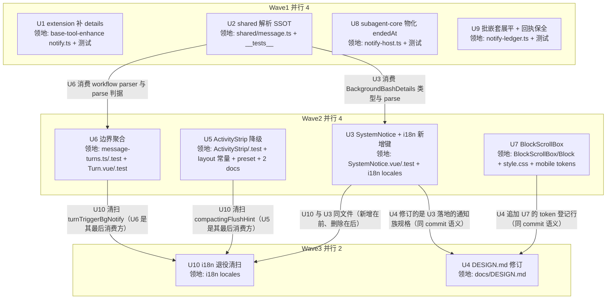

# 对话流系统通知渲染升级 实施计划

基线: 9ab0a122b（本计划 commit） | 来源设计: `.tmp/tech-design/system-notice-rendering-upgrade.md`（R9 终版） | 日期: 2026-09-16

## 0 章节映射

| 内容 | 本文实际位置 |
|------|--------------|
| 背景/目标 | §1 背景目标（SCQA + G1-G5 + In/Out-of-scope） |
| 终态/机制 | §3 解决方案（§3.1 终态使用者视角 / §3.2 多方案对比 / §3.3 关键决策 D1-D7） |
| 验收场景表 | §4 验收（S1-S8 场景表 + e2e 影响面评估段） |
| 下一层拆分 | §5 下一层拆分（U1-U9 单元表 + 文件改动地图） |
| 待验证检查点 | §5 待验证检查点（1-6） |
| 对抗式审查报告（must_fix==0） | `.tmp/tech-design/design-review-r8-20260916.md` / `-impact.md` / `-simplicity.md`（历史 r1-r7 同目录保留） |

## 1 目标快照

**背景（逐字摘录 §1 SCQA）**：太极是 AI Agent 桌面工作台，对话流是用户观察 agent 工作的主界面。**C** 高负载 session（并发后台任务 + 长 thinking + 大输出）实测：4 条系统通知中 2 条信息残缺（background-bash 原文 `[background-bash] bt-3 finished (exit 0, 3m12s): pnpm test` 上屏；「后台任务完成 · 已继续处理」不说是哪个任务、成败、耗时），1 条形态违例（压缩中通栏 accent 带，DESIGN.md 通知族二分明确「压缩中提示」属横线分隔行），且 thinking/bash 展开无高度限制，一次长输出把对话流顶穿。**Q** 用户无法从系统通知快速读取「什么完成了、成功没有、花了多久」，回看历史时被超长展开块打断。**A** 按用户已裁决的方案一增强版落地：通知族统一为语义化横线分隔行（主文案加粗提色 + 分割线显化），background-bash 经 extension details 结构化，bg-notify 边界聚合出计数/成败/耗时，展开块统一块内滚动。

**设计目标**：
1. **G1 通知信息完整**：4 条通知各自说清「主体 + 结果 + 关键数字」——background-bash 显示命令 + exit + 耗时；bg-notify 边界显示任务计数 + 成败 + 总耗时；压缩显示 tokens 钉右。
2. **G2 形态归一**：4 条通知全部落 DESIGN.md 通知族二分的「横线分隔行」族（静态元信息，无可交互入口），压缩中通栏带降级回归该族。
3. **G3 可读性增强**：按用户裁决增强——分割线 hairline(0.05) → border-strong(0.13) 两端渐隐、主文案 text-xs/mid/400 → text-sm/fg/550、图标 13px/stroke 2.2，并同 commit 修订 DESIGN.md 规格行。
4. **G4 数据链拉直**：background-bash 结构化走「extension details → 既有 details 透传管道 → shared 单点防御解析」，content 原文保留给 LLM，旧数据无 details 降级原文，零解析破窗。
5. **G5 展开块不撑爆对话流**：thinking / bash / 工具输出展开统一 240px 块内滚动（渐隐提示 + 行数信息条 + 展开全部逃生口 + streaming 自动吸底 + bash 命令头吸顶）。

**Out-of-scope（逐字摘录 §1）**：
- **todo/goal widget pill 形态变更与入流**——pill 现状可用，是否入流待用户另行裁决；本设计零触碰。
- **通知的可交互化**（点击查看完整输出/托盘面板）——可交互即被 DESIGN.md 通知族二分踢出横线分隔行族（转入通知卡片族），与 G2 冲突；留待后续单独设计。
- **`!` bash 气泡（BashOutputBlock）重构**——其 `--bash-output-max-height: 240px` 限高已存在，本设计只统一 trace 区展开块。
- **ForkNotice / RespawnNoticeBar / TurnProgressBar / QueueBubble**——分属通知卡片族 / warn 卡 / composer 域，不属本次 4 条通知范围。
- **workflow-result 的耗时提取**——其 details 无时间字段，本期耗时只由 subagent-bg-notify 记录贡献；成败提取已在范围内（details.reason 为 DoneReason 枚举）。

## 2 单元列表

| Unit | 职责 | 领地（精确文件路径） | 依赖 | 隔离 | 验收条款 |
|------|------|---------------------|------|------|----------|
| **U1** extension 补 details | `buildNotifyDetails()` 挂进 sendMessage（schema 按 D1：必需 taskId/command/durationMs/endReason + 可空 exitCode；endReason 收敛 natural\|timeout） | `extensions/universal/base-tool-enhance/src/background/notify.ts`、`extensions/universal/base-tool-enhance/src/__tests__/notify.test.ts` | 无 | plain | `pnpm extensions:typecheck && pnpm extensions:test` 绿；单测覆盖 natural/timeout 两形态 details 五字段值与 task 终态一致 |
| **U2** shared 解析 SSOT | `BackgroundBashDetails` 类型 + `parseBackgroundBashDetails()`（必需/可空划分按 D1）+ workflow-result 防御解析（必需 runId（缺失→消息级 null）+ reason（缺失/词表外→记录级 neutral），词表对齐 shared WorkflowDoneReason 镜像） | `packages/shared/src/message.ts`、`packages/shared/__tests__/`（message 族测试） | 无 | plain | `pnpm --filter @taiji/shared test`（或包内 vitest）绿；防御矩阵（null/非对象/缺字段/类型错/正常）+ workflow reason 词表用例 |
| **U3** SystemNotice 增强重构 + 分支 + i18n 新增键 | D3 规格全量落地 + background-bash 分支（D2 降级链）+ compaction 文案/tokens 拆分钉右；i18n 新增键一次加齐：`turnTriggerBgNotifySummary` / `turnTriggerBgNotifyContinued` / `compactingQueueChip` / background-bash「后台」chip 键；改写 `panel.message.compacted` 与 `compactedTokens`（tokens 拆分钉右）；旧键暂留（U10 退役） | `packages/ui/src/features/chat/SystemNotice.vue`、`packages/ui/src/features/chat/__tests__/SystemNotice.test.ts`、`packages/renderer/src/i18n/locales/zh-CN/panel.ts`、`packages/renderer/src/i18n/locales/en-US/panel.ts` | U2（类型/解析） | plain | 组件测试绿（background-bash 三分支渲染断言：结构化行 / 原文兜底 / 压缩 tokens 钉右）；`pnpm --filter @taiji/ui test` + renderer 测试绿；S1/S2/S4 后半的组件级断言 |
| **U4** DESIGN.md 规格行修订 | §6.1 通知族二分表「横线分隔行」样式列按 D3 表重写 + §4.7 组件尺寸 token 登记行追加 `--block-scroll-max-height` | `docs/DESIGN.md` | U3、U7（同 commit 语义） | plain | 实施期人工核对：两处与 D3 表/token 值逐项一致（`check-doc-symbol-drift` 未登记 DESIGN.md 不覆盖本项） |
| **U5** ActivityStrip 压缩中降级 | compacting 行改 spinner 分隔行 + 待发 chip（用 U3 新增的 `compactingQueueChip`）；bash/thinking/settling 行同步 D3 规格；`COMPACTING_NOTICE_HEIGHT` / `EXECUTING_BASH_NOTICE_HEIGHT` 两常量重测回写；compact-defer 文档十处命中面同步（标题 L1 / 头部基线声明（死链修正 docs/assets + 活动带部分改指 DESIGN.md §6.1）/ §1.2 / §1.3 / §2.1 L45 / §2.2 标题与正文 / §2.3 i18n 表 / §3 A3/A4/A9 / §4 u3 行 / 变更历史；L11/L50 豁免）+ 资产活动带形态标注失效 + `tailwind-preset.ts` content-col 清单恢复 ActivityStrip（校准注释计数） | `packages/renderer/src/components/panel/message-stream/ActivityStrip.vue`、`packages/renderer/src/components/panel/message-stream/__tests__/ActivityStrip.test.ts`、`packages/renderer/src/composables/panel/message-stream-layout.ts`、`packages/shared/src/tailwind-preset.ts`、`docs/architecture/compact-defer-composer-queue.md`、`docs/assets/compact-defer-queue-spec.html` | 无（规格表在文档） | plain | ActivityStrip 测试绿（compacting 行新结构断言、band 用例改写、常量断言）；`pnpm --filter @taiji/renderer test` 绿；S4 前半组件级 |
| **U6** bg-notify 边界聚合 | `TurnGroup.hiddenNotifies` 载体 + groupRenderInput 规则 2 压入 + `notifySummary` 派生归一本函数（count 按 record.id 去重取 round 最大者 / failedCount 去重后 / neutralCount（含 workflow 解析）/ durationMs 去重后含值记录 + endedAt≥startedAt 守卫；判据 = status 分派（done/failed/cancelled）+ running/closed 走 `deriveClosedDisplay`）+ `turnSignature` 纳入 hiddenNotifies + 两构造点（`reuseOrRebuildTurn` / 全量 `toRenderItems`）均携带 + `isEmptyTurn` 不纳入；`Turn.vue` trigger 行重写（图标三态/计数/点列三色/耗时）+ i18n 键引用（Summary/Continued） | `packages/core/src/domain/chat/message-turns.ts`、`packages/core/src/domain/chat/__tests__/message-turns*.test.ts`、`packages/ui/src/features/chat/Turn.vue`、`packages/ui/src/features/chat/__tests__/Turn.test.ts`、`packages/renderer/src/__tests__/composables/message-turns.test.ts` | U2（workflow parser） | plain | 分组测试五条绿（累积 / 缓存复用路径 / batch 展开（含嵌套展平后）/ 无填充折叠不变 / id 去重与三态判据（含级联关闭、round 缺失失败载荷、混合组耗时聚合））；`pnpm --filter @taiji/core test` + `@taiji/ui` + renderer 绿；等价性测试无新差异类（`apply-entry-equivalence` / `custom-start-equivalence`） |
| **U7** BlockScrollBox 块内滚动 | 新组件 `BlockScrollBox.vue`（限高 240px + 渐隐 + 信息条 from–to + 展开全部/收起 + streaming 吸底）+ Block.vue 三处接入（thinking / bash 输出（命令头保持滚动区外）/ 非 bash 工具输出）+ `max-h-80` 删除 + `--block-scroll-max-height` token（style.css + mobile tokens.css 镜像） | `packages/ui/src/features/chat/BlockScrollBox.vue`（新）、`packages/ui/src/features/chat/Block.vue`、`packages/ui/src/features/chat/__tests__/BlockScrollBox.test.ts`（新）、`packages/renderer/src/style.css`、`packages/mobile-renderer/src/styles/tokens.css` | 无 | plain | jsdom 行为测试（限高/渐隐 class/展开切换/信息条行数）+ `@taiji/ui` 测试绿；探针 P1/P2 实施期执行并回写（P1 行数注释 / P2 抖动判定） |
| **U8** subagent-core 物化 endedAt | `toNotifyRecord` 物化域 = running 轮终 + 批成员（`endedAt: snap.endedAt ?? Date.now()`）；归档不合成（原值透传）；legacyClosed 保持原值 | `packages/subagent-core/src/execution/notify/notify-host.ts`、其 `__tests__` | 无 | plain | `pnpm --filter @taiji/subagent-core test` 绿；单测断言 running/批成员含 endedAt、归档不合成（原值透传） |
| **U9** 批嵌套展平 + 回执身份保全 | `mergeItems` 批量分支展平一层（wrapper → 成员 spread 进外层）且展平成员补 wrapper 顶层 notifyId（回执不变量）；content join 不变 | `packages/subagent-core/src/execution/notify/notify-ledger.ts`、其 `__tests__` | 无 | plain | 单测三条绿：两 sync 批合并 → 载荷单层；全部成员带批 notifyId；`fireSettled` 后账目销账 |
| **U10** i18n 退役清扫（尾单元） | 退役键清扫：`turnTriggerBgNotify`（消费方 `Turn.vue` U6 改完）/ `compactingFlushHint`（消费方 `ActivityStrip.vue` U5 改完）——zh+en 双侧删除；grep 验证零残留消费方 | `packages/renderer/src/i18n/locales/zh-CN/panel.ts`、`packages/renderer/src/i18n/locales/en-US/panel.ts` | U3（同文件串行）、U5、U6（消费方改完） | plain | `check_i18n_locale_sync.py` / `check_i18n_cjk.py` 绿（pre-commit 触发）；全仓 grep `turnTriggerBgNotify'` / `compactingFlushHint` 仅剩历史语（无 t() 调用） |

> u-foundation 说明：本任务共享契约面 = `packages/shared/src/message.ts`（U2 的解析 SSOT）与 i18n 文件（U3 集中新增 / U10 集中退役）——已按「共享接线点集中律」独立成单元并串行先行（U2 为 DAG 根；i18n 由 U3 独占新增、U10 独占删除），无并行单元同时编辑共享文件。

## 3 DAG 图

## 4 测试与验收计划

### 4.1 测试命令（从项目 AGENTS.md / package.json 真实读取）

- **扩展包三连**：`pnpm extensions:typecheck && pnpm extensions:lint && pnpm extensions:test`
- **单包测试**（从子包目录）：`pnpm --filter @taiji/shared test` / `@taiji/core test` / `@taiji/ui test` / `@taiji/renderer test` / `@taiji/subagent-core test`（vitest，配置在各子包 vitest.config.ts）
- **L0 静态**：`pnpm run lint`、`node scripts/check-doc-symbol-drift.mjs`、`.githooks/check_i18n_locale_sync.py` + `check_i18n_cjk.py`（staged locales 触发）、`node scripts/validate-constraints.mjs`
- **全量（阶段 3 尾）**：`pnpm run lint` + 全 workspace 测试 + extensions 三连（PR/merge 门禁口径，unit 轨）
- **e2e（开发期按圈定清单）**：见 4.3

### 4.2 增量与全量

- 增量（单元开发期）：各单元领地对口单包 vitest + extensions 三连（U1/U2）+ `pnpm run lint`
- 全量（阶段 3）：项目收尾全量 — `pnpm run lint` + 全部包 vitest + extensions 三连

### 4.3 验收计划表

| # | 验收项（场景表行） | 方式 | 成本(1-10) | 收益(1-10) | 组 | 依赖 | 优化判定 |
|---|--------------------|------|------------|------------|----|------|----------|
| A1 | S1 background-bash 结构化（含重开一致） | L4 agent（`TAIJI_DEV_BACKGROUND=1 pnpm dev` + browser-automation CDP） | 7 | 9 | 核心 | - | 无法降级（真实 pi + 视觉）；与 A4/A5/A6/A8 同 session 合并执行 |
| A2 | S2 旧数据降级（无 details → 原文行） | L1 单测（U3 组件测试已覆盖）+ L4 抽查 | 4 | 6 | 核心 | A1 | 可单测化（U3 已落）；L4 只抽查一次 |
| A3 | S3 边界聚合（批量合批仍计 2 / 真实轮失败 / 归档不双计 / 跨组收起 / 多轮同 id） | L1 分组测试（U6 五条）+ L4 主场景 | 6 | 9 | 核心 | - | 分组单测承接判据分支（存量 0 实例三族）；L4 只验主场景两拓扑 |
| A4 | S4 压缩两态（压缩中 spinner 行 + 待发 chip；完成后 tokens 钉右） | L4（与 A1 同 session） | 5 | 8 | 核心 | A1 | 可合并（同 session 操作序列） |
| A5 | S5 块内滚动（240px / 命令头恒吸顶 / 渐隐 / 信息条 / 展开全部 / streaming 吸底） | L4 交互（browser-automation 滚动 + 截图） | 7 | 9 | 核心 | - | 可合并（同 dev 实例）；jsdom 行为测试承接静态断言 |
| A6 | S6 视觉对照（demo 并排 + 族外成员抽查） | L4 视觉（browser-automation 截图 + 视觉模型 subagent 对照） | 6 | 7 | 非核心 | A1,A4,A5 | 合并到 A1/A4/A5 的截图批次 |
| A7 | S7 回归零破窗 | L0+L1+L2（lint + 受影响包 vitest + extensions 三连 + 守卫脚本） | 3 | 8 | 核心 | 全部单元 | 阶段 3 全量测试承接 |
| A8 | S8 SubagentTab drawer 复用核对（窄宽） | L4（与 A5 同次） | 3 | 4 | 非核心 | A5 | 可合并 |

**提速结论**：可降级 1 项（A2 → L1 单测承接，L4 仅抽查）；可合并 4 项（A1+A4+A6+A8 同 dev 实例 session；A5 同实例交互序列）；可脚本化/单测化 3 项（A2/A3 判据分支、A5 静态行为落 U3/U6/U7 单测）；L0 静态守卫清单：`taste-lint`（no-native-html / no-emoji / prefer-v-model）、`vue_rules_checker.py`、`check_i18n_locale_sync.py`、`check_i18n_cjk.py`、`check-doc-symbol-drift.mjs`、`validate-constraints.mjs`、`check_css_token_ssot.py`（不拦 §4.7，人工纪律）、`check-layout-literals.mjs` / `check-scroll-follow.mjs`（扫描面不含新写法，已核）。预计节省派发轮次 ≈4（L4 从 8 项收敛为 3 个 session 批次）。

**e2e 影响面圈定**（继承设计文档 §4 e2e 影响面评估 + 机器对账）：

| e2e 资产 | 触发 | 处置 | 执行时点 |
|----------|------|------|----------|
| E2E-ELECTRON-01（L1 always，P0 smoke） | always | 跑 | 阶段 5（空载串行） |
| E2E-VISUAL-01（L1 always，像素轨） | always | 跑 | 阶段 5（空载串行；chat 通知面无 pixel 基线，人工对照承接） |
| E2E-MOCK-01（L2 on-diff electron 全量轨） | on-diff（renderer/core scope 命中） | 跑 | 阶段 5（空载串行） |
| E2E-REAL-01（L2 on-diff real 轨） | on-diff（同 scope） | 跑 | 阶段 5（空载串行） |
| E2E-EQUIV-01（L2.5 on-diff 等价性） | on-diff（core/domain/chat 命中） | 跑（`TAIJI_SKIP_REAL_PI=1` mock 轨） | U6 committed 后 |
| 真实 LLM（L3）资产 | 无 | 不跑（L3 rule 均 on-pi-bump 触发，本改动不涉） | - |

**机器对账（`node scripts/select-affected-e2e.mjs --base main`，计划期实跑）**：当前 diff 为空 → 输出 2 条 always（ELECTRON-01 / VISUAL-01）。差异披露：人工清单比机器多 3 条（MOCK-01 / REAL-01 / EQUIV-01）——均为 on-diff 规则，实现落地后（diff 非空）将命中，与设计文档预期 5 条一致；机器输出无人工清单外项。对账通过。

### 4.4 待验证检查点承接（设计 §5）

| 检查点 | 承接单元/阶段 |
|--------|---------------|
| 1. 两常量实施期量取回写 | U5（dev 断言实测） |
| 2. 探针 P1（240px 实际行数回写注释） | U7 + 阶段 5 |
| 3. 探针 P2（virtua 高度突变零抖动判定） | U7 + 阶段 5 |
| 4. 跨表面一致性抽查（有实例时） | 阶段 5 |
| 5. chat 视觉验收（S6+S8） | 阶段 5（A6/A8） |
| 6. 存量嵌套载荷扫描（判据 `details.batch===true && items.some(i=>i.batch===true)`） | 阶段 5 |

## 5 合理偏差登记表

（初始为空；执行期登记）

| # | 单元 | 设计原文 | 实现实际 | 分类 | 处置 |
|---|------|----------|----------|------|------|
| | | | | | |

## 6 状态表

| Unit | 状态(pending/in-progress/committed/blocked) | 轮次 | 证据指针 |
|------|--------------------------------------------|------|----------|
| U1 | pending | 0 | - |
| U2 | pending | 0 | - |
| U3 | pending | 0 | - |
| U4 | pending | 0 | - |
| U5 | pending | 0 | - |
| U6 | pending | 0 | - |
| U7 | pending | 0 | - |
| U8 | pending | 0 | - |
| U9 | pending | 0 | - |
| U10 | pending | 0 | - |

## 7 残留风险与变更历史

**残留风险**：
- U7 探针 P2（virtua RO 抖动）设计期未实测——若抖动需降级手动 scrollIntoView 并回写设计决策（U7 执行期落定）。
- U6 的 `deriveClosedDisplay` 复用引入 core → shared 的新 import（已核依赖方向干净，C-state-04）。
- U5 的两常量实测值依赖 D3 规格落地后的真实渲染高度（dev 断言实测校准）。

**变更历史**：
- 2026-09-16 初版（基线 commit：9ab0a122b）：从设计文档 R9 终版编译；e2e 对账完成（2 always + 3 on-diff 待命中）。
