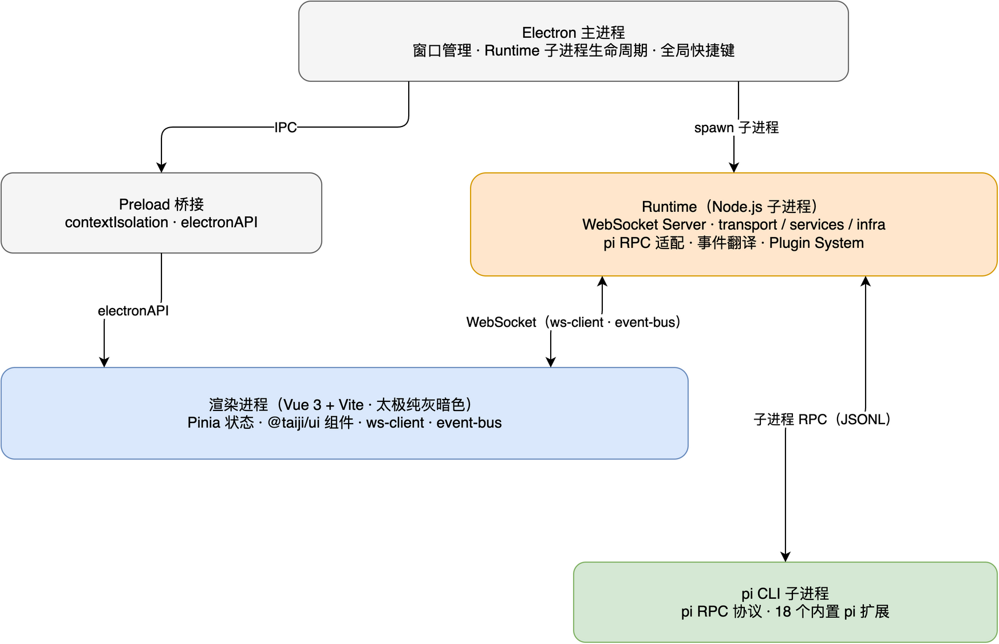

<p align="center"></p>

<h1 align="center">TaiJi</h1>

<p align="center"><strong>An AI Agent desktop workbench for long-running, multi-task collaboration</strong></p>

<p align="center">
  <a href="README.md">简体中文</a> | <a href="README_EN.md">English</a> | <a href="https://github.com/zhushanwen321/tai-ji/releases">Download</a>
</p>

An AI Agent desktop workbench (macOS / Windows / Linux) built on an Electron + Vue 3 + Node.js Runtime architecture. It communicates with all kinds of AI Agents over the child-process RPC protocol of [pi](https://github.com/badlogic/pi-mono) (npm package `@earendil-works/pi-coding-agent`), providing multi-session management, dual-Panel split view, subagent/workflow orchestration, goal-driven autonomous loops, and scheduled tasks. 18 Agent extensions ship bundled with the app, ready out of the box.

<p align="center">
  
</p>

> For development conventions, key rules, and debugging discipline, see [AGENTS.md](AGENTS.md).

## Installation

Current latest version: **v0.10.0** ([view all releases](https://github.com/zhushanwen321/tai-ji/releases)). After installation, the app automatically checks for new versions and offers a one-click upgrade.

<!-- INSTALL:BEGIN -->
<!-- Version numbers inside this block are replaced automatically by .agents/skills/merge/scripts/update-readme-install.mjs after each official release; version numbers outside the block are left untouched. -->

### Mainland China download (GitCode mirror, measured at ~15 MB/s over direct domestic connections)

Mirror repository: [gitcode.com/qq_18433817/tai-ji](https://gitcode.com/qq_18433817/tai-ji)

#### macOS (Apple Silicon)

```bash
# Download and open the DMG (or download it from the Releases page in a browser and install by double-clicking)
curl -L https://gitcode.com/qq_18433817/tai-ji/releases/download/v0.10.0/TaiJi-0.10.0-mac-arm64.dmg -o /tmp/TaiJi.dmg \
  && open /tmp/TaiJi.dmg

# If the app is reported as "damaged" or "cannot verify the developer" on launch, run (usually unnecessary for curl downloads, needed for browser downloads):
# xattr -cr /Applications/TaiJi.app
```

#### Linux

```bash
# Download the AppImage, make it executable, and launch it
curl -L https://gitcode.com/qq_18433817/tai-ji/releases/download/v0.10.0/TaiJi-0.10.0-x86_64.AppImage -o ~/TaiJi.AppImage \
  && chmod +x ~/TaiJi.AppImage \
  && ~/TaiJi.AppImage
```

#### Windows

```powershell
# PowerShell (recommended; avoids the parameter conflicts caused by curl being an alias in PowerShell)
Invoke-WebRequest -Uri "https://gitcode.com/qq_18433817/tai-ji/releases/download/v0.10.0/TaiJi-0.10.0-setup-x64.exe" -OutFile "$env:TEMP\TaiJi-setup.exe" -UseBasicParsing; & "$env:TEMP\TaiJi-setup.exe"

# Command Prompt / cmd.exe (uses the system-bundled curl.exe, included by default since Windows 10 1803+):
# curl -L https://gitcode.com/qq_18433817/tai-ji/releases/download/v0.10.0/TaiJi-0.10.0-setup-x64.exe -o "%TEMP%\TaiJi-setup.exe" && "%TEMP%\TaiJi-setup.exe"
```

### International download (GitHub)

Repository: [github.com/zhushanwen321/tai-ji](https://github.com/zhushanwen321/tai-ji)

#### macOS (Apple Silicon)

```bash
# Download and open the DMG
curl -L https://github.com/zhushanwen321/tai-ji/releases/download/v0.10.0/TaiJi-0.10.0-mac-arm64.dmg -o /tmp/TaiJi.dmg \
  && open /tmp/TaiJi.dmg

# If the app is reported as "damaged" or "cannot verify the developer" on launch, run (usually unnecessary for curl downloads, needed for browser downloads):
# xattr -cr /Applications/TaiJi.app
```

#### Linux

```bash
# Download the AppImage, make it executable, and launch it
curl -L https://github.com/zhushanwen321/tai-ji/releases/download/v0.10.0/TaiJi-0.10.0-x86_64.AppImage -o ~/TaiJi.AppImage \
  && chmod +x ~/TaiJi.AppImage \
  && ~/TaiJi.AppImage
```

#### Windows

```powershell
# PowerShell
Invoke-WebRequest -Uri "https://github.com/zhushanwen321/tai-ji/releases/download/v0.10.0/TaiJi-0.10.0-setup-x64.exe" -OutFile "$env:TEMP\TaiJi-setup.exe" -UseBasicParsing; & "$env:TEMP\TaiJi-setup.exe"

# Command Prompt / cmd.exe (uses the system-bundled curl.exe, included by default since Windows 10 1803+):
# curl -L https://github.com/zhushanwen321/tai-ji/releases/download/v0.10.0/TaiJi-0.10.0-setup-x64.exe -o "%TEMP%\TaiJi-setup.exe" && "%TEMP%\TaiJi-setup.exe"
```

<!-- INSTALL:END -->

---

## Core Capabilities

### Sessions & Workbench

- **Multi-session management** — session list in the sidebar, ⌘/Ctrl+N to create; session tree branching (fork / clone) is a native pi capability, letting you branch from any assistant message (⌘/Ctrl+G fork, ⌘/Ctrl+⇧+G fork mode, ⌘/Ctrl+J handoff)
- **Dual-Panel split view** — a single Panel is the default state; opening a second session splits the view. Focus mode is supported to concentrate on the current session
- **Overview** — a standalone bird's-eye view across sessions (card grid + filtering + background agent aggregation)
- **Global efficiency entry points** — ⌘/Ctrl+K global search, ⌘/Ctrl+I import session, ⌘/Ctrl+B collapse sidebar, ⌘/Ctrl+, settings, ⌘/Ctrl+[ ] session back/forward, ⌘/Ctrl+⇧+P preset switching; all shortcuts can be remapped in settings

### Conversation Flow

- **Streaming rendering** — incremental markdown rendering, turn collapsing, thinking block expand/collapse
- **GUI widget panels** — todo / goal and similar state render as dedicated widget panels with a unified meta header row (title, status dot, N/M progress, mini progress bar); Agent-side state syncs to the presentation layer over a single channel
- **Structured interaction** — ask-user multi-question structured input (split-pane preview + inline editing), structured output validated by JSON Schema

### Files / Terminal / Git

- **File tree** — virtualized rendering (flattened visible rows) that stays smooth on large repositories; file status badges and line counts
- **Terminal** — command-style buffer rendering, versioned replay, session-level persistent partitions
- **Git** — branch and change status display; worktree create/switch/cleanup

### Models & Settings

- **Provider management** — multi-provider configuration, built-in provider catalog, API key management
- **Quota display** — usage quota queries per provider / model
- **Settings center** — full-screen overlay covering 12 menu domains: provider / appearance / skills / agent / extensions / system prompt / terminal / presets / worktree / updates / system / usage
- **Auto update** — periodic checks for new versions; after confirmation the app restarts to upgrade. Release Notes are bilingual (English / Chinese)

## pi Extensions

TaiJi's Agent capabilities are implemented through the pi extension mechanism; source lives in [`extensions/`](extensions/) (21 `@zhushanwen/pi-*` packages + the `shared/` library), 18 of which ship bundled with the app, ready out of the box. The following 16 extensions are self-sufficient and usable standalone outside taiji (all published to npm, or loadable via `--extension`):

| Extension | Purpose |
|------|------|
| [`pi-subagent-workflow`](extensions/universal/subagent-workflow/README.md) | Unified subagent execution + multi-agent workflow orchestration (stateful workflows such as parallel / chain) |
| [`pi-goal`](extensions/universal/goal/README.md) | `/goal` persistent goal-driven autonomous loop with evidence-based acceptance |
| [`pi-todo`](extensions/universal/todo/README.md) | AI-driven todo list (session persistence + `/todos`) |
| [`pi-ask-user`](extensions/universal/ask-user/README.md) | Structured multi-question input (split-pane preview + inline editing) |
| [`pi-permission`](extensions/universal/permission/README.md) | Four permission modes (yolo / auto / approve / strict) + approval pipeline |
| [`pi-scheduler`](extensions/universal/scheduler/README.md) | Scheduled task scheduling (cron / interval, once / recurring) |
| [`pi-session-reader`](extensions/universal/session-reader/README.md) | Read / query session history (trees, family, execution tree, search, export) |
| [`pi-session-manager`](extensions/universal/session-manager/README.md) | Agent-managed child sessions (create / send / history / status / list / abort) |
| [`pi-rename-session`](extensions/universal/rename-session/README.md) | Auto-generate session titles after the first conversation round |
| [`pi-smart-context`](extensions/universal/smart-context/README.md) | Agent-driven context compaction (compact_context tool + dual-mode summary takeover + tiered reminders) |
| [`pi-structured-output`](extensions/universal/structured-output/README.md) | Structured output (JSON Schema + Ajv validation) |
| [`pi-pending-notifications`](extensions/universal/pending-notifications/README.md) | Cross-extension async operation registration / query (prevents message injection during long tasks) |
| [`pi-base-tool-enhance`](extensions/universal/base-tool-enhance/README.md) | Bash tool enhancement (foreground delegates to the pi official factory + background mode + tool error auditing) |
| [`pi-plan`](extensions/universal/plan/README.md) | Lightweight plan mode |
| [`pi-cache-probe`](extensions/universal/cache-probe/README.md) | Cache prefix fingerprint collection + attribution analysis |
| [`pi-cw-tool`](extensions/universal/cw-tool/README.md) | cw 2.0 runner hands-on guide + read-only `cw_query` query tool |

The remaining 5 (`pi-agent-ext` / `pi-msg-id-mapper` / `pi-plugin-bridge` / `pi-system-prompt` / `pi-system-prompt-trace`) are taiji-integration-specific and have no function outside the taiji host. For extension development, see [docs/extensions/development-guide.md](docs/extensions/development-guide.md).

## Architecture

<p align="center">
  
</p>

Diagram source: [`docs/assets/architecture.drawio`](docs/assets/architecture.drawio) (the PNG embeds the editable source; reopen it in draw.io to edit).

Five core modules:

| Module | Path | Responsibility |
|------|------|------|
| **Main process** | `apps/electron/main/` | BrowserWindow lifecycle, runtime spawn/stop, global shortcuts (supervisor / window / gateway orchestration subsystems) |
| **Preload** | `apps/electron/preload/` | `contextIsolation`-secured bridge exposing `window.electronAPI` |
| **Frontend** | `packages/renderer/` | Vue 3 + TypeScript + Pinia + Tailwind CSS v3 + @taiji/ui (TaiJi pure-gray dark design system) |
| **Runtime** | `packages/runtime/` | WebSocket service with a three-layer architecture (transport/services/infra); communicates with Agents over the pi RPC protocol |
| **Shared types** | `packages/shared/` | TypeScript type definitions shared between frontend and runtime (pnpm workspace) |

The renderer process has two outbound channels: **WS** (→ Runtime, business/data) and **IPC** (→ Main, window/process/OS privileges). The renderer never calls `window.electronAPI` directly; all access goes through the [`lib/ipc.ts`](packages/renderer/src/lib/ipc.ts) facade.

---

## Quick Start (Development)

**Prerequisites**: Node.js >= 22.19 (24 recommended, see `.nvmrc`), pnpm >= 10

```bash
# 安装依赖（pnpm workspace 单步装完 apps/* + packages/* + extensions/*）
pnpm install

# 开发模式（Vite HMR + Electron 主进程）
pnpm dev

# 生产构建（electron-builder，产出 DMG/EXE/AppImage/manifest）
pnpm build

# 类型检查
pnpm --filter @taiji/frontend run typecheck

# ESLint
pnpm run lint

# extensions/ 下的 pi 扩展
pnpm extensions:typecheck
pnpm extensions:lint
pnpm extensions:test

# Playwright E2E
pnpm build:e2e && pnpm test:e2e
```

Debugging the dev app: once `pnpm dev` is running, Electron opens a CDP debugging port (stably derived from the worktree name; run `node apps/electron/scripts/dev-instance.mjs --print` to see this instance's port); connect with Playwright for screenshots / DOM snapshots / JS execution (without stealing focus) — see [AGENTS.md "Frontend Debugging"](AGENTS.md). Note that runtime source code is not hot-reloaded (tsx runs without watch), so restart `pnpm dev` after changing runtime code; renderer changes take effect automatically via vite HMR.

### Environment Variables

| Variable | Purpose | Default |
|------|------|--------|
| `TAIJI_MOCK` | Set to `1` to skip runtime child process startup and use mock data | — |
| `VITE_MOCK` | Set to `true` to intercept all WS messages at the ws-client layer | — |
| `TAIJI_AGENT_DATA_DIR` | Custom data directory (dev mode defaults to `~/.taiji-dev`, fully isolated from pi's `~/.pi/agent/`) | `~/.taiji` |

## Tech Stack

| Layer | Technology |
|----|------|
| Desktop framework | Electron 42 |
| Frontend framework | Vue 3.5 + TypeScript 5.8 |
| State management | Pinia 3 |
| Build tooling | Vite 8 (renderer) + Vite lib mode (main/preload) |
| UI components | @taiji/ui (in-house component library) + reka-ui |
| Styling | Tailwind CSS v3 (TaiJi pure-gray tokens; scoped CSS component styles and `@apply` are forbidden) |
| Icons | @lucide/vue |
| Internationalization | vue-i18n 10 |
| Backend communication | ws (WebSocket) + pi child-process RPC |
| Packaging | electron-builder 26 |

## Project Structure

```
├── apps/electron/            # Electron 壳
│   ├── main/                 # 主进程（supervisor / window / gateway / shortcuts）
│   └── preload/              # 安全桥接（electronAPI）
├── packages/                 # pnpm workspace 包
│   ├── renderer/             # Vue 前端（components / composables / stores / lib）
│   ├── runtime/              # Node.js Runtime（transport / services / infra + plugins）
│   ├── core/                 # 前端核心层（coordination / domain / extension-host / foundation）
│   ├── ui/                   # taiji ui component library (@taiji/ui)
│   ├── shared/               # 前后端共享类型
│   ├── dom-core/             # composer DOM 层
│   ├── mobile-renderer/      # 移动端渲染入口
│   ├── plugin-sdk/           # 插件开发 SDK（类型 + mock）
│   ├── extension-protocol/   # Extension GUI 渲染协议（TUI/GUI 双模类型）
│   ├── subagent-core/        # subagent execution core (shared orchestration / budget / channel layer across engines)
│   ├── subagent-engine-sdk/  # engine protocol SDK (NDJSON stdio contract + engine primitives)
│   ├── pi-subagent-cli/      # pi engine CLI (engine-protocol v1)
│   ├── zcode-subagent-cli/   # zcode engine CLI (app-server RPC)
│   ├── pi-rpc/               # shared pi child-process RPC layer
│   ├── session-delivery/     # session message delivery kernel (queue / batch / dedup / gated flush)
│   └── create-taiji-plugin/  # 插件项目脚手架
├── extensions/               # 21 @zhushanwen/pi-* pi extension sources + shared/ library
├── e2e/                      # Playwright E2E spec + 视觉基线（visual-baselines）
├── scripts/                  # 构建 / 验证 / 发布脚本（preflight / postbuild / verify-* / bundle-extensions）
├── resources/                # built-in plugins and statusline
├── docs/                     # 文档（架构 / 设计 SSOT / 扩展指南 / 测试 / ADR / 排查）
└── .agents/                  # 项目级 agent / skill（merge / review 等）
```

## Release

Two independent release pipelines, decoupled by tag prefix:

| Pipeline | Artifacts | Trigger tag | Workflow |
|------|------|----------|----------|
| Electron packaging | DMG / EXE / AppImage / manifest | `v*` | `release.yml` |
| npm package publishing | `@zhushanwen/pi-*` extensions + engine / SDK packages (`pi-rpc` / `subagent-core` / `subagent-engine-sdk` / `pi-subagent-cli` / `zcode-subagent-cli` / `session-delivery` / `extension-protocol`) | `npm-*` | `release-npm.yml` |
| npm prerelease | dev dist-tag test versions | `dev-npm-*` branch / local `npm-prerelease.sh` | `release-npm-dev.yml` |

## Documentation Index

| Document | Content |
|------|------|
| [AGENTS.md](AGENTS.md) | Development conventions, key rules, debugging and release discipline |
| [docs/PRODUCT.md](docs/PRODUCT.md) / [docs/ARCHITECTURE.md](docs/ARCHITECTURE.md) | Product positioning / architecture overview |
| [docs/STANDARDS.md](docs/STANDARDS.md) | Coding standards and architecture standards |
| [docs/DESIGN.md](docs/DESIGN.md) | Visual design authority (TaiJi pure-gray tokens and paradigm) |
| [docs/extensions/](docs/extensions/) | Full set of pi extension development guides |
| [docs/architecture/feature-map.md](docs/architecture/feature-map.md) | Feature planning and phase status |
| [docs/testing/](docs/testing/) + [docs/TEST-STRATEGY.md](docs/TEST-STRATEGY.md) | Test strategy and per-feature test manuals |
| [docs/adr/](docs/adr/) | Architecture decision records |
| [docs/TROUBLESHOOTING.md](docs/TROUBLESHOOTING.md) | Troubleshooting guide |

## License

Private
