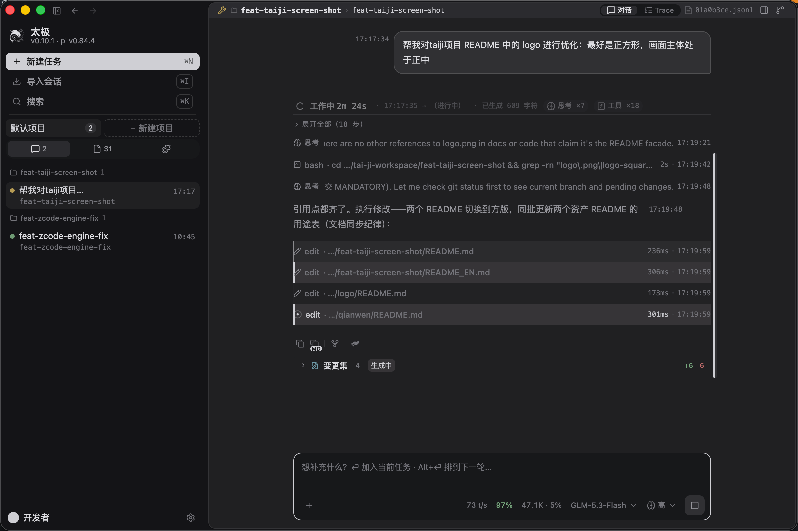

<p align="center"></p>

<h1 align="center">TaiJi</h1>

<p align="center"><strong>An AI Agent desktop workbench for long-running, multi-task collaboration</strong></p>

<p align="center">
  <a href="README.md">简体中文</a> | <a href="README_EN.md">English</a> | <a href="https://github.com/zhushanwen321/tai-ji/releases">Download</a>
</p>

TaiJi is an AI Agent desktop workbench (macOS / Windows / Linux) that puts multiple AI sessions in a single window: run several tasks side by side, watch the AI think, edit files, and run commands as it happens, and fork a session to retry whenever a reply goes the wrong way. Built on the [pi](https://github.com/badlogic/pi-mono) agent kernel (npm package `@earendil-works/pi-coding-agent`), with 18 extensions bundled and ready out of the box.

<p align="center">
  
</p>

> For development conventions, key rules, and debugging discipline, see [AGENTS.md](AGENTS.md).

## Installation

Current latest version: **v0.10.1** ([view all releases](https://github.com/zhushanwen321/tai-ji/releases)). After installation, the app automatically checks for new versions and offers a one-click upgrade.

<!-- INSTALL:BEGIN -->
<!-- Version numbers inside this block are replaced automatically by .agents/skills/merge/scripts/update-readme-install.mjs after each official release; version numbers outside the block are left untouched. -->

### Mainland China download (GitCode mirror, measured at ~15 MB/s over direct domestic connections)

Mirror repository: [gitcode.com/qq_18433817/tai-ji](https://gitcode.com/qq_18433817/tai-ji)

#### macOS (Apple Silicon)

```bash
# Download and open the DMG (or download it from the Releases page in a browser and install by double-clicking)
curl -L https://gitcode.com/qq_18433817/tai-ji/releases/download/v0.10.2/TaiJi-0.10.2-mac-arm64.dmg -o /tmp/TaiJi.dmg \
  && open /tmp/TaiJi.dmg

# If the app is reported as "damaged" or "cannot verify the developer" on launch, run (usually unnecessary for curl downloads, needed for browser downloads):
# xattr -cr /Applications/TaiJi.app
```

#### Linux

```bash
# Download the AppImage, make it executable, and launch it
curl -L https://gitcode.com/qq_18433817/tai-ji/releases/download/v0.10.2/TaiJi-0.10.2-x86_64.AppImage -o ~/TaiJi.AppImage \
  && chmod +x ~/TaiJi.AppImage \
  && ~/TaiJi.AppImage
```

#### Windows

```powershell
# PowerShell (recommended; avoids the parameter conflicts caused by curl being an alias in PowerShell)
Invoke-WebRequest -Uri "https://gitcode.com/qq_18433817/tai-ji/releases/download/v0.10.2/TaiJi-0.10.2-setup-x64.exe" -OutFile "$env:TEMP\TaiJi-setup.exe" -UseBasicParsing; & "$env:TEMP\TaiJi-setup.exe"

# Command Prompt / cmd.exe (uses the system-bundled curl.exe, included by default since Windows 10 1803+):
# curl -L https://gitcode.com/qq_18433817/tai-ji/releases/download/v0.10.2/TaiJi-0.10.2-setup-x64.exe -o "%TEMP%\TaiJi-setup.exe" && "%TEMP%\TaiJi-setup.exe"
```

### International download (GitHub)

Repository: [github.com/zhushanwen321/tai-ji](https://github.com/zhushanwen321/tai-ji)

#### macOS (Apple Silicon)

```bash
# Download and open the DMG
curl -L https://github.com/zhushanwen321/tai-ji/releases/download/v0.10.2/TaiJi-0.10.2-mac-arm64.dmg -o /tmp/TaiJi.dmg \
  && open /tmp/TaiJi.dmg

# If the app is reported as "damaged" or "cannot verify the developer" on launch, run (usually unnecessary for curl downloads, needed for browser downloads):
# xattr -cr /Applications/TaiJi.app
```

#### Linux

```bash
# Download the AppImage, make it executable, and launch it
curl -L https://github.com/zhushanwen321/tai-ji/releases/download/v0.10.2/TaiJi-0.10.2-x86_64.AppImage -o ~/TaiJi.AppImage \
  && chmod +x ~/TaiJi.AppImage \
  && ~/TaiJi.AppImage
```

#### Windows

```powershell
# PowerShell
Invoke-WebRequest -Uri "https://github.com/zhushanwen321/tai-ji/releases/download/v0.10.2/TaiJi-0.10.2-setup-x64.exe" -OutFile "$env:TEMP\TaiJi-setup.exe" -UseBasicParsing; & "$env:TEMP\TaiJi-setup.exe"

# Command Prompt / cmd.exe (uses the system-bundled curl.exe, included by default since Windows 10 1803+):
# curl -L https://github.com/zhushanwen321/tai-ji/releases/download/v0.10.2/TaiJi-0.10.2-setup-x64.exe -o "%TEMP%\TaiJi-setup.exe" && "%TEMP%\TaiJi-setup.exe"
```

<!-- INSTALL:END -->

---

## What It Can Do

### Agent execution

- **Parallel subagents**: dispatch independent tasks to multiple subagents at once and keep the main conversation for conclusions only. The task tray above the input box collects running subtasks; open one to read its full conversation and output in the drawer. Each subtask runs under a budget and turn limit and stops when either is exceeded.
- **Workflow orchestration**: compose subagents into stateful workflows with templates like chain and parallel. Upstream output flows downstream automatically, and an interrupted run resumes from where it stopped. The task tray shows the state of every node.
- **Todo & goal**: the agent breaks work into a todo list and completes items one by one. Long-running goals run in goal mode: set acceptance criteria and a budget up front, and the agent wraps up once they are met.
- **Scheduled tasks**: the agent can create cron or interval tasks that wake a session automatically at the scheduled time, for daily reminders, periodic checks, or recurring batch runs. Tasks can be paused, deleted, or triggered once manually.
- **Context management**: when a session grows long the agent can compact its own context (same-model summaries, keeping the prefix cache warm) and warns you as thresholds approach. Hover next to the input box to check current usage.
- **Session operations**: ⌘/Ctrl+G forks a new session from the latest reply, ⌘/Ctrl+J hands the current context over to a fresh session, ⌘/Ctrl+I imports an existing one. The input box supports / commands, # to reference sessions, $ to reference files, and @ to spawn subagents. Every session is stored as JSONL; click the file name in the title bar to copy its path, and any pi-ecosystem tool can read it directly.

### Watching the execution

- **Live conversation**: thinking, tool calls, and file edits stream in as they happen; each turn collapses into a one-line summary (duration, thinking and tool counts) that expands on click.
- **Trace view**: a ledger of every execution entry in the session, filterable by type and searchable in full text. A context-only mode shows where compaction happened and what entered the context.
- **Status strips**: todo and goal progress stays pinned inside the conversation as a status strip.
- **Structured prompts**: when the agent needs a decision it opens a form with multiple questions, options, and free-form input; answers return to the agent in structured form.
- **Background tasks**: long-running commands can move to the background and notify you on completion, with a dedicated drawer page collecting their output.

### Workbench

- **File tree**: a file panel in the sidebar that stays smooth on large directories, with git badges on modified files.
- **Terminal**: a terminal built into the drawer, one per session, each keeping its own state.
- **Git & worktrees**: check the current branch and file changes; create, switch, and clean up worktrees so parallel tasks work in separate directories.
- **Browser pane**: a browser built into the drawer where you can watch the agent work through web pages.

### Settings & control

- **System prompt**: replace the agent's system prompt entirely from settings. Saving is explicit, a snapshot is taken before each edit, and you can restore it or go back to the default at any time.
- **Tool permissions**: switch tool permission levels next to the input box, from read-only to full access.
- **Models**: a built-in catalog of common providers; paste an API key to start. Switch model and thinking level next to the input box and check quotas per provider in settings.
- **Settings center**: 12 sections covering provider, appearance, skills, agent, extensions, system prompt, terminal, presets, worktree, updates, system, and usage.
- **Auto update**: new versions are detected automatically; confirm and the app restarts to upgrade.
## pi Extensions

TaiJi's Agent capabilities are implemented through the pi extension mechanism; source lives in [`extensions/`](extensions/) (21 `@zhushanwen/pi-*` packages + the `shared/` library), 18 of which ship bundled with the app, ready out of the box. The following 16 extensions are self-sufficient and usable standalone outside taiji (all published to npm, or loadable via `--extension`):

| Extension | Purpose |
|------|------|
| [`pi-subagent-workflow`](extensions/universal/subagent-workflow/README.md) | Unified subagent execution + multi-agent workflow orchestration (stateful workflows such as parallel / chain) |
| [`pi-goal`](extensions/universal/goal/README.md) | `/goal` persistent goal-driven autonomous loop with evidence-based acceptance |
| [`pi-todo`](extensions/universal/todo/README.md) | AI-driven todo list (session persistence + `/todos`) |
| [`pi-ask-user`](extensions/universal/ask-user/README.md) | Structured multi-question input (split-pane preview + inline editing) |
| [`pi-permission`](extensions/universal/permission/README.md) | Four permission modes (yolo / auto / approve / strict) + three-layer decision pipeline (AST / rules / AI classifier) |
| [`pi-scheduler`](extensions/universal/scheduler/README.md) | Scheduled task scheduling (cron / interval, once / recurring) |
| [`pi-session-reader`](extensions/universal/session-reader/README.md) | Read / query session history (trees, family, execution tree, search, export) |
| [`pi-session-manager`](extensions/universal/session-manager/README.md) | Agent-managed child sessions (create / send / history / status / list / abort) |
| [`pi-rename-session`](extensions/universal/rename-session/README.md) | Auto-generate session titles after the first conversation round |
| [`pi-smart-context`](extensions/universal/smart-context/README.md) | Agent-driven context compaction (compact_context tool + dual-mode summary takeover + tiered reminders) |
| [`pi-structured-output`](extensions/universal/structured-output/README.md) | Structured output (JSON Schema + Ajv validation) |
| [`pi-pending-notifications`](extensions/universal/pending-notifications/README.md) | Cross-extension async operation registration / query (prevents message injection during long tasks) |
| [`pi-base-tool-enhance`](extensions/universal/base-tool-enhance/README.md) | Bash tool enhancement (foreground delegates to the pi official factory + background mode + tool error auditing) |
| [`pi-plan`](extensions/universal/plan/README.md) | Lightweight plan mode |
| [`pi-cache-probe`](extensions/universal/cache-probe/README.md) | Cache prefix fingerprint collection + attribution analysis |
| [`pi-cw-tool`](extensions/universal/cw-tool/README.md) | cw 2.0 runner hands-on guide + read-only `cw_query` query tool |

The remaining 5 (`pi-agent-ext` / `pi-msg-id-mapper` / `pi-plugin-bridge` / `pi-system-prompt` / `pi-system-prompt-trace`) are taiji-integration-specific and have no function outside the taiji host. The 18 bundled extensions = 13 of the 16 in the table above + these 5; `pi-plan` / `pi-cache-probe` / `pi-cw-tool` are not bundled; install via npm or load with `--extension`. For extension development, see [docs/extensions/development-guide.md](docs/extensions/development-guide.md).

## Quick Start (Development)

**Prerequisites**: Node.js >= 22.19 (24 recommended, see `.nvmrc`), pnpm >= 10

```bash
# Install dependencies (pnpm workspace installs apps/* + packages/* + extensions/* in one step)
pnpm install

# Dev mode (Vite HMR + Electron main process)
pnpm dev

# Production build (electron-builder; outputs DMG/EXE/AppImage/manifest)
pnpm build

# Type check
pnpm --filter @taiji/frontend run typecheck

# ESLint
pnpm run lint

# pi extensions under extensions/
pnpm extensions:typecheck
pnpm extensions:lint
pnpm extensions:test

# Playwright E2E
pnpm build:e2e && pnpm test:e2e
```

Debugging the dev app: once `pnpm dev` is running, Electron opens a CDP debugging port (stably derived from the worktree name; run `node apps/electron/scripts/dev-instance.mjs --print` to see this instance's port); connect with Playwright for screenshots / DOM snapshots / JS execution (without stealing focus), see [AGENTS.md "Frontend Debugging"](AGENTS.md). Note that runtime source code is not hot-reloaded (tsx runs without watch), so restart `pnpm dev` after changing runtime code; renderer changes take effect automatically via vite HMR.

### Environment Variables

| Variable | Purpose | Default |
|------|------|--------|
| `TAIJI_MOCK` | Set to `1` to skip runtime child process startup and use mock data | — |
| `VITE_MOCK` | Set to `true` to intercept all WS messages at the ws-client layer | — |
| `TAIJI_AGENT_DATA_DIR` | Custom data directory, fully isolated from pi's `~/.pi/agent/` (dev mode pins `~/.taiji-dev` and ignores this variable) | `~/.taiji` |

## Tech Stack

| Layer | Technology |
|----|------|
| Desktop framework | Electron 42 |
| Frontend framework | Vue 3.5 + TypeScript 5.8 |
| State management | Pinia 3 |
| Build tooling | Vite 8 (renderer) + Vite lib mode (main/preload) |
| UI components | @taiji/ui (in-house component library) + reka-ui |
| Styling | Tailwind CSS v3 (TaiJi pure-gray tokens; scoped CSS component styles and `@apply` are forbidden) |
| Icons | @lucide/vue |
| Internationalization | vue-i18n 10 |
| Backend communication | ws (WebSocket) + pi child-process RPC |
| Packaging | electron-builder 26 |

## Release

Two independent release pipelines, decoupled by tag prefix:

| Pipeline | Artifacts | Trigger tag | Workflow |
|------|------|----------|----------|
| Electron packaging | DMG / EXE / AppImage / manifest | `v*` | `release.yml` |
| npm package publishing | `@zhushanwen/pi-*` extensions + engine / SDK packages (`pi-rpc` / `subagent-core` / `subagent-engine-sdk` / `pi-subagent-cli` / `zcode-subagent-cli` / `session-delivery` / `extension-protocol`) | `npm-*` | `release-npm.yml` |
| npm prerelease | dev dist-tag test versions | `dev-npm-*` branch / local `npm-prerelease.sh` | `release-npm-dev.yml` |

## Documentation Index

| Document | Content |
|------|------|
| [AGENTS.md](AGENTS.md) | Development conventions, key rules, debugging and release discipline |
| [docs/PRODUCT.md](docs/PRODUCT.md) / [docs/ARCHITECTURE.md](docs/ARCHITECTURE.md) | Product positioning / architecture overview |
| [docs/STANDARDS.md](docs/STANDARDS.md) | Coding standards and architecture standards |
| [docs/DESIGN.md](docs/DESIGN.md) | Visual design authority (TaiJi pure-gray tokens and paradigm) |
| [docs/extensions/](docs/extensions/) | Full set of pi extension development guides |
| [docs/architecture/feature-map.md](docs/architecture/feature-map.md) | Feature planning and phase status |
| [docs/testing/](docs/testing/) + [docs/TEST-STRATEGY.md](docs/TEST-STRATEGY.md) | Test strategy and per-feature test manuals |
| [docs/adr/](docs/adr/) | Architecture decision records |
| [docs/TROUBLESHOOTING.md](docs/TROUBLESHOOTING.md) | Troubleshooting guide |

## License

Private
